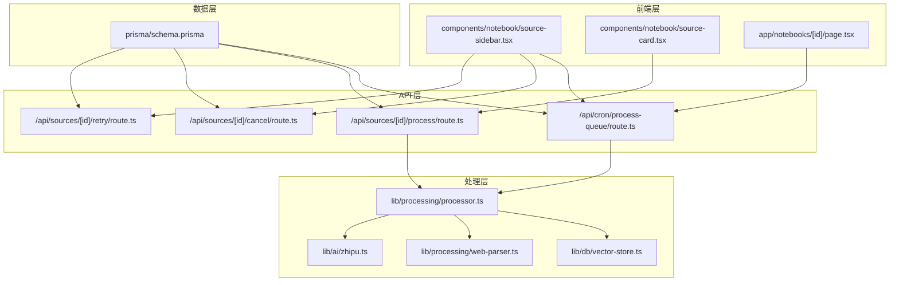
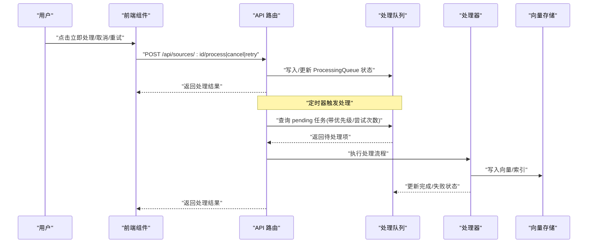
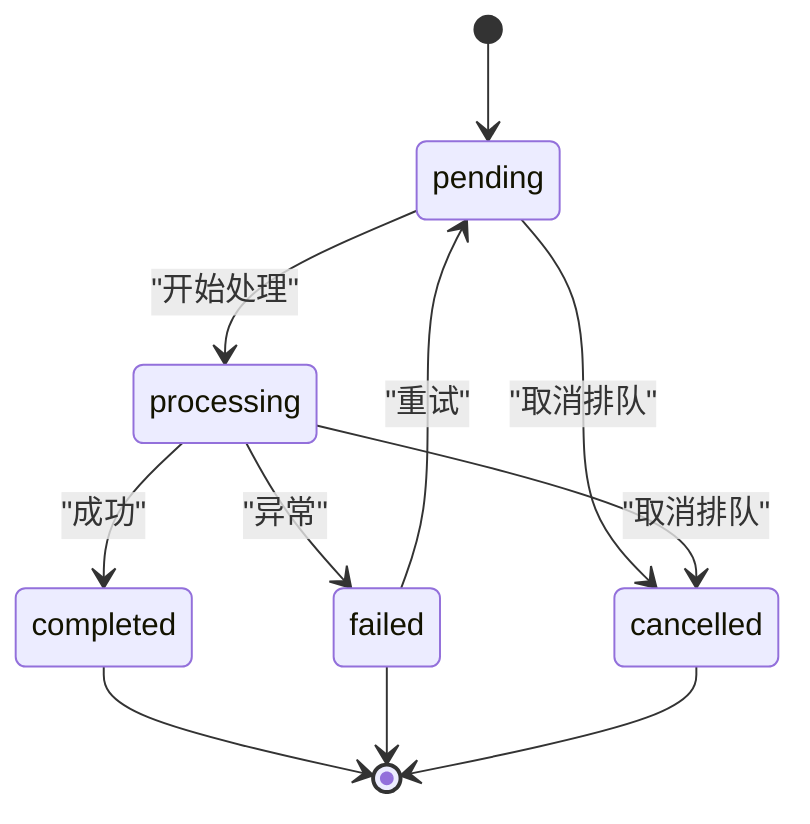
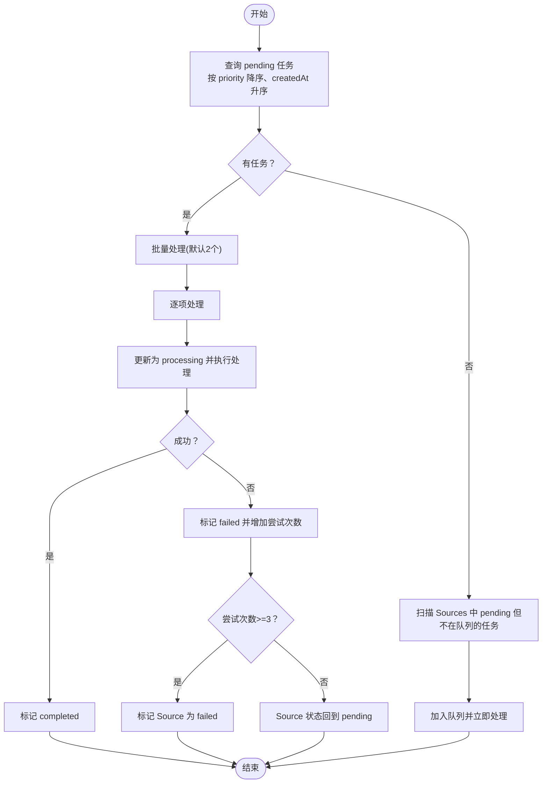
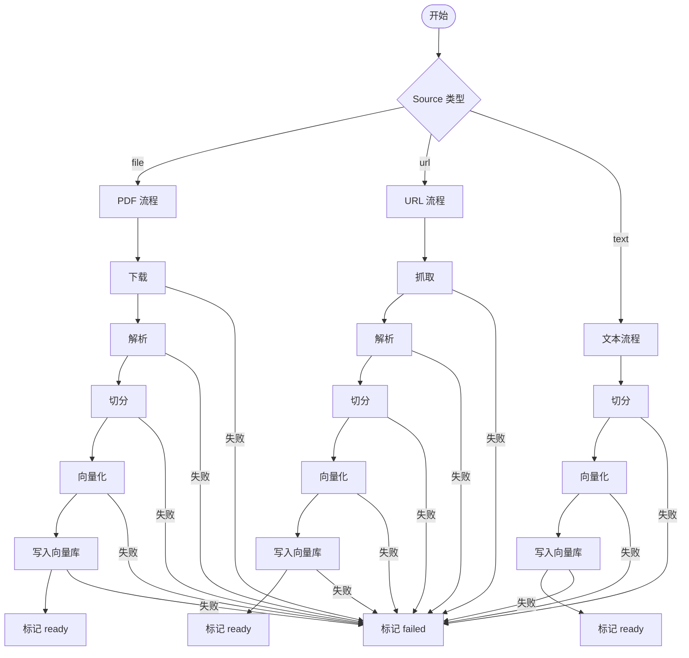
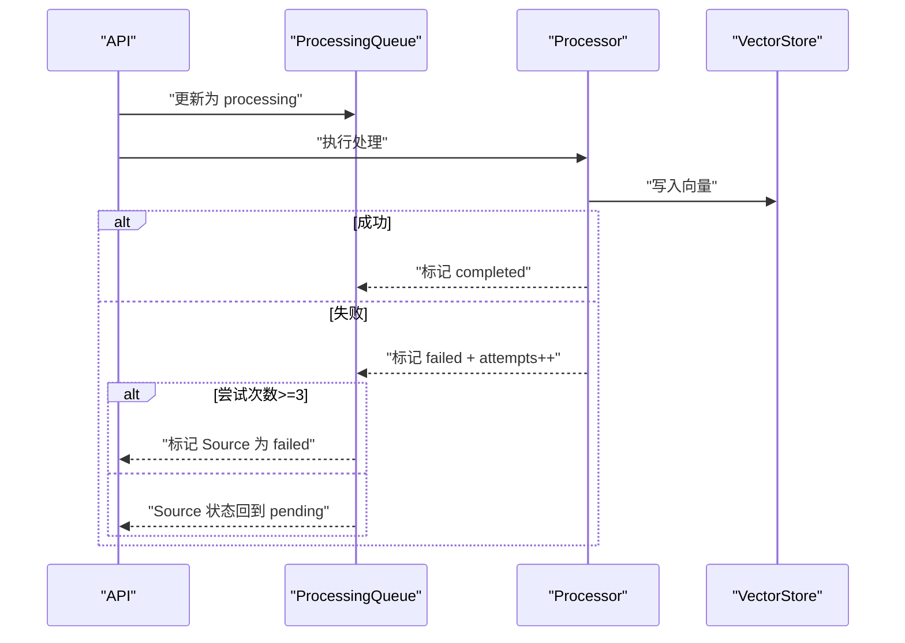
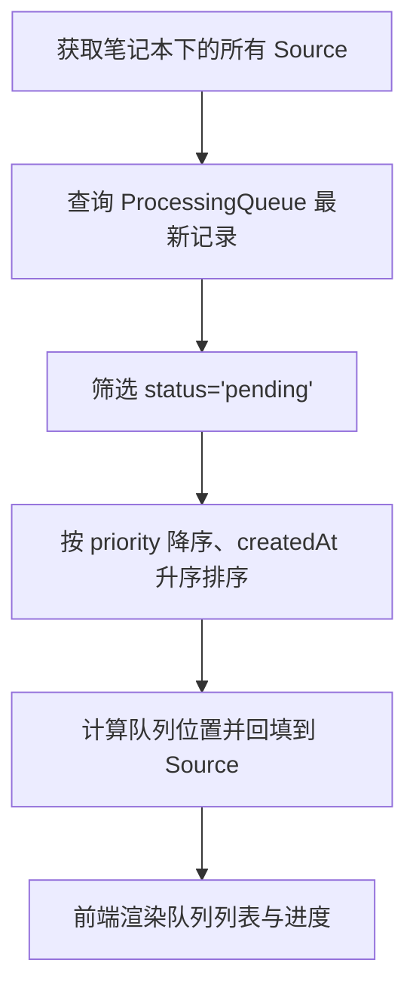
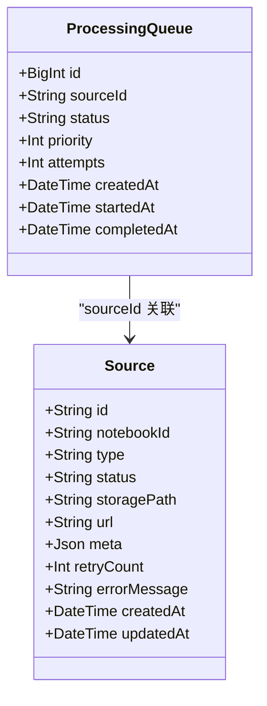

# 处理队列管理

<cite>
**本文引用的文件**
- [app/api/cron/process-queue/route.ts](file://app/api/cron/process-queue/route.ts)
- [app/api/sources/[id]/process/route.ts](file://app/api/sources/[id]/process/route.ts)
- [app/api/sources/[id]/cancel/route.ts](file://app/api/sources/[id]/cancel/route.ts)
- [app/api/sources/[id]/retry/route.ts](file://app/api/sources/[id]/retry/route.ts)
- [lib/processing/processor.ts](file://lib/processing/processor.ts)
- [lib/processing/web-parser.ts](file://lib/processing/web-parser.ts)
- [lib/ai/zhipu.ts](file://lib/ai/zhipu.ts)
- [lib/db/vector-store.ts](file://lib/db/vector-store.ts)
- [lib/config.ts](file://lib/config.ts)
- [prisma/schema.prisma](file://prisma/schema.prisma)
- [components/notebook/source-sidebar.tsx](file://components/notebook/source-sidebar.tsx)
- [components/notebook/source-card.tsx](file://components/notebook/source-card.tsx)
- [app/notebooks/[id]/page.tsx](file://app/notebooks/[id]/page.tsx)
</cite>

## 目录
1. [简介](#简介)
2. [项目结构](#项目结构)
3. [核心组件](#核心组件)
4. [架构总览](#架构总览)
5. [详细组件分析](#详细组件分析)
6. [依赖关系分析](#依赖关系分析)
7. [性能考量](#性能考量)
8. [故障排查指南](#故障排查指南)
9. [结论](#结论)
10. [附录](#附录)

## 简介
本文件面向“处理队列管理”功能，系统化阐述异步任务处理机制，包括任务调度、优先级管理、并发控制、状态转换、重试与超时处理、错误恢复、监控与统计、手动触发/取消/重试操作，以及配置参数、性能调优与扩展性建议。目标读者既包括开发者也包括非技术使用者，文档通过多层级讲解与可视化图示帮助理解。

## 项目结构
围绕“处理队列”的核心文件分布如下：
- API 层：定时器触发的队列处理器与前端触发的处理接口、取消与重试接口
- 处理器层：统一的文档处理流程，按阶段推进并更新状态
- 数据层：Prisma 模型定义处理队列与源数据，向量存储负责嵌入写入
- 前端层：展示队列状态、进度与操作入口

图表来源
- [app/api/cron/process-queue/route.ts](file://app/api/cron/process-queue/route.ts#L1-L165)
- [app/api/sources/[id]/process/route.ts](file://app/api/sources/[id]/process/route.ts#L1-L140)
- [app/api/sources/[id]/cancel/route.ts](file://app/api/sources/[id]/cancel/route.ts#L1-L46)
- [app/api/sources/[id]/retry/route.ts](file://app/api/sources/[id]/retry/route.ts#L1-L72)
- [lib/processing/processor.ts](file://lib/processing/processor.ts#L1-L560)
- [lib/processing/web-parser.ts](file://lib/processing/web-parser.ts#L66-L114)
- [lib/ai/zhipu.ts](file://lib/ai/zhipu.ts#L155-L195)
- [lib/db/vector-store.ts](file://lib/db/vector-store.ts#L73-L213)
- [prisma/schema.prisma](file://prisma/schema.prisma#L117-L134)
- [components/notebook/source-sidebar.tsx](file://components/notebook/source-sidebar.tsx#L276-L316)
- [components/notebook/source-card.tsx](file://components/notebook/source-card.tsx#L396-L494)
- [app/notebooks/[id]/page.tsx](file://app/notebooks/[id]/page.tsx#L49-L95)

章节来源
- [prisma/schema.prisma](file://prisma/schema.prisma#L117-L134)
- [app/api/cron/process-queue/route.ts](file://app/api/cron/process-queue/route.ts#L1-L165)
- [lib/processing/processor.ts](file://lib/processing/processor.ts#L1-L560)

## 核心组件
- 处理队列模型：ProcessingQueue，包含状态、优先级、尝试次数、时间戳等字段，用于追踪每个 Source 的处理生命周期
- 队列处理器：定时器触发的 GET 接口，按优先级与创建时间拉取待处理任务，执行并更新状态
- 前端触发处理：POST 接口将 Source 置为 pending，并异步执行处理流程
- 取消排队：将处于 pending/processing 的队列项标记为 cancelled
- 重试失败：将 failed 的 Source 重置为 pending 并加入队列，提高优先级
- 统一处理器：根据 Source 类型（文件/URL/文本）执行下载/抓取、解析、切分、向量化、入库等阶段
- 监控与进度：前端展示队列位置、处理进度与状态；后端记录阶段耗时与错误日志

章节来源
- [prisma/schema.prisma](file://prisma/schema.prisma#L121-L134)
- [app/api/cron/process-queue/route.ts](file://app/api/cron/process-queue/route.ts#L38-L164)
- [app/api/sources/[id]/process/route.ts](file://app/api/sources/[id]/process/route.ts#L78-L138)
- [app/api/sources/[id]/cancel/route.ts](file://app/api/sources/[id]/cancel/route.ts#L28-L37)
- [app/api/sources/[id]/retry/route.ts](file://app/api/sources/[id]/retry/route.ts#L46-L64)
- [lib/processing/processor.ts](file://lib/processing/processor.ts#L402-L420)

## 架构总览
下图展示了从用户操作到后台处理、再到状态持久化的完整链路。

图表来源
- [app/api/sources/[id]/process/route.ts](file://app/api/sources/[id]/process/route.ts#L78-L138)
- [app/api/sources/[id]/cancel/route.ts](file://app/api/sources/[id]/cancel/route.ts#L28-L37)
- [app/api/sources/[id]/retry/route.ts](file://app/api/sources/[id]/retry/route.ts#L46-L64)
- [app/api/cron/process-queue/route.ts](file://app/api/cron/process-queue/route.ts#L38-L164)
- [lib/processing/processor.ts](file://lib/processing/processor.ts#L402-L420)
- [lib/db/vector-store.ts](file://lib/db/vector-store.ts#L77-L173)

## 详细组件分析

### 队列状态与转换
- 状态集合：pending、processing、completed、failed、cancelled
- 转换规则：
  - pending → processing：队列处理器或前端触发时更新
  - processing → completed/failed：处理完成后更新
  - failed → pending：重试时将 Source 状态重置为 pending，并增加尝试次数
  - pending/processing → cancelled：用户取消排队时更新
- 优先级与尝试次数：
  - 查询时按 priority 降序、createdAt 升序排序
  - 失败任务最多尝试 3 次，超过则标记为 failed

图表来源
- [prisma/schema.prisma](file://prisma/schema.prisma#L121-L134)
- [app/api/cron/process-queue/route.ts](file://app/api/cron/process-queue/route.ts#L40-L50)
- [app/api/sources/[id]/process/route.ts](file://app/api/sources/[id]/process/route.ts#L44-L76)
- [app/api/sources/[id]/cancel/route.ts](file://app/api/sources/[id]/cancel/route.ts#L28-L37)

章节来源
- [prisma/schema.prisma](file://prisma/schema.prisma#L121-L134)
- [app/api/cron/process-queue/route.ts](file://app/api/cron/process-queue/route.ts#L38-L164)
- [app/api/sources/[id]/process/route.ts](file://app/api/sources/[id]/process/route.ts#L44-L76)
- [app/api/sources/[id]/cancel/route.ts](file://app/api/sources/[id]/cancel/route.ts#L28-L37)

### 任务调度与并发控制
- 调度策略：
  - 定时器按优先级与创建时间拉取队列项，批量处理（默认每次处理 2 个）
  - 若队列为空，扫描 Sources 中状态为 pending 但不在队列中的条目进行自我修复
- 并发控制：
  - 每次仅处理少量任务，避免超时
  - 前端触发处理采用异步执行，不阻塞请求响应
- 优先级管理：
  - 队列项默认 priority=1；重试时 priority=2；手动立即处理时 priority=3
  - 查询时优先处理高优先级任务

图表来源
- [app/api/cron/process-queue/route.ts](file://app/api/cron/process-queue/route.ts#L38-L164)
- [app/api/sources/[id]/process/route.ts](file://app/api/sources/[id]/process/route.ts#L10-L42)

章节来源
- [app/api/cron/process-queue/route.ts](file://app/api/cron/process-queue/route.ts#L7-L7)
- [app/api/cron/process-queue/route.ts](file://app/api/cron/process-queue/route.ts#L40-L50)
- [app/api/sources/[id]/process/route.ts](file://app/api/sources/[id]/process/route.ts#L10-L42)

### 处理流程与阶段
- 统一处理函数根据 Source 类型选择不同路径：
  - 文件：下载 → 解析 → 切分 → 向量化 → 写入向量库
  - URL：抓取 → 解析 → 切分 → 向量化 → 写入向量库
  - 文本：切分 → 向量化 → 写入向量库
- 阶段日志与指标：
  - 每个阶段记录耗时、数量、tokens 使用等
  - 总耗时与阶段耗时用于性能分析
- 错误处理：
  - 任一阶段失败均记录错误并标记为 failed
  - 处理器内部对网络抓取与读取设置了超时保护

图表来源
- [lib/processing/processor.ts](file://lib/processing/processor.ts#L402-L420)
- [lib/processing/processor.ts](file://lib/processing/processor.ts#L82-L209)
- [lib/processing/processor.ts](file://lib/processing/processor.ts#L215-L397)
- [lib/processing/processor.ts](file://lib/processing/processor.ts#L426-L526)
- [lib/processing/web-parser.ts](file://lib/processing/web-parser.ts#L82-L114)

章节来源
- [lib/processing/processor.ts](file://lib/processing/processor.ts#L1-L560)
- [lib/processing/web-parser.ts](file://lib/processing/web-parser.ts#L66-L114)

### 重试机制、超时处理与错误恢复
- 重试策略：
  - 队列处理器对失败任务最多尝试 3 次
  - 前端触发处理时，若处理失败，会将 Source 状态重置为 pending 并更新队列记录
- 超时处理：
  - 抓取网页时设置超时，读取内容也设置超时
  - 后端定时器处理受平台限制，每次仅处理少量任务以避免超时
- 错误恢复：
  - 队列为空时扫描 Sources 中遗漏的任务并加入队列处理
  - 失败时记录错误信息，便于定位问题

图表来源
- [app/api/cron/process-queue/route.ts](file://app/api/cron/process-queue/route.ts#L58-L106)
- [app/api/sources/[id]/process/route.ts](file://app/api/sources/[id]/process/route.ts#L44-L76)
- [lib/processing/processor.ts](file://lib/processing/processor.ts#L198-L208)

章节来源
- [app/api/cron/process-queue/route.ts](file://app/api/cron/process-queue/route.ts#L43-L106)
- [app/api/sources/[id]/process/route.ts](file://app/api/sources/[id]/process/route.ts#L44-L76)
- [lib/processing/web-parser.ts](file://lib/processing/web-parser.ts#L82-L114)

### 队列监控与进度跟踪
- 队列长度统计：
  - 前端页面聚合各 Source 的最新队列记录，计算 pending 队列并排序
- 队列位置：
  - 根据优先级与创建时间计算队列位置，显示“队列第 N 位”
- 进度跟踪：
  - Source 状态映射到进度条，展示下载/抓取/解析/切分/向量化阶段
- 日志与指标：
  - 处理器记录每个阶段的耗时、数量、tokens 使用等，便于性能分析

图表来源
- [app/notebooks/[id]/page.tsx](file://app/notebooks/[id]/page.tsx#L54-L95)
- [components/notebook/source-sidebar.tsx](file://components/notebook/source-sidebar.tsx#L276-L307)
- [components/notebook/source-card.tsx](file://components/notebook/source-card.tsx#L396-L494)

章节来源
- [app/notebooks/[id]/page.tsx](file://app/notebooks/[id]/page.tsx#L49-L95)
- [components/notebook/source-sidebar.tsx](file://components/notebook/source-sidebar.tsx#L276-L316)
- [components/notebook/source-card.tsx](file://components/notebook/source-card.tsx#L396-L494)

### 手动触发处理、取消排队与立即处理
- 手动触发处理：
  - 前端点击“立即处理”，调用 POST /api/sources/:id/process
  - 将 Source 状态置为 pending，并异步执行处理
- 取消排队：
  - 前端点击“取消”，调用 POST /api/sources/:id/cancel
  - 将处于 pending/processing 的队列项标记为 cancelled
- 立即处理：
  - 在侧边栏中为 pending 的 Source 提供“立即处理”按钮，提升优先级

章节来源
- [components/notebook/source-card.tsx](file://components/notebook/source-card.tsx#L396-L447)
- [components/notebook/source-sidebar.tsx](file://components/notebook/source-sidebar.tsx#L293-L302)
- [app/api/sources/[id]/process/route.ts](file://app/api/sources/[id]/process/route.ts#L78-L138)
- [app/api/sources/[id]/cancel/route.ts](file://app/api/sources/[id]/cancel/route.ts#L28-L37)

### 队列配置参数与性能调优
- 配置参数：
  - 批处理大小：BATCH_SIZE（默认 2），控制每次处理的任务数量
  - 最大重试次数：队列处理器与前端触发处理均为 3 次
  - 优先级：默认 1，重试 2，立即处理 3
- 性能调优建议：
  - 控制批处理大小以避免超时
  - 优化向量化与写入性能，确保嵌入维度一致
  - 前端展示队列位置与进度，减少用户等待焦虑
  - 对网络抓取设置合理超时，避免阻塞

章节来源
- [app/api/cron/process-queue/route.ts](file://app/api/cron/process-queue/route.ts#L7-L7)
- [app/api/cron/process-queue/route.ts](file://app/api/cron/process-queue/route.ts#L40-L50)
- [app/api/sources/[id]/process/route.ts](file://app/api/sources/[id]/process/route.ts#L6-L8)
- [lib/config.ts](file://lib/config.ts#L6-L29)

## 依赖关系分析
- 数据模型依赖：
  - ProcessingQueue 与 Source 通过 sourceId 关联
  - 索引覆盖 status/priority/createdAt，支持高效查询
- 处理器依赖：
  - Processor 调用 WebParser、VectorStore、AI 封装模块
  - 向量存储对嵌入维度进行严格校验，防止维度不一致导致的错误
- API 依赖：
  - 所有 API 均依赖 Prisma 客户端与 Supabase 权限校验

图表来源
- [prisma/schema.prisma](file://prisma/schema.prisma#L121-L134)
- [prisma/schema.prisma](file://prisma/schema.prisma#L33-L58)

章节来源
- [prisma/schema.prisma](file://prisma/schema.prisma#L117-L134)

## 性能考量
- 资源消耗：
  - 向量化与写入是主要开销，应确保嵌入维度一致（1024 维）
  - 抓取与解析阶段可能受外部服务影响，需设置超时
- 处理时间估算：
  - 阶段日志包含每阶段耗时与总量，可用于估算整体耗时
  - 队列位置与批处理大小影响等待时间
- 扩展性考虑：
  - 当前实现基于 Next.js Serverless，受限于执行时间
  - 建议在生产环境中迁移到具备更高并发与持久化能力的后端（如 Worker/队列服务）

章节来源
- [lib/db/vector-store.ts](file://lib/db/vector-store.ts#L92-L99)
- [lib/config.ts](file://lib/config.ts#L6-L29)
- [lib/processing/processor.ts](file://lib/processing/processor.ts#L185-L208)

## 故障排查指南
- 常见问题与定位：
  - 队列长时间无进展：检查 ProcessingQueue 是否存在 pending 任务；确认定时器是否正常触发
  - 处理失败：查看 Source.errorMessage 与 ProcessingQueue.errorMessage；关注阶段日志
  - 网络抓取失败：检查超时设置与目标站点访问策略
- 操作指引：
  - 重试失败任务：调用 POST /api/sources/:id/retry
  - 取消排队：调用 POST /api/sources/:id/cancel
  - 手动触发：调用 POST /api/sources/:id/process

章节来源
- [app/api/sources/[id]/retry/route.ts](file://app/api/sources/[id]/retry/route.ts#L42-L64)
- [app/api/sources/[id]/cancel/route.ts](file://app/api/sources/[id]/cancel/route.ts#L28-L37)
- [app/api/sources/[id]/process/route.ts](file://app/api/sources/[id]/process/route.ts#L78-L138)

## 结论
本系统通过统一的处理队列模型与清晰的状态机，实现了可靠的异步任务处理。结合优先级管理、重试与超时控制、错误恢复与监控统计，能够在受限运行环境下稳定地处理大量文档。建议在生产环境中进一步增强并发与持久化能力，并持续优化阶段日志与性能指标，以获得更好的用户体验与运维效率。

## 附录
- 关键 API 一览
  - GET /api/cron/process-queue?manual=true/false：定时器触发队列处理
  - POST /api/sources/:id/process：手动触发处理
  - POST /api/sources/:id/cancel：取消排队
  - POST /api/sources/:id/retry：重试失败任务

章节来源
- [app/api/cron/process-queue/route.ts](file://app/api/cron/process-queue/route.ts#L11-L36)
- [app/api/sources/[id]/process/route.ts](file://app/api/sources/[id]/process/route.ts#L78-L138)
- [app/api/sources/[id]/cancel/route.ts](file://app/api/sources/[id]/cancel/route.ts#L5-L39)
- [app/api/sources/[id]/retry/route.ts](file://app/api/sources/[id]/retry/route.ts#L15-L66)