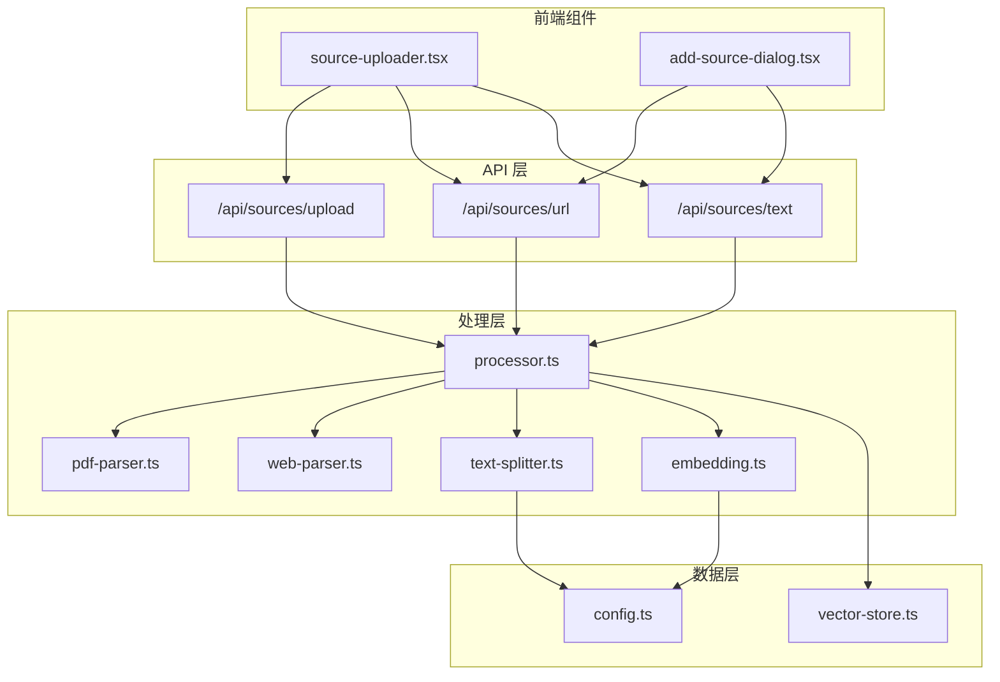
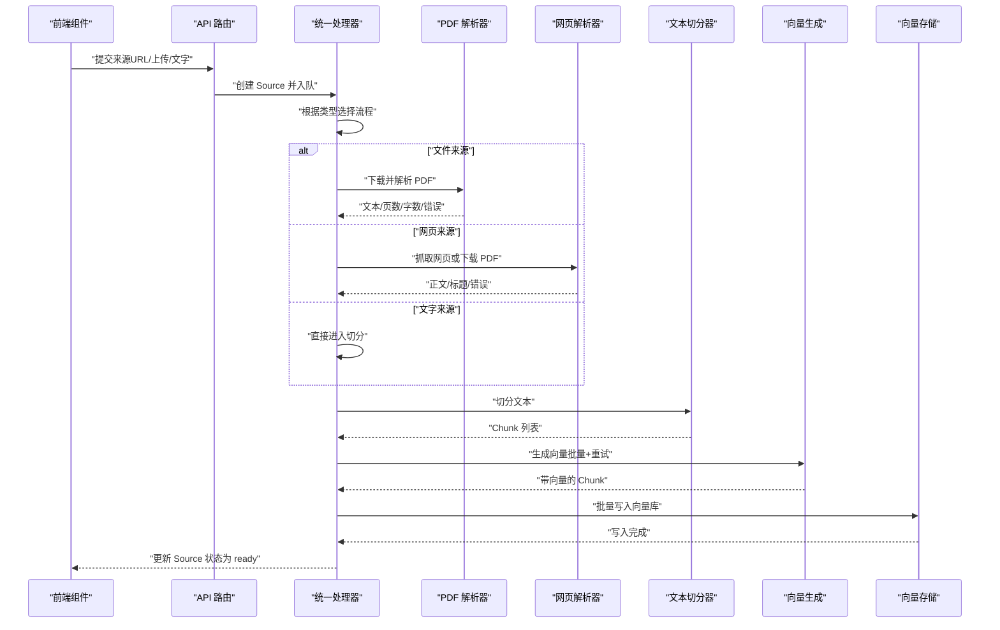
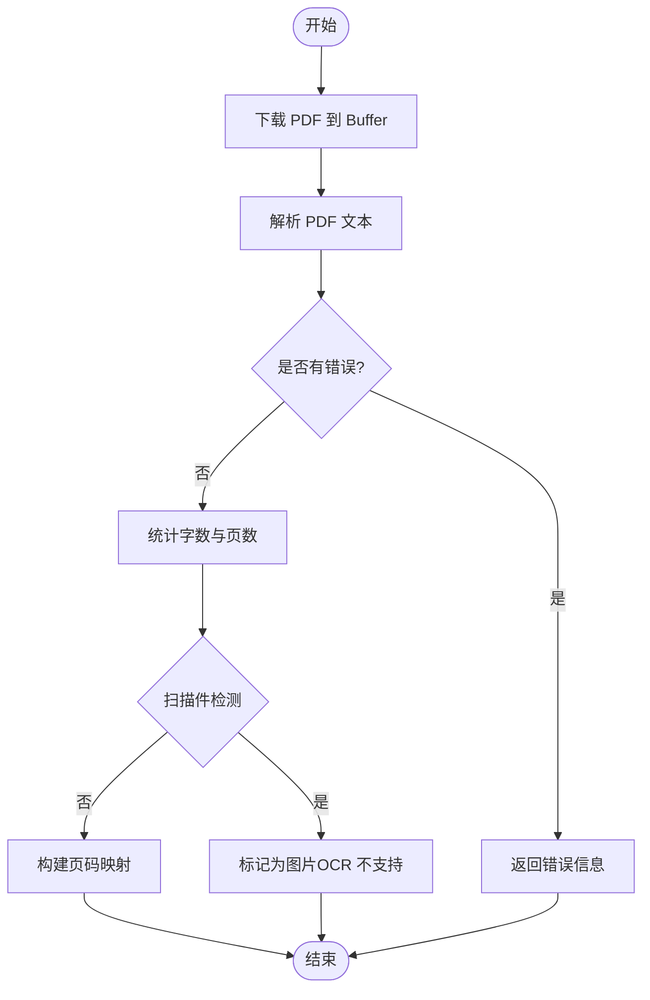
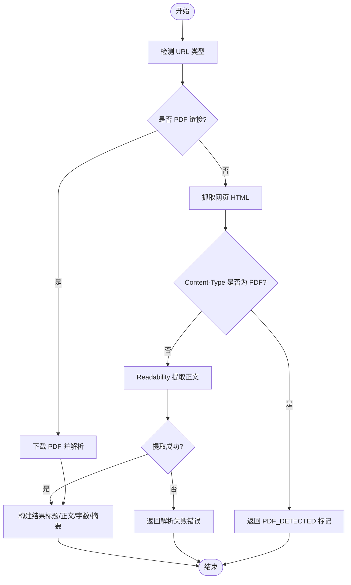
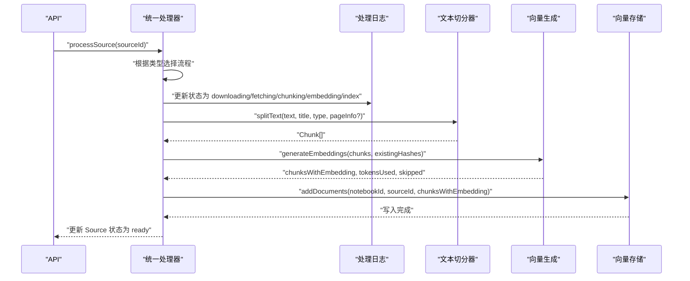
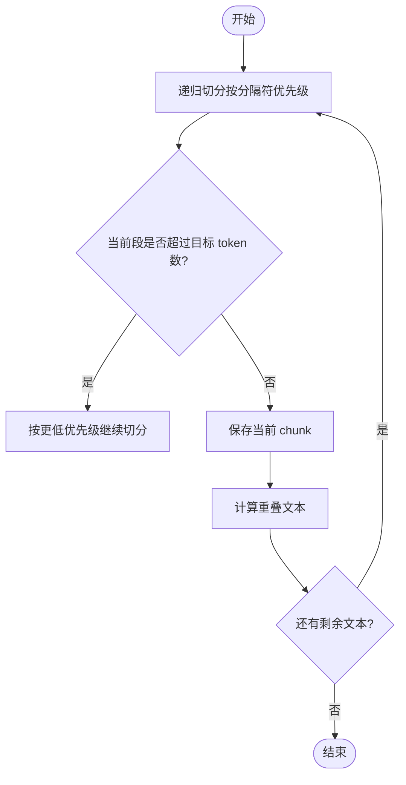
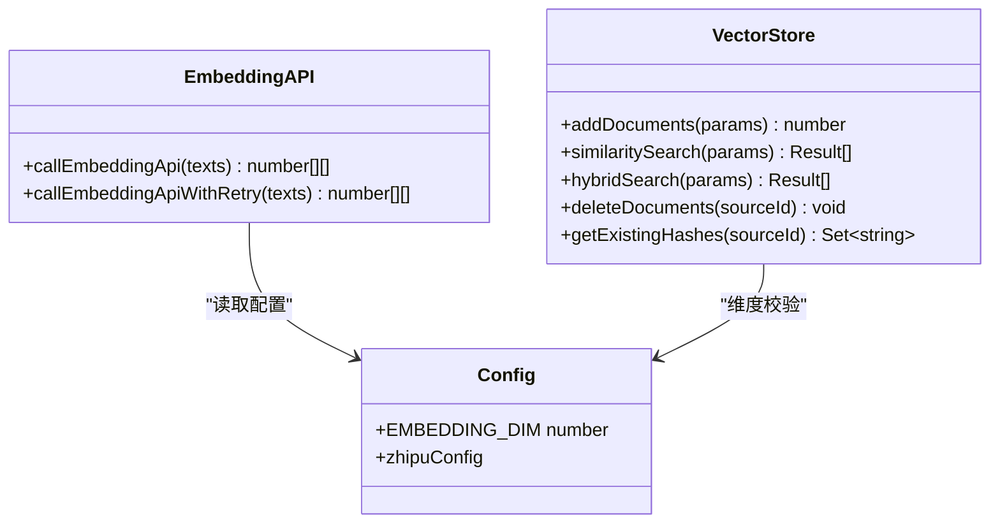
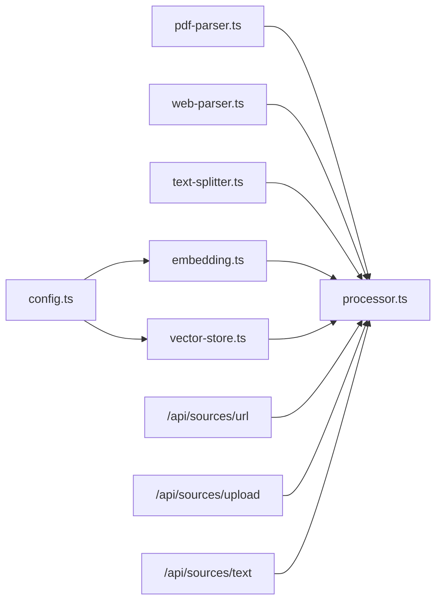

# 文件格式支持

<cite>
**本文引用的文件**
- [pdf-parser.ts](file://lib/processing/pdf-parser.ts)
- [web-parser.ts](file://lib/processing/web-parser.ts)
- [processor.ts](file://lib/processing/processor.ts)
- [text-splitter.ts](file://lib/processing/text-splitter.ts)
- [embedding.ts](file://lib/processing/embedding.ts)
- [vector-store.ts](file://lib/db/vector-store.ts)
- [parser.ts](file://lib/studio/parser.ts)
- [url/route.ts](file://app/api/sources/url/route.ts)
- [upload/route.ts](file://app/api/sources/upload/route.ts)
- [text/route.ts](file://app/api/sources/text/route.ts)
- [config.ts](file://lib/config.ts)
- [pdf-parse.d.ts](file://types/pdf-parse.d.ts)
- [package.json](file://package.json)
- [source-uploader.tsx](file://components/notebook/source-uploader.tsx)
- [add-source-dialog.tsx](file://components/notebook/add-source-dialog.tsx)
</cite>

## 目录
1. [简介](#简介)
2. [项目结构](#项目结构)
3. [核心组件](#核心组件)
4. [架构总览](#架构总览)
5. [详细组件分析](#详细组件分析)
6. [依赖关系分析](#依赖关系分析)
7. [性能考量](#性能考量)
8. [故障排查指南](#故障排查指南)
9. [结论](#结论)
10. [附录](#附录)

## 简介
本文件格式支持功能文档聚焦于系统对多种知识来源的处理能力，包括：
- PDF 文件：从 Supabase Storage 下载并解析文本，识别扫描件并进行基础统计
- 网页链接：抓取网页内容，使用 Readability 提取正文，同时支持 PDF 链接的直接下载解析
- 文本内容：直接以复制的文字作为知识源，无需存储文件

系统采用“统一处理流水线”：下载/抓取 → 解析 → 文本切分 → 向量化 → 写入向量库 → 状态更新，确保不同类型来源具备一致的处理体验与可观测性。

## 项目结构
围绕文件格式支持的关键目录与文件：
- lib/processing：处理管道与解析器
  - pdf-parser.ts：PDF 解析与扫描件检测
  - web-parser.ts：网页抓取与正文提取
  - processor.ts：统一处理流程与状态管理
  - text-splitter.ts：递归字符切分器
  - embedding.ts：向量生成与重试机制
  - studio/parser.ts：JSON 安全解析（用于生成内容）
- lib/db：向量存储与检索
  - vector-store.ts：批量写入、相似度检索与混合检索
- app/api/sources：API 入口
  - url/route.ts：添加网页链接
  - upload/route.ts：上传 PDF 文件
  - text/route.ts：添加复制的文字
- lib/config.ts：全局配置（向量维度、模型、应用参数）
- types/pdf-parse.d.ts：pdf-parse 类型声明
- package.json：依赖清单（包含 pdf-parse、@mozilla/readability 等）

图表来源
- [source-uploader.tsx](file://components/notebook/source-uploader.tsx#L1-L553)
- [add-source-dialog.tsx](file://components/notebook/add-source-dialog.tsx#L1-L365)
- [url/route.ts](file://app/api/sources/url/route.ts#L1-L167)
- [upload/route.ts](file://app/api/sources/upload/route.ts#L1-L111)
- [text/route.ts](file://app/api/sources/text/route.ts#L1-L122)
- [processor.ts](file://lib/processing/processor.ts#L1-L560)
- [pdf-parser.ts](file://lib/processing/pdf-parser.ts#L1-L150)
- [web-parser.ts](file://lib/processing/web-parser.ts#L1-L228)
- [text-splitter.ts](file://lib/processing/text-splitter.ts#L1-L270)
- [embedding.ts](file://lib/processing/embedding.ts#L1-L189)
- [vector-store.ts](file://lib/db/vector-store.ts#L1-L446)
- [config.ts](file://lib/config.ts#L1-L187)

章节来源
- [pdf-parser.ts](file://lib/processing/pdf-parser.ts#L1-L150)
- [web-parser.ts](file://lib/processing/web-parser.ts#L1-L228)
- [processor.ts](file://lib/processing/processor.ts#L1-L560)
- [text-splitter.ts](file://lib/processing/text-splitter.ts#L1-L270)
- [embedding.ts](file://lib/processing/embedding.ts#L1-L189)
- [vector-store.ts](file://lib/db/vector-store.ts#L1-L446)
- [url/route.ts](file://app/api/sources/url/route.ts#L1-L167)
- [upload/route.ts](file://app/api/sources/upload/route.ts#L1-L111)
- [text/route.ts](file://app/api/sources/text/route.ts#L1-L122)
- [config.ts](file://lib/config.ts#L1-L187)
- [pdf-parse.d.ts](file://types/pdf-parse.d.ts#L1-L14)
- [package.json](file://package.json#L1-L82)

## 核心组件
- PDF 解析器：动态导入 pdf-parse，从 Supabase Storage 下载 PDF，解析文本、页数与字数，构建页码映射；检测扫描件（平均每页字符数过少）并返回错误信息；支持加密/损坏文件的错误分类
- 网页解析器：带超时的 fetch 封装，检测 URL 类型（网页/PDF/YouTube），抓取网页 HTML，使用 @mozilla/readability 提取正文；支持 Content-Type 为 PDF 的网页按 PDF 处理；下载 PDF 链接并解析
- 统一处理器：根据 Source 类型（file/url/text）选择对应流程；维护处理阶段日志（下载/抓取/解析/切分/向量/入库），更新 Source 状态与元数据；支持删除 Source 及其关联数据
- 文本切分器：基于递归字符分割策略，优先保持章节/段落/句子边界，使用重叠窗口避免关键信息被截断；估算 token 数量（中英混合权重），生成 Chunk 元数据（页码、字符范围、token 数、来源标题与类型）
- 向量生成：调用智谱 Embedding API，支持指数退避重试、批量处理、维度校验与去重跳过；统计 token 使用量
- 向量存储：批量插入 document_chunks，支持相似度检索与混合检索（向量+全文检索），记录操作日志与错误日志

章节来源
- [pdf-parser.ts](file://lib/processing/pdf-parser.ts#L1-L150)
- [web-parser.ts](file://lib/processing/web-parser.ts#L1-L228)
- [processor.ts](file://lib/processing/processor.ts#L1-L560)
- [text-splitter.ts](file://lib/processing/text-splitter.ts#L1-L270)
- [embedding.ts](file://lib/processing/embedding.ts#L1-L189)
- [vector-store.ts](file://lib/db/vector-store.ts#L1-L446)

## 架构总览
系统遵循“统一处理流水线”，所有来源最终都会进入相同的文本切分、向量化与入库流程，并在数据库中以统一结构存储，便于后续检索与生成。

图表来源
- [processor.ts](file://lib/processing/processor.ts#L80-L397)
- [pdf-parser.ts](file://lib/processing/pdf-parser.ts#L57-L149)
- [web-parser.ts](file://lib/processing/web-parser.ts#L174-L190)
- [text-splitter.ts](file://lib/processing/text-splitter.ts#L97-L152)
- [embedding.ts](file://lib/processing/embedding.ts#L140-L188)
- [vector-store.ts](file://lib/db/vector-store.ts#L77-L173)

## 详细组件分析

### PDF 解析器
- 下载与解析
  - 通过 Supabase Storage 下载 PDF 文件为 Buffer
  - 动态导入 pdf-parse，解析得到文本、页数与元信息
  - 统计字数，按页数均分字符位置构建 pageInfo
- 错误处理
  - 加密/密码保护：返回“文件已加密，无法解析”
  - 损坏/无效 PDF：返回“文件损坏，无法读取”
  - 其他异常：返回通用错误信息
- 扫描件检测
  - 若平均每页字符数低于阈值（每页少于 50 字符），标记为“图片，需要 OCR（暂不支持）”

图表来源
- [pdf-parser.ts](file://lib/processing/pdf-parser.ts#L41-L149)

章节来源
- [pdf-parser.ts](file://lib/processing/pdf-parser.ts#L1-L150)
- [pdf-parse.d.ts](file://types/pdf-parse.d.ts#L1-L14)

### 网页解析器
- URL 类型检测
  - PDF 链接：以 .pdf 结尾
  - YouTube 链接：包含特定域名片段
  - 普通网页：其余情况
- 抓取与正文提取
  - 带超时的 fetch 封装，支持 30 秒超时与中断
  - Content-Type 为 PDF 时，返回特殊标记“PDF_DETECTED”，交由上游按 PDF 处理
  - 使用 @mozilla/readability 提取正文，清理多余空白，计算字数
- PDF 链接下载
  - 直接下载 PDF 并走 PDF 解析流程

图表来源
- [web-parser.ts](file://lib/processing/web-parser.ts#L35-L190)

章节来源
- [web-parser.ts](file://lib/processing/web-parser.ts#L1-L228)

### 统一处理流程
- PDF 来源
  - 下载 → 解析 → 文本切分 → 向量化 → 写入向量库 → 更新状态为 ready
  - 记录阶段耗时、页数、字数、平均 token 数、向量使用量等
- 网页来源
  - 抓取/下载 → 解析（网页已解析） → 文本切分 → 向量化 → 写入向量库 → 更新状态为 ready
  - 支持 YouTube 链接直接标记为 ready（不支持视频内容提取）
- 文字来源
  - 跳过下载/抓取 → 文本切分 → 向量化 → 写入向量库 → 更新状态为 ready
- 删除来源
  - 删除向量库中的 chunks → 删除 Storage 文件 → 删除队列记录 → 删除 Source 记录

图表来源
- [processor.ts](file://lib/processing/processor.ts#L80-L397)
- [text-splitter.ts](file://lib/processing/text-splitter.ts#L97-L152)
- [embedding.ts](file://lib/processing/embedding.ts#L140-L188)
- [vector-store.ts](file://lib/db/vector-store.ts#L77-L173)

章节来源
- [processor.ts](file://lib/processing/processor.ts#L1-L560)

### 文本切分器
- 分隔符优先级：Markdown 二级/三级标题、段落换行、中文句号/感叹号/问号、英文句号/感叹号/问号、空格、字符
- 递归切分：从高优先级到低优先级逐步切分，若某段仍超过目标 token 数，则继续按更低优先级切分
- 重叠窗口：保留上一个 chunk 的末尾部分作为重叠，避免关键信息被截断
- Token 估算：统计中文字符比例，采用加权估算（中文约 1.5 字符/token，其他约 4 字符/token）
- Chunk 元数据：包含页码（PDF）、字符起止位置、token 数、来源标题与类型

图表来源
- [text-splitter.ts](file://lib/processing/text-splitter.ts#L158-L223)

章节来源
- [text-splitter.ts](file://lib/processing/text-splitter.ts#L1-L270)

### 向量生成与存储
- 向量生成
  - 调用智谱 Embedding API，支持指数退避重试（429/500/502/503/504）
  - 批量处理（最大批大小与单条最大 token 数），维度校验
  - 统计 token 使用量（估算）
- 向量存储
  - 批量插入 document_chunks，按 source_id 与 chunk_index 去重
  - 支持相似度检索与混合检索（向量分数与全文检索分数加权）
  - 记录操作日志与错误日志

图表来源
- [embedding.ts](file://lib/processing/embedding.ts#L72-L134)
- [vector-store.ts](file://lib/db/vector-store.ts#L77-L173)
- [config.ts](file://lib/config.ts#L6-L29)

章节来源
- [embedding.ts](file://lib/processing/embedding.ts#L1-L189)
- [vector-store.ts](file://lib/db/vector-store.ts#L1-L446)
- [config.ts](file://lib/config.ts#L1-L187)

### API 入口与前端交互
- 添加网页链接
  - 校验 URL 格式与 Notebook 所有权
  - 检测 URL 类型（网页/PDF/YouTube），尝试获取标题
  - 创建 Source 记录并入队处理；YouTube 链接直接标记为 ready
- 上传 PDF 文件
  - 校验文件类型与大小（仅允许 PDF，最大 50MB）
  - 上传至 Supabase Storage，生成存储路径
  - 创建 Source 记录并入队处理
- 添加复制的文字
  - 校验标题与内容长度（10–50000 字符）
  - 基于内容哈希去重，避免重复添加
  - 创建 Source 记录并入队处理
- 前端组件
  - 支持拖拽上传 PDF、输入 URL、粘贴文字
  - 显示上传进度、添加成功/失败提示
  - 自动触发处理队列

章节来源
- [url/route.ts](file://app/api/sources/url/route.ts#L1-L167)
- [upload/route.ts](file://app/api/sources/upload/route.ts#L1-L111)
- [text/route.ts](file://app/api/sources/text/route.ts#L1-L122)
- [source-uploader.tsx](file://components/notebook/source-uploader.tsx#L1-L553)
- [add-source-dialog.tsx](file://components/notebook/add-source-dialog.tsx#L1-L365)

## 依赖关系分析
- 外部依赖
  - pdf-parse：PDF 文本解析
  - @mozilla/readability：网页正文提取
  - jsdom：网页 DOM 环境
  - zod：请求体校验
  - @supabase/supabase-js：文件存储与鉴权
  - @prisma/client：数据库访问
- 内部模块耦合
  - processor.ts 依赖 pdf-parser.ts、web-parser.ts、text-splitter.ts、embedding.ts、vector-store.ts
  - embedding.ts 依赖 config.ts（向量维度）
  - vector-store.ts 依赖 config.ts（向量维度）
  - API 路由依赖 processor.ts 与 Prisma/SupaBase

图表来源
- [processor.ts](file://lib/processing/processor.ts#L10-L18)
- [embedding.ts](file://lib/processing/embedding.ts#L6-L7)
- [vector-store.ts](file://lib/db/vector-store.ts#L1-L4)
- [config.ts](file://lib/config.ts#L6-L7)
- [url/route.ts](file://app/api/sources/url/route.ts#L1-L167)
- [upload/route.ts](file://app/api/sources/upload/route.ts#L1-L111)
- [text/route.ts](file://app/api/sources/text/route.ts#L1-L122)

章节来源
- [package.json](file://package.json#L17-L64)
- [processor.ts](file://lib/processing/processor.ts#L10-L18)

## 性能考量
- 文本切分
  - 目标 chunk 大小：约 800 tokens，重叠 100 tokens（约 12.5%），优先保持自然边界，减少信息断裂
  - Token 估算采用中英混合权重，提升估算准确性
- 向量生成
  - 批量大小：最多 64 条/批；单条最大 3072 tokens
  - 指数退避重试：最大延迟 30 秒，避免瞬时错误放大
  - 维度校验：严格校验 1024 维（与数据库 vector(D) 一致）
- 向量存储
  - 批量插入：每批最多 500 条，减少事务开销
  - 相似度检索与混合检索：CTE 消除重复计算，支持按 source_ids 过滤
- 网页抓取
  - 超时控制：请求与读取分别设置超时，避免长时间阻塞
  - 用户代理与 Accept 头：提高抓取成功率

[本节为通用性能讨论，不直接分析具体文件]

## 故障排查指南
- PDF 相关
  - “文件已加密，无法解析”：PDF 设置了密码保护，需手动提供密码或更换文件
  - “文件损坏，无法读取”：PDF 文件损坏或格式异常，建议重新生成或修复
  - “图片，需要 OCR（暂不支持）”：扫描件或图片 PDF，系统暂不支持 OCR
- 网页抓取
  - “需要登录才能访问”、“网站拒绝访问”、“页面不存在”：目标站点权限或状态异常
  - “请求超时”：网络不稳定或目标站点响应慢，可稍后重试
  - “无法提取有效内容”：Readability 无法解析正文，建议手动复制文字
- 向量生成
  - “向量维度不匹配”：EMBEDDING_DIM 配置与模型不一致，需调整配置
  - “Embedding API 错误”：第三方服务异常或配额不足，检查密钥与限额
- 存储与去重
  - “相同内容已存在于当前 Notebook”：基于内容哈希去重，避免重复添加
  - “文件大小不能超过 50MB”：超出限制，建议压缩或拆分文件

章节来源
- [pdf-parser.ts](file://lib/processing/pdf-parser.ts#L88-L116)
- [web-parser.ts](file://lib/processing/web-parser.ts#L93-L125)
- [embedding.ts](file://lib/processing/embedding.ts#L98-L110)
- [text/route.ts](file://app/api/sources/text/route.ts#L60-L74)
- [upload/route.ts](file://app/api/sources/upload/route.ts#L54-L57)

## 结论
本系统提供了统一、可观测且可扩展的知识来源处理框架，覆盖 PDF、网页与复制文字三大主流来源。通过递归切分、向量生成与混合检索，系统能够稳定地将异构内容转化为可检索的向量表示，支撑后续的问答与生成任务。建议在生产环境中：
- 明确并固定 EMBEDDING_DIM 与数据库向量维度一致
- 针对大文件与复杂网页场景优化超时与重试策略
- 持续监控处理日志与向量存储性能指标

[本节为总结性内容，不直接分析具体文件]

## 附录

### 文件大小限制与格式兼容性
- PDF 上传
  - 最大文件大小：50MB
  - 允许类型：application/pdf
- 文字来源
  - 标题长度：1–200 字符
  - 内容长度：10–50000 字符
- 网页来源
  - 仅支持 http/https 链接
  - 支持普通网页与 PDF 链接；YouTube 链接直接标记为 ready（不提取视频内容）

章节来源
- [upload/route.ts](file://app/api/sources/upload/route.ts#L11-L57)
- [text/route.ts](file://app/api/sources/text/route.ts#L13-L17)
- [url/route.ts](file://app/api/sources/url/route.ts#L12-L36)

### 支持的编码方式
- 文本切分器采用 Unicode 字符处理，支持中英文混合文本
- PDF 解析依赖 pdf-parse 的内部解码逻辑
- 网页抓取使用 jsdom，默认处理 UTF-8 HTML

章节来源
- [text-splitter.ts](file://lib/processing/text-splitter.ts#L38-L49)
- [web-parser.ts](file://lib/processing/web-parser.ts#L133-L134)

### 配置选项与环境变量
- 向量维度
  - EMBEDDING_DIM：必须为 1024（与 embedding-3 一致）
- 模型配置
  - ZHIPU_EMBEDDING_MODEL：默认 embedding-3
  - ZHIPU_API_KEY：智谱 API 密钥
- 应用参数
  - 最大文件大小：50MB
  - 单 chunk token 数：1000
  - 检索 topK：8
  - 相似度阈值：0.7

章节来源
- [config.ts](file://lib/config.ts#L6-L29)
- [config.ts](file://lib/config.ts#L162-L166)

### 常见问题与解决方案
- PDF 无法解析
  - 检查是否加密或损坏
  - 对扫描件考虑 OCR（当前暂不支持）
- 网页无法抓取
  - 检查 URL 是否为 http/https
  - 调整超时或稍后重试
- 向量维度不匹配
  - 确认 EMBEDDING_DIM 与数据库一致
- 重复内容
  - 文字来源基于哈希去重，避免重复添加

章节来源
- [pdf-parser.ts](file://lib/processing/pdf-parser.ts#L88-L116)
- [web-parser.ts](file://lib/processing/web-parser.ts#L120-L125)
- [embedding.ts](file://lib/processing/embedding.ts#L98-L110)
- [text/route.ts](file://app/api/sources/text/route.ts#L60-L74)