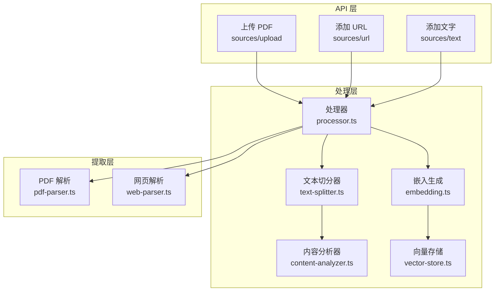
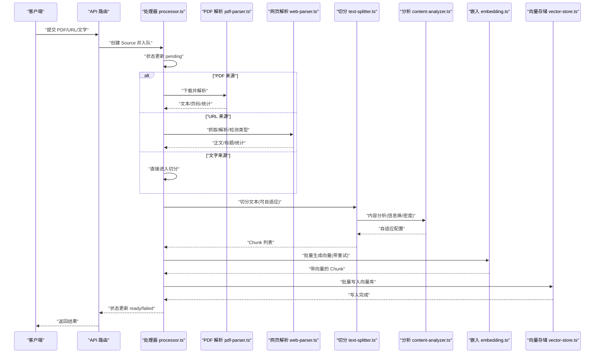
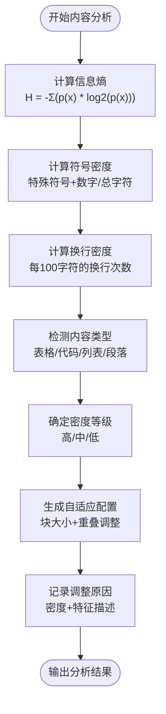
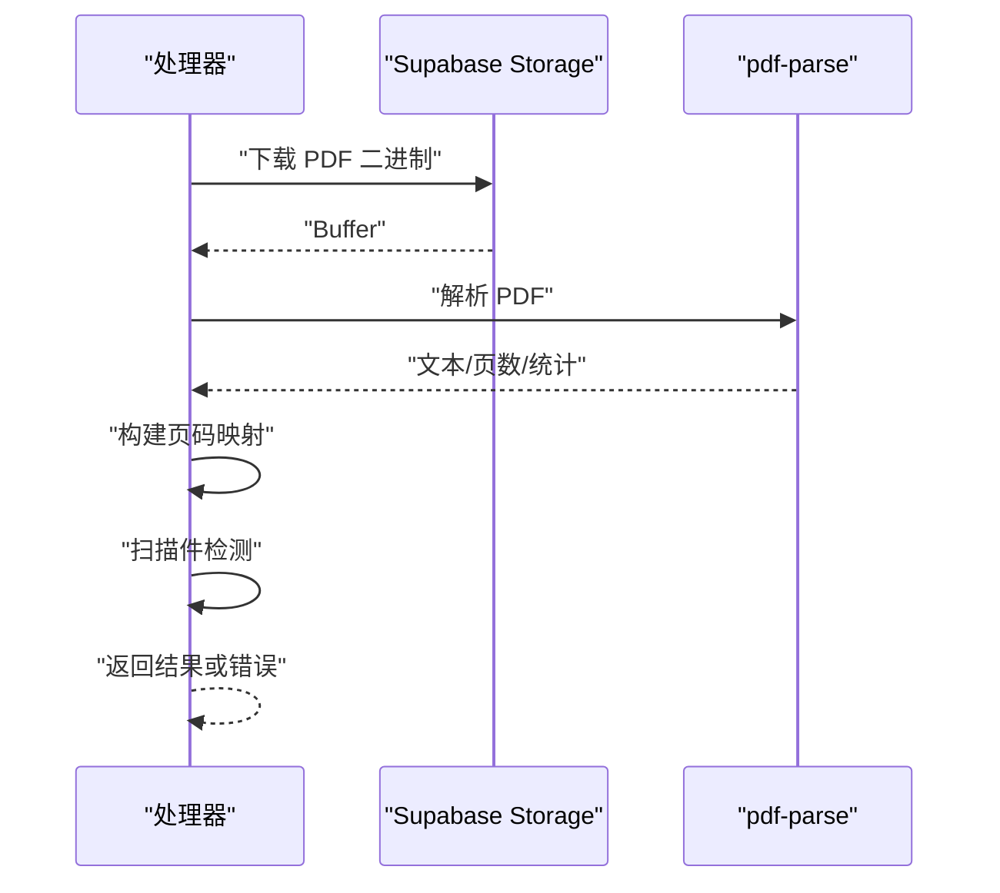
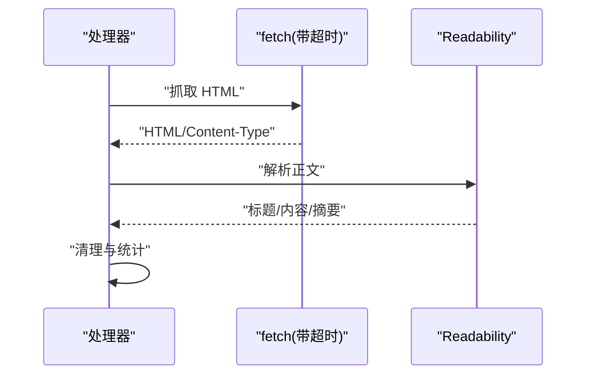
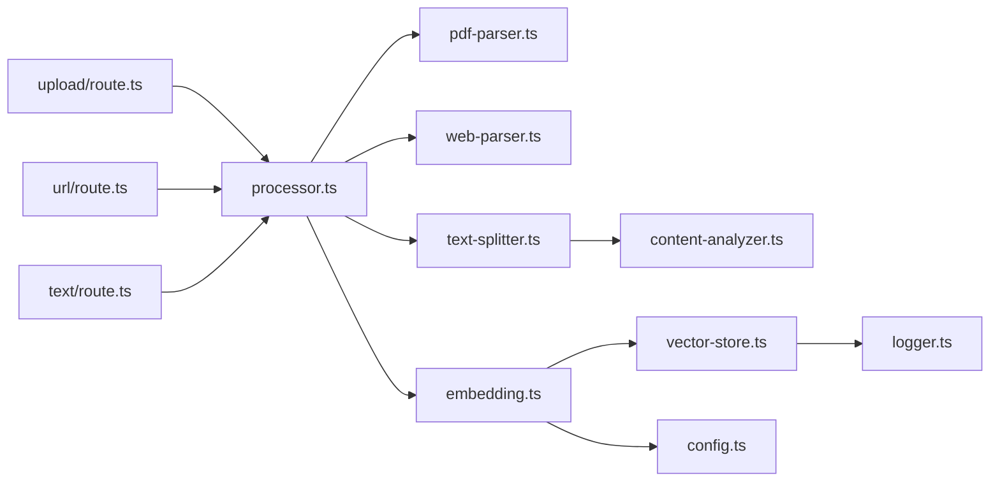

# 文本处理与解析

<cite>
**本文引用的文件**
- [lib/processing/text-splitter.ts](file://lib/processing/text-splitter.ts)
- [lib/processing/content-analyzer.ts](file://lib/processing/content-analyzer.ts)
- [lib/processing/pdf-parser.ts](file://lib/processing/pdf-parser.ts)
- [lib/processing/web-parser.ts](file://lib/processing/web-parser.ts)
- [lib/processing/processor.ts](file://lib/processing/processor.ts)
- [lib/processing/embedding.ts](file://lib/processing/embedding.ts)
- [lib/processing/index.ts](file://lib/processing/index.ts)
- [app/api/sources/upload/route.ts](file://app/api/sources/upload/route.ts)
- [app/api/sources/url/route.ts](file://app/api/sources/url/route.ts)
- [app/api/sources/text/route.ts](file://app/api/sources/text/route.ts)
- [lib/db/vector-store.ts](file://lib/db/vector-store.ts)
- [lib/config.ts](file://lib/config.ts)
- [types/pdf-parse.d.ts](file://types/pdf-parse.d.ts)
- [lib/utils/logger.ts](file://lib/utils/logger.ts)
- [scripts/test-adaptive-splitting.ts](file://scripts/test-adaptive-splitting.ts)
</cite>

## 更新摘要
**变更内容**
- 新增智能内容分析器模块，实现信息熵、符号密度、换行密度分析
- 集成自适应分块策略，支持高密度/低密度内容差异化处理
- 增强特殊内容保护机制，支持代码块、表格、列表的智能识别与保护
- 完善内容类型检测与密度分级系统
- 新增详细的测试脚本验证自适应切分功能

## 目录
1. [简介](#简介)
2. [项目结构](#项目结构)
3. [核心组件](#核心组件)
4. [架构总览](#架构总览)
5. [详细组件分析](#详细组件分析)
6. [依赖关系分析](#依赖关系分析)
7. [性能考量](#性能考量)
8. [故障排查指南](#故障排查指南)
9. [结论](#结论)
10. [附录](#附录)

## 简介
本文件面向"文本处理与解析"能力，系统化阐述以下主题：
- 文本切分算法：语义分割、句子边界检测、段落识别与自适应策略
- 多格式文本提取：PDF 文本提取、网页内容清理与纯文本处理
- 文本预处理：去重、标准化与噪声过滤
- 分块策略与重叠处理：平衡块大小与上下文完整性
- 质量评估与性能优化：token 估算、吞吐与内存控制
- 自定义规则与回退机制：特殊格式支持与失败兜底
- 扩展性与基准测试建议

## 项目结构
围绕"文本处理与解析"的核心目录与文件如下：
- 处理流程与切分：lib/processing/processor.ts、lib/processing/text-splitter.ts、lib/processing/content-analyzer.ts
- 格式提取：lib/processing/pdf-parser.ts、lib/processing/web-parser.ts
- 向量化与持久化：lib/processing/embedding.ts、lib/db/vector-store.ts
- API 入口：app/api/sources/upload/route.ts、app/api/sources/url/route.ts、app/api/sources/text/route.ts
- 配置与类型：lib/config.ts、types/pdf-parse.d.ts、lib/utils/logger.ts

**图表来源**
- [lib/processing/processor.ts](file://lib/processing/processor.ts#L1-L560)
- [lib/processing/text-splitter.ts](file://lib/processing/text-splitter.ts#L1-L432)
- [lib/processing/content-analyzer.ts](file://lib/processing/content-analyzer.ts#L1-L476)
- [lib/processing/pdf-parser.ts](file://lib/processing/pdf-parser.ts#L1-L150)
- [lib/processing/web-parser.ts](file://lib/processing/web-parser.ts#L1-L228)
- [lib/processing/embedding.ts](file://lib/processing/embedding.ts#L1-L189)
- [lib/db/vector-store.ts](file://lib/db/vector-store.ts#L1-L446)
- [app/api/sources/upload/route.ts](file://app/api/sources/upload/route.ts#L1-L111)
- [app/api/sources/url/route.ts](file://app/api/sources/url/route.ts#L1-L167)
- [app/api/sources/text/route.ts](file://app/api/sources/text/route.ts#L1-L122)

**章节来源**
- [lib/processing/index.ts](file://lib/processing/index.ts#L1-L51)

## 核心组件
- 文本切分器：基于递归字符切分，优先自然边界，支持自适应配置与重叠窗口
- **内容分析器**：**新增** 计算信息熵、符号密度、换行密度，识别内容类型，驱动自适应切分
- PDF 解析器：从 Supabase Storage 下载并解析 PDF，构建页码映射，检测扫描件
- 网页解析器：抓取网页，使用 Mozilla Readability 提取正文，清理多余空白
- 处理器：统一编排下载/抓取、解析、切分、向量化、写库的完整流程
- 嵌入生成：批量调用智谱 Embedding API，指数退避重试与去重
- 向量存储：批量插入、相似度检索、混合检索（向量+全文）

**章节来源**
- [lib/processing/text-splitter.ts](file://lib/processing/text-splitter.ts#L1-L432)
- [lib/processing/content-analyzer.ts](file://lib/processing/content-analyzer.ts#L1-L476)
- [lib/processing/pdf-parser.ts](file://lib/processing/pdf-parser.ts#L1-L150)
- [lib/processing/web-parser.ts](file://lib/processing/web-parser.ts#L1-L228)
- [lib/processing/processor.ts](file://lib/processing/processor.ts#L1-L560)
- [lib/processing/embedding.ts](file://lib/processing/embedding.ts#L1-L189)
- [lib/db/vector-store.ts](file://lib/db/vector-store.ts#L1-L446)

## 架构总览
下图展示"从知识源到向量索引"的端到端流程，覆盖 PDF、URL、文字三种来源。

**图表来源**
- [lib/processing/processor.ts](file://lib/processing/processor.ts#L80-L397)
- [lib/processing/pdf-parser.ts](file://lib/processing/pdf-parser.ts#L133-L149)
- [lib/processing/web-parser.ts](file://lib/processing/web-parser.ts#L174-L190)
- [lib/processing/text-splitter.ts](file://lib/processing/text-splitter.ts#L109-L189)
- [lib/processing/embedding.ts](file://lib/processing/embedding.ts#L140-L188)
- [lib/db/vector-store.ts](file://lib/db/vector-store.ts#L77-L173)

## 详细组件分析

### 智能内容分析器与自适应策略
**新增** 内容分析器实现了完整的智能内容分类与自适应分块策略，包括：

#### 内容特征分析
- **信息熵计算**：基于香农熵公式计算文本复杂度，衡量内容的信息密度
- **符号密度分析**：统计特殊符号和数字密度，识别技术文档特征
- **换行密度检测**：分析换行模式，识别列表、代码等结构化内容

#### 内容类型识别
- **表格检测**：支持 Markdown 表格和纯文本表格识别
- **代码块识别**：基于语法特征和缩进模式检测代码区域
- **列表判定**：识别有序和无序列表，支持多种标记格式

#### 密度分级系统
- **高密度内容**：技术文档、代码、数据密集型内容
- **中密度内容**：普通文本内容
- **低密度内容**：叙述性强、结构简单的文本

#### 自适应切分配置
- **高密度内容**：缩小块大小（400 tokens），增加重叠（15%）
- **低密度内容**：扩大块大小（1200 tokens），减少重叠（10%）
- **中密度内容**：使用默认配置（800 tokens，12.5%重叠）

**图表来源**
- [lib/processing/content-analyzer.ts](file://lib/processing/content-analyzer.ts#L49-L68)
- [lib/processing/content-analyzer.ts](file://lib/processing/content-analyzer.ts#L74-L82)
- [lib/processing/content-analyzer.ts](file://lib/processing/content-analyzer.ts#L88-L94)
- [lib/processing/content-analyzer.ts](file://lib/processing/content-analyzer.ts#L99-L118)
- [lib/processing/content-analyzer.ts](file://lib/processing/content-analyzer.ts#L203-L241)
- [lib/processing/content-analyzer.ts](file://lib/processing/content-analyzer.ts#L246-L283)

**章节来源**
- [lib/processing/content-analyzer.ts](file://lib/processing/content-analyzer.ts#L1-L476)

### 文本切分算法与自适应策略
- 切分优先级：Markdown 标题层级 > 段落 > 换行 > 中文句号/感叹号/问号 > 英文句号/感叹号/问号 > 空格 > 字符
- Token 估算：中文约 1.5 字符/token，其他约 4 字符/token，混合加权
- **自适应切分**：**更新** 基于内容分析器的智能配置，根据内容密度动态调整块大小与重叠
- 重叠窗口：以目标 token 数的倍数估算字符数，确保跨边界信息不丢失
- 输出元数据：包含页码、字符范围、token 数、来源类型、策略标识、自适应原因、内容分析结果

**图表来源**
- [lib/processing/text-splitter.ts](file://lib/processing/text-splitter.ts#L109-L189)
- [lib/processing/content-analyzer.ts](file://lib/processing/content-analyzer.ts#L196-L283)

**章节来源**
- [lib/processing/text-splitter.ts](file://lib/processing/text-splitter.ts#L21-L38)
- [lib/processing/text-splitter.ts](file://lib/processing/text-splitter.ts#L45-L56)
- [lib/processing/text-splitter.ts](file://lib/processing/text-splitter.ts#L109-L189)
- [lib/processing/text-splitter.ts](file://lib/processing/text-splitter.ts#L195-L260)
- [lib/processing/text-splitter.ts](file://lib/processing/text-splitter.ts#L265-L305)
- [lib/processing/content-analyzer.ts](file://lib/processing/content-analyzer.ts#L28-L34)
- [lib/processing/content-analyzer.ts](file://lib/processing/content-analyzer.ts#L196-L283)

### PDF 文本提取与扫描件检测
- 下载：从 Supabase Storage 按存储路径下载二进制
- 解析：动态导入 pdf-parse，异步解析文本、页数与元信息
- 页码映射：按平均字符数近似分配页起始字符位置
- 错误处理：区分加密、损坏、其他异常，返回结构化错误信息
- 扫描件检测：按平均每页字符数阈值判断是否为图片扫描版

**图表来源**
- [lib/processing/pdf-parser.ts](file://lib/processing/pdf-parser.ts#L41-L52)
- [lib/processing/pdf-parser.ts](file://lib/processing/pdf-parser.ts#L57-L117)
- [lib/processing/pdf-parser.ts](file://lib/processing/pdf-parser.ts#L133-L149)

**章节来源**
- [lib/processing/pdf-parser.ts](file://lib/processing/pdf-parser.ts#L1-L150)
- [types/pdf-parse.d.ts](file://types/pdf-parse.d.ts#L1-L14)

### 网页内容清理与正文提取
- URL 类型检测：PDF、YouTube、普通网页
- 抓取：带超时与中断控制，遵循重定向
- 正文提取：使用 @mozilla/readability，JSDOM 构造文档对象
- 内容清理：合并空白、规范化换行，计算词数
- 特殊处理：Content-Type 为 PDF 时走 PDF 流程；YouTube 直接标记为不支持

**图表来源**
- [lib/processing/web-parser.ts](file://lib/processing/web-parser.ts#L82-L126)
- [lib/processing/web-parser.ts](file://lib/processing/web-parser.ts#L131-L169)
- [lib/processing/web-parser.ts](file://lib/processing/web-parser.ts#L174-L190)

**章节来源**
- [lib/processing/web-parser.ts](file://lib/processing/web-parser.ts#L1-L228)

### 文本预处理：去重、标准化与噪声过滤
- 去重：基于内容哈希（content hash）在向量库层面进行去重，避免重复写入
- 标准化：切分前的 token 估算与字符范围记录，保证元数据一致性
- 噪声过滤：网页正文提取与清理步骤，去除广告、导航等非正文内容

**章节来源**
- [lib/processing/text-splitter.ts](file://lib/processing/text-splitter.ts#L61-L63)
- [lib/processing/text-splitter.ts](file://lib/processing/text-splitter.ts#L265-L305)
- [lib/db/vector-store.ts](file://lib/db/vector-store.ts#L305-L310)
- [lib/processing/web-parser.ts](file://lib/processing/web-parser.ts#L146-L150)

### 分块策略与重叠处理
- 目标块大小与重叠：默认 800 tokens，12.5% 重叠；高密度内容缩小块并提高重叠，低密度内容扩大块并降低重叠
- 重叠计算：以目标 token 数的倍数估算字符数，保留尾部重叠部分参与下一块
- 上下文完整性：重叠窗口确保跨边界语义不被截断

**章节来源**
- [lib/processing/text-splitter.ts](file://lib/processing/text-splitter.ts#L21-L38)
- [lib/processing/text-splitter.ts](file://lib/processing/text-splitter.ts#L252-L260)
- [lib/processing/content-analyzer.ts](file://lib/processing/content-analyzer.ts#L246-L283)

### 文本质量评估指标
- 词数/字符数：用于统计与进度展示
- 平均 token 数：切分后各块 token 数的均值
- 向量维度一致性：启动时强制校验，确保与数据库向量维度一致
- 日志与可观测性：向量操作成功/失败、耗时、插入/跳过数量、相似度均值

**章节来源**
- [lib/processing/pdf-parser.ts](file://lib/processing/pdf-parser.ts#L66-L84)
- [lib/processing/web-parser.ts](file://lib/processing/web-parser.ts#L24-L30)
- [lib/processing/processor.ts](file://lib/processing/processor.ts#L138-L148)
- [lib/processing/processor.ts](file://lib/processing/processor.ts#L319-L329)
- [lib/config.ts](file://lib/config.ts#L7-L29)
- [lib/utils/logger.ts](file://lib/utils/logger.ts#L75-L94)

### 处理速度优化与内存控制
- 批量处理：嵌入生成按批处理，限制每批最大条数与单条最大 token 数
- 指数退避重试：对特定错误码进行退避重试，提升稳定性
- 分批写库：向量存储按固定批大小批量插入，减少往返开销
- 异步并行：API 层与业务层多处使用 Promise 并行，缩短端到端时间

**章节来源**
- [lib/processing/embedding.ts](file://lib/processing/embedding.ts#L23-L26)
- [lib/processing/embedding.ts](file://lib/processing/embedding.ts#L115-L134)
- [lib/db/vector-store.ts](file://lib/db/vector-store.ts#L9-L10)
- [lib/db/vector-store.ts](file://lib/db/vector-store.ts#L108-L140)
- [app/api/sources/upload/route.ts](file://app/api/sources/upload/route.ts#L22-L26)
- [app/api/sources/text/route.ts](file://app/api/sources/text/route.ts#L44-L50)

### 自定义切分规则与特殊格式支持
- 自定义分隔符优先级：可在配置中扩展或调整
- **特殊格式识别**：**更新** 表格、代码块、列表的识别逻辑，影响密度与类型判断
- **回退机制**：**更新** 当 PDF 为扫描件或网页解析失败时，返回结构化错误信息，避免崩溃

**章节来源**
- [lib/processing/text-splitter.ts](file://lib/processing/text-splitter.ts#L24-L37)
- [lib/processing/content-analyzer.ts](file://lib/processing/content-analyzer.ts#L99-L191)
- [lib/processing/pdf-parser.ts](file://lib/processing/pdf-parser.ts#L122-L128)
- [lib/processing/web-parser.ts](file://lib/processing/web-parser.ts#L137-L168)

### 处理失败的回退机制
- PDF：加密、损坏、其他异常分别返回明确错误
- 网页：HTTP 状态、超时、解析失败均有对应处理
- 嵌入：API 错误、维度不匹配、重试上限触发时抛错并记录日志
- 存储：批量写入异常记录日志并上抛

**章节来源**
- [lib/processing/pdf-parser.ts](file://lib/processing/pdf-parser.ts#L88-L116)
- [lib/processing/web-parser.ts](file://lib/processing/web-parser.ts#L93-L126)
- [lib/processing/embedding.ts](file://lib/processing/embedding.ts#L90-L110)
- [lib/db/vector-store.ts](file://lib/db/vector-store.ts#L157-L172)

## 依赖关系分析
- 处理器依赖切分器、内容分析器、PDF/网页解析器、嵌入生成与向量存储
- **切分器依赖内容分析器**：**新增** 进行自适应配置
- 嵌入生成依赖配置中的模型与维度，并与向量存储交互
- API 路由负责创建 Source、入队与状态反馈

**图表来源**
- [lib/processing/processor.ts](file://lib/processing/processor.ts#L1-L560)
- [lib/processing/text-splitter.ts](file://lib/processing/text-splitter.ts#L1-L432)
- [lib/processing/content-analyzer.ts](file://lib/processing/content-analyzer.ts#L1-L476)
- [lib/processing/pdf-parser.ts](file://lib/processing/pdf-parser.ts#L1-L150)
- [lib/processing/web-parser.ts](file://lib/processing/web-parser.ts#L1-L228)
- [lib/processing/embedding.ts](file://lib/processing/embedding.ts#L1-L189)
- [lib/db/vector-store.ts](file://lib/db/vector-store.ts#L1-L446)
- [lib/config.ts](file://lib/config.ts#L1-L187)
- [lib/utils/logger.ts](file://lib/utils/logger.ts#L1-L98)
- [app/api/sources/upload/route.ts](file://app/api/sources/upload/route.ts#L1-L111)
- [app/api/sources/url/route.ts](file://app/api/sources/url/route.ts#L1-L167)
- [app/api/sources/text/route.ts](file://app/api/sources/text/route.ts#L1-L122)

**章节来源**
- [lib/processing/index.ts](file://lib/processing/index.ts#L1-L51)

## 性能考量
- 切分性能：优先使用语义边界，避免过细切分；自适应策略在高密度内容下减小块大小，提升检索精度
- 向量化性能：批量大小与单条 token 上限控制 API 调用成本；指数退避降低服务端压力
- 存储性能：批量插入与冲突忽略（ON CONFLICT DO NOTHING）减少写放大；相似度检索使用向量距离函数与阈值过滤
- 内存控制：切分与嵌入均采用流式/分批处理，避免一次性加载大文本
- 可观测性：统一日志结构，记录操作、耗时、成功/失败与关键指标，便于定位瓶颈

## 故障排查指南
- 向量维度不匹配：检查 EMBEDDING_DIM 配置与数据库向量维度一致
- PDF 解析失败：确认文件未加密、未损坏；若为扫描件，提示暂不支持 OCR
- 网页抓取失败：检查网络连通性、超时设置、HTTP 状态码
- 嵌入 API 失败：核对鉴权信息、模型名与维度；查看重试日志
- 写库失败：检查数据库连接、权限与批量 SQL 构造

**章节来源**
- [lib/config.ts](file://lib/config.ts#L17-L29)
- [lib/processing/pdf-parser.ts](file://lib/processing/pdf-parser.ts#L88-L116)
- [lib/processing/web-parser.ts](file://lib/processing/web-parser.ts#L118-L126)
- [lib/processing/embedding.ts](file://lib/processing/embedding.ts#L90-L110)
- [lib/db/vector-store.ts](file://lib/db/vector-store.ts#L157-L172)

## 结论
该系统以"递归语义切分 + 内容自适应 + 多格式提取 + 批量向量化 + 向量存储"为核心，形成从知识源到检索增强的完整链路。**新增的内容分析器模块**通过智能内容分类与自适应分块策略，显著提升了不同内容类型的处理效果。通过严格的维度校验、指数退避重试、批量写入与可观测日志，兼顾了正确性、性能与可维护性。建议在生产环境中结合实际数据分布进一步调优切分参数与批大小，并完善扫描件 OCR 与视频内容提取能力。

## 附录
- API 入口职责
  - 上传 PDF：校验类型与大小，上传至 Supabase Storage，创建 Source 并入队
  - 添加 URL：检测类型（PDF/YouTube/网页），必要时转为 PDF 流程或直接标记不支持
  - 添加文字：校验内容长度与去重，直接创建 Source 并入队
- 数据库与向量
  - 向量维度固定为 1024，使用 HNSW 向量索引与全文检索（TSV）组合
  - 批量插入与相似度检索均带有阈值与 TopK 控制
- **内容分析器测试**
  - **新增** 提供完整的自适应切分功能测试脚本，验证不同内容类型的处理效果
  - 支持代码、表格、叙述性文本、技术文档等样本的自动测试

**章节来源**
- [app/api/sources/upload/route.ts](file://app/api/sources/upload/route.ts#L14-L111)
- [app/api/sources/url/route.ts](file://app/api/sources/url/route.ts#L20-L167)
- [app/api/sources/text/route.ts](file://app/api/sources/text/route.ts#L13-L122)
- [lib/db/vector-store.ts](file://lib/db/vector-store.ts#L128-L140)
- [lib/db/vector-store.ts](file://lib/db/vector-store.ts#L215-L252)
- [lib/db/vector-store.ts](file://lib/db/vector-store.ts#L363-L429)
- [scripts/test-adaptive-splitting.ts](file://scripts/test-adaptive-splitting.ts#L1-L113)