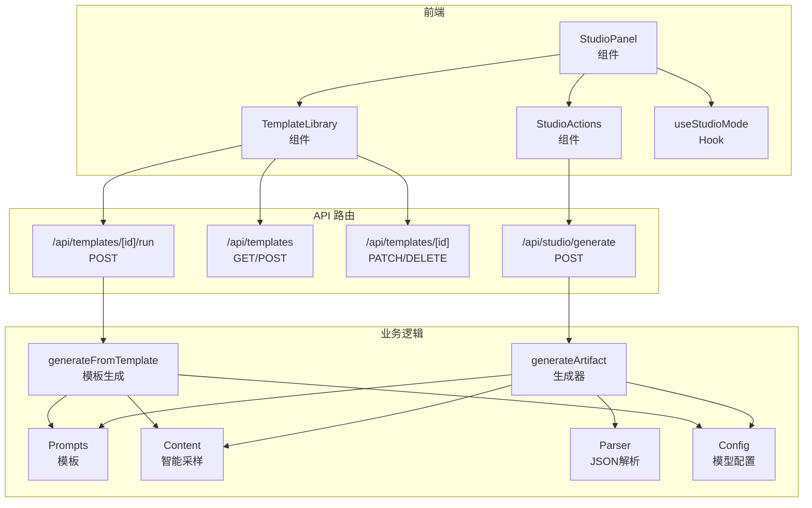
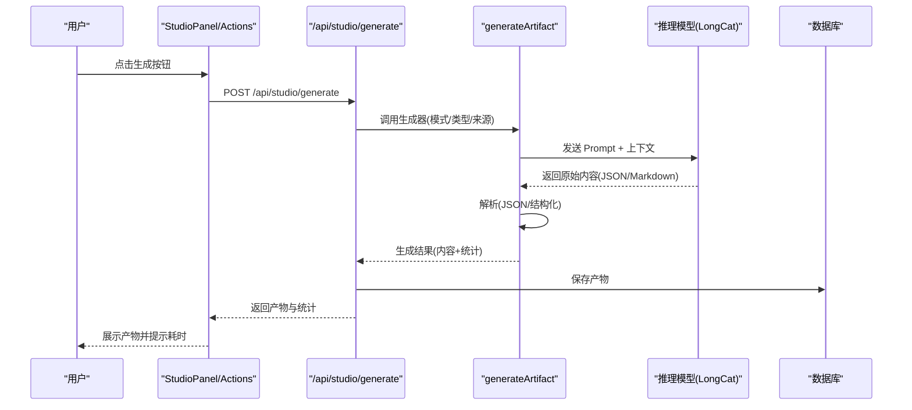
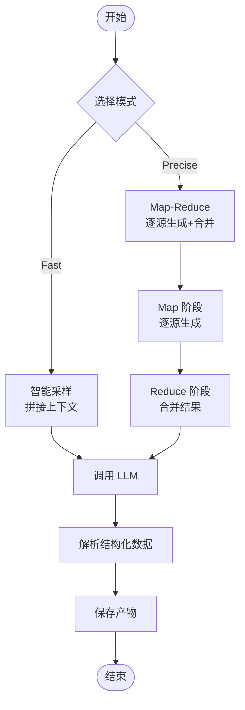
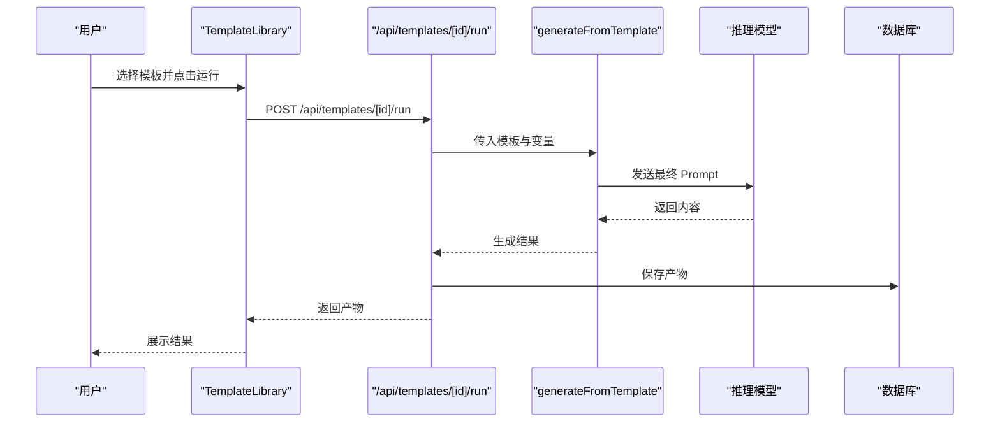
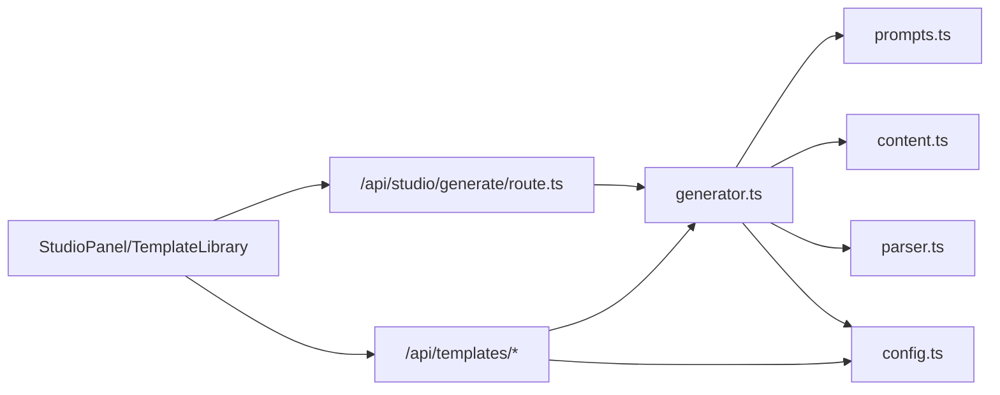

# Studio 产物生成功能

<cite>
**本文档引用的文件**
- [lib/studio/index.ts](file://lib/studio/index.ts)
- [lib/studio/generator.ts](file://lib/studio/generator.ts)
- [lib/studio/parser.ts](file://lib/studio/parser.ts)
- [lib/studio/prompts.ts](file://lib/studio/prompts.ts)
- [lib/studio/content.ts](file://lib/studio/content.ts)
- [app/api/studio/generate/route.ts](file://app/api/studio/generate/route.ts)
- [app/api/templates/route.ts](file://app/api/templates/route.ts)
- [app/api/templates/[id]/route.ts](file://app/api/templates/[id]/route.ts)
- [app/api/templates/[id]/run/route.ts](file://app/api/templates/[id]/run/route.ts)
- [components/notebook/studio-panel.tsx](file://components/notebook/studio-panel.tsx)
- [components/notebook/studio-actions.tsx](file://components/notebook/studio-actions.tsx)
- [components/notebook/template-library.tsx](file://components/notebook/template-library.tsx)
- [hooks/use-studio-mode.ts](file://hooks/use-studio-mode.ts)
- [lib/config.ts](file://lib/config.ts)
- [types/index.ts](file://types/index.ts)
</cite>

## 目录
1. [简介](#简介)
2. [项目结构](#项目结构)
3. [核心组件](#核心组件)
4. [架构总览](#架构总览)
5. [详细组件分析](#详细组件分析)
6. [依赖分析](#依赖分析)
7. [性能考虑](#性能考虑)
8. [故障排查指南](#故障排查指南)
9. [结论](#结论)
10. [附录](#附录)

## 简介
本文件面向 Studio 产物生成功能，系统性阐述以下内容：
- 产物类型：摘要、大纲、测验、思维导图与自定义模板产物的生成原理与实现
- 两种生成模式：Fast（快速）与 Precise（精准）模式的差异、适用场景与性能权衡
- 模板系统：模板架构、变量系统与自定义模板创建流程
- 产物解析机制：结构化数据提取、JSON 安全解析与格式转换
- API 接口：端点定义、请求/响应规范与使用示例
- 质量评估与性能基准：生成质量标准、性能指标与优化建议
- 展示组件：产物渲染与用户体验优化策略

## 项目结构
Studio 产物生成功能由“前端组件 + API 路由 + 业务逻辑模块”三层构成：
- 前端组件负责交互与展示，调用 API 完成生成与模板运行
- API 路由负责鉴权、参数校验、调用生成器并持久化产物
- 业务逻辑模块封装生成器、Prompt 模板、内容采样与解析器

图表来源
- [components/notebook/studio-panel.tsx](file://components/notebook/studio-panel.tsx#L25-L260)
- [components/notebook/studio-actions.tsx](file://components/notebook/studio-actions.tsx#L59-L108)
- [components/notebook/template-library.tsx](file://components/notebook/template-library.tsx#L31-L385)
- [hooks/use-studio-mode.ts](file://hooks/use-studio-mode.ts#L14-L38)
- [app/api/studio/generate/route.ts](file://app/api/studio/generate/route.ts#L12-L144)
- [app/api/templates/route.ts](file://app/api/templates/route.ts#L5-L62)
- [app/api/templates/[id]/route.ts](file://app/api/templates/[id]/route.ts#L5-L92)
- [app/api/templates/[id]/run/route.ts](file://app/api/templates/[id]/run/route.ts#L6-L103)
- [lib/studio/generator.ts](file://lib/studio/generator.ts#L242-L310)
- [lib/studio/prompts.ts](file://lib/studio/prompts.ts#L202-L211)
- [lib/studio/content.ts](file://lib/studio/content.ts#L67-L224)
- [lib/studio/parser.ts](file://lib/studio/parser.ts#L124-L182)
- [lib/config.ts](file://lib/config.ts#L149-L157)

章节来源
- [lib/studio/index.ts](file://lib/studio/index.ts#L6-L24)
- [lib/studio/generator.ts](file://lib/studio/generator.ts#L242-L310)
- [lib/studio/prompts.ts](file://lib/studio/prompts.ts#L202-L211)
- [lib/studio/content.ts](file://lib/studio/content.ts#L67-L224)
- [lib/studio/parser.ts](file://lib/studio/parser.ts#L124-L182)
- [app/api/studio/generate/route.ts](file://app/api/studio/generate/route.ts#L12-L144)
- [app/api/templates/route.ts](file://app/api/templates/route.ts#L5-L62)
- [app/api/templates/[id]/route.ts](file://app/api/templates/[id]/route.ts#L5-L92)
- [app/api/templates/[id]/run/route.ts](file://app/api/templates/[id]/run/route.ts#L6-L103)
- [components/notebook/studio-panel.tsx](file://components/notebook/studio-panel.tsx#L25-L260)
- [components/notebook/studio-actions.tsx](file://components/notebook/studio-actions.tsx#L59-L108)
- [components/notebook/template-library.tsx](file://components/notebook/template-library.tsx#L31-L385)
- [hooks/use-studio-mode.ts](file://hooks/use-studio-mode.ts#L14-L38)
- [lib/config.ts](file://lib/config.ts#L149-L157)
- [types/index.ts](file://types/index.ts#L14-L18)

## 核心组件
- 生成器：统一入口函数，根据模式选择 Fast 或 Precise 路径；支持模板生成
- Prompt 模板：内置摘要、大纲、测验、思维导图的 Prompt，以及 Map-Reduce 的 Map/Reduce Prompt
- 内容采样：智能采样与截断，保障 Token 上限与上下文完整性
- 解析器：安全 JSON 解析与结构校验，提供默认回退
- API 路由：鉴权、参数校验、产物持久化与错误映射
- 前端组件：交互面板、动作按钮、模板库与运行对话框

章节来源
- [lib/studio/generator.ts](file://lib/studio/generator.ts#L242-L310)
- [lib/studio/prompts.ts](file://lib/studio/prompts.ts#L202-L211)
- [lib/studio/content.ts](file://lib/studio/content.ts#L67-L224)
- [lib/studio/parser.ts](file://lib/studio/parser.ts#L124-L182)
- [app/api/studio/generate/route.ts](file://app/api/studio/generate/route.ts#L12-L144)
- [app/api/templates/[id]/run/route.ts](file://app/api/templates/[id]/run/route.ts#L6-L103)
- [components/notebook/studio-panel.tsx](file://components/notebook/studio-panel.tsx#L25-L260)
- [components/notebook/template-library.tsx](file://components/notebook/template-library.tsx#L31-L385)

## 架构总览
下图展示了从用户触发到产物落库的关键流程。

图表来源
- [components/notebook/studio-panel.tsx](file://components/notebook/studio-panel.tsx#L54-L111)
- [app/api/studio/generate/route.ts](file://app/api/studio/generate/route.ts#L82-L111)
- [lib/studio/generator.ts](file://lib/studio/generator.ts#L242-L262)
- [lib/studio/parser.ts](file://lib/studio/parser.ts#L124-L182)

## 详细组件分析

### 生成器与模式对比
- Fast 模式（智能采样）：从每个来源抽取头尾若干片段，拼接后进行一次 LLM 调用，速度快、成本低
- Precise 模式（Map-Reduce）：对每个来源独立生成中间结果，再在 Reduce 阶段合并，结果更全面但耗时更长
- 模板生成：支持传入自定义 Prompt，自动注入上下文与变量，适合复杂定制

图表来源
- [lib/studio/generator.ts](file://lib/studio/generator.ts#L120-L237)
- [lib/studio/content.ts](file://lib/studio/content.ts#L67-L224)
- [lib/studio/parser.ts](file://lib/studio/parser.ts#L124-L182)

章节来源
- [lib/studio/generator.ts](file://lib/studio/generator.ts#L120-L237)
- [lib/studio/content.ts](file://lib/studio/content.ts#L67-L224)
- [lib/studio/parser.ts](file://lib/studio/parser.ts#L124-L182)

### Prompt 模板系统
- 内置模板：摘要、大纲、测验、思维导图的标准 Prompt
- Map-Reduce 模板：为每种产物提供 Map 与 Reduce 阶段的 Prompt
- 类型导出：统一通过 getPrompt(type) 获取对应模板

章节来源
- [lib/studio/prompts.ts](file://lib/studio/prompts.ts#L6-L211)

### 内容采样与 Token 控制
- 智能采样：每个来源取头部与尾部片段，避免遗漏关键信息
- 截断策略：按来源块级截断，保留完整上下文边界
- Token 估算：中英文混合字符按不同权重估算，用于上下限控制

章节来源
- [lib/studio/content.ts](file://lib/studio/content.ts#L33-L61)
- [lib/studio/content.ts](file://lib/studio/content.ts#L67-L154)
- [lib/studio/content.ts](file://lib/studio/content.ts#L159-L224)

### JSON 安全解析与回退
- 多策略解析：直接解析、提取代码块、提取对象/数组边界
- 结构校验：确保必要字段存在，补全缺失字段
- 默认回退：测验与思维导图提供默认结构，保证可用性

章节来源
- [lib/studio/parser.ts](file://lib/studio/parser.ts#L56-L119)
- [lib/studio/parser.ts](file://lib/studio/parser.ts#L124-L182)

### 模板系统与自定义模板
- 模板存储：用户可创建/编辑/删除自己的模板，系统模板不可修改
- 变量系统：模板中使用 {{var}} 占位符，运行时注入变量与上下文
- 运行流程：选择模板 → 填写变量 → 触发运行 → 保存产物

图表来源
- [components/notebook/template-library.tsx](file://components/notebook/template-library.tsx#L150-L186)
- [app/api/templates/[id]/run/route.ts](file://app/api/templates/[id]/run/route.ts#L50-L79)
- [lib/studio/generator.ts](file://lib/studio/generator.ts#L267-L310)

章节来源
- [app/api/templates/route.ts](file://app/api/templates/route.ts#L5-L62)
- [app/api/templates/[id]/route.ts](file://app/api/templates/[id]/route.ts#L5-L92)
- [app/api/templates/[id]/run/route.ts](file://app/api/templates/[id]/run/route.ts#L6-L103)
- [components/notebook/template-library.tsx](file://components/notebook/template-library.tsx#L31-L385)
- [lib/studio/generator.ts](file://lib/studio/generator.ts#L267-L310)

### 前端交互与展示
- StudioPanel：主面板，包含模式切换、生成动作、产物列表与模板库
- StudioActions：四种产物的生成按钮，带禁用态与加载态
- TemplateLibrary：模板列表、编辑/删除、运行对话框与变量输入
- useStudioMode：本地持久化模式选择

章节来源
- [components/notebook/studio-panel.tsx](file://components/notebook/studio-panel.tsx#L25-L260)
- [components/notebook/studio-actions.tsx](file://components/notebook/studio-actions.tsx#L59-L108)
- [components/notebook/template-library.tsx](file://components/notebook/template-library.tsx#L31-L385)
- [hooks/use-studio-mode.ts](file://hooks/use-studio-mode.ts#L14-L38)

## 依赖分析
- 生成器依赖 Prompt 模板、内容采样与解析器
- API 路由依赖鉴权客户端、Prisma 与生成器
- 前端组件依赖路由与状态 Hook
- 配置模块提供模型与环境变量

图表来源
- [lib/studio/generator.ts](file://lib/studio/generator.ts#L6-L20)
- [app/api/studio/generate/route.ts](file://app/api/studio/generate/route.ts#L10-L10)
- [app/api/templates/[id]/run/route.ts](file://app/api/templates/[id]/run/route.ts#L4-L4)
- [lib/config.ts](file://lib/config.ts#L149-L157)

章节来源
- [lib/studio/generator.ts](file://lib/studio/generator.ts#L6-L20)
- [lib/studio/prompts.ts](file://lib/studio/prompts.ts#L202-L211)
- [lib/studio/content.ts](file://lib/studio/content.ts#L67-L224)
- [lib/studio/parser.ts](file://lib/studio/parser.ts#L124-L182)
- [app/api/studio/generate/route.ts](file://app/api/studio/generate/route.ts#L10-L10)
- [app/api/templates/[id]/run/route.ts](file://app/api/templates/[id]/run/route.ts#L4-L4)
- [lib/config.ts](file://lib/config.ts#L149-L157)

## 性能考虑
- 超时与并发：Fast 模式 90 秒，Precise 模式 180 秒，Map 步骤 45 秒；超时统一抛出错误
- Token 控制：估算与截断，避免超过模型上下文限制
- 采样策略：Fast 模式限制总片段数，避免过度拼接
- 模型选择：强制使用推理模型以获得稳定 JSON 输出能力
- 前端反馈：生成耗时通过 Toast 展示，提升感知性能

章节来源
- [lib/studio/generator.ts](file://lib/studio/generator.ts#L23-L26)
- [lib/studio/generator.ts](file://lib/studio/generator.ts#L53-L115)
- [lib/studio/content.ts](file://lib/studio/content.ts#L33-L61)
- [lib/studio/content.ts](file://lib/studio/content.ts#L67-L154)
- [lib/config.ts](file://lib/config.ts#L149-L157)
- [components/notebook/studio-panel.tsx](file://components/notebook/studio-panel.tsx#L94-L99)

## 故障排查指南
- 未授权：鉴权失败返回 401
- 参数错误：缺少必要参数或类型非法返回 400
- Notebook 不存在或无权访问：返回 404
- 产物数量上限：超过 10 个返回 400
- 无可用资料：返回 400，提示先上传资料
- 生成超时：返回 504，提示重试
- 生成失败：返回 500，提示重试
- JSON 解析失败：解析器返回默认回退，前端可观察统计信息

章节来源
- [app/api/studio/generate/route.ts](file://app/api/studio/generate/route.ts#L113-L144)
- [lib/studio/parser.ts](file://lib/studio/parser.ts#L113-L118)

## 结论
本功能通过“Prompt 模板 + 智能采样 + 安全解析”的组合，实现了稳定高效的产物生成。Fast 模式满足快速产出需求，Precise 模式满足高质量需求；模板系统提供了强大的扩展能力。配合完善的错误处理与前端反馈，整体用户体验良好。

## 附录

### API 接口文档

- 生成产物
  - 方法与路径：POST /api/studio/generate
  - 请求体
    - notebookId: string（必填）
    - type: 'summary' | 'outline' | 'quiz' | 'mindmap'（必填）
    - mode: 'fast' | 'precise'（可选，默认 fast）
    - sourceIds: string[]（可选）
  - 成功响应
    - artifact: { id, type, content, createdAt }
    - stats: { totalChunks, usedChunks, estimatedTokens, sourceCount, mode, strategy, duration }
  - 错误码
    - 400: 参数错误/无可用资料/产物数量上限
    - 401: 未授权
    - 404: Notebook 不存在或无权访问
    - 504: 生成超时
    - 500: 生成失败

- 模板库
  - GET /api/templates：获取模板列表（系统模板与个人模板）
  - POST /api/templates：创建模板（name、template、description、variables）

- 模板管理
  - PATCH /api/templates/{id}：更新模板（禁止编辑系统模板）
  - DELETE /api/templates/{id}：删除模板（禁止删除系统模板）

- 运行模板
  - POST /api/templates/{id}/run：运行模板（注入 notebookId 与 variables），返回产物与统计

章节来源
- [app/api/studio/generate/route.ts](file://app/api/studio/generate/route.ts#L12-L144)
- [app/api/templates/route.ts](file://app/api/templates/route.ts#L5-L62)
- [app/api/templates/[id]/route.ts](file://app/api/templates/[id]/route.ts#L5-L92)
- [app/api/templates/[id]/run/route.ts](file://app/api/templates/[id]/run/route.ts#L6-L103)

### 使用示例
- 快速生成摘要
  - 请求：POST /api/studio/generate
  - Body：{ notebookId, type: 'summary', mode: 'fast' }
  - 响应：artifact.content 为 Markdown 摘要，stats 显示耗时与 Token 估算
- 精准生成测验
  - 请求：POST /api/studio/generate
  - Body：{ notebookId, type: 'quiz', mode: 'precise' }
  - 响应：artifact.content 为 JSON 结构化测验，parseSuccess 标记解析是否成功
- 运行自定义模板
  - 请求：POST /api/templates/{id}/run
  - Body：{ notebookId, variables: { topic: 'AI' } }
  - 响应：artifact.content 为模板生成内容

章节来源
- [components/notebook/studio-panel.tsx](file://components/notebook/studio-panel.tsx#L68-L111)
- [app/api/studio/generate/route.ts](file://app/api/studio/generate/route.ts#L82-L111)
- [app/api/templates/[id]/run/route.ts](file://app/api/templates/[id]/run/route.ts#L50-L79)

### 生成质量评估标准
- 结构完整性：测验与思维导图的必要字段齐全，解析成功率
- 内容准确性：与资料主题契合度、关键信息覆盖率
- 格式一致性：输出格式符合模板约束（如 JSON 严格性）
- 用户感知：生成耗时、Token 使用与稳定性

章节来源
- [lib/studio/parser.ts](file://lib/studio/parser.ts#L124-L182)
- [lib/studio/generator.ts](file://lib/studio/generator.ts#L140-L154)
- [lib/studio/generator.ts](file://lib/studio/generator.ts#L217-L225)

### 性能基准与优化建议
- 基准
  - Fast 模式：单次调用，适合小规模资料与快速预览
  - Precise 模式：多源 Map + Reduce，适合大规模资料与深度整合
- 优化
  - 合理选择模式：根据资料规模与质量要求选择
  - 控制上下文：利用截断策略与 Token 估算，避免超限
  - 模板变量：减少不必要的变量与上下文注入，降低 Prompt 长度
  - 前端反馈：Toast 展示耗时，引导用户选择合适模式

章节来源
- [lib/studio/generator.ts](file://lib/studio/generator.ts#L23-L26)
- [lib/studio/content.ts](file://lib/studio/content.ts#L33-L61)
- [lib/studio/content.ts](file://lib/studio/content.ts#L67-L154)
- [components/notebook/studio-panel.tsx](file://components/notebook/studio-panel.tsx#L94-L99)