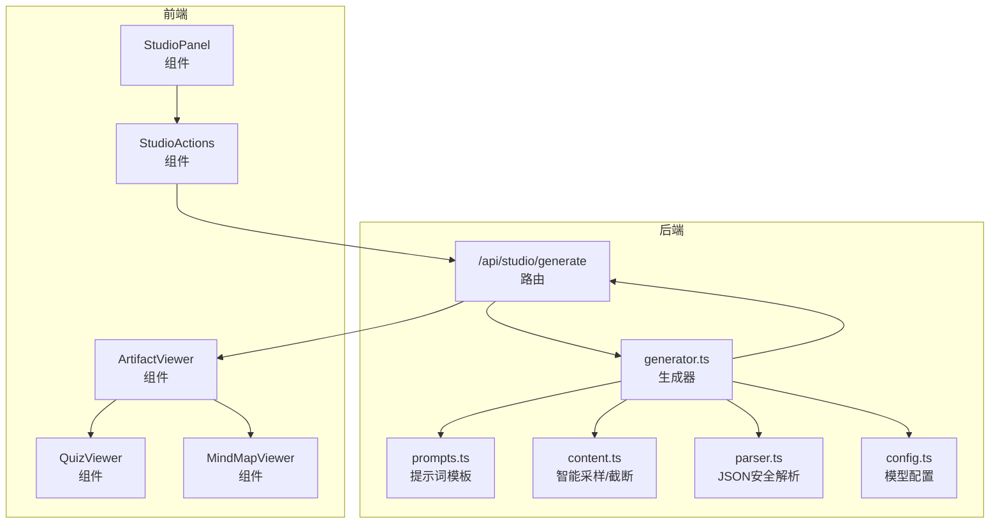
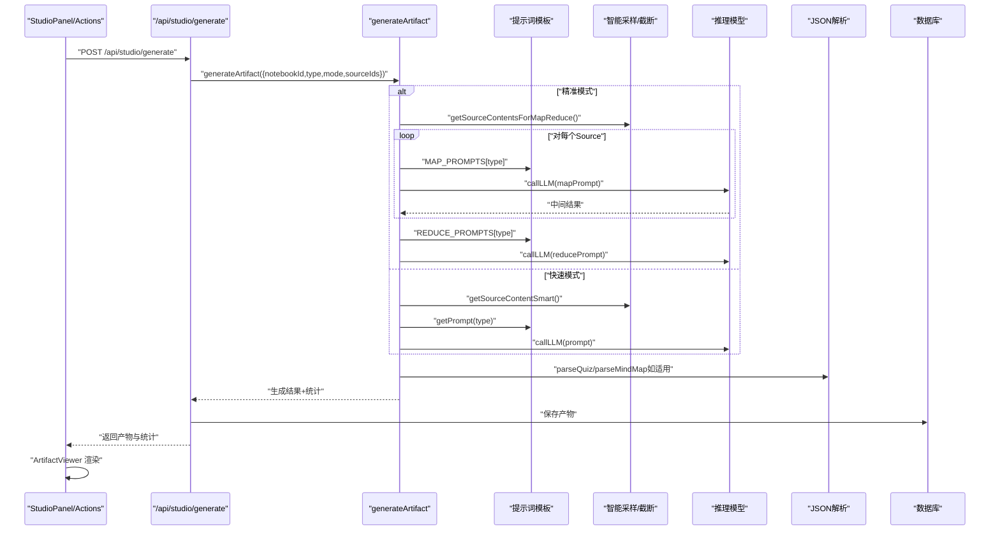
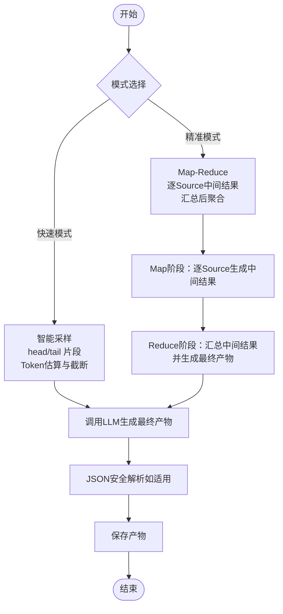
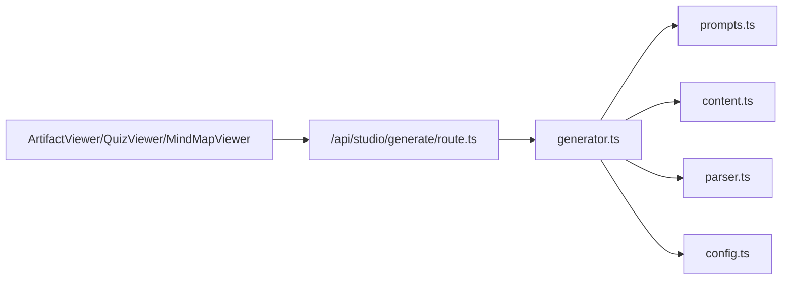

# 产物类型与生成策略

<cite>
**本文引用的文件**
- [lib/studio/prompts.ts](file://lib/studio/prompts.ts)
- [lib/studio/generator.ts](file://lib/studio/generator.ts)
- [lib/studio/content.ts](file://lib/studio/content.ts)
- [lib/studio/parser.ts](file://lib/studio/parser.ts)
- [app/api/studio/generate/route.ts](file://app/api/studio/generate/route.ts)
- [components/notebook/studio-panel.tsx](file://components/notebook/studio-panel.tsx)
- [components/notebook/studio-actions.tsx](file://components/notebook/studio-actions.tsx)
- [components/notebook/artifact-viewer.tsx](file://components/notebook/artifact-viewer.tsx)
- [components/notebook/quiz-viewer.tsx](file://components/notebook/quiz-viewer.tsx)
- [components/notebook/mindmap-viewer.tsx](file://components/notebook/mindmap-viewer.tsx)
- [lib/config.ts](file://lib/config.ts)
</cite>

## 目录
1. [简介](#简介)
2. [项目结构](#项目结构)
3. [核心组件](#核心组件)
4. [架构总览](#架构总览)
5. [详细组件分析](#详细组件分析)
6. [依赖关系分析](#依赖关系分析)
7. [性能考量](#性能考量)
8. [故障排查指南](#故障排查指南)
9. [结论](#结论)
10. [附录](#附录)

## 简介
本文件面向“产物类型与生成策略”，系统阐述系统支持的产物类型（摘要、大纲、测验、思维导图）与其生成策略，重点解析提示词模板设计原理（SUMMARY_PROMPTS、OUTLINE_PROMPTS、QUIZ_PROMPTS、MINDMAP_PROMPTS 以及 MAP_PROMPTS、REDUCE_PROMPTS 的工作机制）、智能采样策略（smart sampling）与 Map-Reduce 策略的实现差异、产物输出格式规范与数据结构定义、生成质量评估与效果对比、适用场景与最佳实践。

## 项目结构
围绕产物生成的关键代码位于 lib/studio 目录，前端通过 Studio 面板触发生成，API 路由负责鉴权与调用生成器，最终产物以统一的数据结构返回并在前端进行差异化渲染。

图表来源
- [components/notebook/studio-panel.tsx](file://components/notebook/studio-panel.tsx#L1-L228)
- [components/notebook/studio-actions.tsx](file://components/notebook/studio-actions.tsx#L1-L109)
- [components/notebook/artifact-viewer.tsx](file://components/notebook/artifact-viewer.tsx#L1-L66)
- [components/notebook/quiz-viewer.tsx](file://components/notebook/quiz-viewer.tsx#L1-L45)
- [components/notebook/mindmap-viewer.tsx](file://components/notebook/mindmap-viewer.tsx#L1-L55)
- [app/api/studio/generate/route.ts](file://app/api/studio/generate/route.ts#L1-L145)
- [lib/studio/generator.ts](file://lib/studio/generator.ts#L1-L311)
- [lib/studio/prompts.ts](file://lib/studio/prompts.ts#L1-L211)
- [lib/studio/content.ts](file://lib/studio/content.ts#L1-L258)
- [lib/studio/parser.ts](file://lib/studio/parser.ts#L1-L183)
- [lib/config.ts](file://lib/config.ts#L1-L187)

章节来源
- [components/notebook/studio-panel.tsx](file://components/notebook/studio-panel.tsx#L1-L228)
- [app/api/studio/generate/route.ts](file://app/api/studio/generate/route.ts#L1-L145)

## 核心组件
- 生成器（generator.ts）：统一入口 generateArtifact，封装快速模式（智能采样）与精准模式（Map-Reduce），并处理 LLM 调用、超时控制、结果解析与回退。
- 提示词模板（prompts.ts）：定义各产物的提示词模板，包含直连模板与 Map-Reduce 的 MAP_PROMPTS/REDUCE_PROMPTS。
- 内容采样（content.ts）：实现智能采样策略（优先头尾片段）、Token 估算与智能截断；提供 Map-Reduce 模式下的逐 Source 内容获取。
- JSON 安全解析（parser.ts）：提供 Quiz 与 MindMap 的安全解析与结构校验，并提供通用 JSON 提取与回退机制。
- API 路由（route.ts）：鉴权、参数校验、调用生成器、持久化产物、错误映射与响应。
- 前端展示（artifact-viewer.tsx 等）：根据产物类型渲染 Markdown 或交互式测验/思维导图。

章节来源
- [lib/studio/generator.ts](file://lib/studio/generator.ts#L1-L311)
- [lib/studio/prompts.ts](file://lib/studio/prompts.ts#L1-L211)
- [lib/studio/content.ts](file://lib/studio/content.ts#L1-L258)
- [lib/studio/parser.ts](file://lib/studio/parser.ts#L1-L183)
- [app/api/studio/generate/route.ts](file://app/api/studio/generate/route.ts#L1-L145)
- [components/notebook/artifact-viewer.tsx](file://components/notebook/artifact-viewer.tsx#L1-L66)

## 架构总览
下图展示了从前端触发到后端生成再到前端渲染的完整链路。

图表来源
- [app/api/studio/generate/route.ts](file://app/api/studio/generate/route.ts#L1-L145)
- [lib/studio/generator.ts](file://lib/studio/generator.ts#L118-L262)
- [lib/studio/prompts.ts](file://lib/studio/prompts.ts#L118-L210)
- [lib/studio/content.ts](file://lib/studio/content.ts#L67-L224)
- [lib/studio/parser.ts](file://lib/studio/parser.ts#L124-L182)
- [components/notebook/artifact-viewer.tsx](file://components/notebook/artifact-viewer.tsx#L21-L56)

## 详细组件分析

### 产物类型与提示词模板设计原理
- 支持产物类型：summary（摘要）、outline（大纲）、quiz（测验）、mindmap（思维导图）。
- 直连模板（getPrompt/type）：为每种类型提供完整的提示词，包含格式约束、语言选择、输出结构等。
- Map-Reduce 模板（MAP_PROMPTS/REDUCE_PROMPTS）：MAP 阶段针对单 Source 输出中间结果，REDUCE 阶段汇总多 Source 的中间结果并生成最终产物。
- 设计原则：
  - 明确输出格式与结构（如 JSON Schema、Markdown 标题层级），降低 LLM 输出不确定性。
  - 控制 Token 上限与层级深度，保证大模型可稳定完成任务。
  - 针对 quiz/mindmap 等强结构化产物，强制 JSON 输出并配合安全解析。

章节来源
- [lib/studio/prompts.ts](file://lib/studio/prompts.ts#L6-L116)
- [lib/studio/prompts.ts](file://lib/studio/prompts.ts#L118-L198)
- [lib/studio/prompts.ts](file://lib/studio/prompts.ts#L200-L210)

### 智能采样策略（smart sampling）与 Map-Reduce 实现差异
- 智能采样（快速模式）：
  - 从每个 Source 的头部与尾部采样固定数量的片段，兼顾覆盖面与效率。
  - 对整体上下文进行 Token 估算与智能截断，避免越界。
  - 适合快速摘要与大纲生成，延迟低、成本低。
- Map-Reduce（精准模式）：
  - 先按 Source 分割，逐个 Source 生成中间结果，再将中间结果拼接并截断后交给 LLM 进行聚合。
  - 更适合需要跨 Source 协同与全局整合的任务，如测验与思维导图的统一结构。
  - 对 Token 与时间预算有更高要求，但结果更全面。

图表来源
- [lib/studio/generator.ts](file://lib/studio/generator.ts#L118-L237)
- [lib/studio/content.ts](file://lib/studio/content.ts#L67-L154)
- [lib/studio/content.ts](file://lib/studio/content.ts#L159-L224)
- [lib/studio/parser.ts](file://lib/studio/parser.ts#L124-L182)

章节来源
- [lib/studio/generator.ts](file://lib/studio/generator.ts#L118-L237)
- [lib/studio/content.ts](file://lib/studio/content.ts#L67-L154)
- [lib/studio/content.ts](file://lib/studio/content.ts#L159-L224)

### 产物输出格式规范与数据结构定义
- 摘要（summary）
  - 输出：Markdown 结构化摘要，包含核心主题、关键要点、总结等。
  - 适用：快速提炼知识要点，便于阅读与检索。
- 大纲（outline）
  - 输出：Markdown 层级结构（最多三级），主题与子主题清晰。
  - 适用：构建知识框架、课程结构、报告提纲。
- 测验（quiz）
  - 输出：严格 JSON Schema，包含标题与题目数组，每题含 id、question、options、answer、explanation。
  - 前端：QuizViewer 提供交互式答题与结果展示。
  - 安全解析：parseQuiz 校验结构并补全缺失字段，失败时回退至预设结构。
- 思维导图（mindmap）
  - 输出：严格 JSON Schema，包含标题与根节点，根节点含 id、label、description、children。
  - 前端：MindMapViewer 使用 React Flow 渲染，支持下载与缩放。
  - 安全解析：parseMindMap 校验结构并递归补全节点 id，失败时回退至预设结构。

章节来源
- [lib/studio/prompts.ts](file://lib/studio/prompts.ts#L6-L116)
- [lib/studio/parser.ts](file://lib/studio/parser.ts#L6-L27)
- [lib/studio/parser.ts](file://lib/studio/parser.ts#L124-L182)
- [components/notebook/quiz-viewer.tsx](file://components/notebook/quiz-viewer.tsx#L1-L45)
- [components/notebook/mindmap-viewer.tsx](file://components/notebook/mindmap-viewer.tsx#L1-L55)

### 生成质量评估与效果对比
- 评估维度（建议）：
  - 结构完整性：是否满足模板要求的层级/字段（如 quiz 的题目数组、mindmap 的根节点）。
  - 一致性：跨 Source 的信息是否一致，是否存在矛盾。
  - 可读性：摘要与大纲的表达是否清晰、逻辑是否连贯。
  - 交互性：测验与思维导图的可操作性与易用性。
- 效果对比（基于实现特性）：
  - 快速模式：吞吐高、延迟低，适合初筛与快速概览；但可能丢失跨 Source 的协同细节。
  - 精准模式：更全面、更稳定，适合正式交付与深度学习场景；但耗时较长。
- 统计指标（生成器返回）：
  - totalChunks、usedChunks、estimatedTokens、sourceCount、mode、strategy、duration。
  - 前端可据此展示耗时与采样统计，辅助用户判断质量与成本。

章节来源
- [lib/studio/generator.ts](file://lib/studio/generator.ts#L40-L48)
- [lib/studio/generator.ts](file://lib/studio/generator.ts#L156-L165)
- [lib/studio/generator.ts](file://lib/studio/generator.ts#L227-L236)
- [components/notebook/studio-panel.tsx](file://components/notebook/studio-panel.tsx#L78-L111)

### 适用场景与最佳实践
- 适用场景
  - 摘要/大纲：知识快速浏览、会议纪要、学习笔记整理。
  - 测验：自测与教学评测、知识点巩固。
  - 思维导图：知识可视化、创意发散、项目规划。
- 最佳实践
  - 选择模式：小批量资料或快速预览用快速模式；需要跨 Source 协同时用精准模式。
  - 控制上下文：合理选择 sourceIds，避免一次性注入过多 Source 导致 Token 超限。
  - 结构化产物：优先使用 quiz/mindmap，便于后续解析与二次加工。
  - 错误处理：关注 parseSuccess 与错误码（如 NO_SOURCES、TIMEOUT、GENERATION_FAILED），及时重试或调整参数。
  - 前端体验：利用 QuizViewer/MindMapViewer 的交互能力提升学习与创作体验。

## 依赖关系分析
- 生成器依赖提示词模板、内容采样与解析模块；API 路由依赖生成器与鉴权；前端依赖解析后的数据结构进行差异化渲染。
- 模型配置（config.ts）为生成器提供推理模型的访问地址与模型名，确保生成器与前端一致地使用长文本推理模型。

图表来源
- [lib/studio/generator.ts](file://lib/studio/generator.ts#L1-L311)
- [lib/studio/prompts.ts](file://lib/studio/prompts.ts#L1-L211)
- [lib/studio/content.ts](file://lib/studio/content.ts#L1-L258)
- [lib/studio/parser.ts](file://lib/studio/parser.ts#L1-L183)
- [lib/config.ts](file://lib/config.ts#L1-L187)
- [app/api/studio/generate/route.ts](file://app/api/studio/generate/route.ts#L1-L145)
- [components/notebook/artifact-viewer.tsx](file://components/notebook/artifact-viewer.tsx#L1-L66)

章节来源
- [lib/studio/generator.ts](file://lib/studio/generator.ts#L1-L311)
- [lib/studio/prompts.ts](file://lib/studio/prompts.ts#L1-L211)
- [lib/studio/content.ts](file://lib/studio/content.ts#L1-L258)
- [lib/studio/parser.ts](file://lib/studio/parser.ts#L1-L183)
- [lib/config.ts](file://lib/config.ts#L1-L187)
- [app/api/studio/generate/route.ts](file://app/api/studio/generate/route.ts#L1-L145)
- [components/notebook/artifact-viewer.tsx](file://components/notebook/artifact-viewer.tsx#L1-L66)

## 性能考量
- Token 与时间预算
  - 快速模式：较短超时与较低 Token 上限，适合快速产出。
  - 精准模式：较长超时与更高的 Token 上限，适合复杂任务。
- 智能截断
  - 按 Source 块进行截断，优先保留完整 Source，避免切分造成语义断裂。
- 采样策略
  - 快速模式优先头尾片段，兼顾覆盖面；精准模式逐 Source 生成，利于全局整合。
- 模型选择
  - 生成器强制使用推理模型（长文本思考模型），适合复杂结构化任务。

章节来源
- [lib/studio/generator.ts](file://lib/studio/generator.ts#L22-L26)
- [lib/studio/generator.ts](file://lib/studio/generator.ts#L40-L48)
- [lib/studio/content.ts](file://lib/studio/content.ts#L42-L61)
- [lib/studio/content.ts](file://lib/studio/content.ts#L67-L154)
- [lib/studio/content.ts](file://lib/studio/content.ts#L159-L224)
- [lib/config.ts](file://lib/config.ts#L38-L52)

## 故障排查指南
- 常见错误与处理
  - NO_SOURCES：资料未就绪或未选择 Source，需先上传资料并等待处理完成。
  - TIMEOUT：生成超时，建议切换为精准模式或减少 Source 数量。
  - GENERATION_FAILED：Map 阶段无有效中间结果，检查 Source 内容与网络状况。
  - JSON 解析失败：quiz/mindmap 解析失败时会回退到预设结构，建议重试或检查提示词模板。
- 前端提示
  - 成功时显示耗时与统计信息；失败时弹出错误提示并引导重试。
- 日志与调试
  - 开发环境下记录 LLM 返回内容与解析失败原因，便于定位问题。

章节来源
- [app/api/studio/generate/route.ts](file://app/api/studio/generate/route.ts#L113-L144)
- [lib/studio/generator.ts](file://lib/studio/generator.ts#L108-L115)
- [lib/studio/parser.ts](file://lib/studio/parser.ts#L113-L118)
- [components/notebook/studio-panel.tsx](file://components/notebook/studio-panel.tsx#L78-L111)

## 结论
本系统通过直连提示词模板与 Map-Reduce 两种策略，实现了对摘要、大纲、测验与思维导图的高效生成。智能采样策略在快速模式下平衡了吞吐与成本，而 Map-Reduce 在精准模式下提升了全局整合能力。结合严格的 JSON 输出与安全解析、前端交互式渲染，系统在可用性与稳定性上具备良好表现。建议根据任务复杂度与时效需求选择合适模式，并通过统计指标持续优化生成效果。

## 附录
- 术语
  - 智能采样：优先选取 Source 的头尾片段，兼顾覆盖面与 Token 控制。
  - Map-Reduce：将任务拆分为 Map（Source 级）与 Reduce（全局聚合）两个阶段。
  - 推理模型：具备更强的长文本与复杂结构化输出能力的模型。
- 相关文件路径
  - 生成器：lib/studio/generator.ts
  - 提示词模板：lib/studio/prompts.ts
  - 内容采样：lib/studio/content.ts
  - JSON 解析：lib/studio/parser.ts
  - API 路由：app/api/studio/generate/route.ts
  - 前端展示：components/notebook/artifact-viewer.tsx、quiz-viewer.tsx、mindmap-viewer.tsx
  - 模型配置：lib/config.ts