# 内容解析与格式化

<cite>
**本文引用的文件**
- [lib/studio/parser.ts](file://lib/studio/parser.ts)
- [lib/studio/content.ts](file://lib/studio/content.ts)
- [lib/studio/generator.ts](file://lib/studio/generator.ts)
- [lib/studio/prompts.ts](file://lib/studio/prompts.ts)
- [lib/studio/index.ts](file://lib/studio/index.ts)
- [lib/processing/processor.ts](file://lib/processing/processor.ts)
- [lib/processing/pdf-parser.ts](file://lib/processing/pdf-parser.ts)
- [lib/processing/web-parser.ts](file://lib/processing/web-parser.ts)
- [lib/processing/text-splitter.ts](file://lib/processing/text-splitter.ts)
- [lib/processing/embedding.ts](file://lib/processing/embedding.ts)
- [lib/processing/content-analyzer.ts](file://lib/processing/content-analyzer.ts)
- [lib/db/vector-store.ts](file://lib/db/vector-store.ts)
- [lib/config.ts](file://lib/config.ts)
- [types/pdf-parse.d.ts](file://types/pdf-parse.d.ts)
- [components/notebook/quiz-viewer.tsx](file://components/notebook/quiz-viewer.tsx)
- [components/notebook/mindmap-viewer.tsx](file://components/notebook/mindmap-viewer.tsx)
</cite>

## 目录
1. [简介](#简介)
2. [项目结构](#项目结构)
3. [核心组件](#核心组件)
4. [架构总览](#架构总览)
5. [详细组件分析](#详细组件分析)
6. [依赖关系分析](#依赖关系分析)
7. [性能考量](#性能考量)
8. [故障排查指南](#故障排查指南)
9. [结论](#结论)
10. [附录](#附录)

## 简介
本文件面向“内容解析与格式化”能力，系统化阐述解析器模块的架构设计与实现细节，重点覆盖：
- 解析器模块：测验解析器与思维导图解析器的实现原理与数据清洗策略
- 结构化数据提取算法：JSON 提取、格式验证与数据清洗流程
- 产物格式转换机制：数据模型映射与视图渲染适配
- 解析质量评估与错误处理策略
- 解析器扩展接口与自定义解析规则
- 解析性能优化与内存管理策略
- 产物展示组件的数据绑定与交互逻辑

## 项目结构
该项目采用功能域划分与分层组织相结合的方式：
- lib/studio：内容生成与解析（提示词、生成、解析）
- lib/processing：文档处理流水线（PDF/网页解析、文本切分、向量化）
- lib/db：向量存储与检索
- components/notebook：产物展示组件（测验、思维导图）

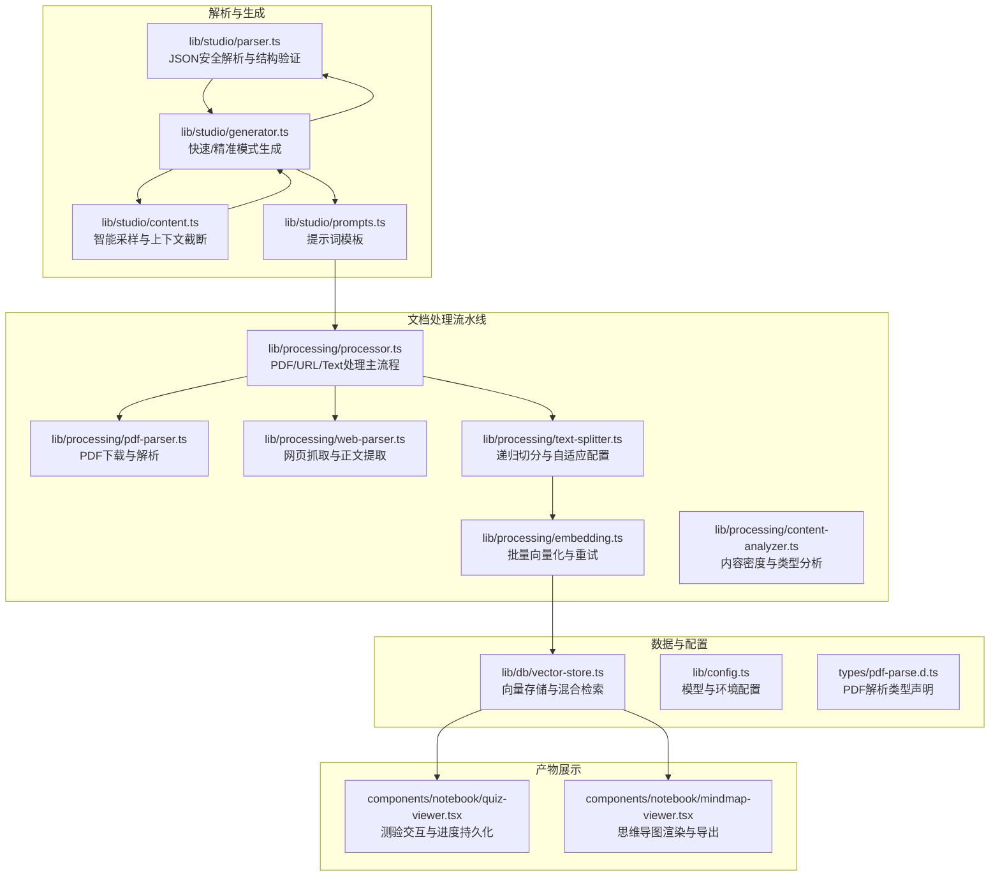

图表来源
- [lib/studio/parser.ts](file://lib/studio/parser.ts#L1-L183)
- [lib/studio/content.ts](file://lib/studio/content.ts#L1-L258)
- [lib/studio/generator.ts](file://lib/studio/generator.ts#L1-L311)
- [lib/studio/prompts.ts](file://lib/studio/prompts.ts#L1-L211)
- [lib/processing/processor.ts](file://lib/processing/processor.ts#L1-L560)
- [lib/processing/pdf-parser.ts](file://lib/processing/pdf-parser.ts#L1-L150)
- [lib/processing/web-parser.ts](file://lib/processing/web-parser.ts#L1-L228)
- [lib/processing/text-splitter.ts](file://lib/processing/text-splitter.ts#L1-L312)
- [lib/processing/embedding.ts](file://lib/processing/embedding.ts#L1-L189)
- [lib/processing/content-analyzer.ts](file://lib/processing/content-analyzer.ts#L1-L284)
- [lib/db/vector-store.ts](file://lib/db/vector-store.ts#L1-L446)
- [lib/config.ts](file://lib/config.ts#L1-L187)
- [types/pdf-parse.d.ts](file://types/pdf-parse.d.ts#L1-L14)
- [components/notebook/quiz-viewer.tsx](file://components/notebook/quiz-viewer.tsx#L1-L205)
- [components/notebook/mindmap-viewer.tsx](file://components/notebook/mindmap-viewer.tsx#L1-L294)

章节来源
- [lib/studio/index.ts](file://lib/studio/index.ts#L1-L25)

## 核心组件
- JSON安全解析与结构验证：提供统一的safeParseJSON与parseQuiz/parseMindMap，内置多种提取策略与回退机制
- 智能内容采样与上下文截断：按Source块采样，保留上下文完整性，并进行token估算与截断
- 生成器：快速模式（智能采样）与精准模式（Map-Reduce）双通道，统一调用LLM并进行结构化产物解析
- 文档处理流水线：PDF/网页/文本三种Source类型，标准化状态流转与日志记录
- 文本切分与自适应：基于内容密度的自适应chunk大小与重叠策略
- 向量化与存储：批量写入、维度校验、混合检索（向量+全文）
- 展示组件：测验交互与进度持久化、思维导图渲染与导出PNG

章节来源
- [lib/studio/parser.ts](file://lib/studio/parser.ts#L56-L182)
- [lib/studio/content.ts](file://lib/studio/content.ts#L33-L154)
- [lib/studio/generator.ts](file://lib/studio/generator.ts#L120-L262)
- [lib/processing/processor.ts](file://lib/processing/processor.ts#L82-L526)
- [lib/processing/text-splitter.ts](file://lib/processing/text-splitter.ts#L93-L311)
- [lib/processing/embedding.ts](file://lib/processing/embedding.ts#L140-L188)
- [lib/db/vector-store.ts](file://lib/db/vector-store.ts#L77-L445)
- [components/notebook/quiz-viewer.tsx](file://components/notebook/quiz-viewer.tsx#L19-L204)
- [components/notebook/mindmap-viewer.tsx](file://components/notebook/mindmap-viewer.tsx#L134-L293)

## 架构总览
解析与生成的整体流程如下：
- Source准备：PDF/URL/Text三种类型，分别进入对应处理通道
- 文档处理：下载/抓取 → 解析 → 切分 → 向量化 → 写入向量库
- 内容采样：智能采样或Map-Reduce模式获取上下文
- 生成：根据产物类型拼装提示词，调用LLM，解析结构化JSON
- 展示：测验组件与思维导图组件分别渲染与交互

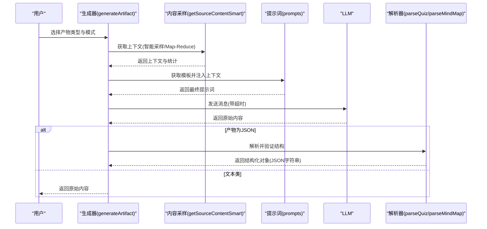

图表来源
- [lib/studio/generator.ts](file://lib/studio/generator.ts#L120-L237)
- [lib/studio/content.ts](file://lib/studio/content.ts#L67-L154)
- [lib/studio/prompts.ts](file://lib/studio/prompts.ts#L202-L210)
- [lib/studio/parser.ts](file://lib/studio/parser.ts#L124-L182)

## 详细组件分析

### JSON安全解析与结构验证
- 设计目标：规避LLM输出格式不稳定导致的解析失败，提供多策略提取与回退
- 关键策略：
  - 预处理：去除BOM与首尾空白，剥离markdown代码块标记
  - 多次尝试：直接解析 → 提取代码块 → 提取大括号/方括号包裹内容
  - 开发环境记录：失败时打印原始内容便于调试
- 结构验证：
  - 测验：校验questions数组非空，必要字段存在；补全缺失字段
  - 思维导图：校验根节点label存在；递归补全节点id并保证唯一性
- 回退策略：QUIZ_FALLBACK与MINDMAP_FALLBACK保障异常情况下的稳定输出

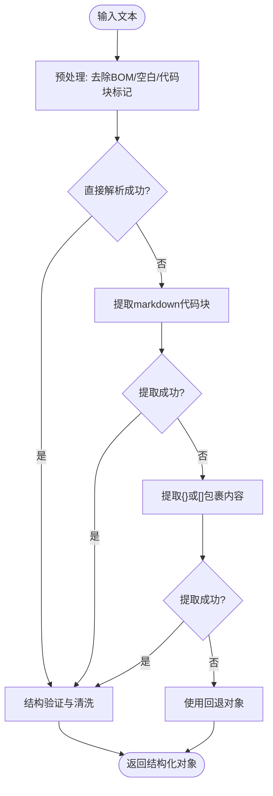

图表来源
- [lib/studio/parser.ts](file://lib/studio/parser.ts#L56-L119)
- [lib/studio/parser.ts](file://lib/studio/parser.ts#L124-L182)

章节来源
- [lib/studio/parser.ts](file://lib/studio/parser.ts#L56-L182)

### 智能内容采样与上下文截断
- 目标：在Token限制内最大化覆盖不同Source，同时保留上下文完整性
- 采样策略：
  - 快速模式：每个Source取头部与尾部若干chunks，避免全量扫描
  - Map-Reduce模式：每个Source独立生成中间结果，再合并Reduce
- 截断策略：按Source块拼接，估算token后在边界处截断并提示省略
- 统计信息：总chunks、使用chunks、估算token数、Source数量

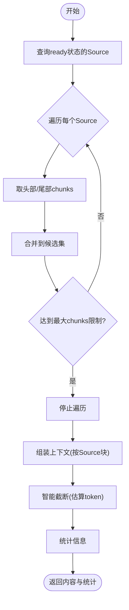

图表来源
- [lib/studio/content.ts](file://lib/studio/content.ts#L67-L154)
- [lib/studio/content.ts](file://lib/studio/content.ts#L159-L224)

章节来源
- [lib/studio/content.ts](file://lib/studio/content.ts#L33-L224)

### 生成器：快速模式与精准模式
- 快速模式：智能采样 + LLM调用 + 结构化解析（如有需要）
- 精准模式：Map-Reduce两阶段，先对每个Source生成中间结果，再合并Reduce
- LLM调用：统一超时控制，推理模型优先从reasoning_content中提取JSON
- 结果处理：统一返回content、stats与parseSuccess（JSON产物）

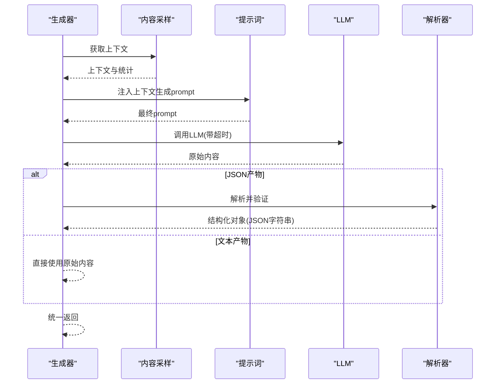

图表来源
- [lib/studio/generator.ts](file://lib/studio/generator.ts#L120-L237)
- [lib/studio/prompts.ts](file://lib/studio/prompts.ts#L202-L210)
- [lib/studio/parser.ts](file://lib/studio/parser.ts#L124-L182)

章节来源
- [lib/studio/generator.ts](file://lib/studio/generator.ts#L53-L262)
- [lib/studio/prompts.ts](file://lib/studio/prompts.ts#L57-L116)

### 文档处理流水线：PDF/网页/文本
- 状态机：pending → downloading/fetching → parsing → chunking → embedding → ready
- PDF：下载 → 解析 → 切分 → 向量化 → 写入
- 网页：抓取 → 解析（Readability） → 切分 → 向量化 → 写入
- 文本：直接切分 → 向量化 → 写入
- 日志：各阶段记录状态、耗时、错误、统计指标
- 清理：删除Source时同步清理向量与存储文件

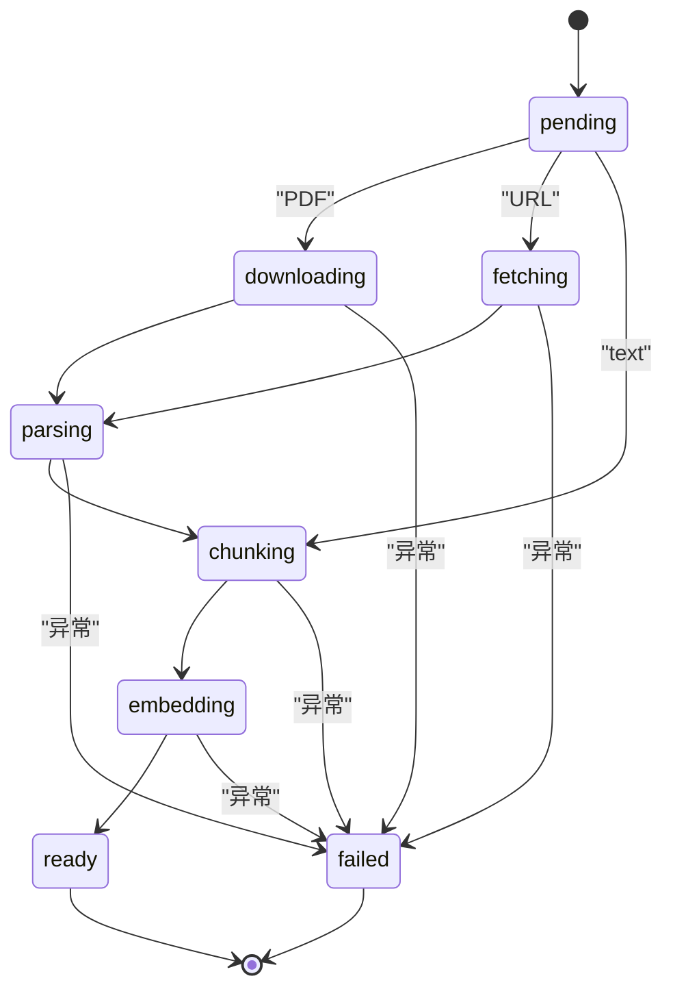

图表来源
- [lib/processing/processor.ts](file://lib/processing/processor.ts#L22-L77)
- [lib/processing/processor.ts](file://lib/processing/processor.ts#L82-L526)

章节来源
- [lib/processing/processor.ts](file://lib/processing/processor.ts#L82-L526)

### 文本切分与自适应配置
- 切分器：基于LangChain思路的递归字符切分，优先保持自然边界
- 分隔符优先级：标题 > 段落 > 句号 > 空格 > 字符
- 自适应策略：根据内容密度（信息熵、符号密度、换行密度）动态调整chunk大小与重叠
- 估算token：混合估算（中文1.5字符/token，英文4字符/token）

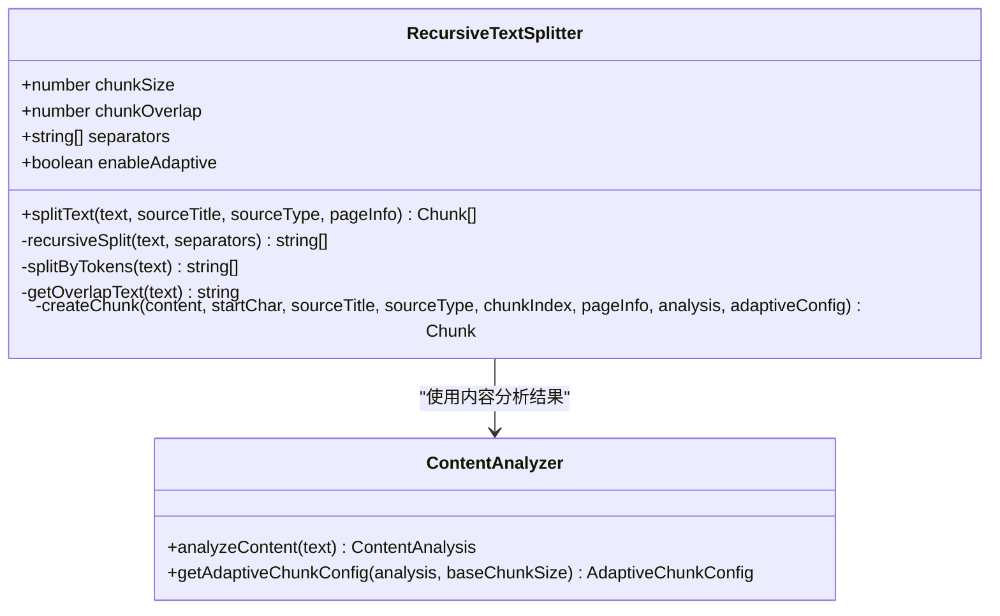

图表来源
- [lib/processing/text-splitter.ts](file://lib/processing/text-splitter.ts#L93-L311)
- [lib/processing/content-analyzer.ts](file://lib/processing/content-analyzer.ts#L196-L283)

章节来源
- [lib/processing/text-splitter.ts](file://lib/processing/text-splitter.ts#L93-L311)
- [lib/processing/content-analyzer.ts](file://lib/processing/content-analyzer.ts#L196-L283)

### 向量化与存储
- 批量写入：分批插入，避免单次SQL过大；冲突去重
- 维度校验：启动时强制校验与数据库一致，运行时逐条校验
- 混合检索：向量相似度与全文检索权重组合，支持过滤Source集合
- 重试与退避：嵌入API失败时指数退避重试

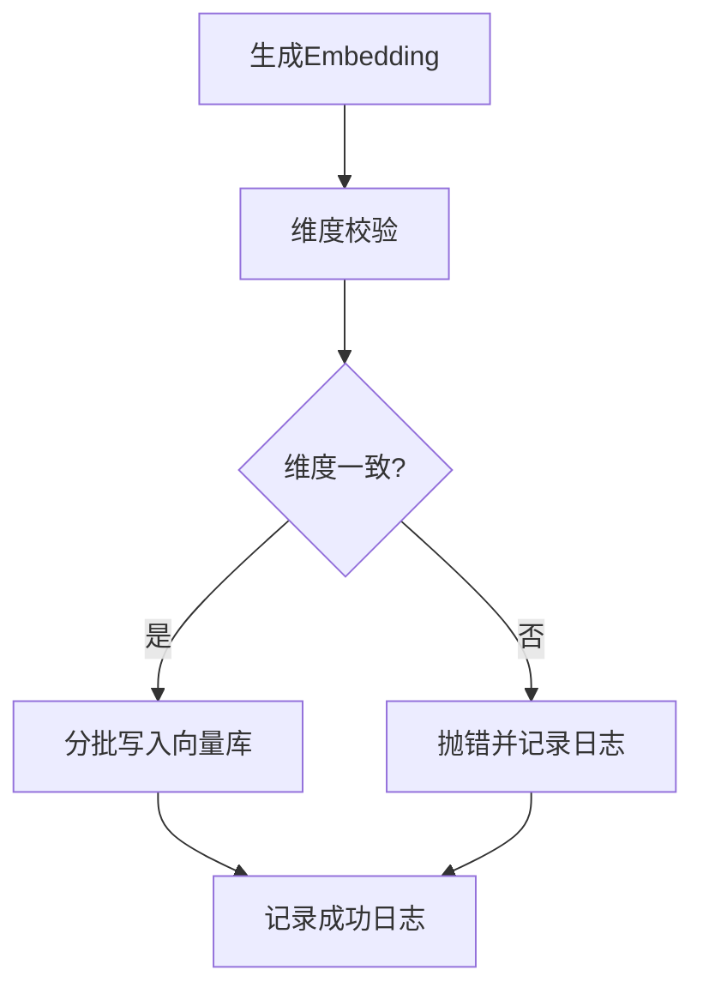

图表来源
- [lib/processing/embedding.ts](file://lib/processing/embedding.ts#L140-L188)
- [lib/db/vector-store.ts](file://lib/db/vector-store.ts#L88-L173)

章节来源
- [lib/processing/embedding.ts](file://lib/processing/embedding.ts#L140-L188)
- [lib/db/vector-store.ts](file://lib/db/vector-store.ts#L88-L173)

### 产物展示组件：测验与思维导图
- 测验组件：
  - 本地持久化：localStorage保存答题进度与结果
  - 交互逻辑：选择答案即显示解析；得分统计；重新测验清空
- 思维导图组件：
  - 布局：dagre自动布局；默认折叠第3级以下节点
  - 交互：点击节点展开/收起；重置视图；导出PNG

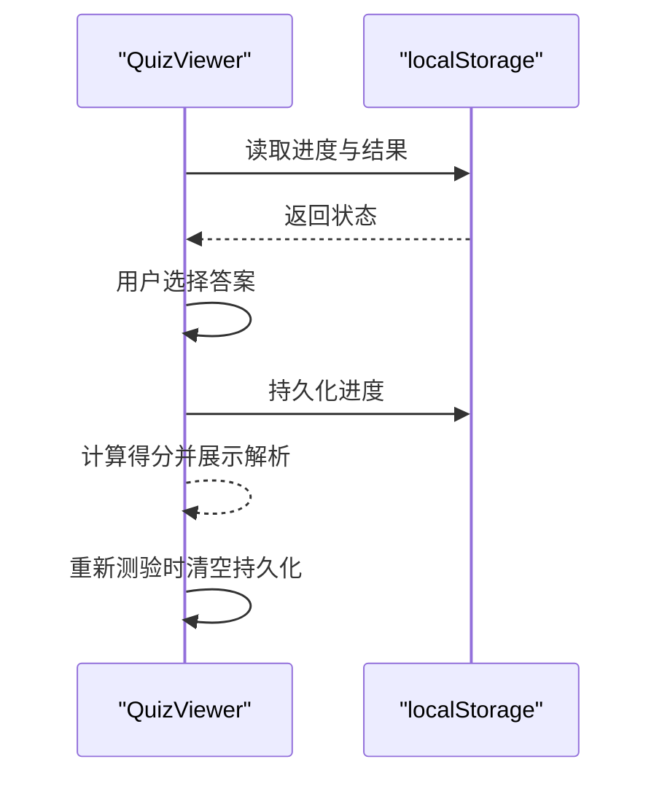

图表来源
- [components/notebook/quiz-viewer.tsx](file://components/notebook/quiz-viewer.tsx#L19-L204)

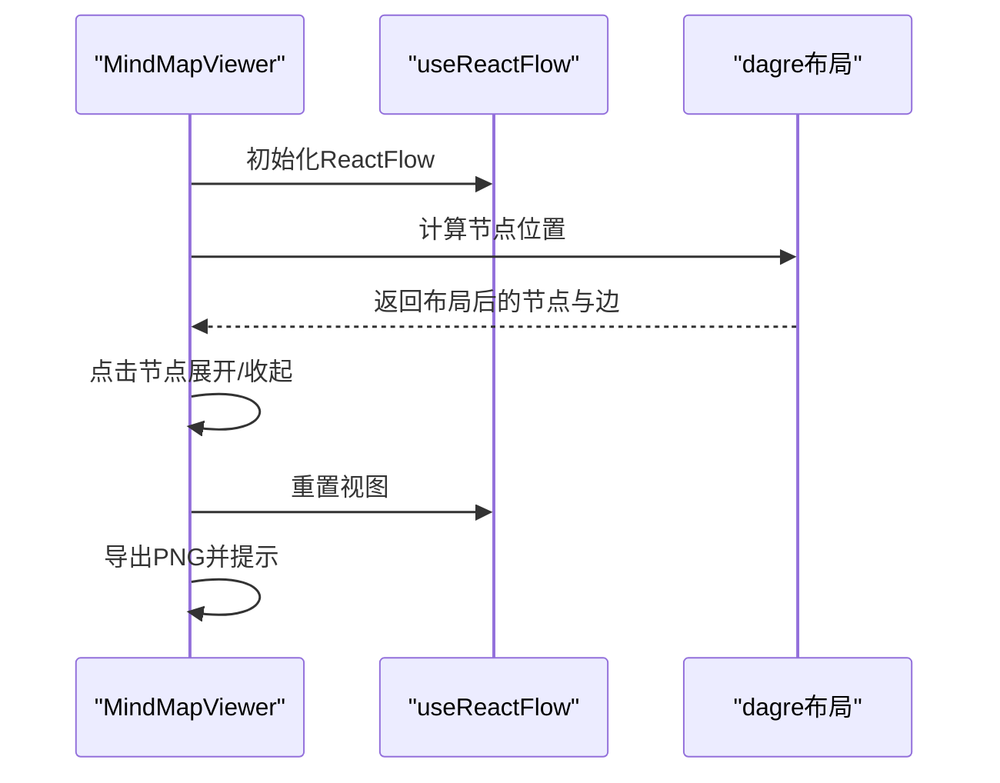

图表来源
- [components/notebook/mindmap-viewer.tsx](file://components/notebook/mindmap-viewer.tsx#L134-L293)

章节来源
- [components/notebook/quiz-viewer.tsx](file://components/notebook/quiz-viewer.tsx#L19-L204)
- [components/notebook/mindmap-viewer.tsx](file://components/notebook/mindmap-viewer.tsx#L134-L293)

## 依赖关系分析
- 模块耦合：
  - 解析器依赖生成器（JSON产物解析）
  - 生成器依赖内容采样与提示词模板
  - 文档处理流水线依赖切分器与向量化模块
  - 展示组件依赖解析器与向量存储（间接）
- 外部依赖：
  - pdf-parse（动态导入，避免SSR问题）
  - @mozilla/readability（网页正文提取）
  - @xyflow/react/dagre（思维导图渲染）
- 配置与约束：
  - 向量维度固定为1024，与数据库一致
  - LLM模型与API密钥通过环境变量配置

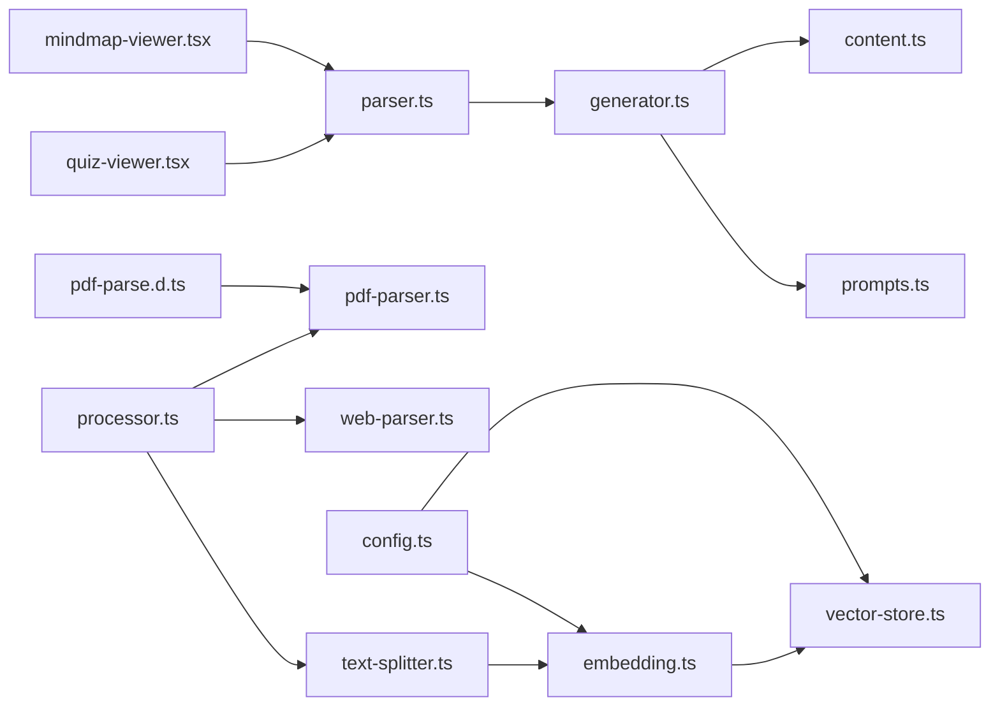

图表来源
- [lib/studio/parser.ts](file://lib/studio/parser.ts#L1-L183)
- [lib/studio/generator.ts](file://lib/studio/generator.ts#L1-L311)
- [lib/studio/content.ts](file://lib/studio/content.ts#L1-L258)
- [lib/studio/prompts.ts](file://lib/studio/prompts.ts#L1-L211)
- [lib/processing/processor.ts](file://lib/processing/processor.ts#L1-L560)
- [lib/processing/pdf-parser.ts](file://lib/processing/pdf-parser.ts#L1-L150)
- [lib/processing/web-parser.ts](file://lib/processing/web-parser.ts#L1-L228)
- [lib/processing/text-splitter.ts](file://lib/processing/text-splitter.ts#L1-L312)
- [lib/processing/embedding.ts](file://lib/processing/embedding.ts#L1-L189)
- [lib/db/vector-store.ts](file://lib/db/vector-store.ts#L1-L446)
- [lib/config.ts](file://lib/config.ts#L1-L187)
- [types/pdf-parse.d.ts](file://types/pdf-parse.d.ts#L1-L14)
- [components/notebook/quiz-viewer.tsx](file://components/notebook/quiz-viewer.tsx#L1-L205)
- [components/notebook/mindmap-viewer.tsx](file://components/notebook/mindmap-viewer.tsx#L1-L294)

章节来源
- [lib/studio/index.ts](file://lib/studio/index.ts#L8-L24)

## 性能考量
- 文本切分与自适应：
  - 递归切分按优先级分隔符，避免破坏语义边界
  - 自适应根据内容密度调整chunk大小与重叠，提升检索质量
- 向量化与存储：
  - 分批写入与冲突去重，降低单次写入压力
  - 维度校验前置，避免后续运行期错误
- LLM调用：
  - 超时控制与推理模型reasoning_content提取，提高稳定性
- 展示组件：
  - 测验组件本地持久化，减少服务端压力
  - 思维导图默认折叠深层节点，降低初始渲染开销

[本节为通用性能建议，无需特定文件引用]

## 故障排查指南
- JSON解析失败：
  - 检查是否包含代码块标记；确认回退策略是否生效
  - 开发环境下会记录原始内容，便于定位问题
- 生成失败：
  - 快速模式：检查内容采样是否返回有效上下文
  - 精准模式：检查Map阶段是否全部成功，Reduce阶段上下文是否过长
- 文档处理失败：
  - PDF：检查是否加密/损坏；扫描件不支持
  - 网页：检查网络超时、HTTP状态码、Content-Type
- 向量维度不匹配：
  - 确认环境变量EMBEDDING_DIM与数据库一致
- 展示异常：
  - 测验：检查localStorage权限与浏览器兼容性
  - 思维导图：检查ReactFlow与dagre依赖版本

章节来源
- [lib/studio/parser.ts](file://lib/studio/parser.ts#L113-L118)
- [lib/studio/generator.ts](file://lib/studio/generator.ts#L110-L114)
- [lib/processing/pdf-parser.ts](file://lib/processing/pdf-parser.ts#L88-L116)
- [lib/processing/web-parser.ts](file://lib/processing/web-parser.ts#L93-L125)
- [lib/db/vector-store.ts](file://lib/db/vector-store.ts#L92-L99)
- [components/notebook/quiz-viewer.tsx](file://components/notebook/quiz-viewer.tsx#L48-L60)
- [components/notebook/mindmap-viewer.tsx](file://components/notebook/mindmap-viewer.tsx#L208-L236)

## 结论
本项目围绕“内容解析与格式化”构建了从数据采集、处理、生成到展示的完整链路。解析器模块通过多策略JSON提取与结构验证，确保产物质量；内容采样与自适应切分兼顾效率与效果；向量存储与混合检索提供稳定的检索能力；展示组件则以交互与持久化增强用户体验。整体设计强调鲁棒性、可扩展性与可观测性，适合在生产环境中持续演进。

[本节为总结性内容，无需特定文件引用]

## 附录

### 扩展接口与自定义解析规则
- 扩展解析器：
  - 新增解析函数：遵循现有接口约定，返回{ data, success }
  - 添加结构验证：确保字段完备与默认值填充
  - 注册回退策略：在失败时返回稳定默认值
- 自定义提示词：
  - 在提示词模板中新增类型与Map/Reduce阶段
  - 生成器中注册类型与解析函数映射
- 自定义切分策略：
  - 在内容分析器中新增密度/类型判断
  - 在切分器中调整分隔符优先级与自适应参数

章节来源
- [lib/studio/parser.ts](file://lib/studio/parser.ts#L124-L182)
- [lib/studio/prompts.ts](file://lib/studio/prompts.ts#L202-L210)
- [lib/processing/content-analyzer.ts](file://lib/processing/content-analyzer.ts#L196-L283)
- [lib/processing/text-splitter.ts](file://lib/processing/text-splitter.ts#L93-L104)

### 解析质量评估标准
- JSON解析成功率：成功解析/总解析次数
- 结构完整性：必填字段覆盖率、默认值填充率
- 内容采样覆盖率：usedChunks/totalChunks
- 生成稳定性：超时与重试次数、失败率
- 展示交互性：本地持久化成功率、用户反馈

[本节为通用评估建议，无需特定文件引用]