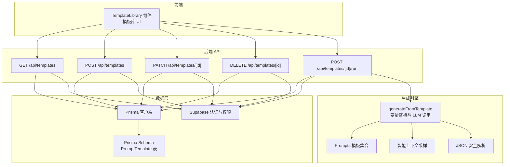
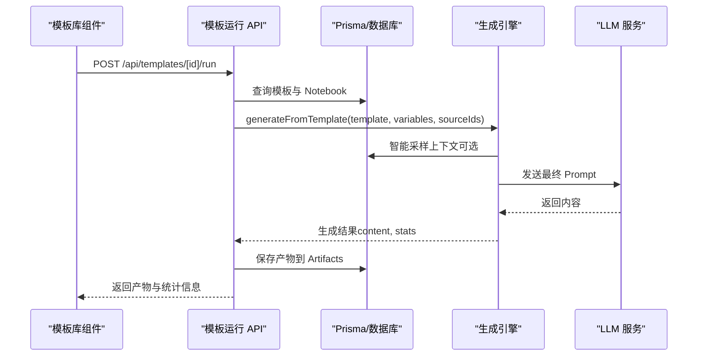
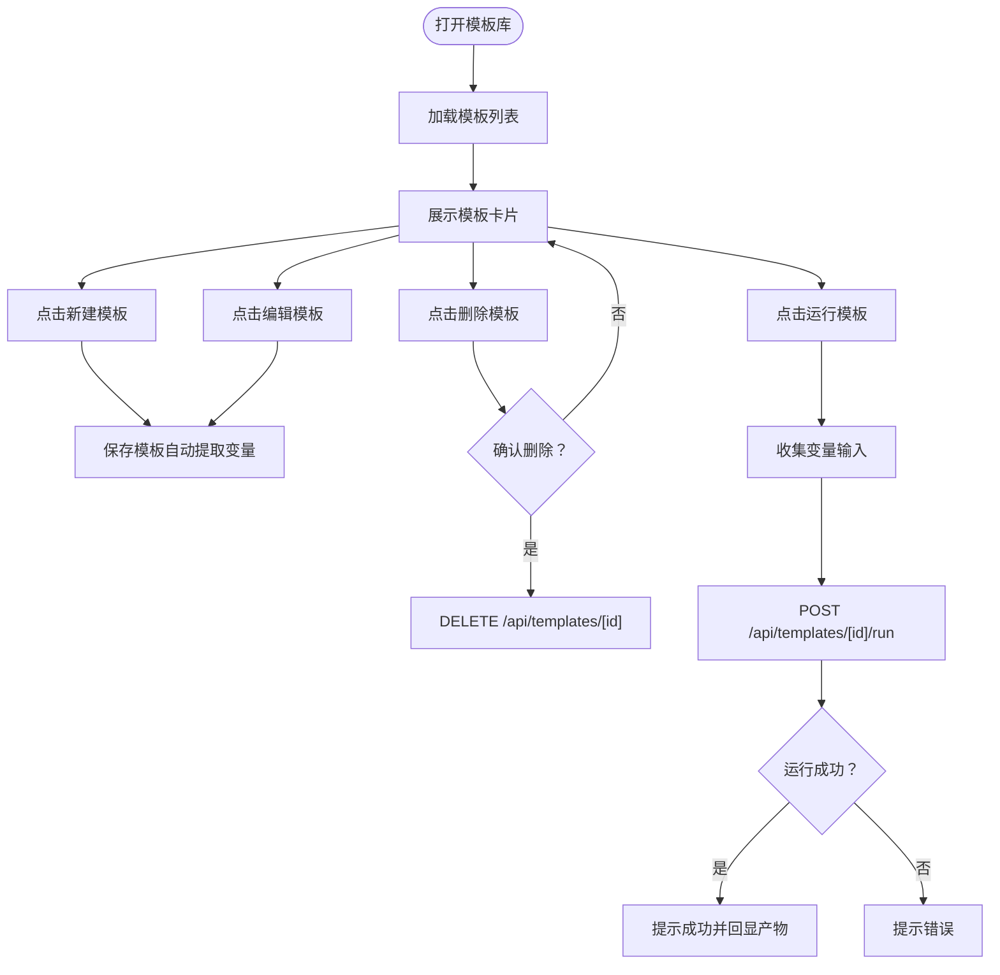
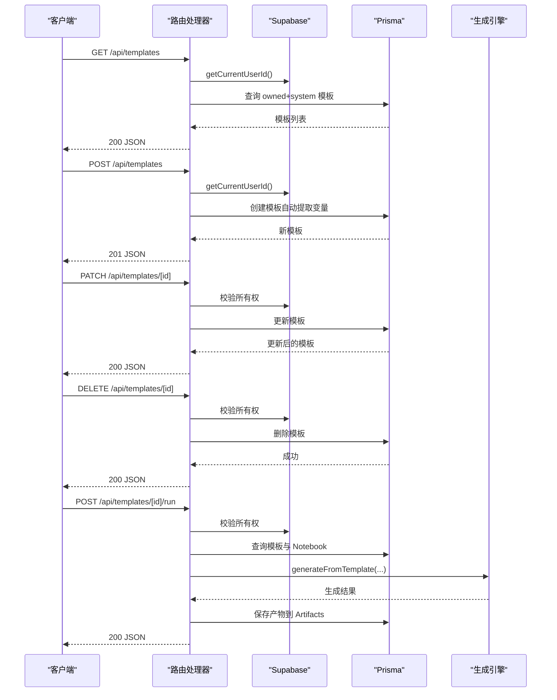
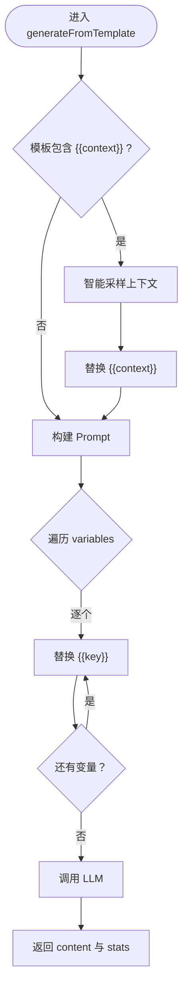
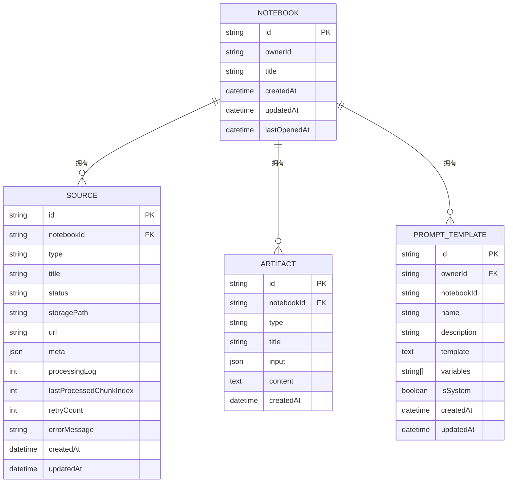
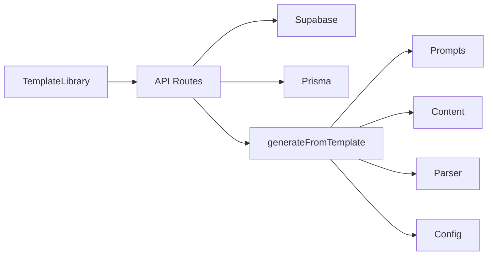

# 模板系统

<cite>
**本文档引用的文件**
- [app/api/templates/route.ts](file://app/api/templates/route.ts)
- [app/api/templates/[id]/route.ts](file://app/api/templates/[id]/route.ts)
- [app/api/templates/[id]/run/route.ts](file://app/api/templates/[id]/run/route.ts)
- [lib/studio/generator.ts](file://lib/studio/generator.ts)
- [lib/studio/prompts.ts](file://lib/studio/prompts.ts)
- [lib/studio/content.ts](file://lib/studio/content.ts)
- [lib/studio/parser.ts](file://lib/studio/parser.ts)
- [components/notebook/template-library.tsx](file://components/notebook/template-library.tsx)
- [types/index.ts](file://types/index.ts)
- [lib/db/supabase.ts](file://lib/db/supabase.ts)
- [lib/db/prisma.ts](file://lib/db/prisma.ts)
- [prisma/schema.prisma](file://prisma/schema.prisma)
- [scripts/seed-templates.ts](file://scripts/seed-templates.ts)
- [lib/config.ts](file://lib/config.ts)
</cite>

## 目录
1. [简介](#简介)
2. [项目结构](#项目结构)
3. [核心组件](#核心组件)
4. [架构总览](#架构总览)
5. [详细组件分析](#详细组件分析)
6. [依赖关系分析](#依赖关系分析)
7. [性能考虑](#性能考虑)
8. [故障排查指南](#故障排查指南)
9. [结论](#结论)
10. [附录](#附录)

## 简介
本文件面向模板系统，系统性阐述模板库的设计理念、实现机制与最佳实践，覆盖模板的存储、检索与版本管理；模板变量替换系统（占位符解析、上下文注入、动态参数绑定）；基于模板的自定义生成流程（模板验证、编译与执行）；模板 API 接口文档与使用示例；性能优化策略与缓存机制；以及模板系统的扩展性与定制化能力。目标是帮助开发者快速理解并高效使用模板系统，同时为后续演进提供清晰的参考。

## 项目结构
模板系统由前端组件、后端 API、数据库模型与生成引擎共同组成，采用分层设计：
- 前端：模板库 UI 组件负责模板的 CRUD、变量收集与运行触发
- 后端：Next.js API Routes 提供模板的增删改查与模板运行接口
- 数据层：Prisma 管理模板表与上下文数据，Supabase 负责鉴权与所有权校验
- 生成引擎：模板变量替换、上下文拼装、LLM 调用与结果解析

图表来源
- [components/notebook/template-library.tsx](file://components/notebook/template-library.tsx#L52-L186)
- [app/api/templates/route.ts](file://app/api/templates/route.ts#L5-L62)
- [app/api/templates/[id]/route.ts](file://app/api/templates/[id]/route.ts#L5-L92)
- [app/api/templates/[id]/run/route.ts](file://app/api/templates/[id]/run/route.ts#L6-L103)
- [lib/db/prisma.ts](file://lib/db/prisma.ts#L23-L34)
- [prisma/schema.prisma](file://prisma/schema.prisma#L99-L115)
- [lib/db/supabase.ts](file://lib/db/supabase.ts#L12-L33)
- [lib/studio/generator.ts](file://lib/studio/generator.ts#L267-L310)
- [lib/studio/prompts.ts](file://lib/studio/prompts.ts#L202-L210)
- [lib/studio/content.ts](file://lib/studio/content.ts#L67-L154)
- [lib/studio/parser.ts](file://lib/studio/parser.ts#L56-L182)

章节来源
- [components/notebook/template-library.tsx](file://components/notebook/template-library.tsx#L52-L186)
- [app/api/templates/route.ts](file://app/api/templates/route.ts#L5-L62)
- [app/api/templates/[id]/route.ts](file://app/api/templates/[id]/route.ts#L5-L92)
- [app/api/templates/[id]/run/route.ts](file://app/api/templates/[id]/run/route.ts#L6-L103)
- [lib/db/prisma.ts](file://lib/db/prisma.ts#L23-L34)
- [prisma/schema.prisma](file://prisma/schema.prisma#L99-L115)
- [lib/db/supabase.ts](file://lib/db/supabase.ts#L12-L33)
- [lib/studio/generator.ts](file://lib/studio/generator.ts#L267-L310)
- [lib/studio/prompts.ts](file://lib/studio/prompts.ts#L202-L210)
- [lib/studio/content.ts](file://lib/studio/content.ts#L67-L154)
- [lib/studio/parser.ts](file://lib/studio/parser.ts#L56-L182)

## 核心组件
- 模板库前端组件：负责模板的展示、编辑、删除与运行，自动提取模板中的变量占位符，运行时收集用户输入并调用后端 API
- 模板 API：提供模板的查询、创建、更新、删除与运行接口，统一进行鉴权与资源所有权校验
- 生成引擎：实现模板变量替换、上下文注入、LLM 调用与结果解析，支持快速与精准两种模式
- 数据模型：通过 Prisma Schema 定义 PromptTemplate 表，包含模板元数据、变量列表与系统/用户标识
- 上下文采样：根据 Notebook 中的 Source 与 Chunk，智能采样并截断，避免 Token 上限
- JSON 安全解析：对 LLM 输出进行多策略解析，保证结构化产物的稳定性

章节来源
- [components/notebook/template-library.tsx](file://components/notebook/template-library.tsx#L31-L186)
- [app/api/templates/route.ts](file://app/api/templates/route.ts#L5-L62)
- [app/api/templates/[id]/route.ts](file://app/api/templates/[id]/route.ts#L5-L92)
- [app/api/templates/[id]/run/route.ts](file://app/api/templates/[id]/run/route.ts#L6-L103)
- [lib/studio/generator.ts](file://lib/studio/generator.ts#L267-L310)
- [prisma/schema.prisma](file://prisma/schema.prisma#L99-L115)
- [lib/studio/content.ts](file://lib/studio/content.ts#L67-L154)
- [lib/studio/parser.ts](file://lib/studio/parser.ts#L56-L182)

## 架构总览
模板系统遵循“前端 UI -> 后端 API -> 数据层 -> 生成引擎”的分层架构。前端组件负责交互与变量收集；后端 API 负责鉴权、模板操作与运行；数据层负责模板与上下文持久化；生成引擎负责模板变量替换、上下文拼装与 LLM 调用。

图表来源
- [components/notebook/template-library.tsx](file://components/notebook/template-library.tsx#L150-L186)
- [app/api/templates/[id]/run/route.ts](file://app/api/templates/[id]/run/route.ts#L6-L103)
- [lib/studio/generator.ts](file://lib/studio/generator.ts#L267-L310)
- [lib/studio/content.ts](file://lib/studio/content.ts#L67-L154)

## 详细组件分析

### 模板库前端组件（TemplateLibrary）
- 功能职责
  - 模板列表加载与展示，区分系统模板与用户模板
  - 模板的创建、编辑与删除（系统模板不可编辑/删除）
  - 运行模板：收集变量输入，调用运行 API，回显产物
  - 自动提取模板变量：从模板内容中解析 {{var}} 占位符，排除 context
- 交互流程
  - 加载模板：GET /api/templates
  - 保存模板：POST/PATCH /api/templates/[id]，自动提取变量列表
  - 删除模板：DELETE /api/templates/[id]
  - 运行模板：POST /api/templates/[id]/run，携带 notebookId 与 variables

图表来源
- [components/notebook/template-library.tsx](file://components/notebook/template-library.tsx#L52-L186)

章节来源
- [components/notebook/template-library.tsx](file://components/notebook/template-library.tsx#L31-L186)

### 模板 API（Next.js Routes）
- 模板查询：GET /api/templates
  - 权限：必须登录，返回当前用户 owned 模板与系统模板
- 模板创建：POST /api/templates
  - 校验：name 与 template 必填，自动提取变量列表
  - 保存：ownerId 为当前用户，isSystem=false
- 模板更新：PATCH /api/templates/[id]
  - 校验：模板存在、非系统模板、ownerId 一致
  - 更新：name/description/template/variables
- 模板删除：DELETE /api/templates/[id]
  - 校验：模板存在、非系统模板、ownerId 一致
- 模板运行：POST /api/templates/[id]/run
  - 校验：登录、模板存在、Notebook 属于当前用户
  - 执行：generateFromTemplate，保存产物到 Artifacts

图表来源
- [app/api/templates/route.ts](file://app/api/templates/route.ts#L5-L62)
- [app/api/templates/[id]/route.ts](file://app/api/templates/[id]/route.ts#L5-L92)
- [app/api/templates/[id]/run/route.ts](file://app/api/templates/[id]/run/route.ts#L6-L103)
- [lib/db/supabase.ts](file://lib/db/supabase.ts#L12-L33)
- [lib/studio/generator.ts](file://lib/studio/generator.ts#L267-L310)

章节来源
- [app/api/templates/route.ts](file://app/api/templates/route.ts#L5-L62)
- [app/api/templates/[id]/route.ts](file://app/api/templates/[id]/route.ts#L5-L92)
- [app/api/templates/[id]/run/route.ts](file://app/api/templates/[id]/run/route.ts#L6-L103)
- [lib/db/supabase.ts](file://lib/db/supabase.ts#L12-L33)

### 生成引擎（模板变量替换与执行）
- generateFromTemplate
  - 上下文注入：若模板包含 {{context}}，则通过智能采样获取上下文并替换
  - 变量替换：遍历 variables，将 {{key}} 替换为对应值（跳过 context）
  - LLM 调用：发送最终 Prompt，返回内容与统计信息
- 智能上下文采样（getSourceContentSmart）
  - 优先采样每个 Source 的头部与尾部 chunks，确保覆盖面
  - 截断策略：按 Source 块保留，超过上限时省略部分并提示
  - 统计：记录 totalChunks、usedChunks、estimatedTokens、sourceCount
- JSON 安全解析（parseQuiz、parseMindMap）
  - 多策略解析：去除代码块标记、提取对象/数组、回退到默认结构
  - 结构校验：确保必要字段存在，缺失字段填充默认值

图表来源
- [lib/studio/generator.ts](file://lib/studio/generator.ts#L267-L310)
- [lib/studio/content.ts](file://lib/studio/content.ts#L67-L154)
- [lib/studio/parser.ts](file://lib/studio/parser.ts#L56-L182)

章节来源
- [lib/studio/generator.ts](file://lib/studio/generator.ts#L267-L310)
- [lib/studio/content.ts](file://lib/studio/content.ts#L67-L154)
- [lib/studio/parser.ts](file://lib/studio/parser.ts#L56-L182)

### 数据模型与存储
- PromptTemplate 表
  - 字段：id、ownerId、name、description、template、variables、isSystem、createdAt、updatedAt
  - 索引：ownerId、notebookId、isSystem
  - 约束：系统模板与用户模板分离，用户模板可编辑/删除
- 上下文数据
  - document_chunks：按 Source 分片存储，用于智能采样
- 产物存储
  - Artifacts 表：保存生成产物，包含 input（模板参数）、content 等

图表来源
- [prisma/schema.prisma](file://prisma/schema.prisma#L16-L115)

章节来源
- [prisma/schema.prisma](file://prisma/schema.prisma#L99-L115)
- [lib/db/prisma.ts](file://lib/db/prisma.ts#L23-L34)

### 系统模板与初始化
- 系统模板：预置在数据库中，isSystem=true，不可被用户编辑/删除
- 初始化脚本：通过 seed-templates.ts 同步系统模板，使用固定 UUID 保证幂等
- 运行时行为：系统模板可直接运行，但不会出现在用户模板列表中

章节来源
- [scripts/seed-templates.ts](file://scripts/seed-templates.ts#L16-L76)
- [app/api/templates/route.ts](file://app/api/templates/route.ts#L12-L20)

## 依赖关系分析
- 前端组件依赖
  - types/PromptTemplate 类型定义
  - Next.js API Routes 提供的模板 CRUD 与运行接口
- 后端 API 依赖
  - Supabase getCurrentUserId 进行鉴权与所有权校验
  - Prisma 访问 PromptTemplate 与 Artifacts 表
- 生成引擎依赖
  - Prompts 模板集合（SUMMARY_PROMPT、QUIZ_PROMPT 等）
  - Content 智能采样与截断
  - Parser JSON 安全解析
  - Config 模型配置（强制 LongCat）

图表来源
- [components/notebook/template-library.tsx](file://components/notebook/template-library.tsx#L52-L186)
- [app/api/templates/[id]/run/route.ts](file://app/api/templates/[id]/run/route.ts#L6-L103)
- [lib/studio/generator.ts](file://lib/studio/generator.ts#L267-L310)
- [lib/studio/prompts.ts](file://lib/studio/prompts.ts#L202-L210)
- [lib/studio/content.ts](file://lib/studio/content.ts#L67-L154)
- [lib/studio/parser.ts](file://lib/studio/parser.ts#L56-L182)
- [lib/config.ts](file://lib/config.ts#L149-L157)

章节来源
- [components/notebook/template-library.tsx](file://components/notebook/template-library.tsx#L52-L186)
- [app/api/templates/[id]/run/route.ts](file://app/api/templates/[id]/run/route.ts#L6-L103)
- [lib/studio/generator.ts](file://lib/studio/generator.ts#L267-L310)
- [lib/studio/prompts.ts](file://lib/studio/prompts.ts#L202-L210)
- [lib/studio/content.ts](file://lib/studio/content.ts#L67-L154)
- [lib/studio/parser.ts](file://lib/studio/parser.ts#L56-L182)
- [lib/config.ts](file://lib/config.ts#L149-L157)

## 性能考虑
- 上下文采样与截断
  - 快速模式：优先采样每个 Source 的头部与尾部 chunks，限制总 chunks 数，避免 Token 超限
  - 精准模式：Map-Reduce，按 Source 逐步处理，再在 Reduce 阶段合并，适合复杂任务
- Token 估算与截断
  - 估算规则：中文字符按 1.5-2 字符/token，英文按 4 字符/token
  - 截断策略：按 Source 块保留，超过上限时省略并提示
- LLM 调用超时与回退
  - 快速模式超时：90 秒
  - 精准模式超时：180 秒
  - Map 步骤超时：45 秒
- 缓存与复用
  - 建议：在应用层对常用模板与上下文进行缓存（如内存缓存），减少重复采样与 LLM 调用
  - 注意：缓存键应包含 notebookId、sourceIds、variables 等关键参数，避免污染
- 并发与错误处理
  - API 层使用 Promise.all 并行解析请求体，提升吞吐
  - 生成阶段对 LLM 错误与空响应进行捕获与回退，保证稳定性

章节来源
- [lib/studio/content.ts](file://lib/studio/content.ts#L33-L61)
- [lib/studio/generator.ts](file://lib/studio/generator.ts#L23-L27)
- [lib/studio/generator.ts](file://lib/studio/generator.ts#L53-L115)

## 故障排查指南
- 常见错误与处理
  - 未登录：401，检查 Supabase 登录状态
  - 模板不存在：404，确认模板 id 与权限
  - 无权编辑/删除：403，确认 isSystem 与 ownerId
  - Notebook 不存在或无权访问：404，确认 notebookId 与用户关系
  - 资料为空：抛出 EMPTY_CONTENT/NO_SOURCES，提示用户上传并等待处理完成
- 日志与调试
  - 开发环境下记录 LLM 空响应与解析失败详情
  - API 层统一捕获异常并返回友好错误信息
- 诊断步骤
  - 确认环境变量与数据库连接正常
  - 检查模板变量是否与上下文一致
  - 验证 Source 状态为 ready，且包含可识别文本

章节来源
- [app/api/templates/[id]/run/route.ts](file://app/api/templates/[id]/run/route.ts#L80-L102)
- [lib/studio/content.ts](file://lib/studio/content.ts#L134-L136)
- [lib/studio/generator.ts](file://lib/studio/generator.ts#L103-L114)
- [lib/studio/parser.ts](file://lib/studio/parser.ts#L113-L118)

## 结论
模板系统通过清晰的分层设计与严格的权限控制，实现了模板的存储、检索与运行闭环。变量替换与上下文注入机制灵活可靠，结合智能采样与 JSON 安全解析，确保生成质量与稳定性。建议在生产环境中配合缓存与监控，持续优化性能与用户体验。

## 附录

### API 接口文档
- 获取模板列表
  - 方法：GET
  - 路径：/api/templates
  - 权限：登录用户
  - 响应：模板数组（包含系统模板与用户模板）
- 创建模板
  - 方法：POST
  - 路径：/api/templates
  - 请求体：name、description、template、variables（可选）
  - 响应：新模板（201）
- 更新模板
  - 方法：PATCH
  - 路径：/api/templates/[id]
  - 权限：模板所有者且非系统模板
  - 响应：更新后的模板
- 删除模板
  - 方法：DELETE
  - 路径：/api/templates/[id]
  - 权限：模板所有者且非系统模板
  - 响应：{ success: true }
- 运行模板
  - 方法：POST
  - 路径：/api/templates/[id]/run
  - 请求体：notebookId、variables（可选）、sourceIds（可选）
  - 响应：artifact（包含 id、type、content、createdAt）与 stats

章节来源
- [app/api/templates/route.ts](file://app/api/templates/route.ts#L5-L62)
- [app/api/templates/[id]/route.ts](file://app/api/templates/[id]/route.ts#L5-L92)
- [app/api/templates/[id]/run/route.ts](file://app/api/templates/[id]/run/route.ts#L6-L103)

### 使用示例
- 在模板库中新建模板
  - 填写名称与描述，编写模板内容（可使用 {{context}} 引用资料）
  - 点击保存，系统自动提取变量列表
- 运行模板
  - 选择模板，填写变量值（如无变量则直接运行）
  - 点击运行，系统将生成内容并保存为产物
- 系统模板
  - 系统模板可在模板库中直接运行，不可编辑/删除

章节来源
- [components/notebook/template-library.tsx](file://components/notebook/template-library.tsx#L150-L186)
- [scripts/seed-templates.ts](file://scripts/seed-templates.ts#L16-L76)

### 最佳实践与设计模式
- 模板设计
  - 明确变量边界：仅使用 {{context}} 引用上下文，其他变量使用语义化命名
  - 模板可复用：将通用提示封装为系统模板，用户模板聚焦个性化
- 变量管理
  - 自动提取变量：前端自动解析 {{var}}，避免遗漏
  - 默认值与校验：在运行前校验必填变量，必要时提供默认值
- 上下文与性能
  - 控制上下文大小：合理设置 MAX_TOTAL_CHUNKS 与 MAX_CONTEXT_TOKENS
  - 选择模式：简单任务用快速模式，复杂任务用精准模式
- 错误处理
  - 统一错误码与消息：区分 NO_SOURCES、EMPTY_CONTENT 等场景
  - 回退策略：JSON 解析失败时使用默认结构，保证产物可用性

章节来源
- [lib/studio/generator.ts](file://lib/studio/generator.ts#L267-L310)
- [lib/studio/content.ts](file://lib/studio/content.ts#L67-L154)
- [lib/studio/parser.ts](file://lib/studio/parser.ts#L56-L182)
- [components/notebook/template-library.tsx](file://components/notebook/template-library.tsx#L90-L101)

### 扩展性与定制化
- 模板类型扩展：新增 ArtifactType 时，同步扩展 prompts.ts 与生成逻辑
- Prompt 模板扩展：通过系统模板与用户模板双轨制，支持快速迭代与私有化
- 生成策略扩展：可引入更多模式（如混合检索、多轮对话），在 generateFromTemplate 中扩展
- 外部集成：通过 Config 与 Supabase 抽象，便于替换模型提供商与认证方式

章节来源
- [lib/studio/prompts.ts](file://lib/studio/prompts.ts#L200-L210)
- [lib/config.ts](file://lib/config.ts#L149-L157)
- [lib/db/supabase.ts](file://lib/db/supabase.ts#L12-L33)