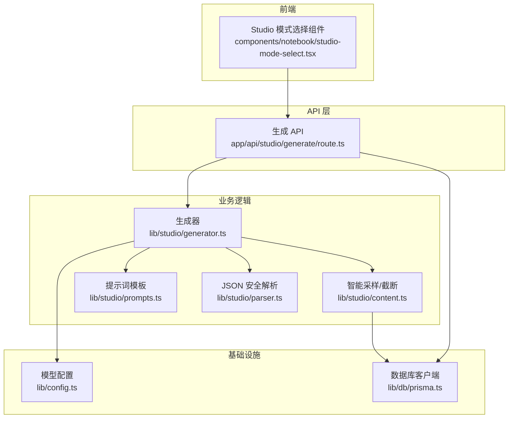
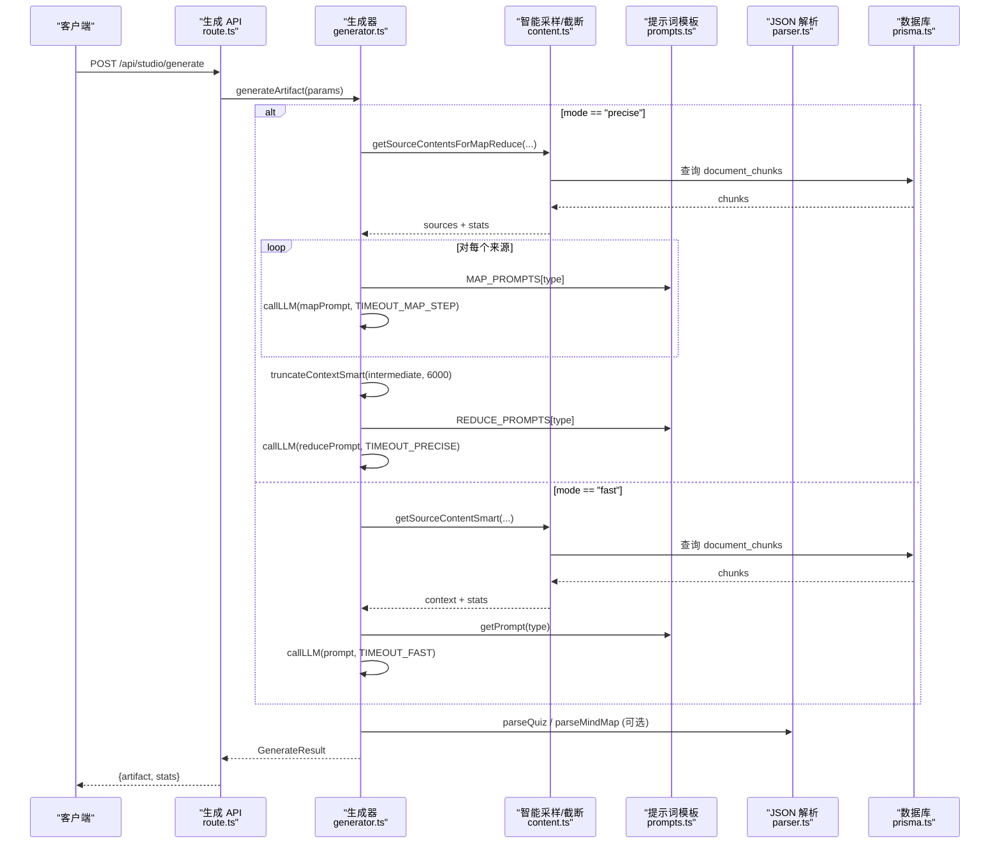
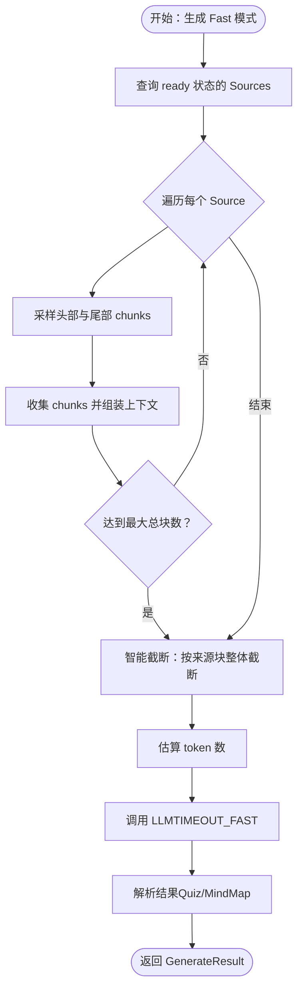
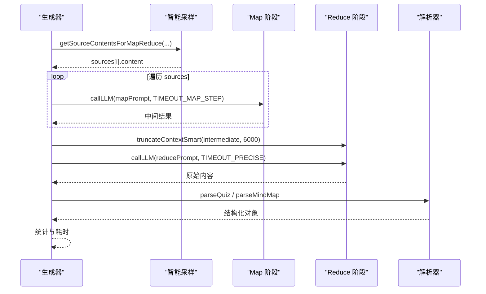
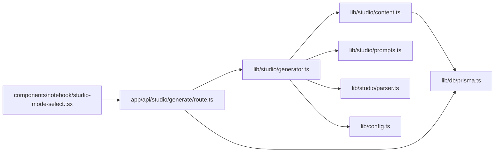
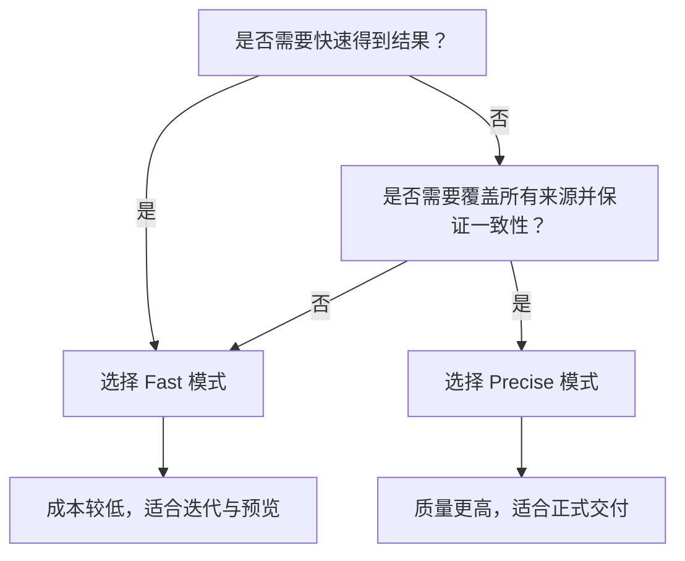

# 生成模式对比

<cite>
**本文档引用的文件**
- [lib/studio/index.ts](file://lib/studio/index.ts)
- [lib/studio/generator.ts](file://lib/studio/generator.ts)
- [lib/studio/content.ts](file://lib/studio/content.ts)
- [lib/studio/parser.ts](file://lib/studio/parser.ts)
- [lib/studio/prompts.ts](file://lib/studio/prompts.ts)
- [app/api/studio/generate/route.ts](file://app/api/studio/generate/route.ts)
- [components/notebook/studio-mode-select.tsx](file://components/notebook/studio-mode-select.tsx)
- [lib/config.ts](file://lib/config.ts)
- [lib/db/prisma.ts](file://lib/db/prisma.ts)
- [lib/ai/zhipu.ts](file://lib/ai/zhipu.ts)
- [types/index.ts](file://types/index.ts)
</cite>

## 目录
1. [简介](#简介)
2. [项目结构](#项目结构)
3. [核心组件](#核心组件)
4. [架构总览](#架构总览)
5. [详细组件分析](#详细组件分析)
6. [依赖关系分析](#依赖关系分析)
7. [性能与成本考量](#性能与成本考量)
8. [故障排查指南](#故障排查指南)
9. [结论](#结论)
10. [附录](#附录)

## 简介
本文件面向“生成模式对比”的目标，系统梳理并对比 Fast 模式与 Precise 模式的实现原理、性能特征与适用场景；深入解释智能采样机制（内容选择策略、token 估算与上下文截断）、Map-Reduce 分布式处理架构（Map 阶段内容分割与 Reduce 阶段结果聚合）；给出超时控制、错误处理与重试机制的实现细节，并提供模式选择的决策树与使用建议。由于本仓库未提供明确的性能基准测试数据与成本效益分析，本文在相应章节提供通用指导与实践建议。

## 项目结构
本项目围绕“Studio 产物生成”能力构建，核心位于 lib/studio 目录，提供统一的生成入口、智能采样、Map-Reduce 分布式处理、提示词模板与结果解析等能力；API 层通过 app/api/studio/generate/route.ts 对外暴露生成接口；前端通过 components/notebook/studio-mode-select.tsx 提供模式选择 UI。

图表来源
- [app/api/studio/generate/route.ts](file://app/api/studio/generate/route.ts#L1-L145)
- [lib/studio/generator.ts](file://lib/studio/generator.ts#L1-L311)
- [lib/studio/content.ts](file://lib/studio/content.ts#L1-L258)
- [lib/studio/prompts.ts](file://lib/studio/prompts.ts#L1-L211)
- [lib/studio/parser.ts](file://lib/studio/parser.ts#L1-L183)
- [lib/config.ts](file://lib/config.ts#L1-L187)
- [lib/db/prisma.ts](file://lib/db/prisma.ts#L1-L41)

章节来源
- [lib/studio/index.ts](file://lib/studio/index.ts#L1-L25)
- [lib/studio/generator.ts](file://lib/studio/generator.ts#L1-L311)
- [lib/studio/content.ts](file://lib/studio/content.ts#L1-L258)
- [lib/studio/prompts.ts](file://lib/studio/prompts.ts#L1-L211)
- [lib/studio/parser.ts](file://lib/studio/parser.ts#L1-L183)
- [app/api/studio/generate/route.ts](file://app/api/studio/generate/route.ts#L1-L145)
- [components/notebook/studio-mode-select.tsx](file://components/notebook/studio-mode-select.tsx#L1-L65)
- [lib/config.ts](file://lib/config.ts#L1-L187)
- [lib/db/prisma.ts](file://lib/db/prisma.ts#L1-L41)

## 核心组件
- 生成器（Fast/Precise）：统一入口 generateArtifact，内部根据模式调用 generateFast 或 generatePrecise；内置超时控制与错误处理。
- 智能采样与截断：getSourceContentSmart 用于 Fast 模式，按来源头尾采样并智能截断；truncateContextSmart 保证按来源块整体截断。
- Map-Reduce 分布式处理：generatePrecise 将每个来源独立生成中间结果，再由 Reduce 阶段整合。
- 提示词模板：包含摘要、大纲、测验、思维导图的 Prompt 以及 Map/Reduce 的专用模板。
- JSON 安全解析：parseQuiz、parseMindMap 与 safeParseJSON 提供鲁棒的 JSON 提取与验证。
- API 层：鉴权、参数校验、产物数量限制、错误映射与持久化。
- 配置与数据库：模型配置、数据库连接池与 Prisma 客户端。

章节来源
- [lib/studio/generator.ts](file://lib/studio/generator.ts#L38-L262)
- [lib/studio/content.ts](file://lib/studio/content.ts#L67-L224)
- [lib/studio/prompts.ts](file://lib/studio/prompts.ts#L118-L210)
- [lib/studio/parser.ts](file://lib/studio/parser.ts#L52-L182)
- [app/api/studio/generate/route.ts](file://app/api/studio/generate/route.ts#L12-L144)
- [lib/config.ts](file://lib/config.ts#L38-L157)
- [lib/db/prisma.ts](file://lib/db/prisma.ts#L18-L39)

## 架构总览
Fast 模式以“智能采样 + 单轮 LLM 调用”为核心，强调低延迟与低成本；Precise 模式采用 Map-Reduce 分布式处理，先对每个来源独立生成中间结果，再由 Reduce 阶段整合，强调覆盖性与一致性。

图表来源
- [app/api/studio/generate/route.ts](file://app/api/studio/generate/route.ts#L82-L111)
- [lib/studio/generator.ts](file://lib/studio/generator.ts#L120-L237)
- [lib/studio/content.ts](file://lib/studio/content.ts#L67-L224)
- [lib/studio/prompts.ts](file://lib/studio/prompts.ts#L118-L198)
- [lib/studio/parser.ts](file://lib/studio/parser.ts#L124-L182)

## 详细组件分析

### Fast 模式：智能采样与单轮生成
- 内容选择策略
  - 对每个来源优先采样头部若干块与尾部若干块，确保覆盖开头与结尾的关键信息。
  - 设定最大总块数上限，避免上下文过长。
- token 估算与截断
  - 估算规则：中文字符按每 1.5~2 字符估算 1 token，英文字符按每 4 字符估算 1 token。
  - 截断策略：按来源块（以特定分隔符分隔）整体保留，超过阈值时停止累加并提示省略。
- LLM 调用与超时
  - 使用 AbortController 设置超时，超时抛出特定错误码，便于 API 层识别。
  - 支持从推理模型的 reasoning_content 中提取 JSON 片段。
- 结果解析
  - 针对测验与思维导图，使用安全解析函数提取 JSON 并做结构校验与补全。

图表来源
- [lib/studio/content.ts](file://lib/studio/content.ts#L67-L154)
- [lib/studio/generator.ts](file://lib/studio/generator.ts#L120-L166)
- [lib/studio/parser.ts](file://lib/studio/parser.ts#L124-L150)

章节来源
- [lib/studio/content.ts](file://lib/studio/content.ts#L67-L154)
- [lib/studio/generator.ts](file://lib/studio/generator.ts#L120-L166)
- [lib/studio/parser.ts](file://lib/studio/parser.ts#L124-L150)

### Precise 模式：Map-Reduce 分布式处理
- Map 阶段
  - 对每个来源独立生成中间结果，使用 Map Prompt 模板，限制每个来源的块数以控制输入规模。
  - 每个 Map 调用设置独立超时，失败的来源会被跳过并记录日志，保证整体流程继续。
- Reduce 阶段
  - 将所有中间结果拼接，再次进行智能截断（降低阈值以适应多来源合并后的长度）。
  - 使用 Reduce Prompt 模板进行最终整合生成。
- 结果解析与统计
  - 同样支持测验与思维导图的解析与校验。

图表来源
- [lib/studio/generator.ts](file://lib/studio/generator.ts#L171-L237)
- [lib/studio/content.ts](file://lib/studio/content.ts#L159-L224)
- [lib/studio/prompts.ts](file://lib/studio/prompts.ts#L118-L198)
- [lib/studio/parser.ts](file://lib/studio/parser.ts#L155-L182)

章节来源
- [lib/studio/generator.ts](file://lib/studio/generator.ts#L171-L237)
- [lib/studio/content.ts](file://lib/studio/content.ts#L159-L224)
- [lib/studio/prompts.ts](file://lib/studio/prompts.ts#L118-L198)
- [lib/studio/parser.ts](file://lib/studio/parser.ts#L155-L182)

### 提示词模板与产物类型
- 产物类型：摘要、大纲、测验、思维导图。
- Prompt 模板：包含通用 Prompt 与 Map/Reduce 专用模板，分别用于 Fast 与 Precise 模式。
- 产物解析：严格 JSON 输出，解析器具备多种提取策略与结构校验。

章节来源
- [lib/studio/prompts.ts](file://lib/studio/prompts.ts#L1-L211)
- [lib/studio/parser.ts](file://lib/studio/parser.ts#L1-L183)

### API 层与错误处理
- 鉴权与参数校验：校验用户身份、必填参数、产物类型与 Notebook 所有权。
- 产物数量限制：单 Notebook 最多 10 个产物。
- 错误映射：NO_SOURCES、TIMEOUT、GENERATION_FAILED 等错误码映射到合适的 HTTP 状态码与消息。
- 数据持久化：生成成功后写入数据库并返回结果与统计信息。

章节来源
- [app/api/studio/generate/route.ts](file://app/api/studio/generate/route.ts#L12-L144)

### 超时控制、错误处理与重试机制
- 超时控制
  - Fast：TIMEOUT_FAST
  - Precise：TIMEOUT_PRECISE；Map 步骤：TIMEOUT_MAP_STEP
  - callLLM 使用 AbortController 实现超时中断，超时抛出特定错误码。
- 错误处理
  - API 层捕获错误并根据错误码映射为 HTTP 状态码。
  - Map 阶段对单个来源失败进行容错，继续处理其他来源。
- 重试机制
  - 通用 AI 调用封装提供带指数退避的重试策略（适用于外部 API 调用场景），但当前生成器未直接使用该封装。

章节来源
- [lib/studio/generator.ts](file://lib/studio/generator.ts#L23-L26)
- [lib/studio/generator.ts](file://lib/studio/generator.ts#L53-L115)
- [app/api/studio/generate/route.ts](file://app/api/studio/generate/route.ts#L113-L143)
- [lib/ai/zhipu.ts](file://lib/ai/zhipu.ts#L168-L195)

## 依赖关系分析
- 生成器依赖智能采样模块、提示词模板与解析模块；同时依赖配置模块与数据库客户端。
- API 层依赖生成器与数据库客户端，负责鉴权、参数校验与错误映射。
- 前端模式选择组件通过 Tooltip 展示模式差异，供用户选择。

图表来源
- [app/api/studio/generate/route.ts](file://app/api/studio/generate/route.ts#L10-L10)
- [lib/studio/generator.ts](file://lib/studio/generator.ts#L6-L20)
- [lib/studio/content.ts](file://lib/studio/content.ts#L6-L7)
- [lib/studio/prompts.ts](file://lib/studio/prompts.ts#L1-L4)
- [lib/studio/parser.ts](file://lib/studio/parser.ts#L1-L4)
- [lib/config.ts](file://lib/config.ts#L38-L52)
- [lib/db/prisma.ts](file://lib/db/prisma.ts#L1-L3)
- [components/notebook/studio-mode-select.tsx](file://components/notebook/studio-mode-select.tsx#L30-L64)

章节来源
- [lib/studio/index.ts](file://lib/studio/index.ts#L8-L24)
- [lib/studio/generator.ts](file://lib/studio/generator.ts#L6-L20)
- [lib/studio/content.ts](file://lib/studio/content.ts#L6-L7)
- [lib/studio/prompts.ts](file://lib/studio/prompts.ts#L1-L4)
- [lib/studio/parser.ts](file://lib/studio/parser.ts#L1-L4)
- [lib/config.ts](file://lib/config.ts#L38-L52)
- [lib/db/prisma.ts](file://lib/db/prisma.ts#L1-L3)
- [components/notebook/studio-mode-select.tsx](file://components/notebook/studio-mode-select.tsx#L30-L64)

## 性能与成本考量
- 时间复杂度与吞吐
  - Fast 模式：O(S) 上下文大小（受限于采样块数与截断），适合快速预览与迭代。
  - Precise 模式：Map 阶段 O(S×N)（N 为来源数），Reduce 阶段 O(S)，适合全面整合与一致性要求高的场景。
- token 估算与截断
  - 估算规则与截断策略确保上下文稳定在模型上下文窗口内，避免超限。
- 超时与并发
  - Map 阶段独立超时，提升整体稳定性；Reduce 阶段较长超时满足整合需求。
- 成本与资源
  - 本仓库未提供明确的基准测试数据与成本模型。建议结合实际模型单价与 token 使用量进行成本评估；Fast 模式通常更节省成本，Precise 模式在准确性与覆盖性上更具优势。
- 优化建议
  - 适当调整采样块数与截断阈值以平衡速度与质量。
  - 对 Map 阶段失败来源进行重试或降级处理（当前实现已具备容错）。
  - 在 API 层引入指数退避重试（参考通用封装）以提升对外部服务的鲁棒性。

[本节为通用指导，不直接分析具体文件]

## 故障排查指南
- 常见错误与定位
  - NO_SOURCES：资料为空或均未 ready，检查数据导入与处理状态。
  - TIMEOUT：生成超时，检查网络、模型服务与超时配置。
  - GENERATION_FAILED：Map 阶段全部失败，检查来源内容与 Prompt。
- 日志与调试
  - 开发环境下会输出详细错误日志，便于定位问题来源。
- 重试与降级
  - Map 阶段失败不会阻塞其他来源；可结合外部重试封装进行增强。

章节来源
- [app/api/studio/generate/route.ts](file://app/api/studio/generate/route.ts#L118-L143)
- [lib/studio/generator.ts](file://lib/studio/generator.ts#L190-L199)
- [lib/ai/zhipu.ts](file://lib/ai/zhipu.ts#L168-L195)

## 结论
- Fast 模式适合快速产出、低延迟与低成本场景；Precise 模式适合需要全面覆盖与一致性的高质量场景。
- 智能采样与 Map-Reduce 分布式处理分别体现了“局部代表性”与“全局整合”的设计思想。
- 超时控制与错误处理保障了系统的稳定性；建议在生产环境中结合外部重试机制进一步提升可靠性。

[本节为总结性内容，不直接分析具体文件]

## 附录

### 模式选择决策树

[本图为概念性决策树，不对应具体源码文件]

### 术语与类型
- 产物类型：summary、outline、quiz、mindmap
- 模式：fast、precise
- 统计指标：totalChunks、usedChunks、estimatedTokens、sourceCount、duration

章节来源
- [types/index.ts](file://types/index.ts#L14-L16)
- [lib/studio/generator.ts](file://lib/studio/generator.ts#L38-L48)
- [lib/studio/content.ts](file://lib/studio/content.ts#L16-L21)