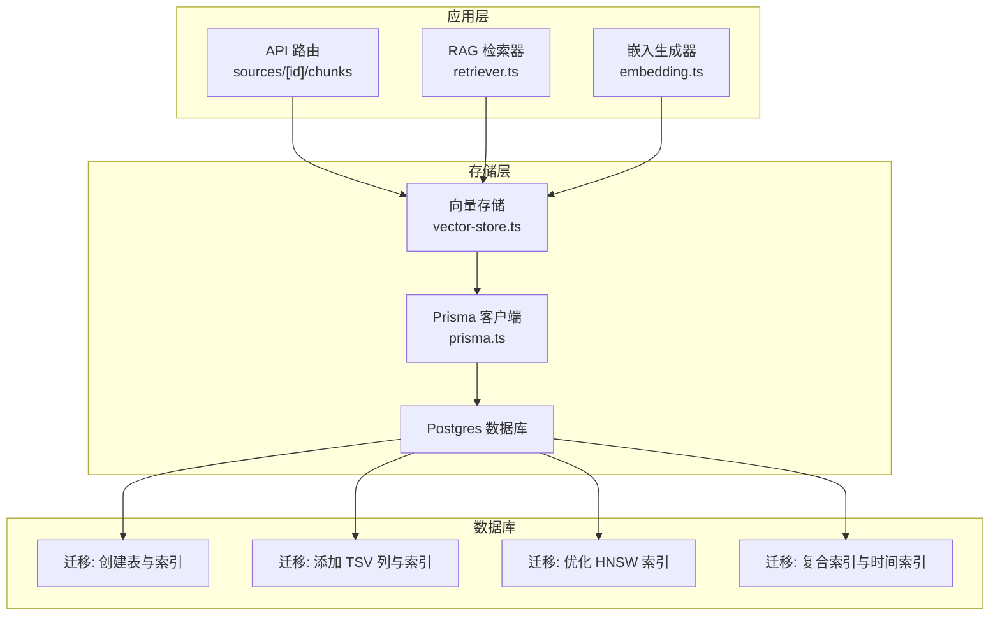
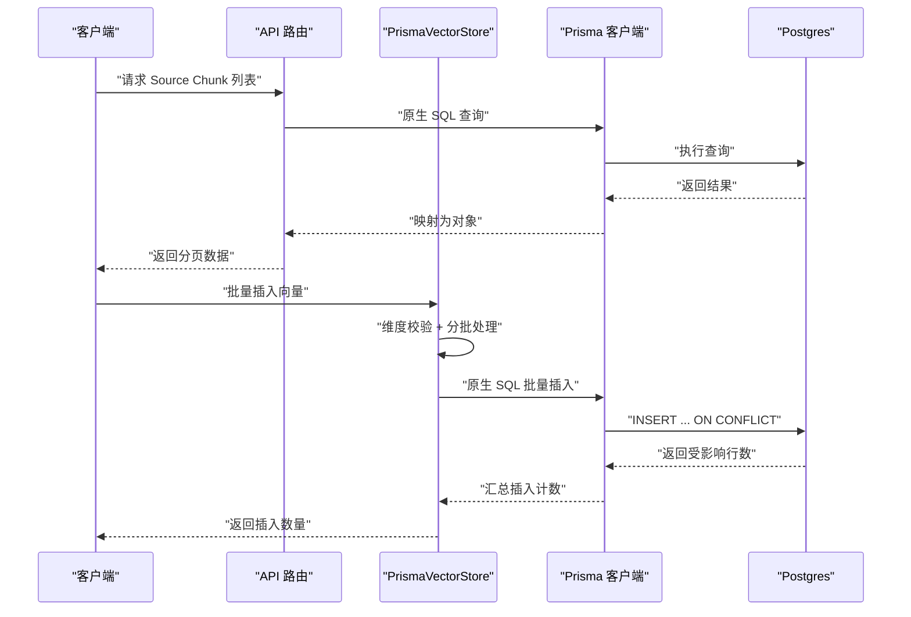
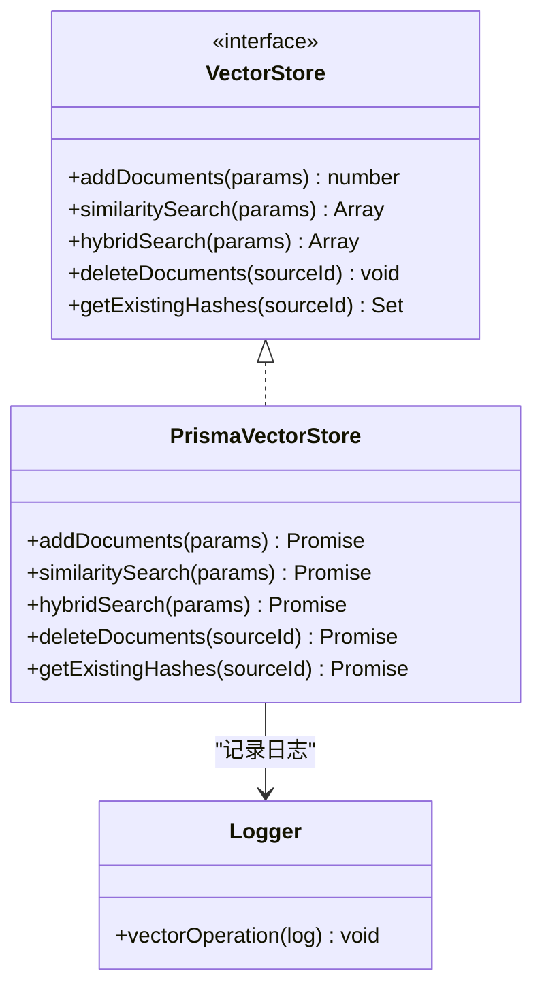
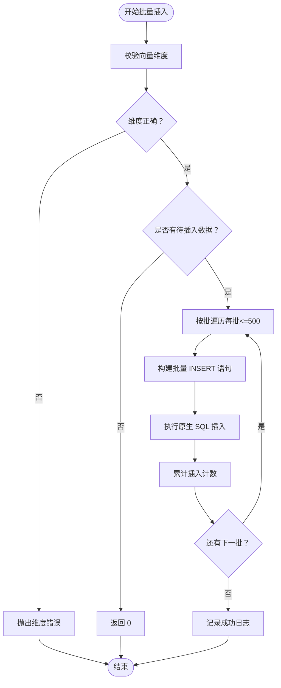
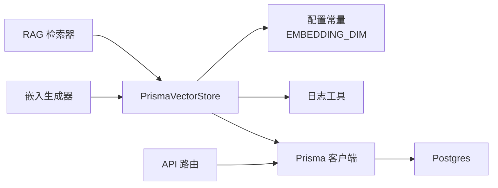

# 向量存储层

<cite>
**本文引用的文件**
- [lib/db/vector-store.ts](file://lib/db/vector-store.ts)
- [lib/db/prisma.ts](file://lib/db/prisma.ts)
- [lib/config.ts](file://lib/config.ts)
- [lib/utils/logger.ts](file://lib/utils/logger.ts)
- [lib/rag/retriever.ts](file://lib/rag/retriever.ts)
- [lib/processing/embedding.ts](file://lib/processing/embedding.ts)
- [app/api/sources/[id]/chunks/route.ts](file://app/api/sources/[id]/chunks/route.ts)
- [prisma/migrations/20241223_create_vector_table/migration.sql](file://prisma/migrations/20241223_create_vector_table/migration.sql)
- [prisma/migrations/20260120050505_add_content_tsv/migration.sql](file://prisma/migrations/20260120050505_add_content_tsv/migration.sql)
- [prisma/migrations/20260120120200_optimize_hnsw_index/migration.sql](file://prisma/migrations/20260120120200_optimize_hnsw_index/migration.sql)
- [prisma/migrations/20260120120300_add_composite_indexes/migration.sql](file://prisma/migrations/20260120120300_add_composite_indexes/migration.sql)
</cite>

## 目录
1. [简介](#简介)
2. [项目结构](#项目结构)
3. [核心组件](#核心组件)
4. [架构总览](#架构总览)
5. [详细组件分析](#详细组件分析)
6. [依赖关系分析](#依赖关系分析)
7. [性能考量](#性能考量)
8. [故障排查指南](#故障排查指南)
9. [结论](#结论)
10. [附录](#附录)

## 简介
本技术文档聚焦于向量存储层的设计与实现，围绕 PrismaVectorStore 类展开，系统阐述向量数据的存储结构、字段定义与约束、批量插入优化策略、HNSW 索引的创建与调优、查询优化技巧、数据一致性与并发控制、容量规划与备份恢复以及性能监控方案。文档同时结合迁移脚本与检索流程，帮助读者全面理解从数据入库到检索的完整链路。

## 项目结构
向量存储层位于 lib/db/vector-store.ts，配合数据库迁移脚本与检索模块共同构成完整的向量检索体系。关键文件职责如下：
- lib/db/vector-store.ts：向量存储接口与 PrismaVectorStore 实现，负责批量写入、相似度检索、混合检索、删除与去重哈希查询。
- lib/db/prisma.ts：Prisma 客户端与 Postgres 连接池适配，支持 Serverless 环境下的连接池配置。
- lib/config.ts：向量维度常量与启动校验，确保与数据库 vector(D) 一致。
- lib/utils/logger.ts：统一日志工具，提供向量操作日志记录能力。
- lib/rag/retriever.ts：RAG 检索入口，封装向量检索与混合检索流程。
- lib/processing/embedding.ts：嵌入生成与批量处理，包含重试与去重逻辑。
- app/api/sources/[id]/chunks/route.ts：对外暴露的 Source Chunk 查询接口，便于调试与可视化。
- prisma/migrations/*：数据库迁移脚本，定义表结构、索引与检索函数。

图表来源
- [lib/db/vector-store.ts](file://lib/db/vector-store.ts#L77-L446)
- [lib/db/prisma.ts](file://lib/db/prisma.ts#L1-L41)
- [lib/rag/retriever.ts](file://lib/rag/retriever.ts#L53-L206)
- [lib/processing/embedding.ts](file://lib/processing/embedding.ts#L140-L189)
- [prisma/migrations/20241223_create_vector_table/migration.sql](file://prisma/migrations/20241223_create_vector_table/migration.sql#L1-L65)
- [prisma/migrations/20260120050505_add_content_tsv/migration.sql](file://prisma/migrations/20260120050505_add_content_tsv/migration.sql#L1-L7)
- [prisma/migrations/20260120120200_optimize_hnsw_index/migration.sql](file://prisma/migrations/20260120120200_optimize_hnsw_index/migration.sql#L1-L16)
- [prisma/migrations/20260120120300_add_composite_indexes/migration.sql](file://prisma/migrations/20260120120300_add_composite_indexes/migration.sql#L1-L20)

章节来源
- [lib/db/vector-store.ts](file://lib/db/vector-store.ts#L1-L446)
- [lib/db/prisma.ts](file://lib/db/prisma.ts#L1-L41)
- [lib/config.ts](file://lib/config.ts#L1-L187)
- [lib/utils/logger.ts](file://lib/utils/logger.ts#L1-L98)
- [lib/rag/retriever.ts](file://lib/rag/retriever.ts#L1-L206)
- [lib/processing/embedding.ts](file://lib/processing/embedding.ts#L1-L189)
- [app/api/sources/[id]/chunks/route.ts](file://app/api/sources/[id]/chunks/route.ts#L1-L139)
- [prisma/migrations/20241223_create_vector_table/migration.sql](file://prisma/migrations/20241223_create_vector_table/migration.sql#L1-L65)
- [prisma/migrations/20260120050505_add_content_tsv/migration.sql](file://prisma/migrations/20260120050505_add_content_tsv/migration.sql#L1-L7)
- [prisma/migrations/20260120120200_optimize_hnsw_index/migration.sql](file://prisma/migrations/20260120120200_optimize_hnsw_index/migration.sql#L1-L16)
- [prisma/migrations/20260120120300_add_composite_indexes/migration.sql](file://prisma/migrations/20260120120300_add_composite_indexes/migration.sql#L1-L20)

## 核心组件
- 向量存储接口与实现
  - 接口定义：addDocuments、similaritySearch、hybridSearch、deleteDocuments、getExistingHashes。
  - 实现类：PrismaVectorStore，基于原生 SQL 批量插入与查询，内置维度校验、分批处理、冲突忽略与日志记录。
- 配置与校验
  - EMBEDDING_DIM：固定为 1024（与数据库 vector(1024) 一致），启动时进行严格校验。
- 日志与可观测性
  - 统一日志工具提供向量操作日志，记录插入/查询耗时、成功与否及元信息。
- 检索与嵌入
  - RAG 检索器封装向量检索与混合检索；嵌入生成器负责批量生成与重试。

章节来源
- [lib/db/vector-store.ts](file://lib/db/vector-store.ts#L24-L75)
- [lib/db/vector-store.ts](file://lib/db/vector-store.ts#L77-L446)
- [lib/config.ts](file://lib/config.ts#L6-L29)
- [lib/utils/logger.ts](file://lib/utils/logger.ts#L11-L27)
- [lib/rag/retriever.ts](file://lib/rag/retriever.ts#L53-L206)
- [lib/processing/embedding.ts](file://lib/processing/embedding.ts#L140-L189)

## 架构总览
向量存储层采用“应用层 + 存储层 + 数据库层”的三层架构：
- 应用层：API 路由、RAG 检索器、嵌入生成器。
- 存储层：PrismaVectorStore 与 Prisma 客户端，负责 SQL 批量写入与查询。
- 数据库层：Postgres + pgvector 扩展，包含 document_chunks 表、HNSW 索引、FTS 索引与检索函数。

图表来源
- [app/api/sources/[id]/chunks/route.ts](file://app/api/sources/[id]/chunks/route.ts#L16-L129)
- [lib/db/vector-store.ts](file://lib/db/vector-store.ts#L77-L173)
- [lib/db/prisma.ts](file://lib/db/prisma.ts#L23-L34)

## 详细组件分析

### PrismaVectorStore 类
- 角色与职责
  - 提供向量数据的批量写入、相似度检索、混合检索、删除与去重哈希查询。
  - 通过原生 SQL 降低 ORM 开销，提升吞吐。
- 关键实现要点
  - 维度校验：入库与查询前均校验向量维度，确保与 EMBEDDING_DIM 一致。
  - 分批插入：每批最多 500 条，使用 ON CONFLICT (source_id, chunk_index) DO NOTHING 避免重复。
  - CTE 优化：相似度与混合检索使用 CTE 减少重复计算。
  - FTS 支持：混合检索结合全文检索（content_tsv），使用 simple 分词器。
  - 日志记录：统一记录操作类型、耗时、成功与否与元信息。
- 类图概览

图表来源
- [lib/db/vector-store.ts](file://lib/db/vector-store.ts#L24-L75)
- [lib/db/vector-store.ts](file://lib/db/vector-store.ts#L77-L446)
- [lib/utils/logger.ts](file://lib/utils/logger.ts#L75-L94)

章节来源
- [lib/db/vector-store.ts](file://lib/db/vector-store.ts#L77-L446)
- [lib/utils/logger.ts](file://lib/utils/logger.ts#L75-L94)

### 向量数据存储结构与字段定义
- 表名：document_chunks
- 字段与约束
  - id：自增主键
  - notebook_id：UUID，笔记标识
  - source_id：UUID，来源标识
  - chunk_index：整型，块索引
  - content：文本内容
  - metadata：JSONB，块元数据（page、startChar、endChar、tokenCount）
  - embedding：向量，维度固定为 1024
  - embedding_model：字符串，默认 embedding-3
  - embedding_dim：整型，默认 1024
  - content_hash：文本哈希，用于去重
  - created_at：时间戳，默认当前时间
- 约束与索引
  - 主键：id
  - HNSW 索引：embedding 上的 HNSW(cosine)，优化召回率与查询性能
  - 其他索引：notebook_id、source_id、content_hash、created_at
  - FTS 列：content_tsv（to_tsvector('english', content)），GIN 索引
- 迁移脚本说明
  - 初始化表与扩展、HNSW 索引、基础索引与检索函数
  - 添加 content_tsv 列与 GIN 索引
  - 优化 HNSW 索引参数（m=32, ef_construction=128）
  - 添加复合索引与时间索引

章节来源
- [prisma/migrations/20241223_create_vector_table/migration.sql](file://prisma/migrations/20241223_create_vector_table/migration.sql#L4-L30)
- [prisma/migrations/20260120050505_add_content_tsv/migration.sql](file://prisma/migrations/20260120050505_add_content_tsv/migration.sql#L1-L7)
- [prisma/migrations/20260120120200_optimize_hnsw_index/migration.sql](file://prisma/migrations/20260120120200_optimize_hnsw_index/migration.sql#L4-L12)
- [prisma/migrations/20260120120300_add_composite_indexes/migration.sql](file://prisma/migrations/20260120120300_add_composite_indexes/migration.sql#L4-L15)

### 批量插入优化策略
- 分批处理
  - 每批最多 500 条，减少单次事务负载与内存占用。
- 维度校验
  - 入库前对每个 chunk.embedding.length 校验，确保与 EMBEDDING_DIM 一致。
- 冲突处理
  - 使用 ON CONFLICT (source_id, chunk_index) DO NOTHING，避免重复插入。
- 性能与可观测性
  - 记录插入耗时、插入数量与跳过数量，便于监控与调优。

图表来源
- [lib/db/vector-store.ts](file://lib/db/vector-store.ts#L88-L173)
- [lib/config.ts](file://lib/config.ts#L6-L29)

章节来源
- [lib/db/vector-store.ts](file://lib/db/vector-store.ts#L88-L173)
- [lib/config.ts](file://lib/config.ts#L6-L29)

### 向量索引创建与维护（HNSW）
- 初始索引
  - 使用 HNSW 索引，向量距离函数为向量余弦距离（cosine）。
- 优化策略
  - 调整 m=32（每层最大连接数）、ef_construction=128（构建时探索深度），提升召回率与索引质量。
- 复合索引与时间索引
  - notebook_id 单列索引与 created_at 降序索引，辅助多租户过滤与时间范围查询。
- 索引维护
  - 通过迁移脚本集中管理，避免手工维护导致的不一致。

章节来源
- [prisma/migrations/20241223_create_vector_table/migration.sql](file://prisma/migrations/20241223_create_vector_table/migration.sql#L22-L24)
- [prisma/migrations/20260120120200_optimize_hnsw_index/migration.sql](file://prisma/migrations/20260120120200_optimize_hnsw_index/migration.sql#L8-L12)
- [prisma/migrations/20260120120300_add_composite_indexes/migration.sql](file://prisma/migrations/20260120120300_add_composite_indexes/migration.sql#L4-L15)

### 查询优化技巧与查询计划分析
- 相似度检索
  - 使用 CTE 将向量相似度计算与过滤、排序解耦，减少重复计算。
  - 支持按 source_ids 过滤与阈值过滤，限制 topK。
- 混合检索
  - 结合向量相似度与全文检索（FTS），使用 simple 分词器，LEFT JOIN 合并分数并加权求和。
  - 支持向量权重与 FTS 权重可调。
- 索引使用策略
  - HNSW 索引用于向量近邻搜索；notebook_id 索引与 created_at 索引辅助过滤与统计。
- 查询计划分析
  - 建议使用 EXPLAIN/EXPLAIN ANALYZE 分析关键查询，确认 HNSW 与 GIN/索引被合理利用。

章节来源
- [lib/db/vector-store.ts](file://lib/db/vector-store.ts#L175-L297)
- [lib/db/vector-store.ts](file://lib/db/vector-store.ts#L312-L442)
- [prisma/migrations/20260120050505_add_content_tsv/migration.sql](file://prisma/migrations/20260120050505_add_content_tsv/migration.sql#L1-L7)
- [prisma/migrations/20260120120300_add_composite_indexes/migration.sql](file://prisma/migrations/20260120120300_add_composite_indexes/migration.sql#L4-L15)

### 数据一致性、事务与并发控制
- 一致性保障
  - 批量插入使用原生 SQL 与单条事务提交，避免 ORM 层级的额外开销。
  - 冲突忽略策略（ON CONFLICT DO NOTHING）确保幂等性。
- 事务处理
  - 当前实现未显式开启事务块，但批量插入在单次执行中顺序提交，整体保持原子性。
- 并发控制
  - 通过 PrismaPg 适配连接池，Serverless 环境下建议使用 Supabase Transaction Pooler（端口 6543）并限制每个实例连接数。
  - 建议在应用层对同一 source_id 的写入做队列化或去重，避免高并发下的重复插入。

章节来源
- [lib/db/vector-store.ts](file://lib/db/vector-store.ts#L128-L139)
- [lib/db/prisma.ts](file://lib/db/prisma.ts#L5-L16)
- [lib/db/prisma.ts](file://lib/db/prisma.ts#L23-L34)

### 存储容量规划、备份与恢复
- 容量规划
  - 单条向量 1024 维，按 float4 计算约 4KB；结合 chunk 数量估算总存储。
  - 建议定期统计 document_chunks 表大小与索引大小，评估增长趋势。
- 备份与恢复
  - 使用数据库层面的逻辑/物理备份策略，确保表结构、数据与索引一致。
  - 迁移脚本集中管理结构变更，便于回滚与重放。
- 监控与告警
  - 结合日志记录的插入/查询耗时与成功率，建立阈值告警。

章节来源
- [lib/db/vector-store.ts](file://lib/db/vector-store.ts#L143-L154)
- [lib/db/vector-store.ts](file://lib/db/vector-store.ts#L268-L279)
- [prisma/migrations/20241223_create_vector_table/migration.sql](file://prisma/migrations/20241223_create_vector_table/migration.sql#L1-L65)

## 依赖关系分析
- 组件耦合
  - PrismaVectorStore 依赖 Prisma 客户端与配置常量，日志工具提供可观测性。
  - RAG 检索器与嵌入生成器通过接口与向量存储解耦。
- 外部依赖
  - Postgres + pgvector 扩展；Supabase 连接池器（推荐）。
- 潜在循环依赖
  - 未发现循环导入；模块间通过接口与工具函数交互。

图表来源
- [lib/db/vector-store.ts](file://lib/db/vector-store.ts#L1-L4)
- [lib/config.ts](file://lib/config.ts#L6-L7)
- [lib/utils/logger.ts](file://lib/utils/logger.ts#L1-L98)
- [lib/db/prisma.ts](file://lib/db/prisma.ts#L1-L41)
- [lib/rag/retriever.ts](file://lib/rag/retriever.ts#L1-L5)
- [lib/processing/embedding.ts](file://lib/processing/embedding.ts#L1-L6)

章节来源
- [lib/db/vector-store.ts](file://lib/db/vector-store.ts#L1-L4)
- [lib/db/prisma.ts](file://lib/db/prisma.ts#L1-L41)
- [lib/rag/retriever.ts](file://lib/rag/retriever.ts#L1-L5)
- [lib/processing/embedding.ts](file://lib/processing/embedding.ts#L1-L6)

## 性能考量
- 向量维度与模型
  - 固定 1024 维，对应 embedding-3 模型；严格校验避免运行期异常。
- 索引参数调优
  - HNSW：m=32、ef_construction=128 提升召回率；根据业务调整阈值与 topK。
- 查询优化
  - 使用 CTE 与阈值过滤；FTS 与向量检索加权合并；必要时添加复合索引。
- 连接池与并发
  - Serverless 环境使用 Supabase Transaction Pooler，限制连接数，避免资源争用。
- 批量写入
  - 控制批大小与维度校验，减少事务开销与重复插入。

章节来源
- [lib/config.ts](file://lib/config.ts#L6-L29)
- [prisma/migrations/20260120120200_optimize_hnsw_index/migration.sql](file://prisma/migrations/20260120120200_optimize_hnsw_index/migration.sql#L8-L12)
- [lib/db/vector-store.ts](file://lib/db/vector-store.ts#L128-L139)
- [lib/db/prisma.ts](file://lib/db/prisma.ts#L5-L16)

## 故障排查指南
- 维度错误
  - 现象：插入或查询时报维度不匹配。
  - 排查：检查 EMBEDDING_DIM 与数据库 vector(D) 是否一致；确认嵌入模型为 embedding-3。
- 插入失败
  - 现象：批量插入报错或无新增。
  - 排查：查看日志中的错误信息；确认 source_id 与 chunk_index 组合唯一性；检查连接池配置。
- 查询无结果
  - 现象：相似度检索或混合检索返回空。
  - 排查：调整阈值与 topK；确认 notebook_id 与 source_ids 过滤条件；检查 HNSW 与 FTS 索引是否存在。
- 并发写入冲突
  - 现象：重复插入或写入阻塞。
  - 排查：使用冲突忽略策略；应用层对同一 source_id 写入做去重或串行化。

章节来源
- [lib/config.ts](file://lib/config.ts#L6-L29)
- [lib/db/vector-store.ts](file://lib/db/vector-store.ts#L92-L99)
- [lib/db/vector-store.ts](file://lib/db/vector-store.ts#L198-L202)
- [lib/utils/logger.ts](file://lib/utils/logger.ts#L75-L94)
- [lib/db/prisma.ts](file://lib/db/prisma.ts#L5-L16)

## 结论
本向量存储层通过严格的维度校验、分批插入与冲突忽略、CTE 查询优化与 HNSW/FTS 索引策略，实现了高吞吐、低延迟的向量检索能力。配合统一的日志记录与迁移脚本管理，具备良好的可观测性与可维护性。建议在生产环境中结合连接池配置、阈值与 topK 调优以及容量监控，持续优化检索质量与系统稳定性。

## 附录
- API 路由参考
  - Source Chunk 列表查询：用于调试与可视化，支持分页与目标 chunk 上下文查询。
- 迁移脚本参考
  - 初始化表与索引、添加 FTS 列与索引、优化 HNSW 索引、添加复合索引与时间索引。

章节来源
- [app/api/sources/[id]/chunks/route.ts](file://app/api/sources/[id]/chunks/route.ts#L16-L129)
- [prisma/migrations/20241223_create_vector_table/migration.sql](file://prisma/migrations/20241223_create_vector_table/migration.sql#L1-L65)
- [prisma/migrations/20260120050505_add_content_tsv/migration.sql](file://prisma/migrations/20260120050505_add_content_tsv/migration.sql#L1-L7)
- [prisma/migrations/20260120120200_optimize_hnsw_index/migration.sql](file://prisma/migrations/20260120120200_optimize_hnsw_index/migration.sql#L1-L16)
- [prisma/migrations/20260120120300_add_composite_indexes/migration.sql](file://prisma/migrations/20260120120300_add_composite_indexes/migration.sql#L1-L20)