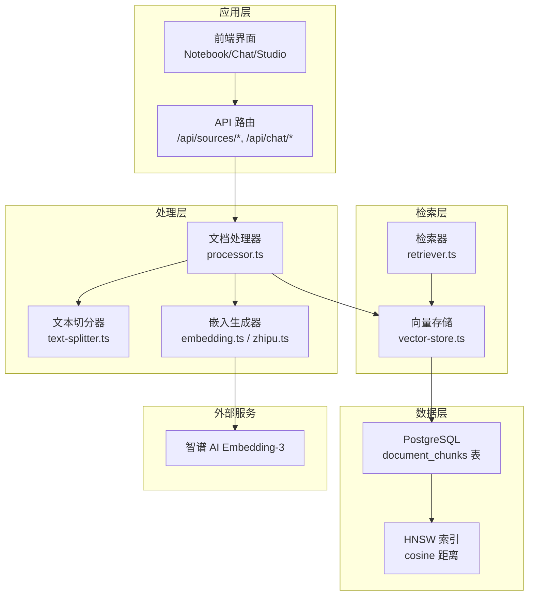
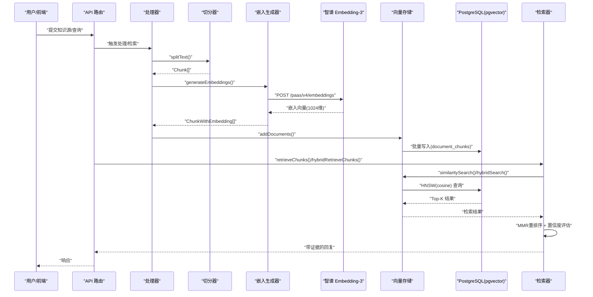
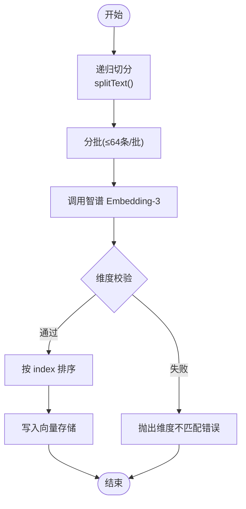
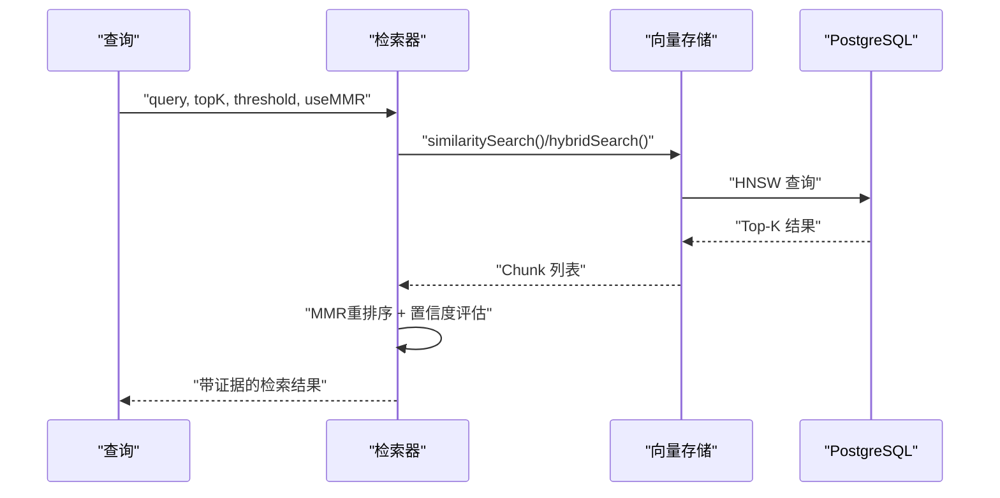
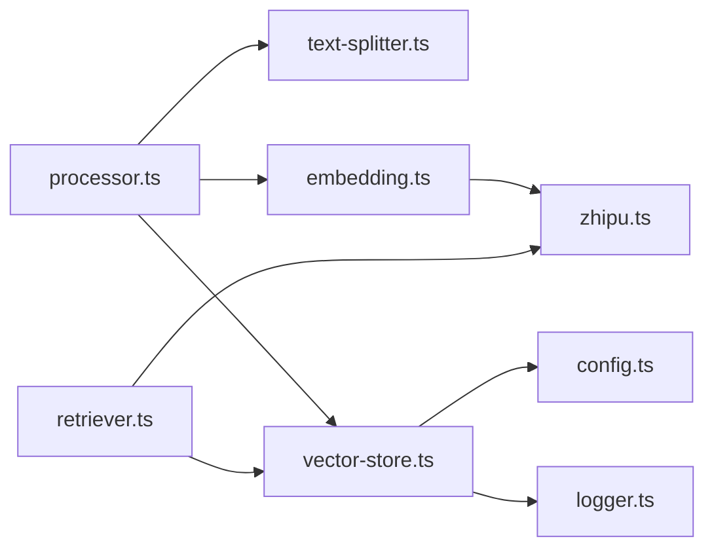

# 向量嵌入算法

<cite>
**本文引用的文件**
- [lib/processing/embedding.ts](file://lib/processing/embedding.ts)
- [lib/ai/zhipu.ts](file://lib/ai/zhipu.ts)
- [lib/db/vector-store.ts](file://lib/db/vector-store.ts)
- [lib/processing/text-splitter.ts](file://lib/processing/text-splitter.ts)
- [lib/processing/processor.ts](file://lib/processing/processor.ts)
- [lib/rag/retriever.ts](file://lib/rag/retriever.ts)
- [lib/config.ts](file://lib/config.ts)
- [lib/utils/logger.ts](file://lib/utils/logger.ts)
- [prisma/migrations/20241223_create_vector_table/migration.sql](file://prisma/migrations/20241223_create_vector_table/migration.sql)
- [prisma/migrations/20260120120200_add_composite_indexes/migration.sql](file://prisma/migrations/20260120120200_add_composite_indexes/migration.sql)
- [README.md](file://README.md)
- [package.json](file://package.json)
</cite>

## 更新摘要
**变更内容**
- 优化了MMR重排序算法的健壮性，增强了错误处理和降级机制
- 改进了cosine相似度计算的健壮性，避免维度不匹配导致的异常
- 新增了置信度计算功能，基于检索结果的相似度分布评估回答质量
- 完善了MMR重排序的降级策略，包括查询层失败、向量解析失败等多种场景
- 优化了向量嵌入获取的兼容性处理，支持多种向量格式

## 目录
1. [简介](#简介)
2. [项目结构](#项目结构)
3. [核心组件](#核心组件)
4. [架构总览](#架构总览)
5. [详细组件分析](#详细组件分析)
6. [依赖关系分析](#依赖关系分析)
7. [性能考量](#性能考量)
8. [故障排查指南](#故障排查指南)
9. [结论](#结论)
10. [附录](#附录)

## 简介
本文件面向向量嵌入算法与检索系统，围绕以下目标展开：嵌入模型选择与配置、文本向量化实现原理、嵌入质量评估方法、参数调优建议、多语言与跨语言语义对齐、嵌入缓存与批量优化、内存管理、版本与兼容性处理。本文以代码为依据，结合数据库迁移脚本与配置文件，给出可操作的工程实践与最佳实践。

## 项目结构
本项目采用前后端分离的 Next.js 应用，向量嵌入相关逻辑集中在 lib/processing、lib/db、lib/rag、lib/ai 等目录，并通过 Prisma 迁移在 PostgreSQL 中建立 pgvector 向量表与索引。

**图表来源**
- [lib/processing/processor.ts](file://lib/processing/processor.ts#L1-L560)
- [lib/processing/text-splitter.ts](file://lib/processing/text-splitter.ts#L1-L270)
- [lib/processing/embedding.ts](file://lib/processing/embedding.ts#L1-L189)
- [lib/ai/zhipu.ts](file://lib/ai/zhipu.ts#L1-L196)
- [lib/db/vector-store.ts](file://lib/db/vector-store.ts#L1-L446)
- [lib/rag/retriever.ts](file://lib/rag/retriever.ts#L1-L465)
- [prisma/migrations/20241223_create_vector_table/migration.sql](file://prisma/migrations/20241223_create_vector_table/migration.sql#L1-L65)

**章节来源**
- [README.md](file://README.md#L1-L141)
- [package.json](file://package.json#L1-L82)

## 核心组件
- 文本切分器：负责将原始文本按 Markdown/语言边界切分为固定 token 数量的块，并保留重叠窗口，便于上下文连续性。
- 嵌入生成器：封装智谱 Embedding-3 API，支持批量请求、指数退避重试、维度校验与排序返回。
- 向量存储：统一写入/检索接口，确保嵌入维度一致性，支持相似度检索与混合检索（向量+全文检索）。
- 检索器：对外暴露向量检索与混合检索，聚合来源元数据，返回带证据的检索结果，包含MMR重排序和置信度评估。
- 处理器：串联下载/抓取、解析、切分、嵌入、入库的完整流水线，记录阶段日志与统计指标。
- 配置与日志：集中管理嵌入维度、模型参数；提供向量操作日志，便于监控与排障。

**章节来源**
- [lib/processing/text-splitter.ts](file://lib/processing/text-splitter.ts#L1-L270)
- [lib/processing/embedding.ts](file://lib/processing/embedding.ts#L1-L189)
- [lib/ai/zhipu.ts](file://lib/ai/zhipu.ts#L1-L196)
- [lib/db/vector-store.ts](file://lib/db/vector-store.ts#L1-L446)
- [lib/rag/retriever.ts](file://lib/rag/retriever.ts#L1-L465)
- [lib/processing/processor.ts](file://lib/processing/processor.ts#L1-L560)
- [lib/config.ts](file://lib/config.ts#L1-L187)
- [lib/utils/logger.ts](file://lib/utils/logger.ts#L1-L98)

## 架构总览
下图展示从"用户输入/知识源"到"向量检索"的端到端流程，强调嵌入维度一致性、批量处理与重试机制、混合检索与索引优化，以及MMR重排序和置信度评估。

**图表来源**
- [lib/processing/processor.ts](file://lib/processing/processor.ts#L1-L560)
- [lib/processing/text-splitter.ts](file://lib/processing/text-splitter.ts#L1-L270)
- [lib/processing/embedding.ts](file://lib/processing/embedding.ts#L1-L189)
- [lib/ai/zhipu.ts](file://lib/ai/zhipu.ts#L1-L196)
- [lib/db/vector-store.ts](file://lib/db/vector-store.ts#L1-L446)
- [lib/rag/retriever.ts](file://lib/rag/retriever.ts#L1-L465)

## 详细组件分析

### 嵌入模型选择与配置
- 模型与维度：系统默认使用智谱 Embedding-3，强制嵌入维度为 1024，与数据库向量列定义一致。
- 环境变量：通过 EMBEDDING_DIM 控制维度，启动时进行严格校验，不匹配则抛出错误并指导修复。
- 模型提供商：支持 zhipu 与 longcat，聊天模型与嵌入模型可独立配置。

**章节来源**
- [lib/config.ts](file://lib/config.ts#L6-L29)
- [lib/config.ts](file://lib/config.ts#L46-L52)
- [prisma/migrations/20241223_create_vector_table/migration.sql](file://prisma/migrations/20241223_create_vector_table/migration.sql#L13-L15)

### 文本向量化实现原理
- 文本切分：基于递归分隔符优先级（Markdown 标题、段落、中英文标点、空格），在满足 token 目标与重叠窗口的前提下切分，保留上下文连续性。
- 嵌入生成：封装智谱 Embedding API，支持批量请求（最大 64 条/批）、单条最大 3072 tokens；内置指数退避重试；返回向量按 index 排序；对返回维度进行严格校验。
- 写入存储：向量存储层在入库前再次校验维度，使用批量插入（每批最多 500 条），并记录插入/查询日志。

**图表来源**
- [lib/processing/text-splitter.ts](file://lib/processing/text-splitter.ts#L83-L264)
- [lib/processing/embedding.ts](file://lib/processing/embedding.ts#L72-L110)
- [lib/ai/zhipu.ts](file://lib/ai/zhipu.ts#L62-L101)
- [lib/db/vector-store.ts](file://lib/db/vector-store.ts#L77-L173)

**章节来源**
- [lib/processing/text-splitter.ts](file://lib/processing/text-splitter.ts#L1-L270)
- [lib/processing/embedding.ts](file://lib/processing/embedding.ts#L1-L189)
- [lib/ai/zhipu.ts](file://lib/ai/zhipu.ts#L1-L196)
- [lib/db/vector-store.ts](file://lib/db/vector-store.ts#L1-L446)

### 检索与混合检索
- 相似度检索：使用 PostgreSQL 向量内积距离（cosine 距离），支持按 notebook/source 过滤、阈值过滤与 topK 限制。
- 混合检索：结合向量相似度与全文检索（FTS），通过权重融合得到综合得分，提升召回质量。
- 检索器职责：统一返回带来源标题、类型、相似度与可选得分明细的结构化结果。
- **新增** MMR重排序：通过最大化边际相关性平衡相关性和多样性，提升检索质量。
- **新增** 置信度评估：基于检索结果的相似度分布计算回答质量分数。

**图表来源**
- [lib/rag/retriever.ts](file://lib/rag/retriever.ts#L53-L116)
- [lib/rag/retriever.ts](file://lib/rag/retriever.ts#L131-L206)
- [lib/db/vector-store.ts](file://lib/db/vector-store.ts#L175-L297)
- [lib/db/vector-store.ts](file://lib/db/vector-store.ts#L312-L442)

**章节来源**
- [lib/rag/retriever.ts](file://lib/rag/retriever.ts#L1-L465)
- [lib/db/vector-store.ts](file://lib/db/vector-store.ts#L1-L446)

### MMR重排序算法优化
**新增** MMR（最大边际相关性）重排序算法，用于平衡检索结果的相关性和多样性：

- **算法原理**：MMR分数 = λ × 相关性 - (1-λ) × 与已选结果的最大相似度
- **降级策略**：
  1. 查询层失败 → 返回原始 chunks
  2. 余弦相似度计算失败 → 返回 0 并继续
  3. rerankeWithMMR 调用失败 → 切换为 chunks.slice(0, topK) 基础截断
- **健壮性增强**：
  - 维度不匹配时返回 0 而非抛出异常
  - 支持多种向量格式（原生数组和JSON字符串）
  - 自动跳过无效或维度不匹配的向量
  - 限制候选集大小避免过多计算

**章节来源**
- [lib/rag/retriever.ts](file://lib/rag/retriever.ts#L191-L357)

### 置信度评估系统
**新增** 基于检索结果相似度分布的置信度计算：

- **计算指标**：
  - 最高相似度：衡量最佳匹配质量
  - 相似度方差：衡量信息集中程度
- **评分规则**：
  - 基于最高相似度计算基础分数
  - 方差大时（>0.05）轻微加分，体现信息集中
  - 方差小时（<0.01）轻微减分，体现信息分散
  - 确保分数在 [0, 1] 范围内
- **等级划分**：
  - 高置信度：≥ 0.75
  - 中置信度：≥ 0.6
  - 低置信度：< 0.6

**章节来源**
- [lib/rag/retriever.ts](file://lib/rag/retriever.ts#L145-L189)

### 数据库与索引设计
- 表结构：document_chunks 包含 notebook_id、source_id、chunk_index、content、metadata、embedding(1024)、embedding_model、embedding_dim、content_hash 等字段。
- 索引：HNSW 索引使用 cosine 距离；复合索引加速 notebook/source/content_hash 查询；SQL 函数 match_document_chunks 提供检索 RPC。
- 迁移：首次迁移创建扩展与表、索引与函数；后续迁移补充复合索引与 FTS 相关变更。

**章节来源**
- [prisma/migrations/20241223_create_vector_table/migration.sql](file://prisma/migrations/20241223_create_vector_table/migration.sql#L1-L65)
- [prisma/migrations/20260120120200_add_composite_indexes/migration.sql](file://prisma/migrations/20260120120200_add_composite_indexes/migration.sql)

### 处理流水线与日志
- 流水线：PDF/URL/文本三种来源分别走不同分支，但均包含下载/抓取、解析、切分、嵌入、入库五个阶段，阶段状态与耗时记录在 processingLog 中。
- 日志：统一向量操作日志（插入/查询/混合查询/删除），包含 notebookId、sourceId、duration、success、metadata 等，便于监控与排障。

**章节来源**
- [lib/processing/processor.ts](file://lib/processing/processor.ts#L1-L560)
- [lib/utils/logger.ts](file://lib/utils/logger.ts#L1-L98)

## 依赖关系分析
- 模块耦合：处理器依赖切分器与嵌入生成器；检索器依赖向量存储；嵌入生成器依赖配置与外部 API；向量存储依赖数据库与日志工具。
- 外部依赖：智谱 AI、PostgreSQL + pgvector、Supabase 存储与认证。
- 循环依赖：未发现循环依赖迹象，模块职责清晰。

**图表来源**
- [lib/processing/processor.ts](file://lib/processing/processor.ts#L1-L560)
- [lib/processing/text-splitter.ts](file://lib/processing/text-splitter.ts#L1-L270)
- [lib/processing/embedding.ts](file://lib/processing/embedding.ts#L1-L189)
- [lib/ai/zhipu.ts](file://lib/ai/zhipu.ts#L1-L196)
- [lib/db/vector-store.ts](file://lib/db/vector-store.ts#L1-L446)
- [lib/rag/retriever.ts](file://lib/rag/retriever.ts#L1-L465)
- [lib/config.ts](file://lib/config.ts#L1-L187)
- [lib/utils/logger.ts](file://lib/utils/logger.ts#L1-L98)

## 性能考量
- 批量与并发
  - 嵌入：每批最多 64 条，单条最多 3072 tokens；API 层与生成器层均做维度校验与排序，减少下游处理成本。
  - 写入：每批最多 500 条，使用原生 SQL 批量插入，避免 ORM 循环开销。
- 索引与查询
  - HNSW(cosine) 索引显著降低相似度检索时间；按 notebook/source 过滤可进一步缩小搜索空间。
  - 混合检索通过 CTE 消除重复计算，统一使用 simple 分词器支持多语言。
- 重试与稳定性
  - 指数退避重试（最大延迟、最大重试次数）提升对外部 API 的鲁棒性。
- 内存与资源
  - 切分器使用估算 token 数量与重叠窗口，避免超长文本一次性加载；嵌入生成器按批处理，控制内存峰值。
- 日志与可观测性
  - 统一向量操作日志，记录成功/失败、耗时、插入/跳过数量、平均相似度等，便于性能分析与容量规划。
- **新增** MMR性能优化
  - 限制候选集大小（最多20个），避免过多计算
  - 批量查询chunk embeddings，减少数据库往返
  - 智能降级机制，确保系统稳定性

**章节来源**
- [lib/processing/embedding.ts](file://lib/processing/embedding.ts#L23-L26)
- [lib/processing/embedding.ts](file://lib/processing/embedding.ts#L115-L134)
- [lib/db/vector-store.ts](file://lib/db/vector-store.ts#L9-L9)
- [lib/db/vector-store.ts](file://lib/db/vector-store.ts#L204-L296)
- [lib/db/vector-store.ts](file://lib/db/vector-store.ts#L312-L442)
- [lib/utils/logger.ts](file://lib/utils/logger.ts#L75-L94)
- [lib/rag/retriever.ts](file://lib/rag/retriever.ts#L244-L245)

## 故障排查指南
- 常见错误与定位
  - 维度不匹配：嵌入返回维度与配置不一致，抛出错误并提示修复方法（设置 EMBEDDING_DIM=1024 或重建表）。
  - API 错误：HTTP 非 2xx，返回错误文本；嵌入生成器与 AI 封装均进行错误包装与重试。
  - 插入失败：向量存储捕获异常并记录失败日志，包含错误信息与元数据。
  - **新增** MMR重排序错误：查询层失败、向量解析失败、cosine相似度计算失败等，系统自动降级。
- 排查步骤
  - 检查环境变量：确认 EMBEDDING_DIM、ZHIPU_*、DATABASE_URL 等齐全且正确。
  - 核对数据库：确认 pgvector 扩展已安装、document_chunks 表与 HNSW 索引存在。
  - 查看日志：关注向量操作日志中的 duration、success、metadata（如 skipped、topK、threshold）。
  - 复现最小场景：使用单条/少量文本调用嵌入与检索，逐步定位问题范围。
  - **新增** MMR调试：查看MMR相关的警告和错误日志，确认降级机制是否正常工作。

**章节来源**
- [lib/config.ts](file://lib/config.ts#L10-L29)
- [lib/processing/embedding.ts](file://lib/processing/embedding.ts#L90-L110)
- [lib/ai/zhipu.ts](file://lib/ai/zhipu.ts#L81-L101)
- [lib/db/vector-store.ts](file://lib/db/vector-store.ts#L157-L172)
- [lib/utils/logger.ts](file://lib/utils/logger.ts#L75-L94)
- [lib/rag/retriever.ts](file://lib/rag/retriever.ts#L287-L289)

## 结论
本系统以"强约束 + 批量优化 + 混合检索 + MMR重排序"为核心设计，通过严格的嵌入维度一致性、完善的重试与日志体系、以及 HNSW 索引与混合检索，实现了稳定高效的向量检索能力。最新的MMR重排序算法优化进一步提升了检索质量，置信度评估系统提供了更可靠的回答质量判断。建议在生产环境中持续关注维度配置、索引维护、日志分析和MMR算法调优，以保障检索质量与性能。

## 附录

### 嵌入质量评估方法
- 语义相似度测试：构造一组人工标注的语义相似/不相似样本，计算检索 Top-K 中正样本命中率、MRR、NDCG 等指标。
- 检索效果验证：以问答任务为目标，统计"可引用证据"的回答占比、平均检索耗时、Top-1 相似度分布。
- A/B 对比：对比不同 topK、阈值、向量权重与 FTS 权重组合下的效果，选择最优配置。
- **新增** MMR效果评估：比较启用/禁用MMR重排序的检索质量差异，评估置信度计算的有效性。

**章节来源**
- [lib/rag/retriever.ts](file://lib/rag/retriever.ts#L145-L189)

### 嵌入参数调优指南
- 维度选择：系统强制 1024 维，若需更换模型需同步修改数据库表结构与配置。
- 归一化处理：向量检索使用 cosine 距离，通常不需要额外归一化；若自定义距离，需在检索层统一处理。
- 噪声过滤：通过相似度阈值与 topK 控制召回范围；混合检索中调整向量权重与 FTS 权重平衡语义与关键词。
- 批量与令牌：控制每批条数与单条最大 tokens，避免超限；根据 API 限额与网络状况动态调整。
- **新增** MMR参数调优：
  - λ（相关性权重）：0.7为默认值，可根据业务需求调整
  - 候选集大小：默认20，可根据性能需求调整
  - 置信度阈值：根据应用场景调整置信度等级划分

**章节来源**
- [lib/rag/retriever.ts](file://lib/rag/retriever.ts#L7-L15)
- [lib/rag/retriever.ts](file://lib/rag/retriever.ts#L234-L239)

### 多语言与跨语言语义对齐
- 多语言支持：切分器与 FTS 使用 simple 分词器，天然支持多语言；token 估算区分中英文字符比例。
- 跨语言对齐：建议使用同源多语言语料训练/微调嵌入模型，或在检索后引入语言检测与翻译预处理（需额外模块）。

**章节来源**
- [lib/processing/text-splitter.ts](file://lib/processing/text-splitter.ts#L38-L49)
- [lib/db/vector-store.ts](file://lib/db/vector-store.ts#L350-L351)

### 嵌入缓存策略、批量处理与内存管理
- 缓存策略：以 content_hash 作为去重键，避免重复嵌入；入库前先查询已有哈希集合，跳过已存在 chunk。
- 批量处理：嵌入与写入均采用分批策略，控制内存峰值与网络压力。
- 内存管理：切分器按估算 token 数量切分，重叠窗口按 token 数估算；嵌入生成器按批处理，避免一次性加载大量文本。
- **新增** MMR内存优化：限制候选集大小，避免大规模向量计算导致的内存压力。

**章节来源**
- [lib/db/vector-store.ts](file://lib/db/vector-store.ts#L305-L310)
- [lib/processing/embedding.ts](file://lib/processing/embedding.ts#L164-L181)
- [lib/processing/text-splitter.ts](file://lib/processing/text-splitter.ts#L102-L151)
- [lib/rag/retriever.ts](file://lib/rag/retriever.ts#L244-L245)

### 版本管理与兼容性
- 配置版本：EMBEDDING_DIM 与 embedding_model 与数据库向量列保持一致，启动时强制校验。
- 数据库迁移：通过 SQL 迁移管理向量表、索引与函数，确保 schema 与索引演进可控。
- 兼容性：若更换模型或维度，需执行数据库迁移重建表结构，或在配置层面统一调整。
- **新增** MMR兼容性：新版本向后兼容，旧版本功能在新版本中得到增强和优化。

**章节来源**
- [lib/config.ts](file://lib/config.ts#L6-L29)
- [prisma/migrations/20241223_create_vector_table/migration.sql](file://prisma/migrations/20241223_create_vector_table/migration.sql#L13-L15)
- [lib/rag/retriever.ts](file://lib/rag/retriever.ts#L234-L239)