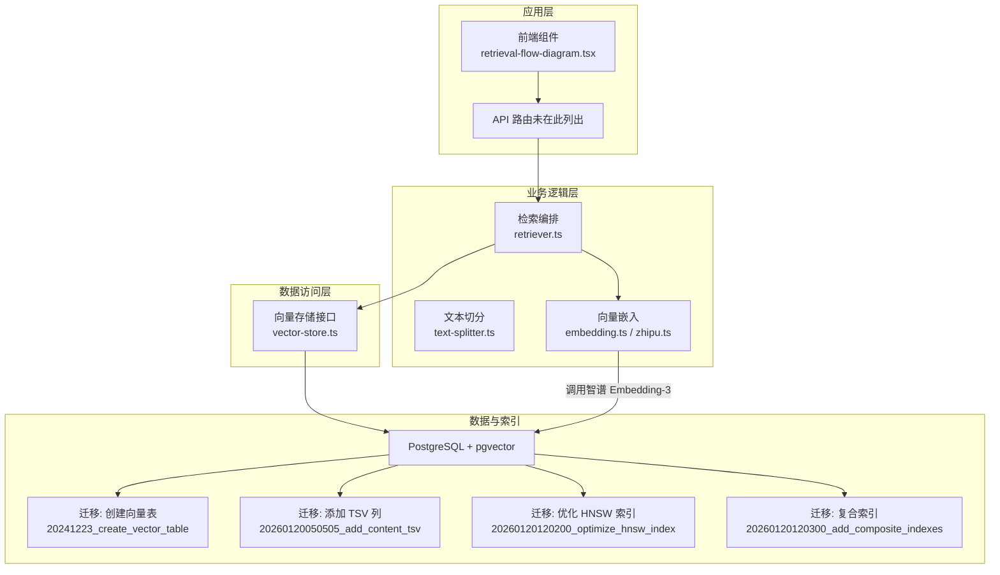
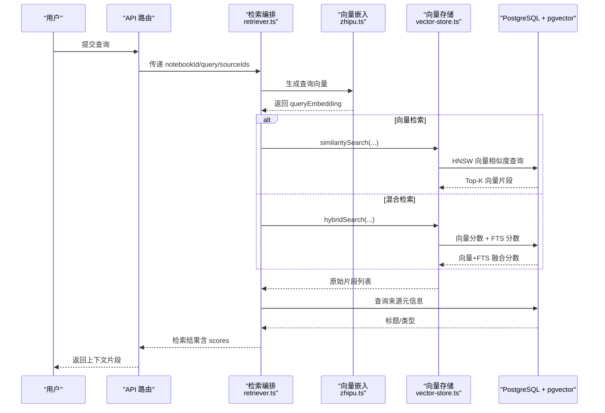
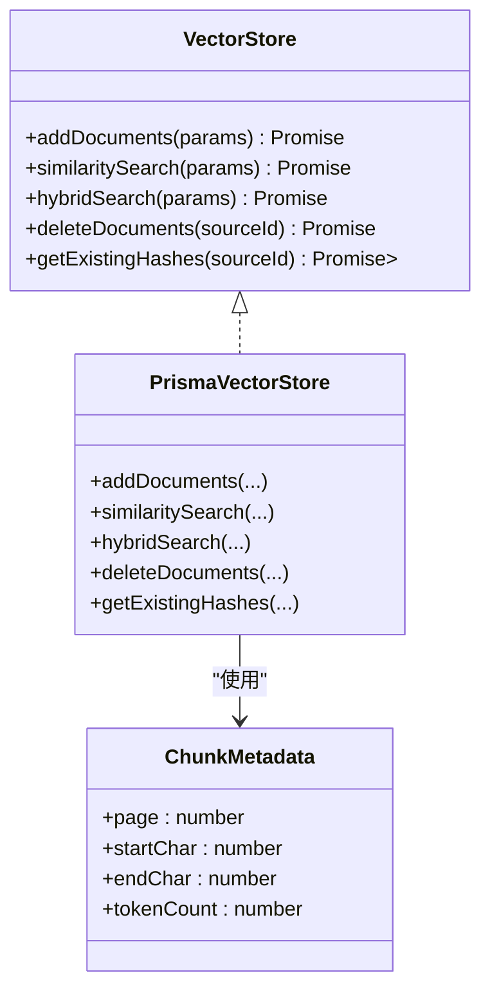
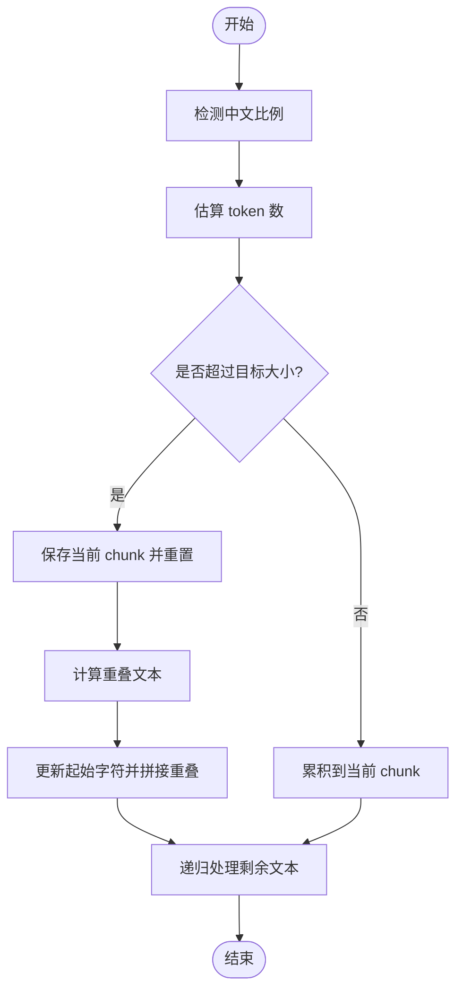
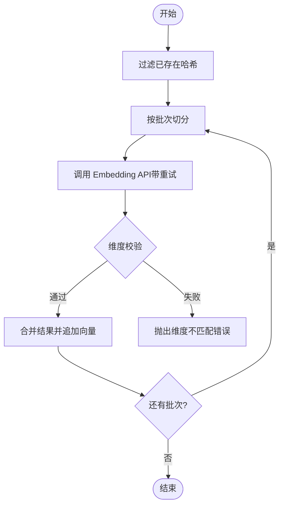
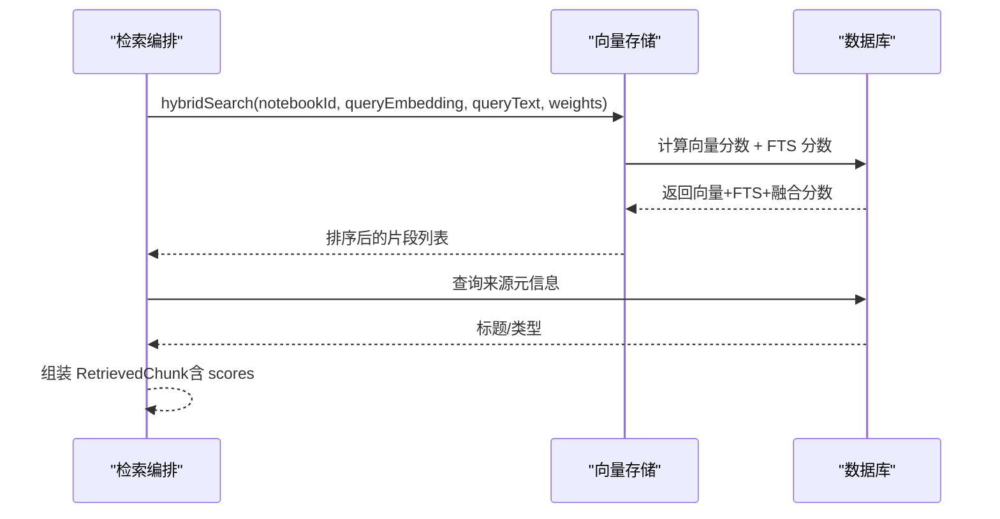
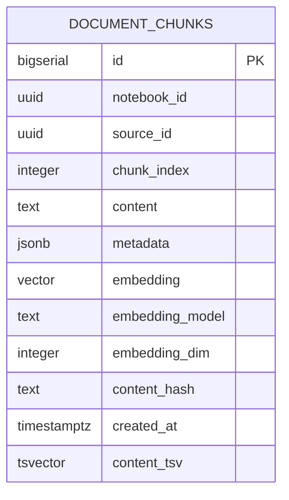

# 向量检索引擎

<cite>
**本文引用的文件**
- [lib/db/vector-store.ts](file://lib/db/vector-store.ts)
- [lib/processing/embedding.ts](file://lib/processing/embedding.ts)
- [lib/rag/retriever.ts](file://lib/rag/retriever.ts)
- [lib/processing/text-splitter.ts](file://lib/processing/text-splitter.ts)
- [lib/config.ts](file://lib/config.ts)
- [lib/ai/zhipu.ts](file://lib/ai/zhipu.ts)
- [lib/utils/logger.ts](file://lib/utils/logger.ts)
- [prisma/migrations/20241223_create_vector_table/migration.sql](file://prisma/migrations/20241223_create_vector_table/migration.sql)
- [prisma/migrations/20260120050505_add_content_tsv/migration.sql](file://prisma/migrations/20260120050505_add_content_tsv/migration.sql)
- [prisma/migrations/20260120120200_optimize_hnsw_index/migration.sql](file://prisma/migrations/20260120120200_optimize_hnsw_index/migration.sql)
- [prisma/migrations/20260120120300_add_composite_indexes/migration.sql](file://prisma/migrations/20260120120300_add_composite_indexes/migration.sql)
- [components/notebook/retrieval-flow-diagram.tsx](file://components/notebook/retrieval-flow-diagram.tsx)
</cite>

## 目录
1. [简介](#简介)
2. [项目结构](#项目结构)
3. [核心组件](#核心组件)
4. [架构总览](#架构总览)
5. [详细组件分析](#详细组件分析)
6. [依赖关系分析](#依赖关系分析)
7. [性能考量](#性能考量)
8. [故障排查指南](#故障排查指南)
9. [结论](#结论)
10. [附录](#附录)

## 简介
本技术文档围绕基于 pgvector 的向量检索引擎进行深入解析，覆盖向量嵌入算法选择与优化、文本切分策略、检索算法实现（相似度计算、混合检索、结果排序）、向量索引的创建与维护、性能基准与监控建议，并给出扩展性与稳定性保障措施。文档以代码为依据，结合数据库迁移脚本与前端可视化组件，帮助读者全面理解从“文本入库”到“混合检索”的完整链路。

## 项目结构
该工程采用前后端同构的 Next.js 应用，向量检索相关逻辑主要分布在以下模块：
- 配置与环境：统一的向量维度与模型配置
- 文本切分：递归字符切分器，兼顾中英文与多级标题
- 向量嵌入：对接智谱 Embedding-3，带指数退避与批量控制
- 向量存储：基于 Prisma 的向量表与检索接口，支持相似度与混合检索
- 检索编排：RAG 检索器，负责嵌入生成、检索与结果映射
- 数据库迁移：向量表、TSV 列与索引的演进
- 日志与可视化：统一向量操作日志与检索流程图

图表来源
- [lib/processing/text-splitter.ts](file://lib/processing/text-splitter.ts#L83-L264)
- [lib/processing/embedding.ts](file://lib/processing/embedding.ts#L140-L188)
- [lib/ai/zhipu.ts](file://lib/ai/zhipu.ts#L53-L101)
- [lib/rag/retriever.ts](file://lib/rag/retriever.ts#L53-L206)
- [lib/db/vector-store.ts](file://lib/db/vector-store.ts#L77-L443)
- [prisma/migrations/20241223_create_vector_table/migration.sql](file://prisma/migrations/20241223_create_vector_table/migration.sql#L4-L65)
- [prisma/migrations/20260120050505_add_content_tsv/migration.sql](file://prisma/migrations/20260120050505_add_content_tsv/migration.sql#L1-L7)
- [prisma/migrations/20260120120200_optimize_hnsw_index/migration.sql](file://prisma/migrations/20260120120200_optimize_hnsw_index/migration.sql#L1-L16)
- [prisma/migrations/20260120120300_add_composite_indexes/migration.sql](file://prisma/migrations/20260120120300_add_composite_indexes/migration.sql#L1-L19)
- [components/notebook/retrieval-flow-diagram.tsx](file://components/notebook/retrieval-flow-diagram.tsx#L16-L81)

章节来源
- [lib/config.ts](file://lib/config.ts#L6-L29)
- [lib/processing/text-splitter.ts](file://lib/processing/text-splitter.ts#L1-L270)
- [lib/processing/embedding.ts](file://lib/processing/embedding.ts#L1-L189)
- [lib/ai/zhipu.ts](file://lib/ai/zhipu.ts#L1-L196)
- [lib/rag/retriever.ts](file://lib/rag/retriever.ts#L1-L206)
- [lib/db/vector-store.ts](file://lib/db/vector-store.ts#L1-L446)
- [prisma/migrations/20241223_create_vector_table/migration.sql](file://prisma/migrations/20241223_create_vector_table/migration.sql#L1-L65)
- [prisma/migrations/20260120050505_add_content_tsv/migration.sql](file://prisma/migrations/20260120050505_add_content_tsv/migration.sql#L1-L7)
- [prisma/migrations/20260120120200_optimize_hnsw_index/migration.sql](file://prisma/migrations/20260120120200_optimize_hnsw_index/migration.sql#L1-L16)
- [prisma/migrations/20260120120300_add_composite_indexes/migration.sql](file://prisma/migrations/20260120120300_add_composite_indexes/migration.sql#L1-L19)
- [components/notebook/retrieval-flow-diagram.tsx](file://components/notebook/retrieval-flow-diagram.tsx#L1-L81)

## 核心组件
- 向量存储接口与实现：提供批量插入、相似度检索、混合检索、删除与去重哈希查询等能力，SQL 层使用向量距离与 HNSW 索引，同时支持全文检索（FTS）融合。
- 文本切分器：递归字符切分，优先保留自然边界（标题、段落、句子），并引入重叠窗口避免关键信息断裂；提供 token 估算与内容哈希。
- 向量嵌入：对接智谱 Embedding-3，严格锁定 1024 维度，内置指数退避重试与批量控制，确保稳定性与吞吐。
- 检索编排：统一生成查询向量，按配置选择向量或混合检索，映射来源元信息，输出检索结果与耗时统计。
- 数据库迁移：向量表、TSV 列、HNSW 与复合索引的演进，支撑高召回与高性能检索。

章节来源
- [lib/db/vector-store.ts](file://lib/db/vector-store.ts#L24-L75)
- [lib/processing/text-splitter.ts](file://lib/processing/text-splitter.ts#L83-L264)
- [lib/processing/embedding.ts](file://lib/processing/embedding.ts#L140-L188)
- [lib/rag/retriever.ts](file://lib/rag/retriever.ts#L53-L206)
- [prisma/migrations/20241223_create_vector_table/migration.sql](file://prisma/migrations/20241223_create_vector_table/migration.sql#L4-L65)

## 架构总览
下图展示从“用户查询”到“返回检索片段”的端到端流程，包括向量化、向量检索与混合检索（向量 + FTS）的协同。

图表来源
- [lib/rag/retriever.ts](file://lib/rag/retriever.ts#L53-L206)
- [lib/ai/zhipu.ts](file://lib/ai/zhipu.ts#L53-L101)
- [lib/db/vector-store.ts](file://lib/db/vector-store.ts#L175-L442)
- [prisma/migrations/20241223_create_vector_table/migration.sql](file://prisma/migrations/20241223_create_vector_table/migration.sql#L32-L60)

## 详细组件分析

### 向量存储与检索接口
- 批量插入：按固定批次大小分批写入，使用原生 SQL 插入并启用冲突忽略，插入前后记录日志，便于追踪性能与跳过重复。
- 相似度检索：使用向量余弦距离（cosine）与 HNSW 索引，支持按 notebook 与 sourceIds 过滤，阈值过滤与 topK 限制。
- 混合检索：同时计算向量分数与 FTS 分数，按权重融合，支持阈值或任一条件满足即返回。
- 删除与去重：按 sourceId 删除文档，按 content_hash 去重，避免重复入库。

图表来源
- [lib/db/vector-store.ts](file://lib/db/vector-store.ts#L24-L75)
- [lib/db/vector-store.ts](file://lib/db/vector-store.ts#L77-L443)

章节来源
- [lib/db/vector-store.ts](file://lib/db/vector-store.ts#L77-L443)

### 文本切分策略与最佳实践
- 切分器特性：优先自然边界（标题/段落/句子），字符级回退；重叠窗口降低信息割裂；token 估算兼顾中英文比例。
- 元数据：记录起止字符、token 数、来源标题与类型；PDF 场景可映射页码。
- 最佳实践：
  - 根据内容类型调整 chunkSize 与重叠比例；
  - 对长文档先做层级切分（如目录、章节）再进入切分器；
  - 保留必要的上下文标识（如标题、页码）以便后续排序与溯源。

图表来源
- [lib/processing/text-splitter.ts](file://lib/processing/text-splitter.ts#L97-L152)
- [lib/processing/text-splitter.ts](file://lib/processing/text-splitter.ts#L158-L194)
- [lib/processing/text-splitter.ts](file://lib/processing/text-splitter.ts#L228-L263)

章节来源
- [lib/processing/text-splitter.ts](file://lib/processing/text-splitter.ts#L1-L270)

### 向量嵌入算法与优化策略
- 模型与维度：强制使用智谱 Embedding-3，维度锁定为 1024；启动时进行维度校验，防止配置不一致导致的运行时错误。
- 批量与令牌限制：单批最多 64 条，单条最多 3072 tokens；按批处理减少 API 调用次数。
- 重试机制：指数退避，最大延迟上限，针对 429/5xx 等可重试错误自动重试。
- 去重与跳过：基于 content_hash 去重，跳过已存在片段，降低重复调用与写入成本。

图表来源
- [lib/processing/embedding.ts](file://lib/processing/embedding.ts#L140-L188)
- [lib/ai/zhipu.ts](file://lib/ai/zhipu.ts#L62-L101)
- [lib/config.ts](file://lib/config.ts#L17-L29)

章节来源
- [lib/processing/embedding.ts](file://lib/processing/embedding.ts#L1-L189)
- [lib/ai/zhipu.ts](file://lib/ai/zhipu.ts#L1-L196)
- [lib/config.ts](file://lib/config.ts#L6-L29)

### 检索算法实现：相似度、混合检索与排序
- 相似度计算：使用向量余弦距离（cosine），返回 1 - 距离作为相似度，利用 HNSW 索引加速。
- 混合检索：向量分数与 FTS 分数融合，支持独立权重配置；任一满足阈值即纳入候选，最终按融合分数排序。
- 结果排序：向量检索按相似度降序；混合检索按融合分数降序；检索编排阶段补充来源标题与类型。

图表来源
- [lib/rag/retriever.ts](file://lib/rag/retriever.ts#L131-L206)
- [lib/db/vector-store.ts](file://lib/db/vector-store.ts#L312-L442)

章节来源
- [lib/rag/retriever.ts](file://lib/rag/retriever.ts#L1-L206)
- [lib/db/vector-store.ts](file://lib/db/vector-store.ts#L312-L442)

### 向量索引的创建、维护与优化
- 向量表与扩展：启用 vector 扩展，创建 document_chunks 表，包含向量、元数据、哈希与模型/维度字段。
- HNSW 索引优化：提升每层最大连接数与构建探索深度，显著提升召回率与查询性能。
- 复合与辅助索引：为 notebook_id 与 created_at 建立索引，优化多租户过滤与时间范围查询。
- FTS 支持：添加 content_tsv 列与 GIN 索引，配合混合检索提升语义与关键词召回。

图表来源
- [prisma/migrations/20241223_create_vector_table/migration.sql](file://prisma/migrations/20241223_create_vector_table/migration.sql#L4-L20)
- [prisma/migrations/20260120050505_add_content_tsv/migration.sql](file://prisma/migrations/20260120050505_add_content_tsv/migration.sql#L1-L7)

章节来源
- [prisma/migrations/20241223_create_vector_table/migration.sql](file://prisma/migrations/20241223_create_vector_table/migration.sql#L1-L65)
- [prisma/migrations/20260120050505_add_content_tsv/migration.sql](file://prisma/migrations/20260120050505_add_content_tsv/migration.sql#L1-L7)
- [prisma/migrations/20260120120200_optimize_hnsw_index/migration.sql](file://prisma/migrations/20260120120200_optimize_hnsw_index/migration.sql#L1-L16)
- [prisma/migrations/20260120120300_add_composite_indexes/migration.sql](file://prisma/migrations/20260120120300_add_composite_indexes/migration.sql#L1-L19)

## 依赖关系分析
- 组件耦合：
  - 文本切分器与向量嵌入：切分器产出的 chunk 作为嵌入输入。
  - 向量嵌入与检索编排：检索编排依赖嵌入服务生成查询向量。
  - 检索编排与向量存储：检索编排调用向量存储接口执行相似度与混合检索。
  - 向量存储与数据库：向量存储通过 Prisma 执行原生 SQL，依赖 HNSW 与 FTS 索引。
- 外部依赖：
  - 智谱 AI：Embedding-3 服务，提供 1024 维向量。
  - PostgreSQL + pgvector：向量存储与索引。
  - Prisma：ORM 与迁移管理。

图表来源
- [lib/processing/text-splitter.ts](file://lib/processing/text-splitter.ts#L1-L270)
- [lib/processing/embedding.ts](file://lib/processing/embedding.ts#L1-L189)
- [lib/ai/zhipu.ts](file://lib/ai/zhipu.ts#L1-L196)
- [lib/rag/retriever.ts](file://lib/rag/retriever.ts#L1-L206)
- [lib/db/vector-store.ts](file://lib/db/vector-store.ts#L1-L446)

章节来源
- [lib/processing/text-splitter.ts](file://lib/processing/text-splitter.ts#L1-L270)
- [lib/processing/embedding.ts](file://lib/processing/embedding.ts#L1-L189)
- [lib/ai/zhipu.ts](file://lib/ai/zhipu.ts#L1-L196)
- [lib/rag/retriever.ts](file://lib/rag/retriever.ts#L1-L206)
- [lib/db/vector-store.ts](file://lib/db/vector-store.ts#L1-L446)

## 性能考量
- 维度与模型：严格锁定 1024 维，与 Embedding-3 一致，避免维度不匹配带来的额外校验与转换开销。
- 批量与重试：嵌入批量大小与指数退避减少 API 调用抖动与失败重试成本。
- 索引参数：HNSW m 与 ef_construction 参数优化提升召回率与查询性能；复合索引优化过滤场景。
- 查询路径：CTE 消除重复计算，阈值过滤与 topK 限制控制返回规模。
- 监控与日志：统一向量操作日志，记录插入/查询耗时、成功与否与关键元数据，便于定位瓶颈。

章节来源
- [lib/config.ts](file://lib/config.ts#L6-L29)
- [lib/processing/embedding.ts](file://lib/processing/embedding.ts#L12-L26)
- [lib/db/vector-store.ts](file://lib/db/vector-store.ts#L198-L202)
- [prisma/migrations/20260120120200_optimize_hnsw_index/migration.sql](file://prisma/migrations/20260120120200_optimize_hnsw_index/migration.sql#L8-L12)
- [lib/utils/logger.ts](file://lib/utils/logger.ts#L75-L94)

## 故障排查指南
- 维度不匹配：
  - 现象：插入或查询时报错提示维度不符。
  - 排查：确认 EMBEDDING_DIM 与 Embedding-3 输出维度一致；检查环境变量与启动时校验逻辑。
- API 调用失败：
  - 现象：嵌入 API 返回 429/5xx。
  - 排查：检查指数退避与重试配置；核对鉴权头与请求体；关注限流与配额。
- 检索无结果：
  - 现象：混合检索返回空或稀疏。
  - 排查：调整阈值与 topK；确认 HNSW 与 FTS 索引是否存在；检查过滤条件（notebookId/sourceIds）。
- 性能异常：
  - 现象：插入/查询耗时上升。
  - 排查：查看向量操作日志；确认索引参数是否生效；评估批次大小与重叠比例。

章节来源
- [lib/config.ts](file://lib/config.ts#L9-L29)
- [lib/processing/embedding.ts](file://lib/processing/embedding.ts#L115-L134)
- [lib/db/vector-store.ts](file://lib/db/vector-store.ts#L198-L202)
- [lib/utils/logger.ts](file://lib/utils/logger.ts#L75-L94)

## 结论
本向量检索引擎以 pgvector 为核心，结合文本切分、向量嵌入与混合检索，形成从“入库”到“召回”的闭环。通过严格的维度一致性、批量与重试优化、HNSW 与 FTS 索引优化以及统一日志监控，系统在准确性与性能之间取得平衡。建议在生产环境中持续观测检索耗时、召回率与资源占用，按业务规模动态调整索引参数与切分策略。

## 附录
- 检索流程可视化组件：前端组件直观展示“问题 -> 向量化 -> 混合检索 -> 召回片段”的时序与耗时。
- 数据库迁移清单：向量表、TSV 列、HNSW 与复合索引的演进记录，便于审计与回滚。

章节来源
- [components/notebook/retrieval-flow-diagram.tsx](file://components/notebook/retrieval-flow-diagram.tsx#L16-L81)