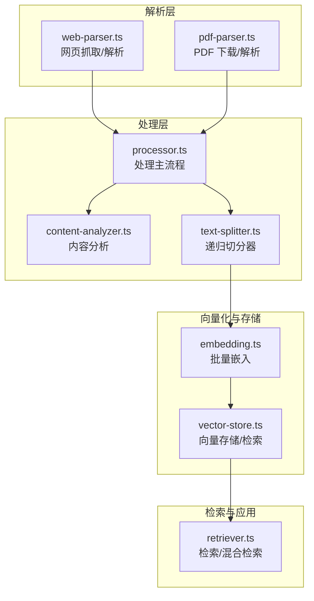
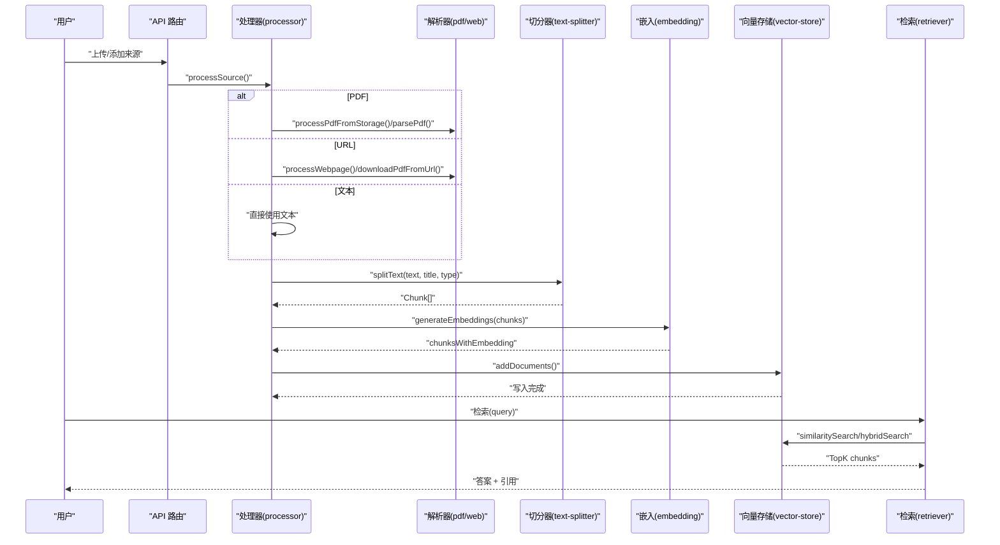
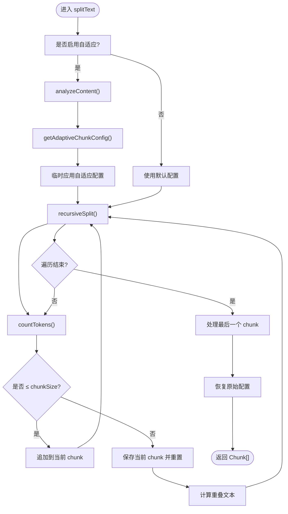
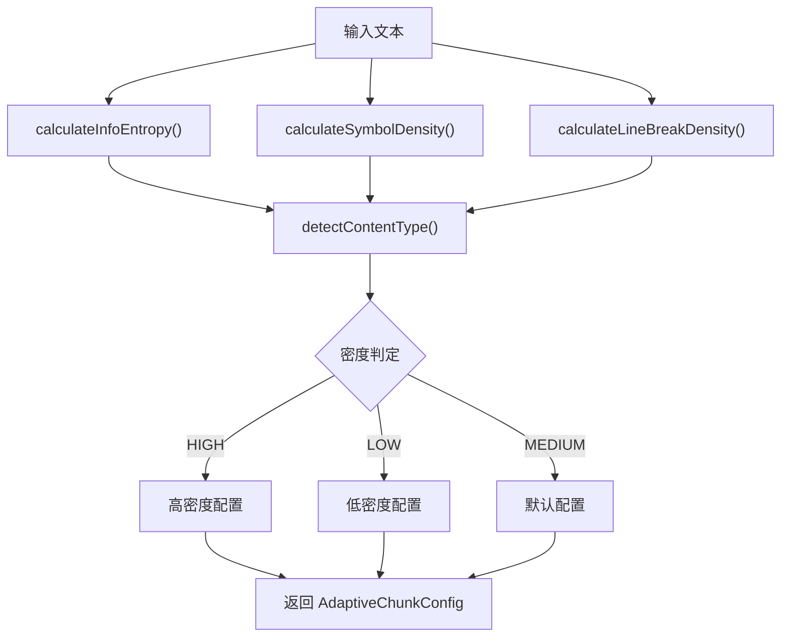
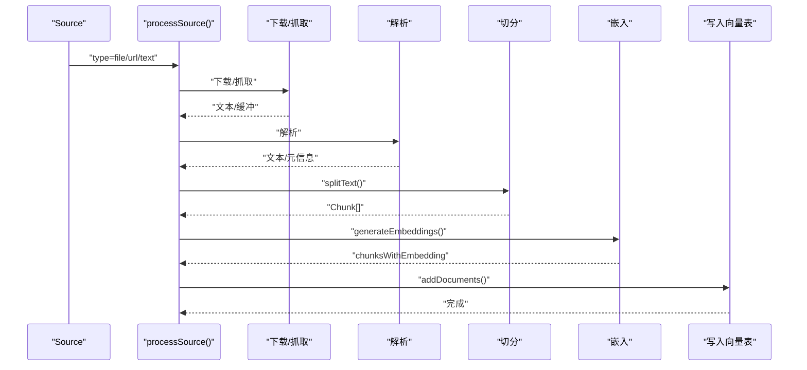
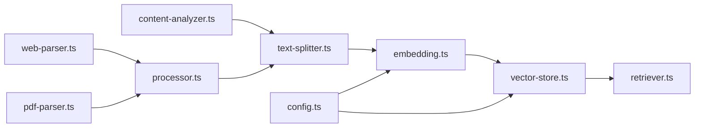

# 文本处理与切分

<cite>
**本文引用的文件**
- [text-splitter.ts](file://lib/processing/text-splitter.ts)
- [content-analyzer.ts](file://lib/processing/content-analyzer.ts)
- [processor.ts](file://lib/processing/processor.ts)
- [pdf-parser.ts](file://lib/processing/pdf-parser.ts)
- [web-parser.ts](file://lib/processing/web-parser.ts)
- [embedding.ts](file://lib/processing/embedding.ts)
- [vector-store.ts](file://lib/db/vector-store.ts)
- [retriever.ts](file://lib/rag/retriever.ts)
- [config.ts](file://lib/config.ts)
- [README.md](file://README.md)
- [PROJECT_SPEC.md](file://docs/PROJECT_SPEC.md)
</cite>

## 目录
1. [简介](#简介)
2. [项目结构](#项目结构)
3. [核心组件](#核心组件)
4. [架构总览](#架构总览)
5. [详细组件分析](#详细组件分析)
6. [依赖关系分析](#依赖关系分析)
7. [性能考量](#性能考量)
8. [故障排查指南](#故障排查指南)
9. [结论](#结论)
10. [附录](#附录)

## 简介
本文件聚焦“文本处理与切分”模块，系统阐述文本切分算法的设计原理、不同策略的适用场景、预处理流程、参数调优、质量评估方法、性能优化与内存控制策略，以及多语言文本处理的适配方案。该模块是 RAG 知识库构建的关键环节，贯穿“解析 → 切分 → 向量化 → 检索”的主链路，直接影响检索质量与下游问答效果。

## 项目结构
与文本处理与切分直接相关的模块分布如下：
- 文本切分与内容分析：lib/processing/text-splitter.ts、lib/processing/content-analyzer.ts
- 文档处理主流程：lib/processing/processor.ts
- 网页与 PDF 解析：lib/processing/web-parser.ts、lib/processing/pdf-parser.ts
- 向量化与嵌入：lib/processing/embedding.ts、lib/db/vector-store.ts
- 检索与 RAG：lib/rag/retriever.ts
- 配置与环境：lib/config.ts
- 项目说明与规范：README.md、docs/PROJECT_SPEC.md

图表来源
- [processor.ts](file://lib/processing/processor.ts#L82-L397)
- [text-splitter.ts](file://lib/processing/text-splitter.ts#L93-L312)
- [content-analyzer.ts](file://lib/processing/content-analyzer.ts#L196-L284)
- [embedding.ts](file://lib/processing/embedding.ts#L140-L189)
- [vector-store.ts](file://lib/db/vector-store.ts#L77-L446)
- [retriever.ts](file://lib/rag/retriever.ts#L53-L206)

章节来源
- [processor.ts](file://lib/processing/processor.ts#L1-L560)
- [text-splitter.ts](file://lib/processing/text-splitter.ts#L1-L312)
- [content-analyzer.ts](file://lib/processing/content-analyzer.ts#L1-L284)
- [web-parser.ts](file://lib/processing/web-parser.ts#L1-L228)
- [pdf-parser.ts](file://lib/processing/pdf-parser.ts#L1-L150)
- [embedding.ts](file://lib/processing/embedding.ts#L1-L189)
- [vector-store.ts](file://lib/db/vector-store.ts#L1-L446)
- [retriever.ts](file://lib/rag/retriever.ts#L1-L206)
- [config.ts](file://lib/config.ts#L1-L187)
- [README.md](file://README.md#L1-L141)
- [PROJECT_SPEC.md](file://docs/PROJECT_SPEC.md#L1-L800)

## 核心组件
- 递归字符切分器：基于多级分隔符优先级的自适应切分，支持重叠窗口、token 估算与内容密度自适应。
- 内容分析器：计算信息熵、符号密度、换行密度，识别内容类型（表格/代码/列表/段落），为自适应切分提供决策依据。
- 文档处理主流程：统一调度 PDF/URL/文本三种来源的解析、切分、向量化与入库，记录阶段日志与状态。
- 网页解析器：抓取网页、检测 PDF、使用 Readability 提取正文并清理文本。
- PDF 解析器：从 Supabase Storage 下载并解析 PDF，构建页码信息，检测扫描件。
- 向量化与存储：批量调用智谱 Embedding API，分批写入向量表，支持去重与索引。
- 检索器：向量检索与混合检索（向量+全文检索），支持评分与去重。

章节来源
- [text-splitter.ts](file://lib/processing/text-splitter.ts#L93-L312)
- [content-analyzer.ts](file://lib/processing/content-analyzer.ts#L196-L284)
- [processor.ts](file://lib/processing/processor.ts#L82-L397)
- [web-parser.ts](file://lib/processing/web-parser.ts#L174-L190)
- [pdf-parser.ts](file://lib/processing/pdf-parser.ts#L57-L117)
- [embedding.ts](file://lib/processing/embedding.ts#L140-L189)
- [vector-store.ts](file://lib/db/vector-store.ts#L77-L446)
- [retriever.ts](file://lib/rag/retriever.ts#L53-L206)

## 架构总览
文本处理与切分在整体 RAG 流程中的位置如下：

图表来源
- [processor.ts](file://lib/processing/processor.ts#L82-L397)
- [text-splitter.ts](file://lib/processing/text-splitter.ts#L109-L189)
- [embedding.ts](file://lib/processing/embedding.ts#L140-L189)
- [vector-store.ts](file://lib/db/vector-store.ts#L77-L446)
- [retriever.ts](file://lib/rag/retriever.ts#L53-L206)

## 详细组件分析

### 递归字符切分器（RecursiveTextSplitter）
- 设计原则
  - 优先保持自然边界：标题 > 段落 > 句子 > 空格 > 字符，避免破坏语义完整性。
  - 重叠窗口：通过重叠避免关键信息被截断，提升检索召回。
  - token 估算：中文约 1.5 字符/token，英文约 4 字符/token，按混合比例估算。
  - 自适应切分：根据内容密度动态调整 chunk 大小与重叠率。
- 关键流程
  - splitText：递归切分 → 计数 token → 达界保存并开始新 chunk → 计算重叠 → 生成 Chunk 对象。
  - recursiveSplit：按分隔符拆分，若子段仍超长则递归使用更低优先级分隔符。
  - splitByTokens：作为最后手段，按估算字符数切分。
  - getOverlapText：按重叠比例估算字符数，保留尾部重叠。
- 数据结构
  - Chunk：content、contentHash、metadata（tokenCount、页码、字符区间、来源信息、策略标识等）。
  - ChunkMetadata：承载切分元信息，便于检索与溯源。
- 参数配置
  - CHUNK_CONFIG：chunkSize、chunkOverlap、分隔符优先级。
  - enableAdaptive：是否启用自适应切分。

图表来源
- [text-splitter.ts](file://lib/processing/text-splitter.ts#L109-L189)
- [text-splitter.ts](file://lib/processing/text-splitter.ts#L195-L231)
- [text-splitter.ts](file://lib/processing/text-splitter.ts#L237-L260)
- [text-splitter.ts](file://lib/processing/text-splitter.ts#L265-L305)

章节来源
- [text-splitter.ts](file://lib/processing/text-splitter.ts#L21-L38)
- [text-splitter.ts](file://lib/processing/text-splitter.ts#L45-L56)
- [text-splitter.ts](file://lib/processing/text-splitter.ts#L93-L312)

### 内容分析器（ContentAnalyzer）
- 目标：为自适应切分提供决策依据，识别内容密度与类型，指导 chunk 大小与重叠策略。
- 指标
  - 信息熵（香农熵）：衡量字符分布的不确定性，高熵通常代表高密度内容。
  - 特殊符号密度：代码/表格等结构化内容常具有较高符号密度。
  - 换行密度：列表/代码块等结构化内容换行频繁。
  - 内容类型：表格、代码块、列表、普通段落。
- 自适应策略
  - 高密度：缩小 chunk、增大重叠，保留关键信息。
  - 低密度：增大 chunk、减小重叠，提升吞吐。
  - 中密度：使用默认配置。

图表来源
- [content-analyzer.ts](file://lib/processing/content-analyzer.ts#L196-L241)
- [content-analyzer.ts](file://lib/processing/content-analyzer.ts#L246-L283)

章节来源
- [content-analyzer.ts](file://lib/processing/content-analyzer.ts#L28-L43)
- [content-analyzer.ts](file://lib/processing/content-analyzer.ts#L49-L94)
- [content-analyzer.ts](file://lib/processing/content-analyzer.ts#L99-L191)
- [content-analyzer.ts](file://lib/processing/content-analyzer.ts#L246-L283)

### 文档处理主流程（Processor）
- 统一入口：processSource，自动判断来源类型（file/url/text）。
- PDF 流程：下载 → 解析 → 切分 → 向量化 → 写入向量表 → 更新状态。
- URL 流程：抓取/下载 → 解析（网页或 PDF）→ 切分 → 向量化 → 写入向量表 → 更新状态。
- 文本流程：直接切分 → 向量化 → 写入向量表 → 更新状态。
- 日志与状态：记录各阶段耗时、token 数、chunks 数、错误信息等，支持断点续传与重试。

图表来源
- [processor.ts](file://lib/processing/processor.ts#L82-L397)

章节来源
- [processor.ts](file://lib/processing/processor.ts#L19-L77)
- [processor.ts](file://lib/processing/processor.ts#L82-L397)

### 网页解析器（WebParser）
- 抓取：带超时与重定向控制，检测 HTTP 错误。
- 解析：使用 @mozilla/readability 提取正文，清理多余空白，计算词数。
- URL 类型检测：区分网页、PDF、YouTube 链接，PDF 通过 Content-Type 或扩展名识别。
- 下载 PDF：当 URL 指向 PDF 时直接下载二进制缓冲。

章节来源
- [web-parser.ts](file://lib/processing/web-parser.ts#L12-L19)
- [web-parser.ts](file://lib/processing/web-parser.ts#L35-L53)
- [web-parser.ts](file://lib/processing/web-parser.ts#L58-L126)
- [web-parser.ts](file://lib/processing/web-parser.ts#L131-L169)
- [web-parser.ts](file://lib/processing/web-parser.ts#L174-L190)
- [web-parser.ts](file://lib/processing/web-parser.ts#L195-L227)

### PDF 解析器（PdfParser）
- 下载：从 Supabase Storage 按存储路径下载二进制缓冲。
- 解析：使用 pdf-parse 提取文本、页数、信息；统计词数；构建页码信息（按页均分字符）。
- 错误处理：加密/损坏/异常等错误分类返回。
- 扫描件检测：按平均每页字符数阈值判断是否为扫描件。

章节来源
- [pdf-parser.ts](file://lib/processing/pdf-parser.ts#L41-L52)
- [pdf-parser.ts](file://lib/processing/pdf-parser.ts#L57-L117)
- [pdf-parser.ts](file://lib/processing/pdf-parser.ts#L122-L128)
- [pdf-parser.ts](file://lib/processing/pdf-parser.ts#L133-L149)

### 向量化与存储（Embedding + VectorStore）
- 批量嵌入：指数退避重试、批量分片、维度校验、估算 token 消耗。
- 向量存储：Prisma 封装，支持相似度检索与混合检索（向量+FTS），批量插入、去重、日志记录。
- 维度一致性：严格校验 EMBEDDING_DIM 与数据库 vector(D) 一致，防止写入/检索失败。

章节来源
- [embedding.ts](file://lib/processing/embedding.ts#L12-L18)
- [embedding.ts](file://lib/processing/embedding.ts#L52-L67)
- [embedding.ts](file://lib/processing/embedding.ts#L72-L110)
- [embedding.ts](file://lib/processing/embedding.ts#L140-L189)
- [vector-store.ts](file://lib/db/vector-store.ts#L77-L446)
- [config.ts](file://lib/config.ts#L6-L29)

### 检索器（Retriever）
- 向量检索：基于 cosine 距离，支持按 Source 过滤与阈值控制。
- 混合检索：向量分数与全文检索（FTS）加权融合，提升召回质量。
- 去重：按 id 去重，保证引用唯一性。

章节来源
- [retriever.ts](file://lib/rag/retriever.ts#L53-L116)
- [retriever.ts](file://lib/rag/retriever.ts#L131-L206)

## 依赖关系分析
- 切分器依赖内容分析器进行自适应配置。
- 处理器串联解析器、切分器、嵌入器与向量存储。
- 检索器依赖向量存储与数据库索引。
- 配置模块统一约束向量维度，保障一致性。

图表来源
- [content-analyzer.ts](file://lib/processing/content-analyzer.ts#L246-L283)
- [text-splitter.ts](file://lib/processing/text-splitter.ts#L115-L128)
- [processor.ts](file://lib/processing/processor.ts#L131-L136)
- [embedding.ts](file://lib/processing/embedding.ts#L140-L189)
- [vector-store.ts](file://lib/db/vector-store.ts#L77-L446)
- [retriever.ts](file://lib/rag/retriever.ts#L53-L206)
- [config.ts](file://lib/config.ts#L6-L29)

章节来源
- [text-splitter.ts](file://lib/processing/text-splitter.ts#L13-L18)
- [processor.ts](file://lib/processing/processor.ts#L10-L17)
- [retriever.ts](file://lib/rag/retriever.ts#L1-L5)

## 性能考量
- 切分性能
  - 分隔符优先级与递归拆分减少无效回溯，token 估算避免昂贵的 tokenizer 调用。
  - 自适应切分按内容密度动态调整，避免固定策略导致的碎片化或越界。
- 向量化性能
  - 批量分片（≤64 条/批）与指数退避重试，降低 QPS 与失败重试成本。
  - 维度校验与估算 token 消耗，避免 API 限额与资源浪费。
- 存储与检索
  - 批量插入（每批 ≤500 条），ON CONFLICT DO NOTHING 避免重复写入。
  - 混合检索（向量+FTS）提升召回，CTE 与联合查询减少重复计算。
- 内存控制
  - 流式处理：网页抓取与 PDF 解析采用缓冲读取，避免一次性加载大文件。
  - 分批处理：嵌入与入库均采用分批策略，控制峰值内存占用。
- 约束与限制
  - Embedding-3 单请求上限：3072 tokens/条，最多 64 条/批；建议将 chunk 控制在 ~600–1200 tokens。
  - 向量维度：必须与数据库 vector(D) 一致，建议 1024 维起步。

章节来源
- [embedding.ts](file://lib/processing/embedding.ts#L23-L26)
- [embedding.ts](file://lib/processing/embedding.ts#L115-L134)
- [vector-store.ts](file://lib/db/vector-store.ts#L8-L9)
- [vector-store.ts](file://lib/db/vector-store.ts#L105-L140)
- [PROJECT_SPEC.md](file://docs/PROJECT_SPEC.md#L165-L174)
- [config.ts](file://lib/config.ts#L6-L29)

## 故障排查指南
- PDF 解析失败
  - 常见原因：加密、损坏、扫描件无文本。
  - 处理：捕获错误类型并返回相应错误信息；扫描件检测阈值可调。
- 网页抓取失败
  - 常见原因：超时、HTTP 错误、需要登录/拒绝访问。
  - 处理：超时控制与错误分类，必要时提示用户重试或更换链接。
- 嵌入 API 失败
  - 常见原因：429/5xx、网络中断、维度不匹配。
  - 处理：指数退避重试；校验维度一致性；记录失败批次以便重试。
- 向量写入失败
  - 常见原因：维度不一致、重复写入、数据库连接异常。
  - 处理：维度断言与日志记录；ON CONFLICT DO NOTHING；重试与告警。
- 检索质量不佳
  - 常见原因：chunk 太大/太小、重叠不足、阈值过高。
  - 处理：调整 chunkSize 与重叠率；降低阈值；开启混合检索。

章节来源
- [pdf-parser.ts](file://lib/processing/pdf-parser.ts#L85-L117)
- [web-parser.ts](file://lib/processing/web-parser.ts#L82-L126)
- [embedding.ts](file://lib/processing/embedding.ts#L115-L134)
- [vector-store.ts](file://lib/db/vector-store.ts#L92-L99)
- [vector-store.ts](file://lib/db/vector-store.ts#L157-L172)
- [retriever.ts](file://lib/rag/retriever.ts#L53-L116)

## 结论
文本处理与切分模块通过“自然边界优先 + 重叠窗口 + 自适应切分 + token 估算”的组合策略，实现了高质量的语义切分；配合内容分析器的密度与类型识别，进一步提升了对高/低密度内容的适配能力。在大规模文本处理中，通过批量分片、指数退避、维度校验与去重等工程实践，兼顾了性能与稳定性。结合混合检索与严格的维度一致性约束，为后续 RAG 问答提供了可靠的知识基础。

## 附录

### 切分策略与适用场景
- 固定长度切分：适用于结构化数据（表格/代码），追求稳定与可预测性。
- 语义段落切分：优先段落与标题，适合长文档与论文，保持上下文完整。
- 句子边界切分：强调语义单元完整性，适合问答与检索场景。
- 自适应切分：根据内容密度动态调整，兼顾吞吐与质量。

章节来源
- [text-splitter.ts](file://lib/processing/text-splitter.ts#L24-L38)
- [content-analyzer.ts](file://lib/processing/content-analyzer.ts#L254-L276)

### 文本预处理流程
- 网页：抓取 HTML → Readability 提取正文 → 清理多余空白 → 统计词数。
- PDF：下载缓冲 → 解析文本/页码 → 统计词数 → 检测扫描件。
- 文本：直接使用，跳过下载与解析。

章节来源
- [web-parser.ts](file://lib/processing/web-parser.ts#L174-L190)
- [pdf-parser.ts](file://lib/processing/pdf-parser.ts#L57-L117)
- [processor.ts](file://lib/processing/processor.ts#L426-L526)

### 切分参数调优指南
- 重叠率：默认 12.5%，高密度内容可提升至 15%，低密度可降至 10%。
- 最小长度：建议不低于 100–200 tokens，避免过碎影响语义。
- 最大长度：建议不超过 1200–1500 tokens，避免接近 Embedding-3 3072 上限。
- 分隔符优先级：根据内容类型微调，如代码优先按换行切分。

章节来源
- [text-splitter.ts](file://lib/processing/text-splitter.ts#L21-L38)
- [content-analyzer.ts](file://lib/processing/content-analyzer.ts#L254-L276)
- [PROJECT_SPEC.md](file://docs/PROJECT_SPEC.md#L165-L168)

### 切分质量评估方法
- 语义完整性：人工抽查代表性 chunk，确认关键信息未被截断。
- 信息丢失率：统计重复内容比例（基于 contentHash），评估去重与切分粒度。
- 检索命中率：对样本问题进行检索，统计 TopK 命中与相关性评分。

章节来源
- [vector-store.ts](file://lib/db/vector-store.ts#L305-L310)
- [retriever.ts](file://lib/rag/retriever.ts#L118-L125)

### 多语言文本处理适配
- 字符估算：中文按 1.5 字符/token，英文按 4 字符/token，混合估算 token 数。
- 检索分词：使用 PostgreSQL FTS 的 'simple' 分词器，支持多语言基础检索。
- 混合检索：向量与 FTS 结合，提升跨语言与术语检索效果。

章节来源
- [text-splitter.ts](file://lib/processing/text-splitter.ts#L45-L56)
- [vector-store.ts](file://lib/db/vector-store.ts#L350-L351)
- [retriever.ts](file://lib/rag/retriever.ts#L131-L206)