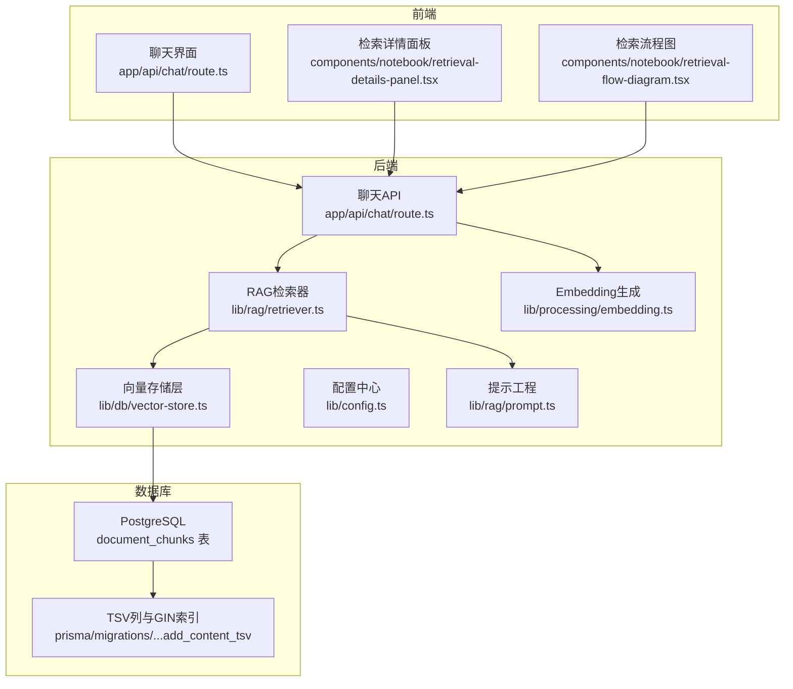
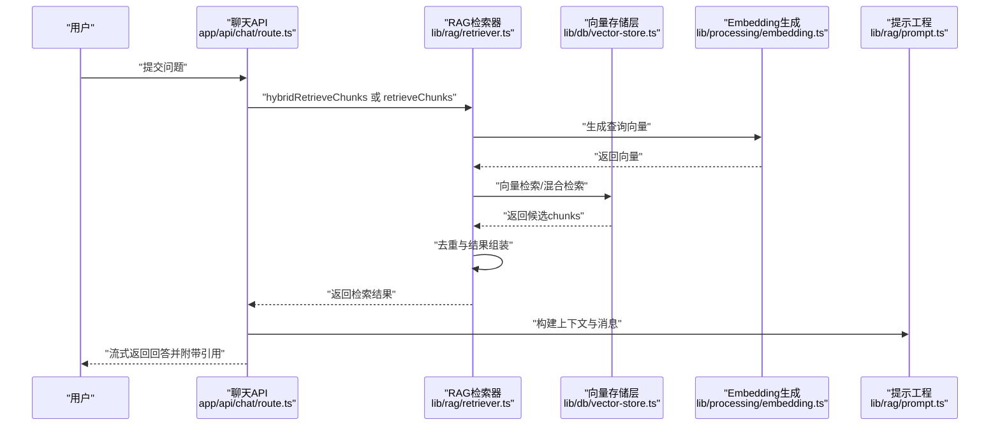
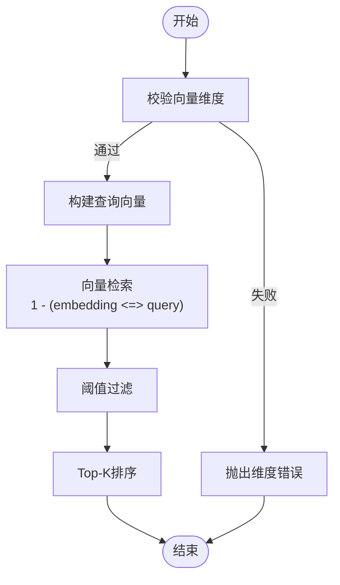
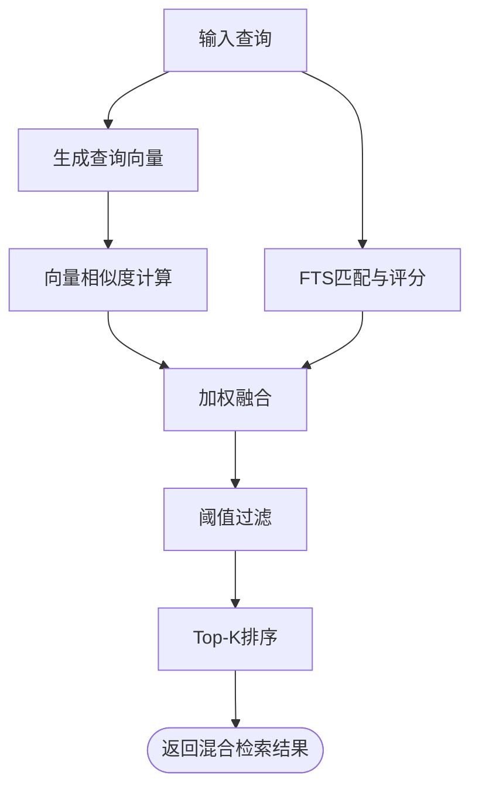
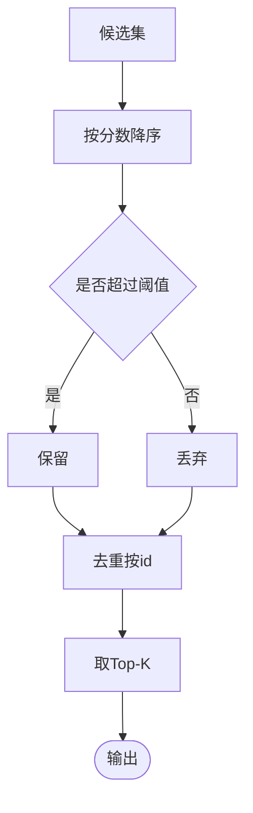
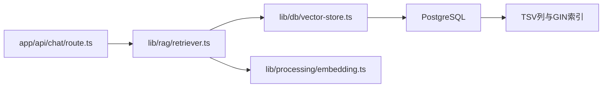

# 检索算法实现

<cite>
**本文档引用的文件**
- [lib/rag/retriever.ts](file://lib/rag/retriever.ts)
- [lib/db/vector-store.ts](file://lib/db/vector-store.ts)
- [lib/processing/embedding.ts](file://lib/processing/embedding.ts)
- [lib/config.ts](file://lib/config.ts)
- [app/api/chat/route.ts](file://app/api/chat/route.ts)
- [lib/rag/prompt.ts](file://lib/rag/prompt.ts)
- [components/notebook/retrieval-details-panel.tsx](file://components/notebook/retrieval-details-panel.tsx)
- [components/notebook/retrieval-flow-diagram.tsx](file://components/notebook/retrieval-flow-diagram.tsx)
- [prisma/migrations/20260120050505_add_content_tsv/migration.sql](file://prisma/migrations/20260120050505_add_content_tsv/migration.sql)
</cite>

## 目录
1. [简介](#简介)
2. [项目结构](#项目结构)
3. [核心组件](#核心组件)
4. [架构总览](#架构总览)
5. [详细组件分析](#详细组件分析)
6. [依赖关系分析](#依赖关系分析)
7. [性能考量](#性能考量)
8. [故障排查指南](#故障排查指南)
9. [结论](#结论)
10. [附录](#附录)

## 简介
本文件面向检索算法实现，围绕相似度搜索与混合检索展开，覆盖余弦相似度、欧几里得距离与点积相似度的计算方法，混合检索的权重分配策略，以及排序、过滤与Top-K选择机制。同时提供性能优化建议、参数调优方法、评估指标与A/B测试思路，并讨论分布式扩展与负载均衡策略。

## 项目结构
该仓库采用前后端同构的Next.js应用结构，检索能力主要由RAG模块与向量存储层协作完成：
- RAG检索器负责检索入口、参数控制、结果后处理与去重
- 向量存储层封装pgvector与PostgreSQL全文检索（FTS），提供向量相似度与混合检索
- Embedding生成模块负责文本向量化，包含重试与批处理
- API层在聊天接口中串联检索、提示工程与流式生成
- 前端组件展示检索流程与结果细节

图表来源
- [app/api/chat/route.ts](file://app/api/chat/route.ts#L25-L96)
- [lib/rag/retriever.ts](file://lib/rag/retriever.ts#L53-L116)
- [lib/db/vector-store.ts](file://lib/db/vector-store.ts#L312-L442)
- [lib/processing/embedding.ts](file://lib/processing/embedding.ts#L140-L188)
- [lib/rag/prompt.ts](file://lib/rag/prompt.ts#L37-L88)
- [prisma/migrations/20260120050505_add_content_tsv/migration.sql](file://prisma/migrations/20260120050505_add_content_tsv/migration.sql#L1-L7)

章节来源
- [app/api/chat/route.ts](file://app/api/chat/route.ts#L25-L96)
- [lib/rag/retriever.ts](file://lib/rag/retriever.ts#L53-L116)
- [lib/db/vector-store.ts](file://lib/db/vector-store.ts#L312-L442)
- [lib/processing/embedding.ts](file://lib/processing/embedding.ts#L140-L188)
- [lib/rag/prompt.ts](file://lib/rag/prompt.ts#L37-L88)
- [prisma/migrations/20260120050505_add_content_tsv/migration.sql](file://prisma/migrations/20260120050505_add_content_tsv/migration.sql#L1-L7)

## 核心组件
- RAG检索器：提供向量检索与混合检索入口，统一返回结构，包含去重与结果组装
- 向量存储层：封装pgvector相似度查询与PostgreSQL全文检索（FTS），支持向量与FTS联合打分
- Embedding生成：批量生成向量，内置指数退避重试与维度校验
- 提示工程：根据检索结果构造上下文与消息序列
- API集成：在聊天API中串行检索、去重、引用构建与流式生成

章节来源
- [lib/rag/retriever.ts](file://lib/rag/retriever.ts#L6-L51)
- [lib/db/vector-store.ts](file://lib/db/vector-store.ts#L24-L75)
- [lib/processing/embedding.ts](file://lib/processing/embedding.ts#L140-L188)
- [lib/rag/prompt.ts](file://lib/rag/prompt.ts#L37-L88)
- [app/api/chat/route.ts](file://app/api/chat/route.ts#L79-L96)

## 架构总览
检索链路分为“向量化”和“检索”两阶段，最终进入提示工程与生成：
- 向量化：将查询文本转为向量，用于向量相似度检索
- 检索：向量检索或混合检索（向量+FTS），按阈值与Top-K过滤
- 结果处理：去重、引用构建、上下文组装
- 生成：流式调用大模型生成回答

图表来源
- [app/api/chat/route.ts](file://app/api/chat/route.ts#L79-L96)
- [lib/rag/retriever.ts](file://lib/rag/retriever.ts#L131-L206)
- [lib/db/vector-store.ts](file://lib/db/vector-store.ts#L312-L442)
- [lib/processing/embedding.ts](file://lib/processing/embedding.ts#L140-L188)
- [lib/rag/prompt.ts](file://lib/rag/prompt.ts#L166-L170)

## 详细组件分析

### 相似度搜索算法实现
- 余弦相似度：通过pgvector的向量内积与范数归一化等价于余弦相似度，检索器中以“1 - (embedding <=> query)”近似实现
- 欧几里得距离：可由“1 - exp(-k·||a−b||²)”近似转换为相似度，但当前实现未直接使用
- 点积相似度：在向量检索中直接使用向量内积作为相似度，便于与FTS分数线性融合

图表来源
- [lib/db/vector-store.ts](file://lib/db/vector-store.ts#L198-L202)
- [lib/db/vector-store.ts](file://lib/db/vector-store.ts#L224-L251)
- [lib/config.ts](file://lib/config.ts#L7-L29)

章节来源
- [lib/db/vector-store.ts](file://lib/db/vector-store.ts#L198-L202)
- [lib/db/vector-store.ts](file://lib/db/vector-store.ts#L224-L251)
- [lib/config.ts](file://lib/config.ts#L7-L29)

### 混合检索算法设计
混合检索结合向量相似度与全文检索（FTS）：
- 向量分数：使用pgvector内积近似的余弦相似度
- FTS分数：使用PostgreSQL ts_rank对查询进行全文匹配
- 组合分数：加权求和，权重由配置决定；当任一分数超过阈值即被保留
- 过滤与排序：先按组合分数降序，再取Top-K

图表来源
- [lib/rag/retriever.ts](file://lib/rag/retriever.ts#L157-L166)
- [lib/db/vector-store.ts](file://lib/db/vector-store.ts#L363-L396)
- [lib/db/vector-store.ts](file://lib/db/vector-store.ts#L398-L429)

章节来源
- [lib/rag/retriever.ts](file://lib/rag/retriever.ts#L157-L166)
- [lib/db/vector-store.ts](file://lib/db/vector-store.ts#L363-L396)
- [lib/db/vector-store.ts](file://lib/db/vector-store.ts#L398-L429)

### 检索结果排序与过滤机制
- 阈值设置：向量检索默认阈值为0，混合检索默认阈值为较小值，确保FTS能补充弱语义匹配
- Top-K选择：统一按分数降序取Top-K
- 过滤策略：按来源过滤、按阈值过滤、按唯一性去重
- 去重逻辑：基于chunk id去重，避免重复片段影响上下文质量

图表来源
- [lib/db/vector-store.ts](file://lib/db/vector-store.ts#L230-L233)
- [lib/db/vector-store.ts](file://lib/db/vector-store.ts#L393-L396)
- [lib/rag/retriever.ts](file://lib/rag/retriever.ts#L118-L125)

章节来源
- [lib/db/vector-store.ts](file://lib/db/vector-store.ts#L230-L233)
- [lib/db/vector-store.ts](file://lib/db/vector-store.ts#L393-L396)
- [lib/rag/retriever.ts](file://lib/rag/retriever.ts#L118-L125)

### 检索参数与配置
- RAG配置：包含Top-K、相似度阈值、最大上下文tokens、是否启用混合检索及向量与FTS权重
- 系统级配置：向量维度锁定为1024维，确保与pgvector与Embedding模型一致
- API层参数：支持按notebookId与sourceIds限定检索范围，支持动态调整Top-K与阈值

章节来源
- [lib/rag/retriever.ts](file://lib/rag/retriever.ts#L6-L13)
- [lib/config.ts](file://lib/config.ts#L7-L29)
- [app/api/chat/route.ts](file://app/api/chat/route.ts#L39-L42)

### Embedding生成与重试机制
- 批量处理：按批次大小分批调用Embedding API，降低单次请求压力
- 指数退避：对特定HTTP状态码自动重试，避免瞬时服务波动影响
- 维度校验：严格校验返回向量维度，防止后续检索异常
- 去重优化：基于内容哈希跳过已存在chunk，减少重复向量化

章节来源
- [lib/processing/embedding.ts](file://lib/processing/embedding.ts#L140-L188)
- [lib/processing/embedding.ts](file://lib/processing/embedding.ts#L72-L110)
- [lib/processing/embedding.ts](file://lib/processing/embedding.ts#L115-L134)

### 提示工程与引用构建
- 上下文组装：将检索到的chunks按编号组织，包含来源信息与相似度
- 引用去重：按内容前100字符去重，保留相似度更高的片段
- 消息序列：拼接系统提示、历史对话与当前问题，形成完整提示

章节来源
- [lib/rag/prompt.ts](file://lib/rag/prompt.ts#L37-L57)
- [lib/rag/prompt.ts](file://lib/rag/prompt.ts#L112-L148)

### 前端可视化与调试
- 检索详情面板：展示检索参数、结果数量、流程图与计时信息
- 流程图组件：直观呈现“问题—向量化—混合检索—召回片段—生成回答”的时序

章节来源
- [components/notebook/retrieval-details-panel.tsx](file://components/notebook/retrieval-details-panel.tsx#L42-L157)
- [components/notebook/retrieval-flow-diagram.tsx](file://components/notebook/retrieval-flow-diagram.tsx#L16-L51)

## 依赖关系分析
- 检索器依赖向量存储层与Embedding模块，返回统一结构供上层消费
- API层在聊天流程中并行执行用户消息保存与检索，提升端到端吞吐
- 数据库层通过TSV列与GIN索引支撑FTS，配合pgvector实现混合检索

图表来源
- [app/api/chat/route.ts](file://app/api/chat/route.ts#L79-L96)
- [lib/rag/retriever.ts](file://lib/rag/retriever.ts#L53-L116)
- [lib/db/vector-store.ts](file://lib/db/vector-store.ts#L312-L442)
- [prisma/migrations/20260120050505_add_content_tsv/migration.sql](file://prisma/migrations/20260120050505_add_content_tsv/migration.sql#L1-L7)

章节来源
- [app/api/chat/route.ts](file://app/api/chat/route.ts#L79-L96)
- [lib/rag/retriever.ts](file://lib/rag/retriever.ts#L53-L116)
- [lib/db/vector-store.ts](file://lib/db/vector-store.ts#L312-L442)
- [prisma/migrations/20260120050505_add_content_tsv/migration.sql](file://prisma/migrations/20260120050505_add_content_tsv/migration.sql#L1-L7)

## 性能考量
- 索引与查询优化
  - pgvector向量索引：确保向量维度与配置一致，避免额外转换开销
  - FTS列与GIN索引：加速全文检索，降低混合检索中的FTS成本
- 批处理与重试
  - Embedding批处理与指数退避，提升吞吐并增强稳定性
- 并行化
  - API层并行保存消息与检索，缩短端到端延迟
- 缓存策略
  - 查询缓存：对热点问题的检索结果与向量可做短期缓存（需注意数据更新一致性）
  - 向量缓存：对长文档分块的向量可持久化，避免重复生成
- 资源隔离
  - 按notebookId与sourceIds缩小检索范围，减少扫描与连接成本

章节来源
- [lib/db/vector-store.ts](file://lib/db/vector-store.ts#L105-L140)
- [lib/processing/embedding.ts](file://lib/processing/embedding.ts#L140-L188)
- [app/api/chat/route.ts](file://app/api/chat/route.ts#L70-L96)
- [prisma/migrations/20260120050505_add_content_tsv/migration.sql](file://prisma/migrations/20260120050505_add_content_tsv/migration.sql#L1-L7)

## 故障排查指南
- 维度不匹配
  - 现象：向量维度与配置不一致导致运行时错误
  - 处理：核对EMBEDDING_DIM与Embedding模型维度，确保二者一致
- API错误与重试
  - 现象：Embedding API返回特定HTTP状态码
  - 处理：检查网络与鉴权，系统已内置指数退避重试
- 检索无证据
  - 现象：无召回片段
  - 处理：降低阈值、扩大sourceIds范围、检查FTS索引是否生效
- 前端展示异常
  - 现象：检索详情不显示或计时不准确
  - 处理：确认API返回的retrievalDetails字段完整，检查前端组件props传递

章节来源
- [lib/config.ts](file://lib/config.ts#L17-L29)
- [lib/processing/embedding.ts](file://lib/processing/embedding.ts#L72-L110)
- [app/api/chat/route.ts](file://app/api/chat/route.ts#L129-L158)
- [components/notebook/retrieval-details-panel.tsx](file://components/notebook/retrieval-details-panel.tsx#L42-L157)

## 结论
本实现以pgvector为核心，结合PostgreSQL FTS，提供了高效稳定的混合检索方案。通过严格的维度校验、批处理与重试机制、并行化与索引优化，系统在准确性与性能之间取得良好平衡。建议在生产环境中持续监控检索命中率、平均延迟与FTS覆盖率，并基于业务反馈迭代阈值与权重。

## 附录

### 参数调优方法
- 相似度阈值：从混合检索默认阈值开始，逐步下调以提升召回率，同时观察下游生成质量
- Top-K：在保证上下文长度不超过限制的前提下，适度增加Top-K以提升覆盖
- 权重分配：向量权重过高易引入噪声，FTS权重过低影响关键词召回，建议A/B测试不同组合
- 召回率与精确率：通过离线评估（如MRR、Precision@K）与在线A/B测试（对比命中率、用户满意度）确定最优参数

### 评估指标与A/B测试
- 离线指标
  - MRR（Mean Reciprocal Rank）：衡量首个相关片段的排名
  - Precision@K：前K个结果中相关片段的比例
  - Recall@K：相关片段被召回的比例
- 在线指标
  - 检索命中率、平均检索时间、用户点击引用率、任务完成率
- A/B测试
  - 对比组：纯向量检索、混合检索（不同权重）、仅FTS
  - 样本：随机抽样用户会话，保证统计显著性

### 分布式扩展与负载均衡
- 数据层
  - 使用PostgreSQL主从或读副本，分离写入与读取流量
  - 对FTS与向量索引进行分区或分片（按notebookId）
- 服务层
  - API网关限流与熔断，避免Embedding与LLM上游抖动影响
  - 检索服务独立部署，支持水平扩展
- 缓存层
  - 检索结果与向量短期缓存，结合版本号或时间戳失效策略
- 负载均衡
  - 基于会话亲和或轮询策略，结合健康检查与自动扩缩容