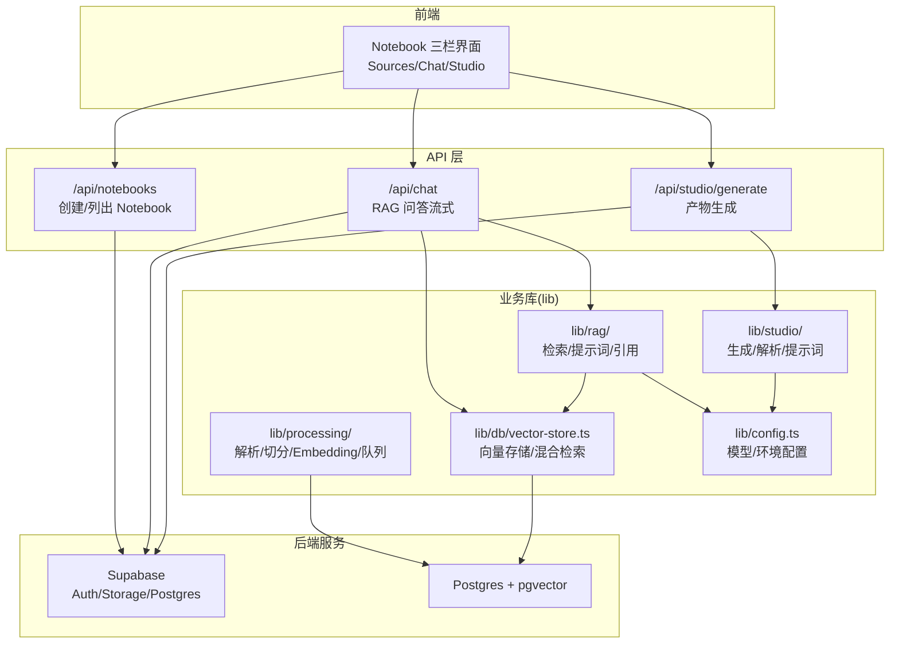
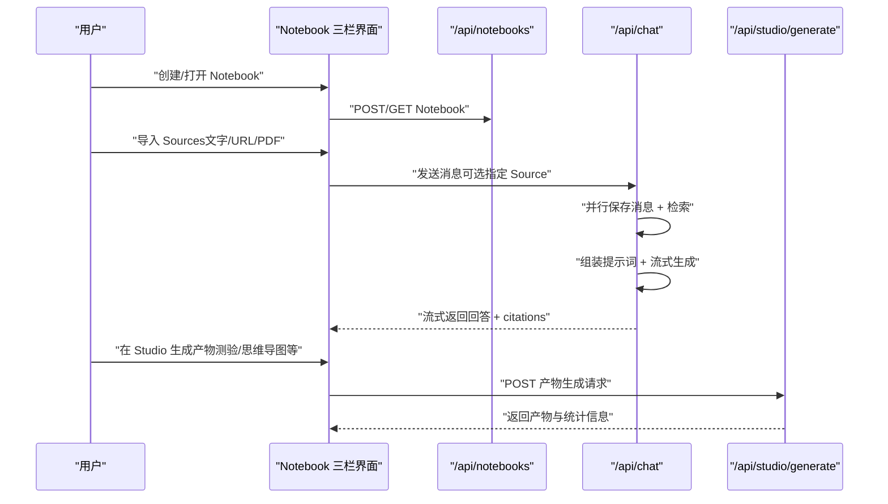
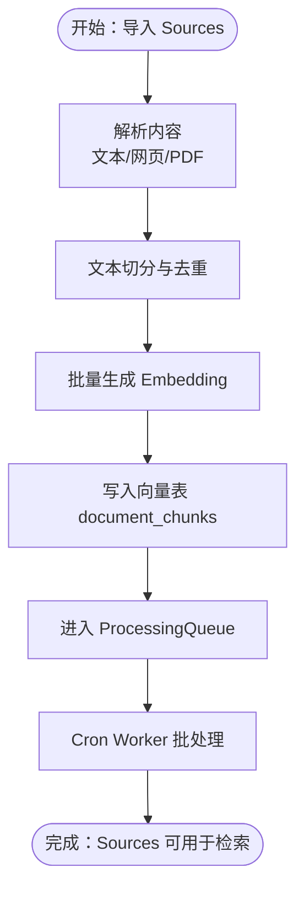
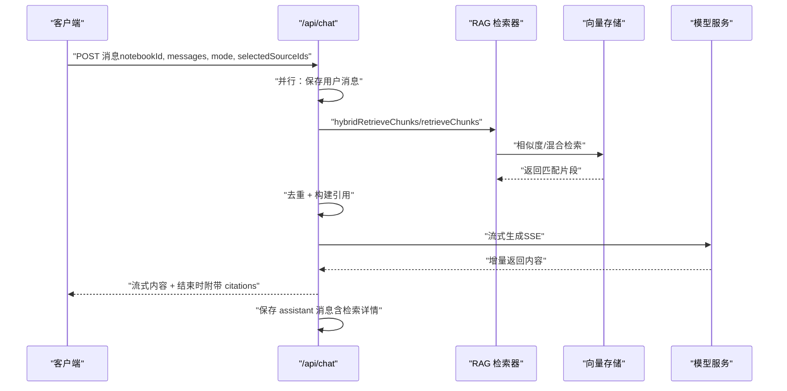
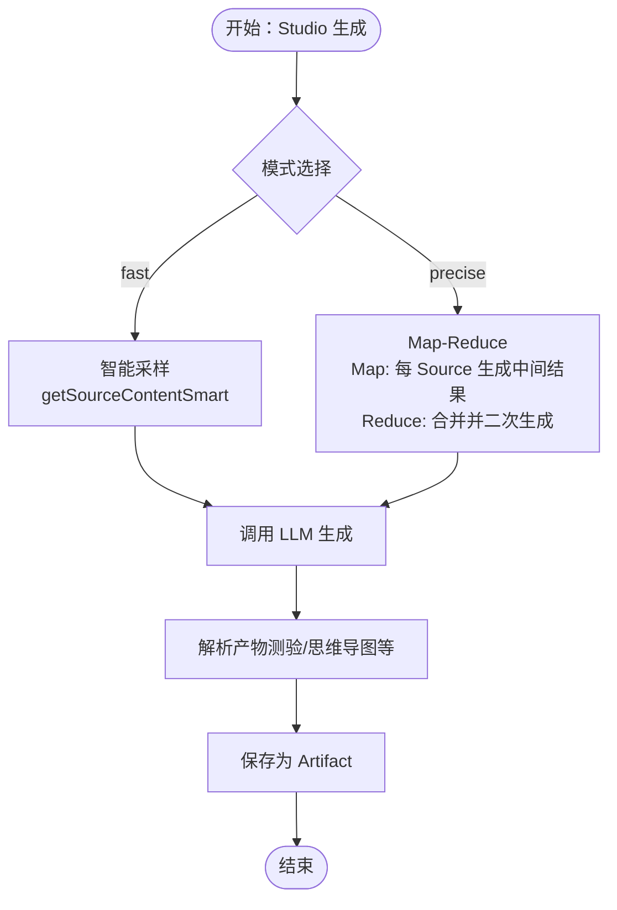
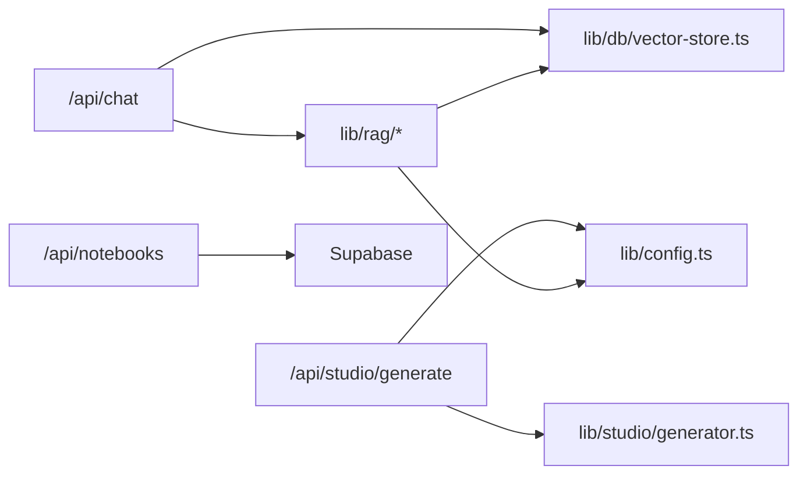

# 核心功能

<cite>
**本文引用的文件**
- [README.md](file://README.md)
- [package.json](file://package.json)
- [lib/config.ts](file://lib/config.ts)
- [lib/db/vector-store.ts](file://lib/db/vector-store.ts)
- [lib/rag/index.ts](file://lib/rag/index.ts)
- [lib/rag/retriever.ts](file://lib/rag/retriever.ts)
- [lib/rag/prompt.ts](file://lib/rag/prompt.ts)
- [lib/studio/index.ts](file://lib/studio/index.ts)
- [lib/studio/generator.ts](file://lib/studio/generator.ts)
- [lib/processing/index.ts](file://lib/processing/index.ts)
- [app/api/notebooks/route.ts](file://app/api/notebooks/route.ts)
- [app/api/chat/route.ts](file://app/api/chat/route.ts)
- [app/api/studio/generate/route.ts](file://app/api/studio/generate/route.ts)
- [components/notebook/notebook-content.tsx](file://components/notebook/notebook-content.tsx)
</cite>

## 目录
1. [简介](#简介)
2. [项目结构](#项目结构)
3. [核心组件](#核心组件)
4. [架构总览](#架构总览)
5. [详细组件分析](#详细组件分析)
6. [依赖分析](#依赖分析)
7. [性能考虑](#性能考虑)
8. [故障排查指南](#故障排查指南)
9. [结论](#结论)
10. [附录](#附录)

## 简介
本项目是一个个人/团队知识库原型，提供五大核心功能模块：
- Notebook 管理：创建、列表、删除、最近打开
- Sources 知识源导入：文字粘贴、URL 导入（网页抓取/解析，含 PDF 链接识别）、PDF 文件上传
- 处理与索引：文本切分、去重、批量 Embedding、写入 pgvector 向量表、ProcessingQueue 队列与 Cron Worker 处理
- Chat RAG 问答：基于向量/混合检索的问答、流式输出、每条 AI 回复携带 citations、支持查看检索链路详情
- Studio 产物生成：fast/precise 两种策略（采样/Map-Reduce）、生成结构化产物（JSON/Markdown）、支持模板运行并保存为 Artifact

这些模块围绕“知识导入—向量化索引—RAG 检索—流式问答—产物生成”的主流程协同工作，形成闭环的知识处理与应用体系。

## 项目结构
项目采用 Next.js App Router + React 18 + TypeScript 的前端架构，配合 Supabase（Auth/Storage/Postgres）、Prisma、pgvector 实现后端能力；核心代码分布在 app/、components/、lib/ 三个目录下，分别承载页面与 API 路由、UI 组件、业务库（处理/检索/生成/数据库）。

图表来源
- [components/notebook/notebook-content.tsx](file://components/notebook/notebook-content.tsx#L85-L127)
- [app/api/notebooks/route.ts](file://app/api/notebooks/route.ts#L1-L67)
- [app/api/chat/route.ts](file://app/api/chat/route.ts#L1-L324)
- [app/api/studio/generate/route.ts](file://app/api/studio/generate/route.ts#L1-L145)
- [lib/rag/retriever.ts](file://lib/rag/retriever.ts#L1-L206)
- [lib/db/vector-store.ts](file://lib/db/vector-store.ts#L1-L446)
- [lib/studio/generator.ts](file://lib/studio/generator.ts#L1-L311)
- [lib/config.ts](file://lib/config.ts#L1-L187)

章节来源
- [README.md](file://README.md#L42-L49)
- [package.json](file://package.json#L17-L64)

## 核心组件
- Notebook 管理：通过 API 路由提供创建与列表能力，结合 Supabase 认证保障所有权。
- Sources 导入与处理：统一入口调用处理模块，完成解析、切分、去重、Embedding、入库与队列调度。
- 向量检索与提示词：封装检索器与提示词组装，支持向量/混合检索与引用生成。
- Chat RAG 问答：并行保存用户消息与检索，流式返回 AI 回复并附加 citations。
- Studio 产物生成：提供 fast/precise 两种策略，支持模板与结构化产物解析。

章节来源
- [app/api/notebooks/route.ts](file://app/api/notebooks/route.ts#L11-L66)
- [lib/processing/index.ts](file://lib/processing/index.ts#L1-L51)
- [lib/rag/index.ts](file://lib/rag/index.ts#L1-L24)
- [lib/rag/retriever.ts](file://lib/rag/retriever.ts#L53-L206)
- [lib/rag/prompt.ts](file://lib/rag/prompt.ts#L1-L149)
- [app/api/chat/route.ts](file://app/api/chat/route.ts#L25-L324)
- [lib/studio/index.ts](file://lib/studio/index.ts#L1-L25)
- [lib/studio/generator.ts](file://lib/studio/generator.ts#L242-L311)
- [app/api/studio/generate/route.ts](file://app/api/studio/generate/route.ts#L12-L144)

## 架构总览
整体流程：用户在 Notebook 页面中导入 Sources，系统异步处理并写入向量库；随后在 Chat 中进行 RAG 检索与流式问答，并在 Studio 中生成结构化产物。各模块通过 API 路由与业务库协作，数据持久化依赖 Supabase/Postgres，向量检索依赖 pgvector。

图表来源
- [components/notebook/notebook-content.tsx](file://components/notebook/notebook-content.tsx#L85-L127)
- [app/api/notebooks/route.ts](file://app/api/notebooks/route.ts#L11-L66)
- [app/api/chat/route.ts](file://app/api/chat/route.ts#L70-L324)
- [app/api/studio/generate/route.ts](file://app/api/studio/generate/route.ts#L12-L144)

## 详细组件分析

### Notebook 管理
- 功能特性
  - 创建 Notebook：校验登录状态，接收标题并创建记录。
  - 列出 Notebook：按最后打开时间倒序返回当前用户的 Notebook 列表，并包含资源与消息计数。
- 使用场景
  - 新用户首次使用时创建个人知识库；团队成员在共享空间内管理各自知识库。
- 技术实现
  - 使用 Supabase SSR 客户端获取当前用户 ID，Prisma ORM 操作数据库。
- 最佳实践
  - 为每个知识域建立独立 Notebook，便于后续按主题检索与产物生成。

章节来源
- [app/api/notebooks/route.ts](file://app/api/notebooks/route.ts#L11-L66)

### Sources 知识源导入、处理与索引
- 功能特性
  - 支持文字粘贴、URL 导入（自动识别 PDF 链接）、PDF 文件上传（依赖 Supabase Storage）。
  - 文本切分、去重、批量 Embedding、写入 pgvector 向量表 document_chunks。
  - ProcessingQueue 队列与 Cron Worker 处理，支持鉴权触发。
- 使用场景
  - 快速整理网页资料、学术论文、报告文档；批量导入多个来源以提升检索覆盖度。
- 技术实现
  - 处理模块导出统一接口：文本切分、PDF/网页解析、Embedding 生成、主处理流程与清理。
  - 向量存储封装批量插入、相似度检索、混合检索（向量 + FTS），并记录日志。
- 最佳实践
  - 优先使用高质量原文（去除广告、导航等噪声）；合理设置切分粒度以平衡检索精度与上下文长度。

图表来源
- [lib/processing/index.ts](file://lib/processing/index.ts#L1-L51)
- [lib/db/vector-store.ts](file://lib/db/vector-store.ts#L77-L173)

章节来源
- [README.md](file://README.md#L8-L16)
- [lib/processing/index.ts](file://lib/processing/index.ts#L1-L51)
- [lib/db/vector-store.ts](file://lib/db/vector-store.ts#L77-L446)
- [README.md](file://README.md#L124-L131)

### Chat RAG 问答
- 功能特性
  - 基于向量/混合检索的问答，支持流式输出。
  - 每条 AI 回复携带 citations，无依据时返回“未找到依据”。
  - 支持查看检索链路详情（query、topK、分数、耗时等）。
- 使用场景
  - 快速从多来源资料中提炼答案；需要引用出处时进行溯源。
- 技术实现
  - 并行保存用户消息与检索，检索支持向量/混合检索，提示词组装包含上下文与历史对话，流式返回通过 SSE 实现。
  - 引用生成包含去重与内容截断，确保引用可读性与准确性。
- 最佳实践
  - 限定检索范围（仅选择相关 Source）以提升检索质量；在复杂问题中适当增加检索 topK。

图表来源
- [app/api/chat/route.ts](file://app/api/chat/route.ts#L70-L324)
- [lib/rag/retriever.ts](file://lib/rag/retriever.ts#L53-L206)
- [lib/rag/prompt.ts](file://lib/rag/prompt.ts#L37-L88)
- [lib/db/vector-store.ts](file://lib/db/vector-store.ts#L175-L442)

章节来源
- [README.md](file://README.md#L16-L21)
- [app/api/chat/route.ts](file://app/api/chat/route.ts#L25-L324)
- [lib/rag/retriever.ts](file://lib/rag/retriever.ts#L1-L206)
- [lib/rag/prompt.ts](file://lib/rag/prompt.ts#L1-L149)
- [lib/db/vector-store.ts](file://lib/db/vector-store.ts#L1-L446)

### Studio 产物生成
- 功能特性
  - fast 策略：智能采样，快速生成；precise 策略：Map-Reduce，更全面整合。
  - 生成结构化产物（JSON/Markdown），支持解析与容错。
  - 支持基于模板运行并保存为 Artifact。
- 使用场景
  - 自动生成测验、思维导图、摘要、大纲等结构化产物，辅助复习与知识沉淀。
- 技术实现
  - 统一生成入口，根据模式选择 fast/precise；fast 使用智能采样，precise 使用 Map-Reduce；支持模板变量替换；结果解析与容错。
- 最佳实践
  - 对长文档优先使用 precise 模式；对时效性强的场景使用 fast 模式；合理设置 Source 范围以控制上下文大小。

图表来源
- [lib/studio/generator.ts](file://lib/studio/generator.ts#L118-L311)
- [lib/studio/index.ts](file://lib/studio/index.ts#L1-L25)

章节来源
- [README.md](file://README.md#L21-L25)
- [app/api/studio/generate/route.ts](file://app/api/studio/generate/route.ts#L12-L144)
- [lib/studio/generator.ts](file://lib/studio/generator.ts#L1-L311)
- [lib/studio/index.ts](file://lib/studio/index.ts#L1-L25)

### 检索与提示词组装（RAG）
- 功能特性
  - 向量检索与混合检索（向量 + 关键词/FTS），支持权重组合与阈值过滤。
  - 提示词组装包含系统提示、历史对话、上下文与问题，引用生成支持去重与内容截断。
- 使用场景
  - 需要高召回与高精度兼顾的问答场景；需要清晰的引用溯源。
- 技术实现
  - 检索器封装向量/混合检索，返回标准化的 RetrievedChunk；提示词模块负责上下文拼接与引用构建。
- 最佳实践
  - 合理设置 topK 与阈值；在混合检索中平衡向量与关键词权重；对 PDF 等多页内容注意页码信息的展示。

章节来源
- [lib/rag/retriever.ts](file://lib/rag/retriever.ts#L1-L206)
- [lib/rag/prompt.ts](file://lib/rag/prompt.ts#L1-L149)
- [lib/db/vector-store.ts](file://lib/db/vector-store.ts#L312-L442)

## 依赖分析
- 组件耦合
  - Chat API 依赖 RAG 模块与向量存储；Studio API 依赖 Studio 模块与配置；Notebook API 依赖 Supabase 认证。
- 外部依赖
  - Supabase（认证、存储、数据库）、Prisma（ORM/迁移）、pgvector（向量检索）、模型服务（智谱/LongCat OpenAI 兼容接口）。
- 潜在循环依赖
  - 当前模块边界清晰，未发现循环依赖迹象。

图表来源
- [app/api/chat/route.ts](file://app/api/chat/route.ts#L10-L21)
- [app/api/studio/generate/route.ts](file://app/api/studio/generate/route.ts#L8-L11)
- [app/api/notebooks/route.ts](file://app/api/notebooks/route.ts#L7-L9)
- [lib/rag/index.ts](file://lib/rag/index.ts#L1-L24)
- [lib/studio/index.ts](file://lib/studio/index.ts#L1-L25)
- [lib/config.ts](file://lib/config.ts#L1-L187)
- [lib/db/vector-store.ts](file://lib/db/vector-store.ts#L1-L446)

章节来源
- [package.json](file://package.json#L17-L64)

## 性能考虑
- 检索性能
  - 向量检索使用 CTE 与 HNSW 索引，SQL 层面避免重复计算；混合检索结合 FTS 与向量评分，合理设置权重与阈值。
- 写入性能
  - 向量存储批量插入，分批处理（默认 500 条/批），减少事务开销与网络往返。
- 生成性能
  - Studio fast 模式适合快速产出；precise 模式通过 Map-Reduce 更全面整合，但耗时较长；合理设置超时与上下文长度。
- 流式输出
  - Chat 采用 SSE 流式传输，前端可即时渲染；注意在 Serverless 环境下的超时与内存限制。

章节来源
- [lib/db/vector-store.ts](file://lib/db/vector-store.ts#L77-L173)
- [lib/db/vector-store.ts](file://lib/db/vector-store.ts#L175-L442)
- [lib/studio/generator.ts](file://lib/studio/generator.ts#L23-L34)
- [app/api/chat/route.ts](file://app/api/chat/route.ts#L22-L24)

## 故障排查指南
- 环境变量缺失
  - 缺少必需变量会导致启动失败或运行时报错，需检查 .env.local 配置。
- 向量维度不一致
  - 系统严格校验 EMBEDDING_DIM，必须与数据库向量维度一致，否则抛出错误。
- 模型配置错误
  - 模型提供商与模型名需与配置一致，否则提示无效或无法调用。
- 生成超时/失败
  - Studio 生成可能因超时或 LLM 返回为空而失败，需检查网络与模型服务状态。
- 权限不足
  - Notebook 或 Studio 请求需通过 Supabase 认证，且需为拥有者才可访问。

章节来源
- [lib/config.ts](file://lib/config.ts#L169-L187)
- [lib/config.ts](file://lib/config.ts#L6-L29)
- [app/api/studio/generate/route.ts](file://app/api/studio/generate/route.ts#L113-L144)
- [app/api/chat/route.ts](file://app/api/chat/route.ts#L35-L60)

## 结论
本项目围绕“知识导入—向量化索引—RAG 检索—流式问答—产物生成”的完整链路，提供了可扩展、可维护的知识库原型能力。通过严格的配置校验、向量检索优化与流式输出设计，满足了从资料整理到问答溯源再到结构化产物生成的多样化需求。建议在生产环境中进一步完善队列监控、错误重试与缓存策略，以提升稳定性与用户体验。

## 附录
- 快速开始与常用命令参见项目自述文件。
- 处理队列与 Cron Worker 的鉴权与触发方式参见项目自述文件。

章节来源
- [README.md](file://README.md#L51-L123)
- [README.md](file://README.md#L124-L141)