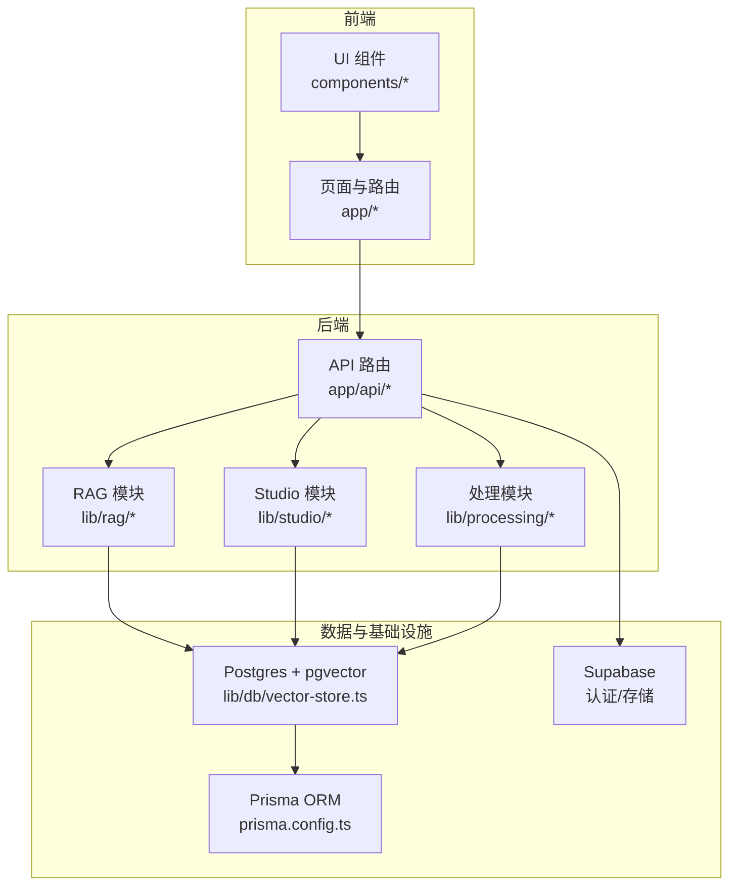
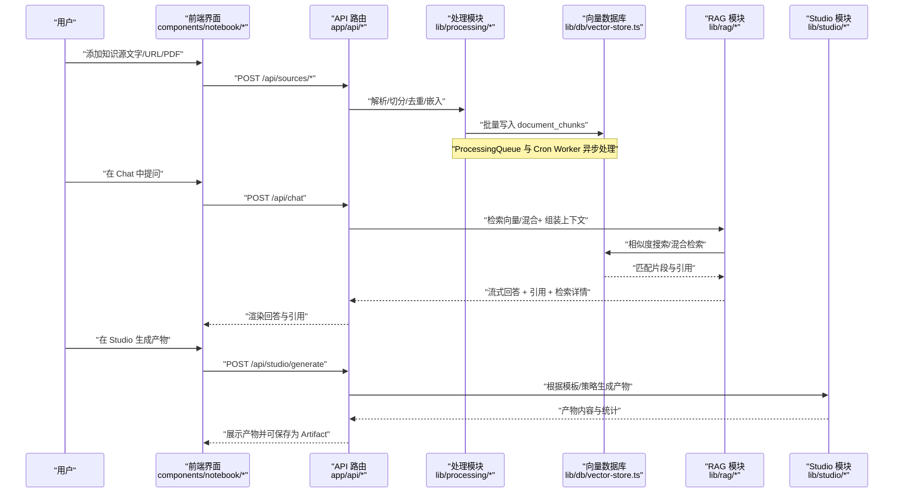
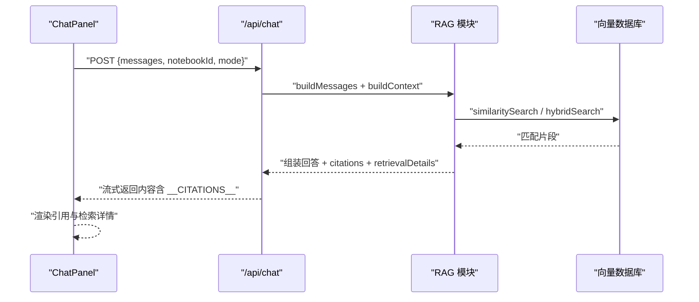
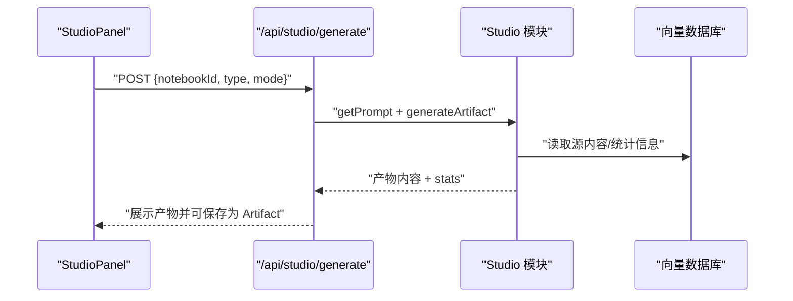
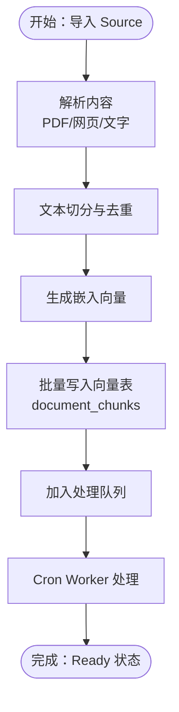
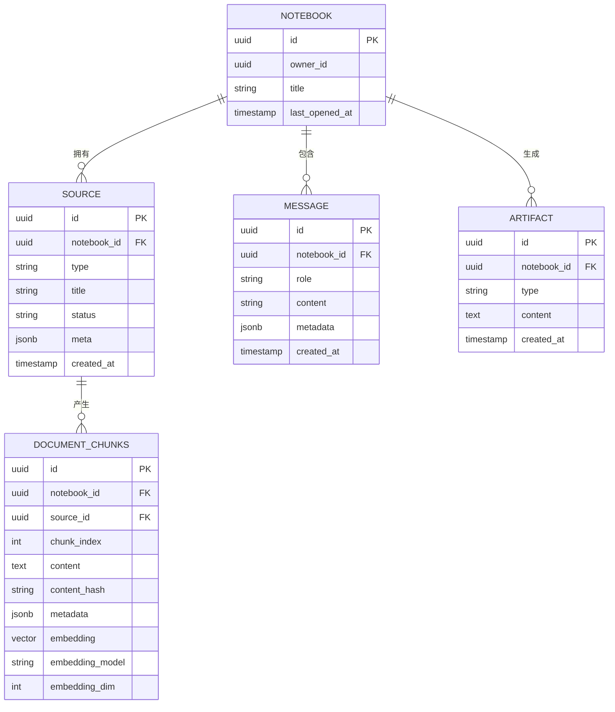
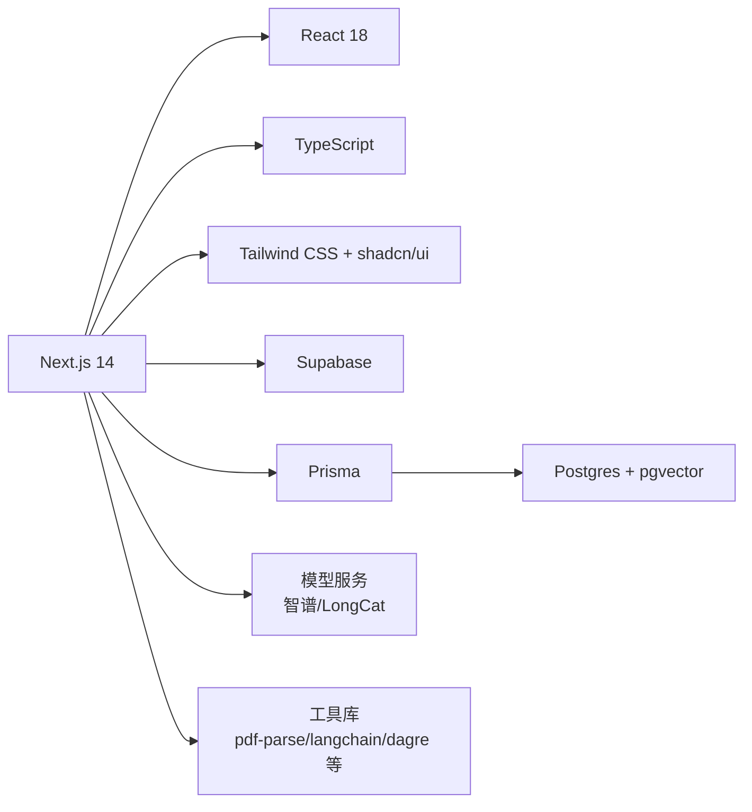

# 项目介绍

<cite>
**本文引用的文件**
- [README.md](file://README.md)
- [package.json](file://package.json)
- [app/page.tsx](file://app/page.tsx)
- [lib/config.ts](file://lib/config.ts)
- [lib/rag/index.ts](file://lib/rag/index.ts)
- [lib/studio/index.ts](file://lib/studio/index.ts)
- [lib/processing/index.ts](file://lib/processing/index.ts)
- [components/notebook/notebook-content.tsx](file://components/notebook/notebook-content.tsx)
- [components/notebook/chat-panel.tsx](file://components/notebook/chat-panel.tsx)
- [components/notebook/studio-panel.tsx](file://components/notebook/studio-panel.tsx)
- [lib/db/vector-store.ts](file://lib/db/vector-store.ts)
- [prisma.config.ts](file://prisma.config.ts)
- [app/api/notebooks/route.ts](file://app/api/notebooks/route.ts)
</cite>

## 目录
1. [简介](#简介)
2. [项目结构](#项目结构)
3. [核心组件](#核心组件)
4. [架构总览](#架构总览)
5. [详细组件分析](#详细组件分析)
6. [依赖关系分析](#依赖关系分析)
7. [性能考量](#性能考量)
8. [故障排查指南](#故障排查指南)
9. [结论](#结论)
10. [附录](#附录)

## 简介
Personal NotebookLM 是一个类似 NotebookLM 的个人/团队知识库管理原型产品，专注于“知识导入—向量化—RAG 对话—结构化产物生成”的闭环体验。它允许用户将多种来源（文字、URL、PDF）导入到 Notebook，经过解析、切分、去重与嵌入，写入向量数据库；随后在同一 Notebook 内进行基于证据的对话（带引用），并在 Studio 中一键生成大纲、测验、思维导图等结构化产物。

- 核心价值主张
  - 提升知识管理效率：统一入口管理多源资料，结构化组织与检索。
  - 支持智能问答：基于证据的 RAG 对话，每条回答可溯源。
  - 生成结构化学习材料：一键产出学习清单、测验、思维导图等，辅助复习与沉淀。

- 主要应用场景
  - 学生：整理课堂讲义、论文、网课资料，快速问答巩固知识点。
  - 研究人员：聚合文献、报告、实验记录，进行跨文档检索与问答。
  - 企业团队：沉淀项目文档、FAQ、培训材料，支持团队协作与知识传承。

- 与现有方案的区别与优势
  - 一体化工作流：从导入到向量化、RAG 对话、产物生成，端到端闭环。
  - 可追溯性：每条 AI 回答附带引用来源，支持查看检索链路详情。
  - 多模态输入：支持文字粘贴、URL 抓取、PDF 上传，覆盖常见知识源。
  - 可扩展的生成能力：支持模板驱动与两种生成策略（fast/precise），满足不同场景需求。

**章节来源**
- file://README.md#L1-L141
- file://app/page.tsx#L1-L105

## 项目结构
项目采用 Next.js 14 App Router + React 18 + TypeScript 的前端架构，配合 Supabase（认证、存储、Postgres）、Prisma（ORM 与迁移）、pgvector（向量检索）与模型服务（智谱/LongCat）。核心目录职责如下：
- app/：页面与 API 路由（Notebooks、Sources、Chat、Studio、Templates、Cron）
- components/：Notebook 三栏 UI（Sources / Chat / Studio）与通用组件
- lib/processing/：导入内容处理（解析、切分、embedding、入库、队列）
- lib/rag/：检索与提示词组装（messages、citations）
- lib/studio/：Studio 产物生成与解析
- prisma/：Prisma schema 与 SQL migrations（含 pgvector 向量表）

**图表来源**
- [package.json](file://package.json#L17-L64)
- [lib/db/vector-store.ts](file://lib/db/vector-store.ts#L1-L446)
- [prisma.config.ts](file://prisma.config.ts#L1-L20)

**章节来源**
- file://README.md#L42-L49
- file://package.json#L17-L64

## 核心组件
- Notebook 三栏布局：左侧 Source、中间 Chat、右侧 Studio，支持可调整宽度与引用高亮。
- Chat 面板：支持流式输出、引用列表、检索详情面板、模型选择（fast/precise）。
- Studio 面板：支持产物生成（摘要/大纲/测验/思维导图）、模板库、产物列表与删除。
- 处理模块：文本切分、PDF/网页解析、嵌入生成、批量入库、队列与 Cron Worker。
- RAG 模块：向量/混合检索、上下文构建、引用生成、系统提示词与无证据回复策略。
- Studio 模块：产物生成与解析（JSON/Markdown）、模板运行、统计信息。

**章节来源**
- file://components/notebook/notebook-content.tsx#L71-L127
- file://components/notebook/chat-panel.tsx#L60-L412
- file://components/notebook/studio-panel.tsx#L25-L261
- file://lib/processing/index.ts#L1-L51
- file://lib/rag/index.ts#L1-L24
- file://lib/studio/index.ts#L1-L25

## 架构总览
下图展示了从“知识导入”到“RAG 问答/产物生成”的整体流程与关键交互。

**图表来源**
- [components/notebook/chat-panel.tsx](file://components/notebook/chat-panel.tsx#L171-L300)
- [components/notebook/studio-panel.tsx](file://components/notebook/studio-panel.tsx#L54-L111)
- [lib/db/vector-store.ts](file://lib/db/vector-store.ts#L77-L443)
- [lib/processing/index.ts](file://lib/processing/index.ts#L44-L50)
- [lib/rag/index.ts](file://lib/rag/index.ts#L5-L23)
- [lib/studio/index.ts](file://lib/studio/index.ts#L6-L14)

## 详细组件分析

### Chat 面板（RAG 问答）
- 流式输出与引用：支持长文本流式接收，动态注入引用标记与检索详情。
- 模型选择：提供 fast/precise 两种模式，分别对应不同模型配置。
- 无证据处理：当检索不到依据时，返回明确提示并建议优化问题或资料。
- 检索详情：可查看检索参数、TopK、分数与耗时等链路信息。

**图表来源**
- [components/notebook/chat-panel.tsx](file://components/notebook/chat-panel.tsx#L171-L300)
- [lib/rag/index.ts](file://lib/rag/index.ts#L16-L23)
- [lib/db/vector-store.ts](file://lib/db/vector-store.ts#L175-L297)

**章节来源**
- file://components/notebook/chat-panel.tsx#L60-L412
- file://lib/rag/index.ts#L1-L24
- file://lib/config.ts#L55-L147

### Studio 面板（产物生成）
- 生成策略：fast/precise 两种模式，分别面向速度与准确性。
- 产物类型：摘要、大纲、测验、思维导图等结构化内容。
- 模板库：支持基于模板运行并保存为 Artifact，便于复用与归档。
- 统计反馈：生成耗时等统计信息提示，优化使用体验。

**图表来源**
- [components/notebook/studio-panel.tsx](file://components/notebook/studio-panel.tsx#L54-L111)
- [lib/studio/index.ts](file://lib/studio/index.ts#L6-L24)

**章节来源**
- file://components/notebook/studio-panel.tsx#L25-L261
- file://lib/studio/index.ts#L1-L25

### 处理与索引（导入—嵌入—入库）
- 文本切分：递归切分、去重、统计 Token。
- PDF/网页解析：下载、OCR（扫描版检测）、正文抽取。
- 嵌入生成：调用模型服务生成固定维度向量。
- 批量入库：按批写入向量表，避免重复，记录日志。
- 队列与 Cron：异步处理队列，支持手动触发。

**图表来源**
- [lib/processing/index.ts](file://lib/processing/index.ts#L1-L51)
- [lib/db/vector-store.ts](file://lib/db/vector-store.ts#L77-L173)

**章节来源**
- file://lib/processing/index.ts#L1-L51
- file://lib/db/vector-store.ts#L1-L446
- file://README.md#L124-L131

### 数据模型与向量检索
- 向量表：document_chunks，包含 notebook_id、source_id、chunk_index、content、content_hash、metadata、embedding、embedding_model、embedding_dim。
- 检索策略：相似度搜索（向量）与混合检索（向量 + 关键词/全文检索），支持阈值与 TopK 控制。
- 性能优化：CTE 避免重复计算、批量插入、复合索引与 HNSW 索引优化。

**图表来源**
- [lib/db/vector-store.ts](file://lib/db/vector-store.ts#L24-L75)

**章节来源**
- file://lib/db/vector-store.ts#L1-L446

## 依赖关系分析
- 技术栈与集成
  - 前端：Next.js 14、React 18、TypeScript、Tailwind CSS、shadcn/ui、Radix UI。
  - 后端：Prisma（ORM 与迁移）、Supabase（认证、存储、Postgres + pgvector）。
  - 模型服务：智谱（ZHIPU）与 LongCat（兼容 OpenAI 接口）。
  - 工具库：@ant-design/x、@ant-design/x-markdown、dagre、langchain、pdf-parse、mammoth 等。

**图表来源**
- [package.json](file://package.json#L17-L64)

**章节来源**
- file://package.json#L17-L64
- file://README.md#L26-L41

## 性能考量
- 向量维度一致性：启动时强制校验 EMBEDDING_DIM，确保与数据库 vector(D) 一致，避免检索异常。
- 批量写入：向量表写入采用分批（默认 500 条/批），减少单次事务压力。
- 检索优化：使用 CTE 统一评分逻辑、阈值过滤与 TopK 限制；混合检索结合向量与关键词，兼顾召回与精度。
- 日志与可观测性：对向量操作（插入/查询）记录耗时、成功率与平均相似度，便于问题定位与容量规划。
- 模型选择：fast 模式侧重速度，precise 模式侧重全面性，按需选择以平衡性能与成本。

**章节来源**
- file://lib/config.ts#L6-L29
- file://lib/db/vector-store.ts#L8-L173
- file://lib/db/vector-store.ts#L175-L442

## 故障排查指南
- 环境变量缺失：启动前校验必需项（Supabase URL/Key、数据库 URL、模型密钥、向量维度），缺少时抛出明确错误。
- 向量维度不一致：若 EMBEDDING_DIM 与数据库不一致，立即报错并给出修复建议（修改配置或重建表）。
- 检索无结果：检查资料是否已 Ready、TopK 是否过小、阈值是否过高；必要时增加资料或放宽条件。
- 生成失败：Studio 生成失败会返回错误信息，可查看统计耗时与日志；尝试切换模式或优化模板。
- 队列未处理：确认 Cron Worker 已部署并携带正确鉴权；本地可手动触发处理队列。

**章节来源**
- file://lib/config.ts#L169-L186
- file://lib/config.ts#L18-L29
- file://README.md#L124-L131

## 结论
Personal NotebookLM 通过“导入—向量化—RAG—生成”的完整链路，为个人与团队提供了可追溯、可验证、可生成的知识库管理方案。其亮点在于一体化工作流、可追溯的问答体验与灵活的产物生成能力。对于学生、研究人员与企业团队，均可显著提升知识管理效率与学习/协作质量。未来可在模板生态、多语言支持、并发处理与缓存策略等方面持续演进。

## 附录
- 快速开始与常用命令参见 README 的“快速开始”与“常用命令”部分。
- 数据库初始化与迁移：使用 Prisma CLI 执行迁移，确保向量表与检索函数创建完成。
- 模型配置：通过环境变量与配置文件统一管理，支持多模型切换与模式选择。

**章节来源**
- file://README.md#L51-L122
- file://prisma.config.ts#L1-L20