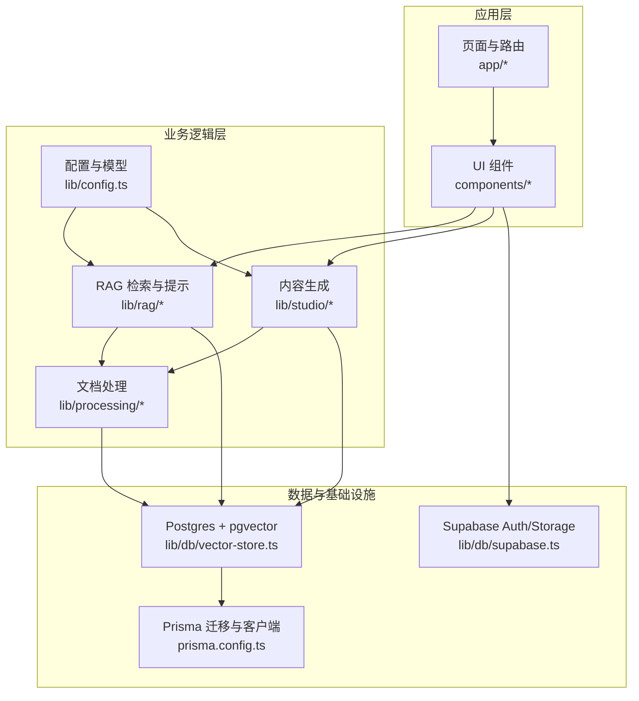
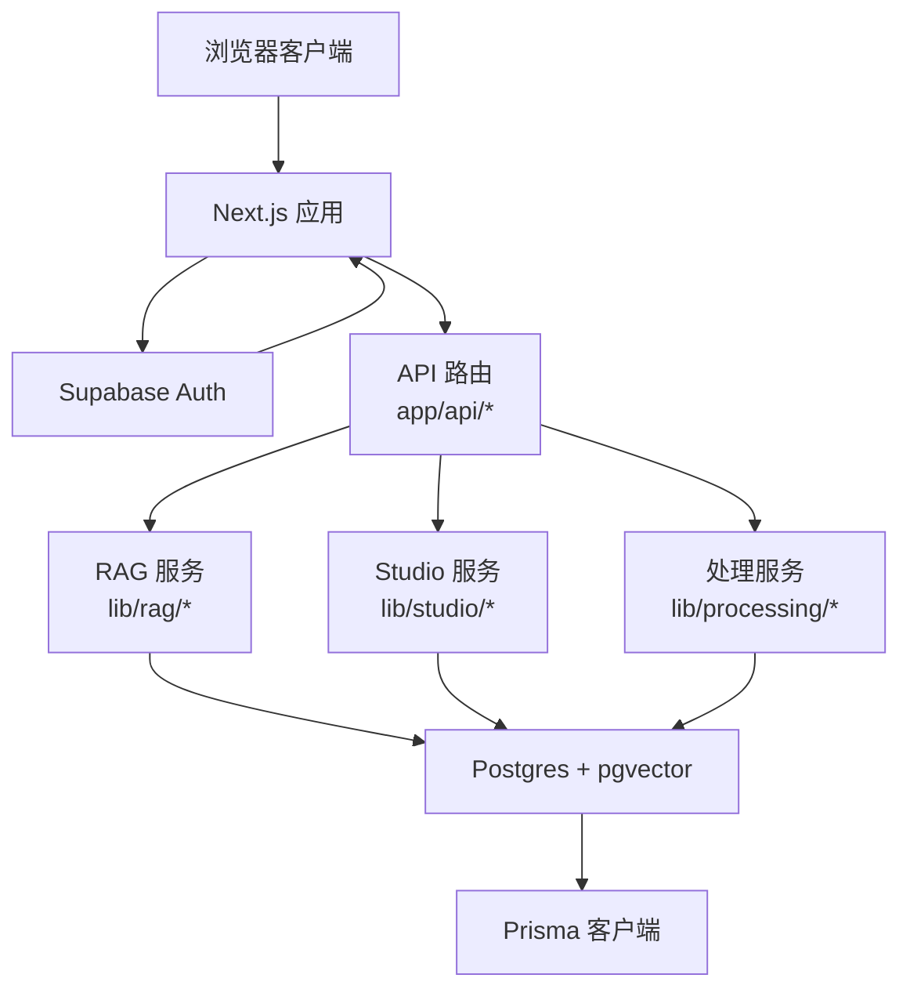
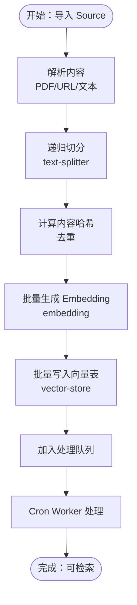
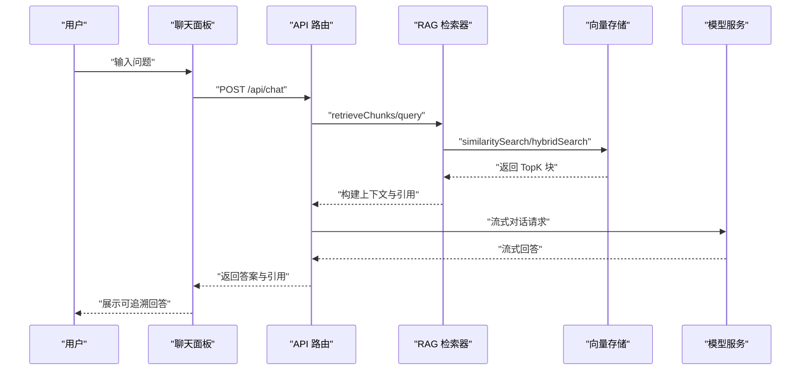
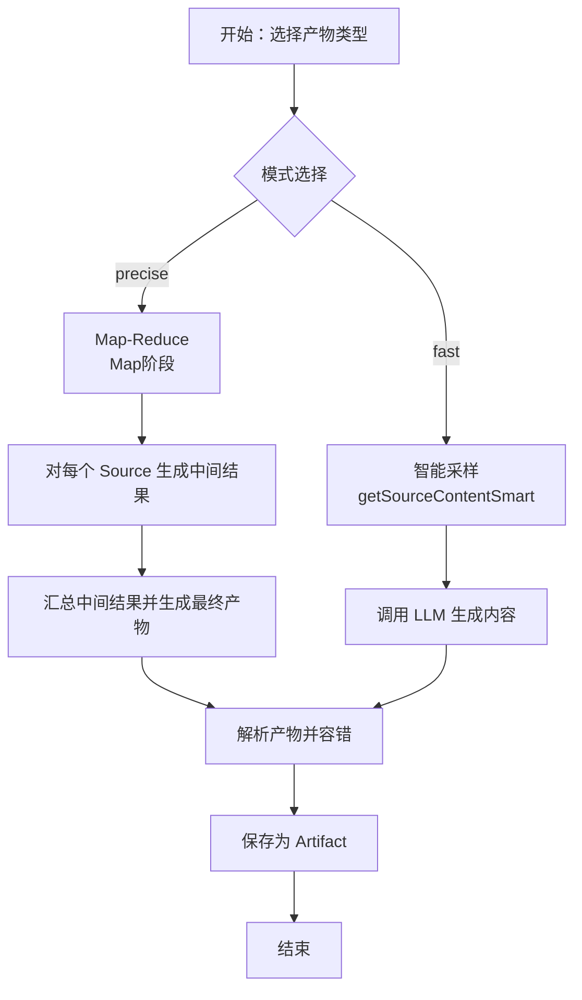
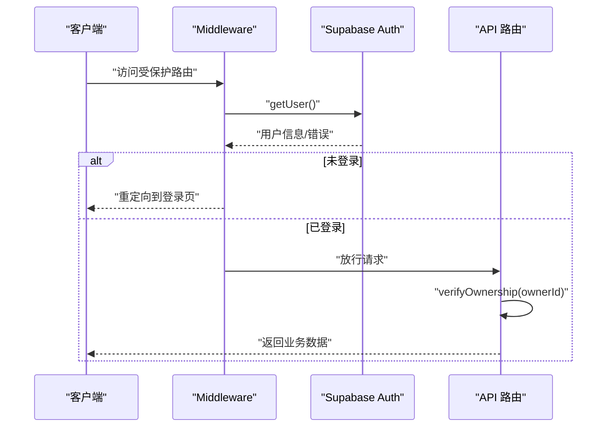
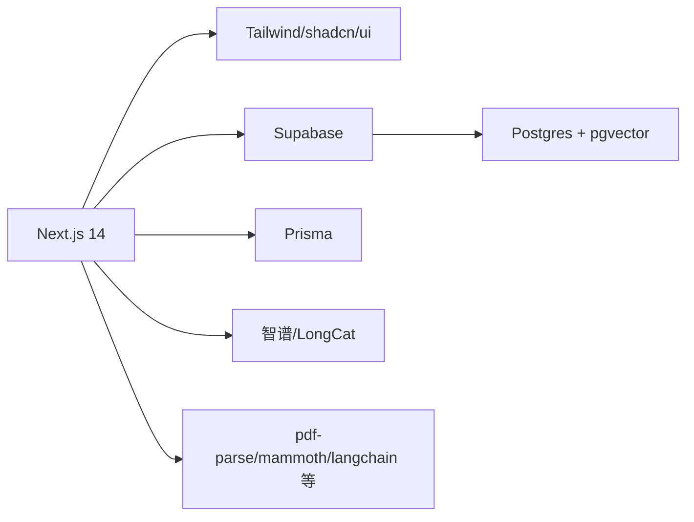

# 项目概述

<cite>
**本文引用的文件**
- [README.md](file://README.md)
- [package.json](file://package.json)
- [next.config.js](file://next.config.js)
- [lib/config.ts](file://lib/config.ts)
- [lib/db/supabase.ts](file://lib/db/supabase.ts)
- [lib/db/vector-store.ts](file://lib/db/vector-store.ts)
- [lib/rag/retriever.ts](file://lib/rag/retriever.ts)
- [lib/rag/prompt.ts](file://lib/rag/prompt.ts)
- [lib/studio/generator.ts](file://lib/studio/generator.ts)
- [lib/processing/index.ts](file://lib/processing/index.ts)
- [lib/processing/embedding.ts](file://lib/processing/embedding.ts)
- [lib/processing/text-splitter.ts](file://lib/processing/text-splitter.ts)
- [lib/supabase/client.ts](file://lib/supabase/client.ts)
- [lib/supabase/server.ts](file://lib/supabase/server.ts)
- [middleware.ts](file://middleware.ts)
- [prisma.config.ts](file://prisma.config.ts)
- [app/page.tsx](file://app/page.tsx)
- [components/notebook/notebook-content.tsx](file://components/notebook/notebook-content.tsx)
</cite>

## 目录
1. [简介](#简介)
2. [项目结构](#项目结构)
3. [核心组件](#核心组件)
4. [架构总览](#架构总览)
5. [详细组件分析](#详细组件分析)
6. [依赖分析](#依赖分析)
7. [性能考量](#性能考量)
8. [故障排查指南](#故障排查指南)
9. [结论](#结论)
10. [附录](#附录)

## 简介
Personal NotebookLM 是一个类似 NotebookLM 的个人/团队知识库原型系统，目标是让用户将各类资料导入到 Notebook，经过解析、切分、向量化与索引后，在同一 Notebook 内进行基于证据的对话（带引用），并在 Studio 中生成结构化产物（如测验、思维导图等）。项目强调可追溯、可验证与可生成，覆盖从“知识源导入”到“RAG 问答”再到“内容生成”的完整闭环。

- 价值主张
  - 一站式知识库：统一管理多种来源（文字、URL、PDF），自动处理与向量化
  - 可追溯问答：RAG 检索与引用标注，确保回答可溯源
  - 结构化产物：快速生成大纲、测验、思维导图等，提升学习与整理效率
  - 易部署：基于 Next.js 14 + Supabase + pgvector，开箱即用

**章节来源**
- file://README.md#L1-L141

## 项目结构
项目采用 Next.js App Router 的目录组织方式，主要分为以下层次：
- app/：页面与 API 路由（Notebooks、Sources、Chat、Studio、Templates、Cron）
- components/：Notebook 三栏 UI（Sources / Chat / Studio）与通用组件
- lib/：核心业务逻辑（处理、RAG、Studio、数据库、工具）
- prisma/：Prisma schema 与 SQL 迁移（含 pgvector 向量表）

**图表来源**
- [app/page.tsx](file://app/page.tsx#L1-L105)
- [components/notebook/notebook-content.tsx](file://components/notebook/notebook-content.tsx#L1-L128)
- [lib/processing/index.ts](file://lib/processing/index.ts#L1-L51)
- [lib/rag/retriever.ts](file://lib/rag/retriever.ts#L1-L206)
- [lib/studio/generator.ts](file://lib/studio/generator.ts#L1-L311)
- [lib/db/vector-store.ts](file://lib/db/vector-store.ts#L1-L446)
- [lib/db/supabase.ts](file://lib/db/supabase.ts#L1-L39)
- [prisma.config.ts](file://prisma.config.ts#L1-L20)

**章节来源**
- file://README.md#L42-L49
- file://package.json#L1-L82

## 核心组件
- 知识源导入与处理
  - 文本切分、去重、批量 Embedding、写入向量表、队列与 Cron 处理
- RAG 问答
  - 向量检索、混合检索（向量 + FTS）、流式输出、引用标注、检索详情
- Studio 内容生成
  - fast/precise 两种策略（采样/Map-Reduce）、模板运行、产物解析与容错
- 身份与权限
  - Supabase Auth 登录态与路由保护、资源所有权校验
- 数据与索引
  - Prisma + Postgres + pgvector，SQL 函数与 HNSW 索引

**章节来源**
- file://README.md#L5-L25
- file://lib/processing/index.ts#L1-L51
- file://lib/rag/retriever.ts#L1-L206
- file://lib/studio/generator.ts#L1-L311
- file://lib/db/supabase.ts#L1-L39
- file://lib/db/vector-store.ts#L1-L446

## 架构总览
系统采用前后端分离的 Web 应用架构，前端使用 Next.js 14 App Router，后端通过 API 路由与数据库交互；Supabase 提供认证与对象存储，pgvector 提供向量检索能力。

**图表来源**
- [lib/db/supabase.ts](file://lib/db/supabase.ts#L1-L39)
- [lib/rag/retriever.ts](file://lib/rag/retriever.ts#L1-L206)
- [lib/studio/generator.ts](file://lib/studio/generator.ts#L1-L311)
- [lib/processing/index.ts](file://lib/processing/index.ts#L1-L51)
- [lib/db/vector-store.ts](file://lib/db/vector-store.ts#L1-L446)
- [prisma.config.ts](file://prisma.config.ts#L1-L20)

## 详细组件分析

### 知识源导入与处理流水线
- 文本切分与去重：递归字符切分器，支持中英混合估算 token，重叠窗口避免截断，MD5 去重
- Embedding 生成：批量调用智谱 Embedding API，指数退避重试，维度校验
- 向量入库：批量插入 document_chunks，按 source_id + chunk_index 去重
- 队列与 Cron：ProcessingQueue 队列与 /api/cron/process-queue 手动触发

**图表来源**
- [lib/processing/text-splitter.ts](file://lib/processing/text-splitter.ts#L1-L270)
- [lib/processing/embedding.ts](file://lib/processing/embedding.ts#L1-L189)
- [lib/db/vector-store.ts](file://lib/db/vector-store.ts#L1-L446)
- [README.md](file://README.md#L124-L131)

**章节来源**
- file://lib/processing/text-splitter.ts#L1-L270
- file://lib/processing/embedding.ts#L1-L189
- file://lib/db/vector-store.ts#L1-L446
- file://README.md#L124-L131

### RAG 检索与问答
- 检索策略：默认向量检索，可选混合检索（向量 + FTS），支持 topK 与阈值控制
- 上下文组装：将检索到的块组织为结构化上下文，带来源编号与相似度
- 引用生成：对重复内容去重，保留相似度更高的引用
- 对话流式输出：结合历史对话与上下文，流式返回答案与引用

**图表来源**
- [lib/rag/retriever.ts](file://lib/rag/retriever.ts#L1-L206)
- [lib/rag/prompt.ts](file://lib/rag/prompt.ts#L1-L149)
- [lib/db/vector-store.ts](file://lib/db/vector-store.ts#L1-L446)

**章节来源**
- file://lib/rag/retriever.ts#L1-L206
- file://lib/rag/prompt.ts#L1-L149
- file://lib/db/vector-store.ts#L1-L446

### Studio 内容生成
- 两种模式
  - fast：智能采样，直接从上下文中抽取片段，适合快速生成
  - precise：Map-Reduce，先对每个 Source 生成中间结果，再汇总合并
- 产物类型：测验、思维导图等，支持模板运行与变量替换
- 容错与解析：对 LLM 输出进行 JSON/Markdown 解析与容错

**图表来源**
- [lib/studio/generator.ts](file://lib/studio/generator.ts#L1-L311)

**章节来源**
- file://lib/studio/generator.ts#L1-L311

### 身份认证与权限控制
- 路由保护：Middleware 对受保护路由进行登录态校验
- 资源所有权：所有 API 调用前进行资源归属校验，防止越权访问
- Supabase 客户端：区分浏览器与服务端客户端，适配 SSR/SSG 场景

**图表来源**
- [middleware.ts](file://middleware.ts#L1-L78)
- [lib/db/supabase.ts](file://lib/db/supabase.ts#L1-L39)
- [lib/supabase/client.ts](file://lib/supabase/client.ts#L1-L14)
- [lib/supabase/server.ts](file://lib/supabase/server.ts#L1-L33)

**章节来源**
- file://middleware.ts#L1-L78
- file://lib/db/supabase.ts#L1-L39
- file://lib/supabase/client.ts#L1-L14
- file://lib/supabase/server.ts#L1-L33

## 依赖分析
- 前端框架与样式
  - Next.js 14（App Router）、React 18、TypeScript
  - Tailwind CSS + shadcn/ui + Radix UI
- 数据库与向量
  - Supabase（Postgres + Storage + Auth）
  - Prisma（Schema 与迁移）
  - pgvector（向量检索与 HNSW 索引）
- 模型服务
  - 智谱（ZHIPU）与 LongCat（OpenAI 兼容）
- 工具与库
  - @prisma/adapter-pg、@supabase/ssr、langchain、pdf-parse、mammoth、dagre、@xyflow/react 等

**图表来源**
- [package.json](file://package.json#L1-L82)
- [lib/config.ts](file://lib/config.ts#L1-L187)

**章节来源**
- file://package.json#L1-L82
- file://lib/config.ts#L1-L187

## 性能考量
- 向量检索
  - 使用 HNSW 索引与 SQL 函数加速相似度计算
  - 混合检索（向量 + FTS）提升召回质量与稳定性
- 批量处理
  - 文本切分与 Embedding 采用分批与重试机制，降低失败率
  - 向量入库使用批量 INSERT 与去重，减少重复写入
- 模型调用
  - fast 模式减少上下文长度，precise 模式合理拆分 Map/Reduce 步骤
  - 设置合理的超时与重试策略，避免长尾阻塞
- 前端体验
  - Next.js 图片优化与大文件上传限制，提升页面加载与上传稳定性

**章节来源**
- file://lib/db/vector-store.ts#L1-L446
- file://lib/processing/embedding.ts#L1-L189
- file://lib/studio/generator.ts#L1-L311
- file://next.config.js#L1-L21

## 故障排查指南
- 环境变量缺失
  - 启动时会校验必需变量（Supabase URL/Key、DATABASE_URL、ZHIPU_API_KEY、EMBEDDING_DIM），请根据提示补齐
- 向量维度不匹配
  - 系统严格校验 EMBEDDING_DIM 与数据库 vector(D) 一致，否则抛出错误
- 权限与路由保护
  - 受保护路由未登录会被重定向至登录页；资源越权会抛出无权访问错误
- 处理队列与 Cron
  - 通过 /api/cron/process-queue 手动触发处理，注意 Authorization: Bearer $CRON_SECRET
- 模型调用失败
  - 检查 API Key、Base URL 与网络连通性；关注超时与重试策略

**章节来源**
- file://lib/config.ts#L1-L187
- file://lib/db/supabase.ts#L1-L39
- file://README.md#L124-L131

## 结论
Personal NotebookLM 以 Next.js 14 为基础，结合 Supabase 与 pgvector，构建了从“知识源导入”到“RAG 问答”再到“内容生成”的完整原型系统。其设计强调可追溯、可验证与可生成，既适合初学者快速上手，也为有经验的开发者提供了可扩展的架构与完善的错误处理机制。未来可进一步完善模板生态、优化检索算法与生成稳定性，并探索多用户协作与权限细化。

## 附录
- 快速开始与常用命令
  - 安装依赖、初始化数据库、开发/构建/质量检查、Prisma Studio
- 文档入口
  - 项目规格、数据模型与关键实现细节
  - 项目排期与里程碑

**章节来源**
- file://README.md#L51-L141