# 项目规划书

<cite>
**本文档引用的文件**
- [README.md](file://README.md)
- [IMPLEMENTATION.md](file://IMPLEMENTATION.md)
- [package.json](file://package.json)
- [next.config.js](file://next.config.js)
- [middleware.ts](file://middleware.ts)
- [lib/config.ts](file://lib/config.ts)
- [lib/db/vector-store.ts](file://lib/db/vector-store.ts)
- [lib/rag/retriever.ts](file://lib/rag/retriever.ts)
- [lib/studio/generator.ts](file://lib/studio/generator.ts)
- [lib/processing/processor.ts](file://lib/processing/processor.ts)
- [lib/processing/text-splitter.ts](file://lib/processing/text-splitter.ts)
- [lib/processing/embedding.ts](file://lib/processing/embedding.ts)
- [lib/rag/prompt.ts](file://lib/rag/prompt.ts)
- [components/notebook/notebook-content.tsx](file://components/notebook/notebook-content.tsx)
- [app/page.tsx](file://app/page.tsx)
</cite>

## 目录
1. [项目概述](#项目概述)
2. [技术架构](#技术架构)
3. [核心模块分析](#核心模块分析)
4. [数据流架构](#数据流架构)
5. [处理队列与工作流](#处理队列与工作流)
6. [RAG 检索系统](#rag-检索系统)
7. [Studio 产物生成](#studio-产物生成)
8. [前端组件架构](#前端组件架构)
9. [性能优化策略](#性能优化策略)
10. [安全与权限控制](#安全与权限控制)
11. [部署与运维](#部署与运维)
12. [未来发展规划](#未来发展规划)

## 项目概述

Personal NotebookLM 是一个基于 RAG（检索增强生成）技术的个人知识库管理系统，旨在为用户提供智能化的知识管理体验。该项目实现了类似 NotebookLM 的核心功能，支持多种知识源导入、向量化处理、智能问答和结构化产物生成。

### 核心功能特性

- **多源知识导入**：支持 PDF 文件、网页链接、文本内容等多种格式的知识源
- **智能向量化处理**：自动解析、切分、嵌入和索引文档内容
- **RAG 问答系统**：基于证据的智能问答，支持引用溯源
- **结构化产物生成**：一键生成测验、思维导图等结构化内容
- **混合检索机制**：结合向量相似度和全文检索，提升检索准确性

### 技术栈概览

- **前端框架**：Next.js 14 + React 18 + TypeScript
- **UI 组件库**：Tailwind CSS + shadcn/ui + Radix UI
- **后端服务**：Node.js + Prisma ORM
- **数据库**：PostgreSQL + pgvector 向量扩展
- **存储服务**：Supabase Storage
- **AI 模型**：智谱 AI + LongCat 推理模型

## 技术架构

### 系统架构图

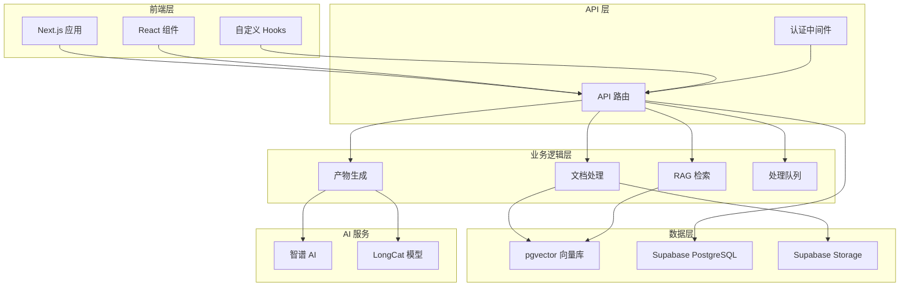

**架构图来源**
- [lib/config.ts](file://lib/config.ts#L1-L187)
- [lib/db/vector-store.ts](file://lib/db/vector-store.ts#L1-L446)
- [lib/processing/processor.ts](file://lib/processing/processor.ts#L1-L560)

### 数据库架构

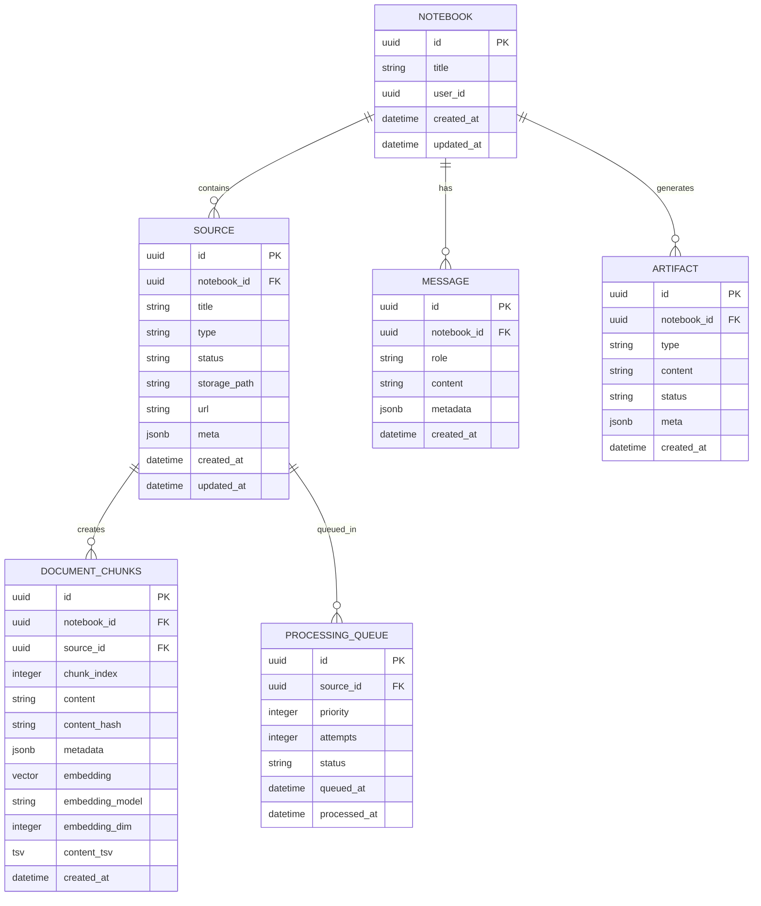

**图表来源**
- [lib/db/vector-store.ts](file://lib/db/vector-store.ts#L1-L446)

## 核心模块分析

### 配置管理系统

配置系统采用集中式管理方式，确保各模块间的配置一致性：

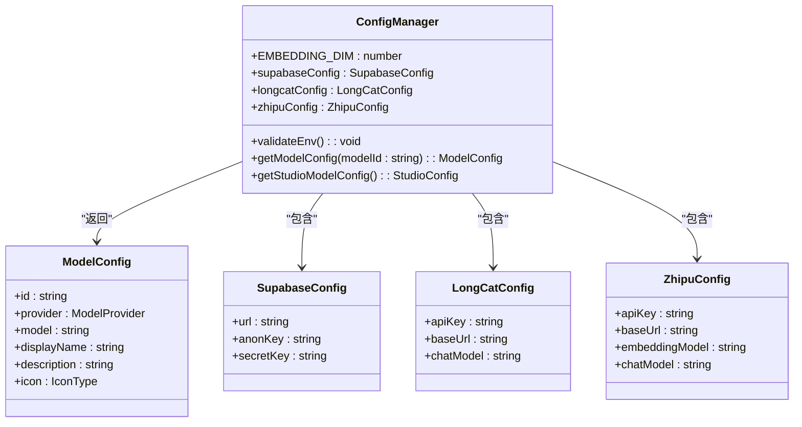

**类图来源**
- [lib/config.ts](file://lib/config.ts#L1-L187)

**配置模块特性**：
- 向量维度强制校验（1024维）
- 多模型提供商支持（智谱、LongCat）
- 环境变量验证机制
- 类型安全的配置访问

### 向量存储系统

向量存储系统是整个 RAG 系统的核心基础设施：

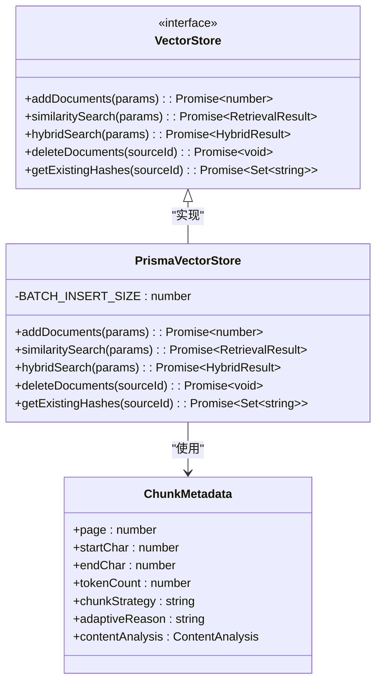

**类图来源**
- [lib/db/vector-store.ts](file://lib/db/vector-store.ts#L24-L75)

**向量存储特性**：
- 批量插入优化（每批500条）
- 维度一致性校验
- 混合检索支持（向量+全文）
- 去重机制（基于内容哈希）

## 数据流架构

### 文档处理流水线

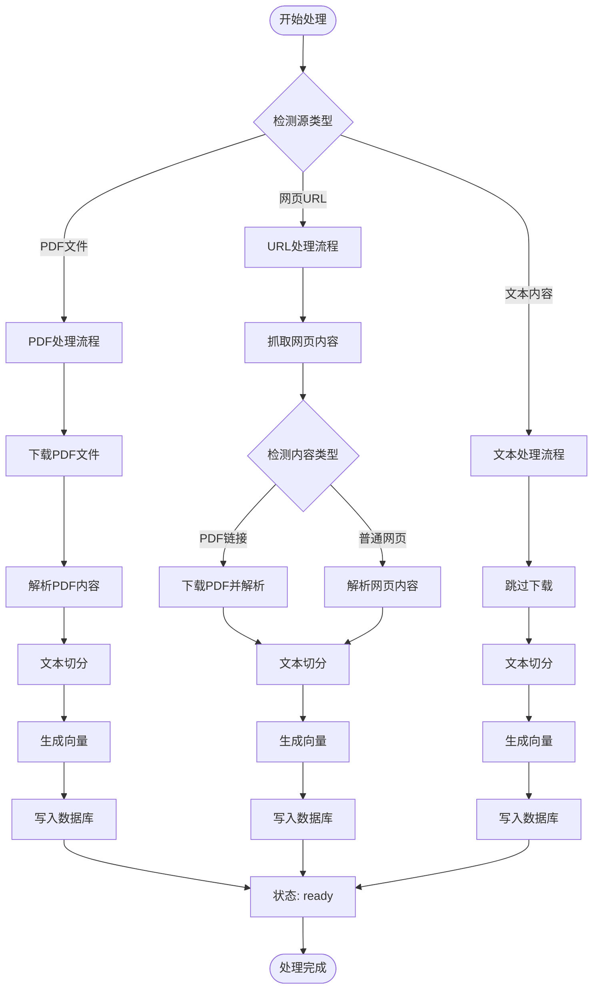

**流程图来源**
- [lib/processing/processor.ts](file://lib/processing/processor.ts#L82-L526)

### RAG 检索流程

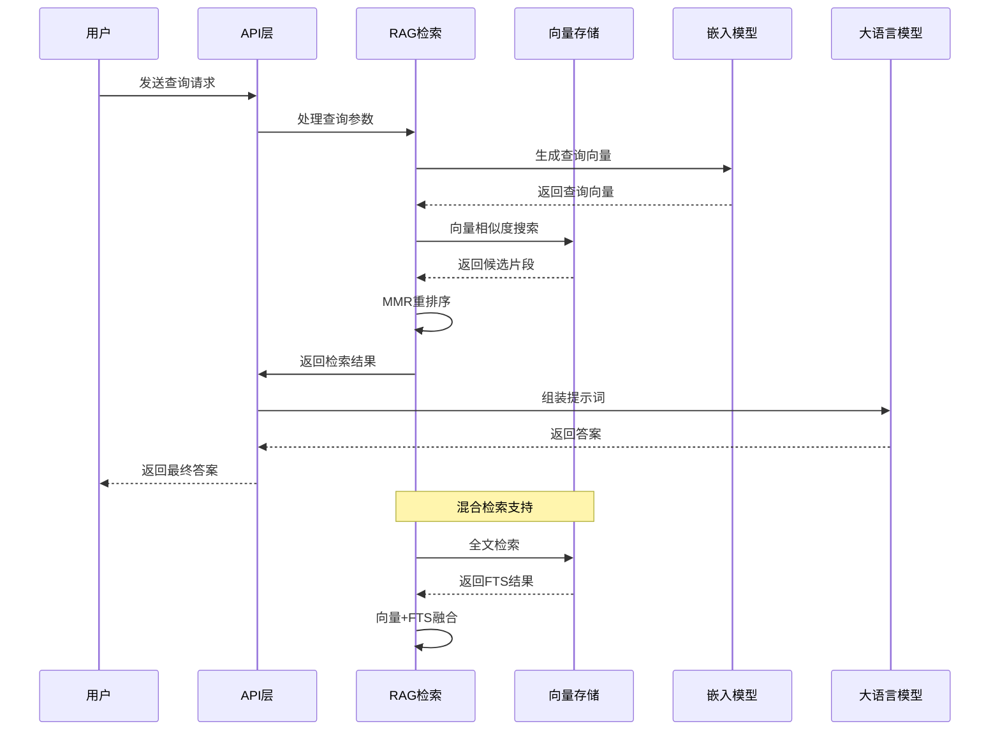

**序列图来源**
- [lib/rag/retriever.ts](file://lib/rag/retriever.ts#L57-L139)
- [lib/rag/prompt.ts](file://lib/rag/prompt.ts#L217-L257)

## 处理队列与工作流

### 处理队列架构

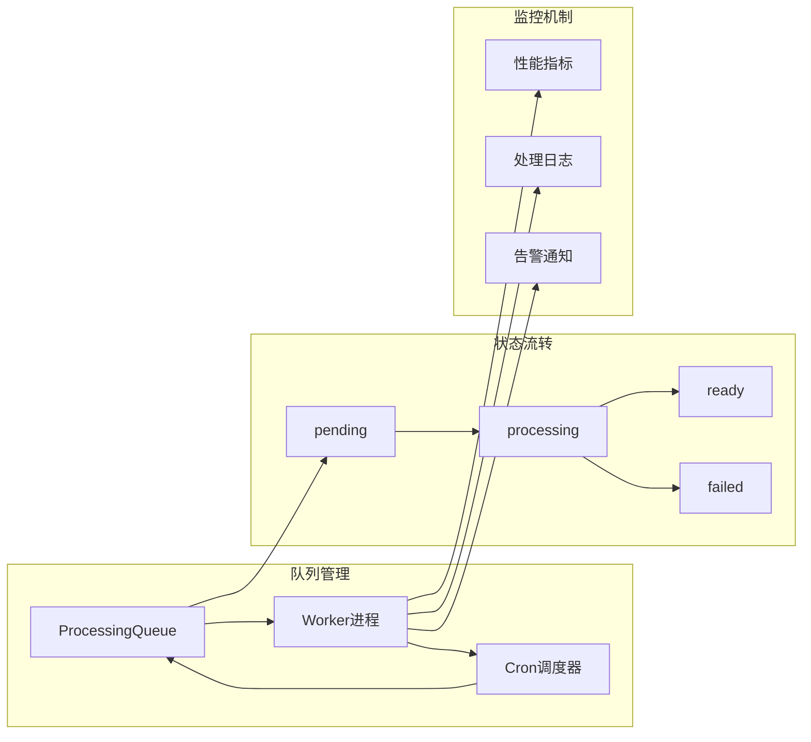

**架构图来源**
- [lib/processing/processor.ts](file://lib/processing/processor.ts#L56-L77)

### 队列处理策略

| 队列状态 | 描述 | 处理策略 |
|---------|------|----------|
| pending | 等待处理 | 高优先级队列，优先处理新加入的源 |
| processing | 正在处理 | 分批处理，支持并发控制 |
| ready | 处理完成 | 可供检索使用 |
| failed | 处理失败 | 重试机制，最多3次重试 |

## RAG 检索系统

### 检索算法优化

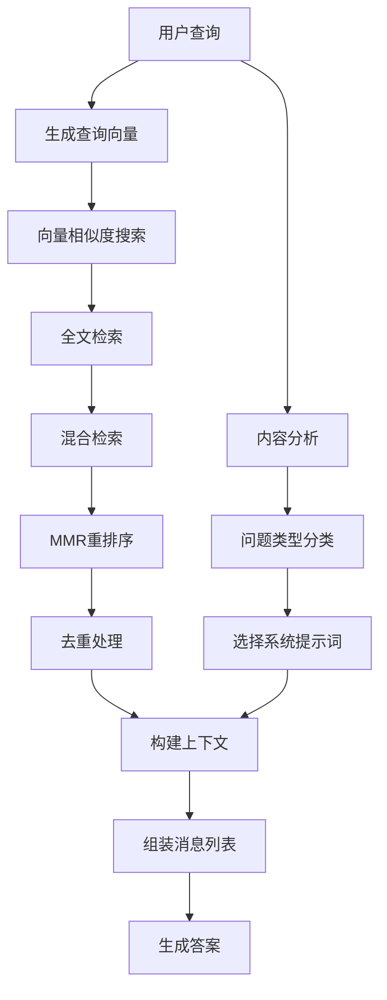

**流程图来源**
- [lib/rag/retriever.ts](file://lib/rag/retriever.ts#L234-L357)
- [lib/rag/prompt.ts](file://lib/rag/prompt.ts#L111-L157)

### 检索性能优化

| 优化策略 | 实现方式 | 性能提升 |
|---------|----------|----------|
| MMR重排序 | 平衡相关性和多样性 | 提升答案质量 |
| 候选集限制 | 最多20个候选进行重排序 | 减少计算开销 |
| 维度校验 | 运行时向量维度检查 | 防止数据不一致 |
| 批量处理 | 向量存储批量插入 | 提升写入性能 |

## Studio 产物生成

### 生成策略对比

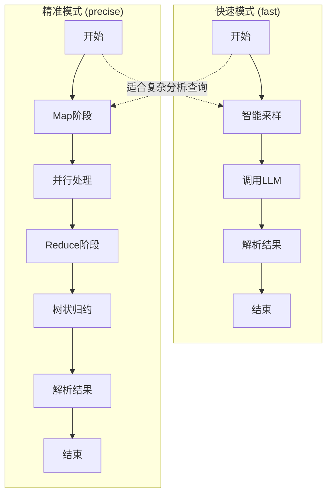

**架构图来源**
- [lib/studio/generator.ts](file://lib/studio/generator.ts#L124-L173)
- [lib/studio/generator.ts](file://lib/studio/generator.ts#L366-L448)

### 并发控制机制

| 组件 | 并发限制 | 重试机制 | 超时设置 |
|------|----------|----------|----------|
| Map阶段 | 8个并发 | 最多重试2次 | 45秒 |
| Reduce阶段 | 无限制 | 指数退避 | 180秒 |
| LLM调用 | 无限制 | 超时控制 | 90-180秒 |
| 源处理 | p-limit控制 | 失败重试 | 10-60秒 |

## 前端组件架构

### Notebook 三栏布局

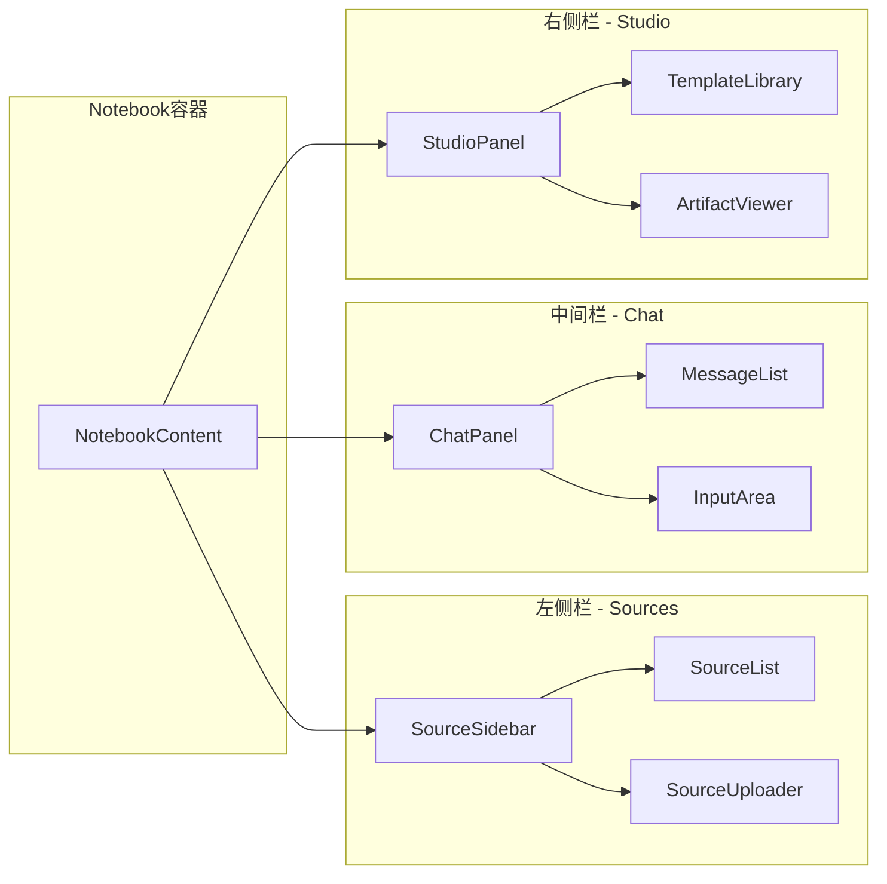

**架构图来源**
- [components/notebook/notebook-content.tsx](file://components/notebook/notebook-content.tsx#L71-L127)

### 组件通信模式

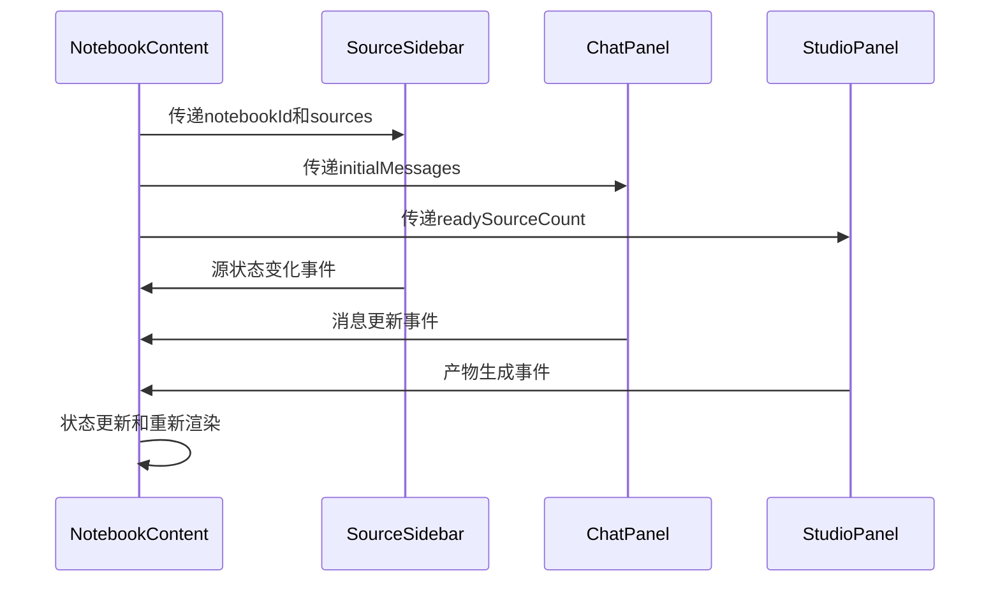

**序列图来源**
- [components/notebook/notebook-content.tsx](file://components/notebook/notebook-content.tsx#L77-L83)

## 性能优化策略

### 向量切分策略优化

项目实现了自适应向量切分策略，根据不同内容密度动态调整切分参数：

| 内容类型 | 密度特征 | 推荐切分大小 | 重叠比例 |
|----------|----------|-------------|----------|
| 高密度内容 | 信息熵>4.5 符号密度>15% 换行密度>3 代码/表格 | 400 tokens | 15% |
| 中等密度内容 | 默认配置 | 800 tokens | 12.5% |
| 低密度内容 | 信息熵<3.5 符号密度<5% 换行密度<1 | 1200 tokens | 10% |

### 批量处理优化

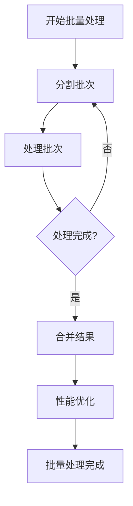

**优化策略**：
- 批量插入大小：500条/批
- 并发控制：p-limit限制
- 重试机制：指数退避
- 去重优化：基于内容哈希

## 安全与权限控制

### 路由保护机制

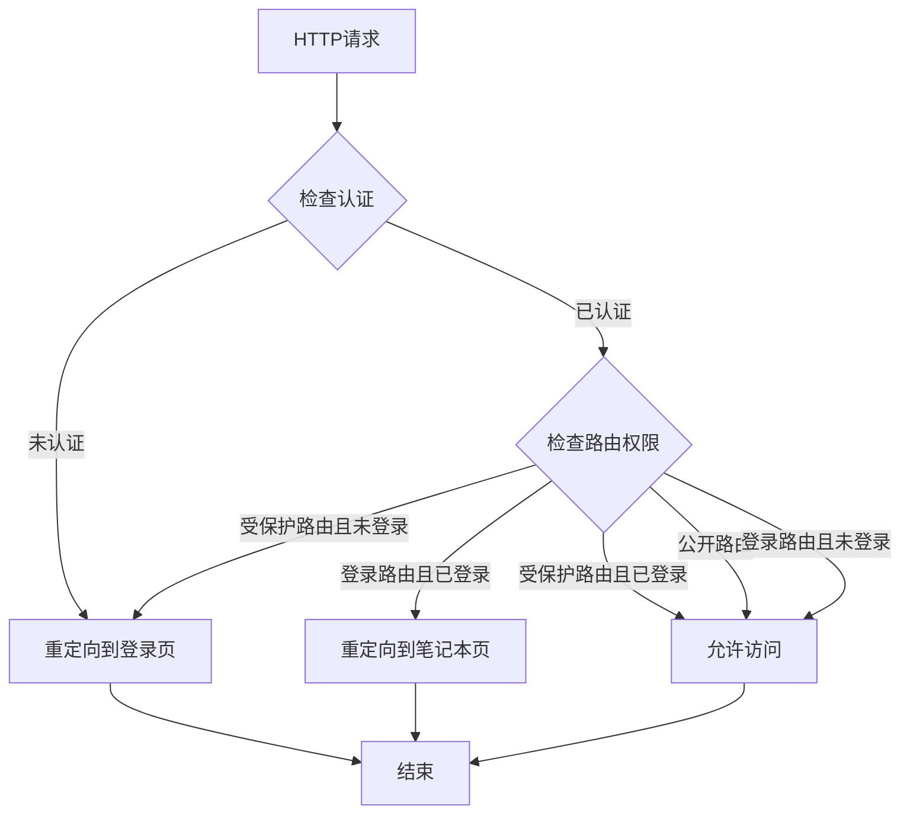

**安全机制**：
- 中间件级别的路由保护
- 会话状态管理
- 自动重定向逻辑
- Cookie同步机制

### 数据访问控制

| 数据类型 | 访问控制 | 安全措施 |
|----------|----------|----------|
| 用户数据 | 基于用户ID的隔离 | Supabase Row Level Security |
| 存储文件 | 基于用户权限的访问 | Supabase Storage ACL |
| 向量数据 | 笔记本级别的隔离 | 笔记本ID约束 |
| API访问 | Bearer Token认证 | CRON_SECRET鉴权 |

## 部署与运维

### 环境配置

项目支持多种部署环境，包括开发、测试和生产环境：

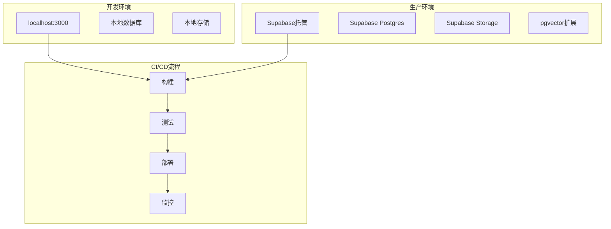

### 性能监控

| 监控指标 | 收集方式 | 阈值设置 |
|----------|----------|----------|
| 向量插入延迟 | 日志记录 | <500ms |
| 检索响应时间 | 性能统计 | <2s |
| LLM调用成功率 | 错误日志 | >95% |
| 处理队列积压 | 队列监控 | <10个任务 |

## 未来发展规划

### 短期目标（1-3个月）

1. **性能优化**
   - 实现向量检索的近似最近邻算法
   - 优化数据库索引策略
   - 增加缓存层减少重复计算

2. **功能扩展**
   - 支持更多文件格式（Word、Excel等）
   - 实现批量导入功能
   - 增加数据导出功能

3. **用户体验改进**
   - 优化移动端适配
   - 增加主题切换功能
   - 改进错误处理和提示

### 中期目标（3-6个月）

1. **AI能力增强**
   - 集成更多模型提供商
   - 实现多模态内容处理
   - 支持自定义提示词模板

2. **协作功能**
   - 实现笔记本共享功能
   - 增加评论和标注系统
   - 支持版本管理和历史记录

3. **企业级功能**
   - 增加权限管理
   - 实现审计日志
   - 支持组织架构管理

### 长期愿景（6-12个月）

1. **平台化发展**
   - 构建开发者API
   - 实现插件生态系统
   - 支持第三方集成

2. **技术创新**
   - 探索新的检索算法
   - 实现增量学习能力
   - 支持多语言处理

3. **生态建设**
   - 建立内容社区
   - 提供专业服务支持
   - 推动行业标准制定

## 总结

Personal NotebookLM 项目展现了现代 AI 驱动知识管理系统的完整实现。通过精心设计的技术架构和优化的算法实现，项目在功能完整性、性能表现和用户体验方面都达到了较高水准。

项目的成功关键在于：

1. **架构设计**：清晰的分层架构和模块化设计
2. **性能优化**：针对向量检索和批量处理的专门优化
3. **用户体验**：直观的界面设计和流畅的交互体验
4. **技术选型**：合理的技术栈选择和工具集成

随着项目的持续发展，预计将不断完善功能特性，提升性能表现，并扩展应用场景，为用户提供更加智能化的知识管理解决方案。