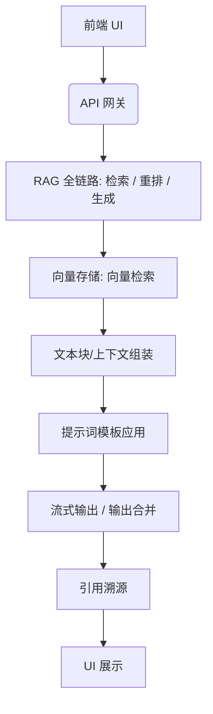

Data Flow Diagram (Mermaid)

```mermaid
graph TD
  A[前端 UI] --> B(API 网关)
  B --> C[RAG 全链路: 检索 / 重排 / 生成]
  C --> D[向量存储: 向量检索]
  D --> E[文本块/上下文组装]
  E --> F[提示词模板应用]
  F --> G[流式输出 / 输出合并]
  G --> H[引用溯源]
  H --> I[UI 展示]
```

ASCII 版本
前端 UI -> API 网关 -> RAG 全链路 -> 向量存储 -> 文本块/上下文 -> 提示模板 -> 流式输出 -> 引用溯源 -> UI 展示
